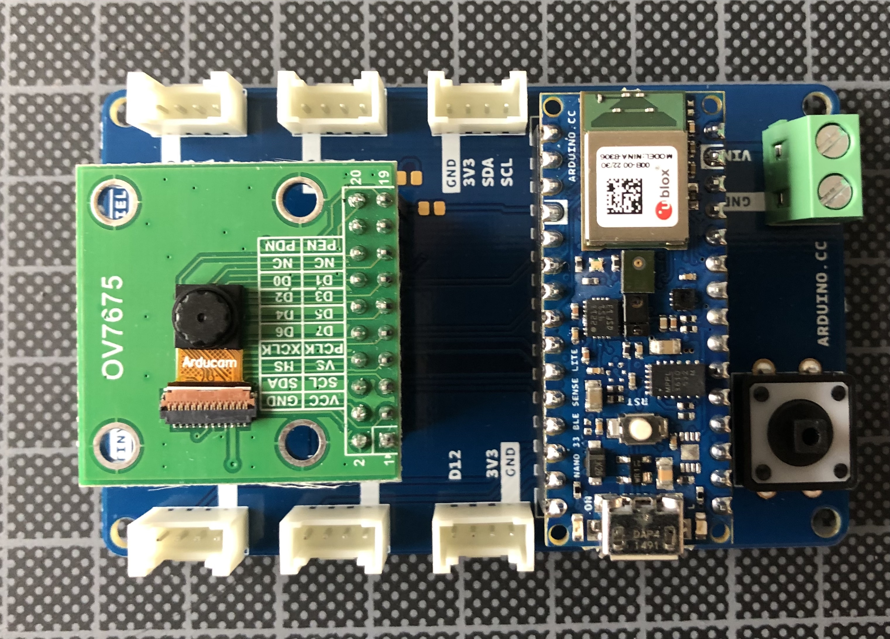

# Arduino Nano 33 BLE

La carte [Arduino Nano 33 BLE](https://docs.arduino.cc/hardware/nano-33-ble) est batie autour d'une MCU Nordic nRF52840 (64 MHz, 1MB FlashRAM, 256KB SRAM) avec un module Bluetooth® NINA-B306 et une centrale inertiele IMU [LSM9DS1](https://www.st.com/en/mems-and-sensors/lsm9ds1.html).

La carte [Arduino Nano 33 BLE](https://docs.arduino.cc/hardware/nano-33-ble) peut être achetée [individuelement](https://store.arduino.cc/products/arduino-nano-33-ble-sense) ou bien dans ce kit dédié à [Tiny Machine Learning](https://store.arduino.cc/products/arduino-tiny-machine-learning-kit). Ce dernier kit comporte une platine pour brancher facilement une camera OV7675 et des 6 platines Grove (I2C, Analogique, et Numérique).




## Démarrage avec Arduino IDE 1.8

Il faut installer préalablement la carte dans l'IDE Arduino 1.8 via le grestionnaire de cartes en recherchant les cartes `Arduino Mbed OS Nano Boards`.

### Test simple

Ouvrez le croquis d'exemple `Blink`.

Sélectionnez le type de carte `Arduino Nano 33 BLE`.

Compilez et chargez le croquis : la Led orange à coté du connecteur micro-USB doit clignoter à une fréquence de 1 Hz.

### Test de l'IMU LSM9DS1

https://github.com/arduino-libraries/Arduino_LSM9DS1

### Test de la caméra OV7675

Installez les bibliothèques [`Arduino_OV767X`](https://github.com/arduino-libraries/Arduino_OV767X) et [`Harvard_TinyMLx`](https://github.com/tinyMLx/arduino-library)

Ouvrez le croquis `person_detection` depuis les exemples `Fichier > Exemples > Harvard_TinyMLx`.

Compilez le croquis et chargez sur la carte.


https://docs.edgeimpulse.com/docs/tutorials/detect-objects-using-fomo


### Test de la connectivité BLE

https://www.arduino.cc/reference/en/libraries/arduinoble/


## Démarrage avec RIOT OS

La carte est supportée par [RIOT OS](https://doc.riot-os.org/group__boards__arduino-nano-33-ble.html)

### Test simple

Le programme suivant fait clignoter les 5 Led de la carte.

```bash
cd ~/github/RIOT-OS/RIOT
make BOARD=arduino-nano-33-ble -C tests/leds flash
```

### Test avec Tensorflow Lite

https://github.com/tinyMLx/arduino-library/tree/main/examples

## Démarrage avec Zephyr OS

[TODO](https://docs.zephyrproject.org/3.2.0/boards/arm/arduino_nano_33_ble/doc/index.html)

## Démarrage avec Edge Impulse

[TODO](https://docs.edgeimpulse.com/docs/development-platforms/officially-supported-mcu-targets/arduino-nano-33-ble-sense)

## Autres exemples de démonstration

* https://www.youtube.com/watch?v=LXgL850p7b0 
* https://github.com/tinyMLx/arduino-library
* https://github.com/tinyMLx/arduino-library/tree/main/examples
