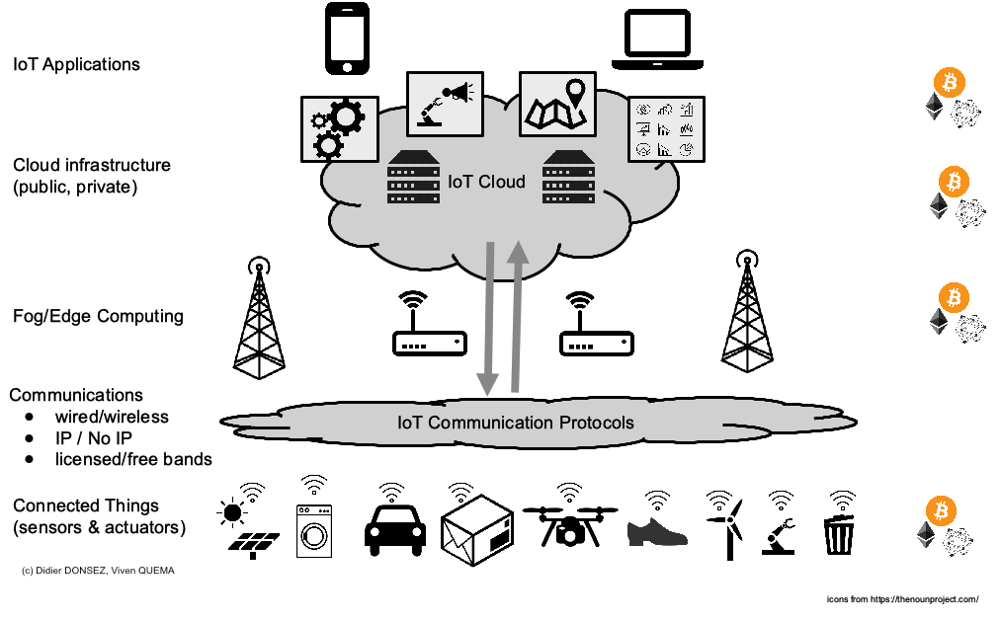

# Sécurisation des données IoT avec une blockchain de consortium

## Introduction
* Blockchains for trusted IoT, Vivien Quéma, Didier Donsez. [presentation](https://wiki.eclipse.org/images/0/01/Eclipse-IoT-Days-Grenoble-2018-Blockchain.pdf), [video](https://gricad.univ-grenoble-alpes.fr/video/blockchains-trusted-iot)

## Sécurisation des données IoT avec Ethereum
Coming soon ...

## Sécurisation des données IoT avec Hyperledger
Coming soon ...

## Sécurisation des données IoT avec IOTA Trinity
Coming soon ...
