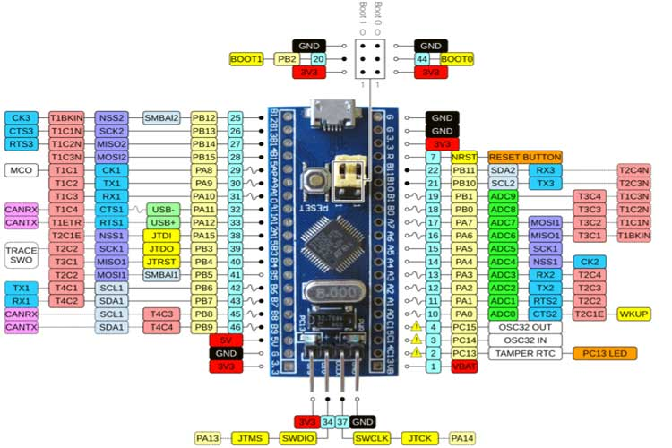

# STM32 BluePill :: Tutoriel

## Description
Les cartes STM32 sont des cartes compactes de prototypage avec une MCU STM32F030 dotée de 64KB or 128KB de FlashRAM. Elles ont l'avantage d'être très bon marché et sont disponibles sur plusieurs chinois. Elles sont en général livrées avec un programmateur STLink. Prévoyez un adapteur UART Serial pour le connecter au port console.

La description et le pinout sont disponibles [ici](https://components101.com/microcontrollers/stm32f103c8t8-blue-pill-development-board).



## RIOT

RIOT OS supporte les 2 modèles 64KB et 128KB :
* [bluepill-stm32f030c8 (64KB)](https://github.com/RIOT-OS/RIOT/blob/master/boards/bluepill-stm32f030c8/doc.txt)
* [bluepill_128kib (128KB)](https://github.com/RIOT-OS/RIOT/blob/master/boards/bluepill_128kib/doc.txt)


## Flashage

Connectez les broches (SW)DIO, (SW)CLK, 3V3 et GND au programmateur.

Appuyez le bouton Reset jusqu'au `flash-only`.

```bash
cd ~github/RIOT-OS/RIOT
cd tests/shell
make BOARD=bluepill-stm32f030c8 flash
make BOARD=bluepill-stm32f030c8 flash-only
```

## Console UART

Connectez les broches A9,A10,3V3,GND aux broches RX,TX,3V3,GND de l'adapteur USB Serial.


```bash
make BOARD=bluepill-stm32f030c8 term
```

ou

```bash
minicom -s
```
