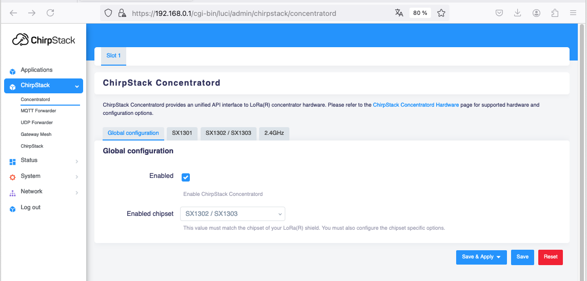
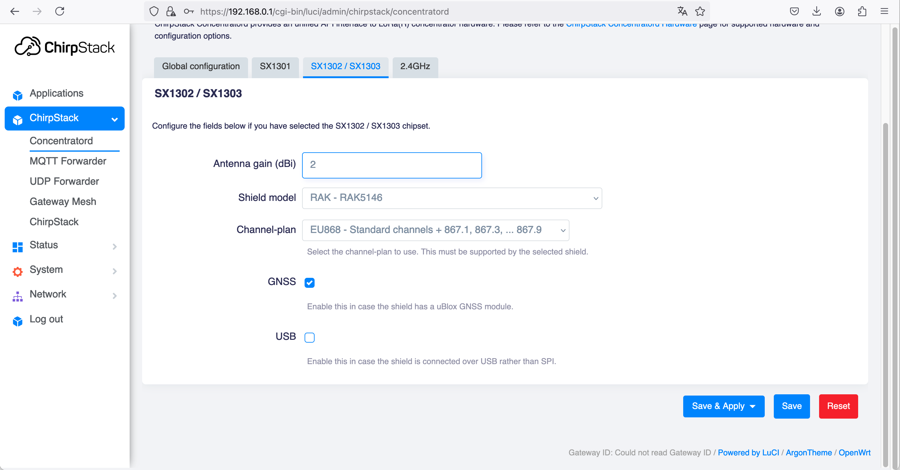
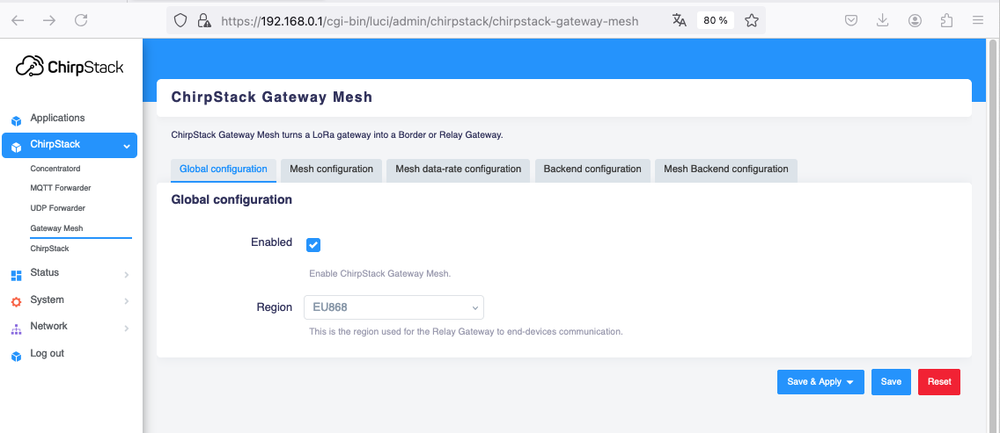
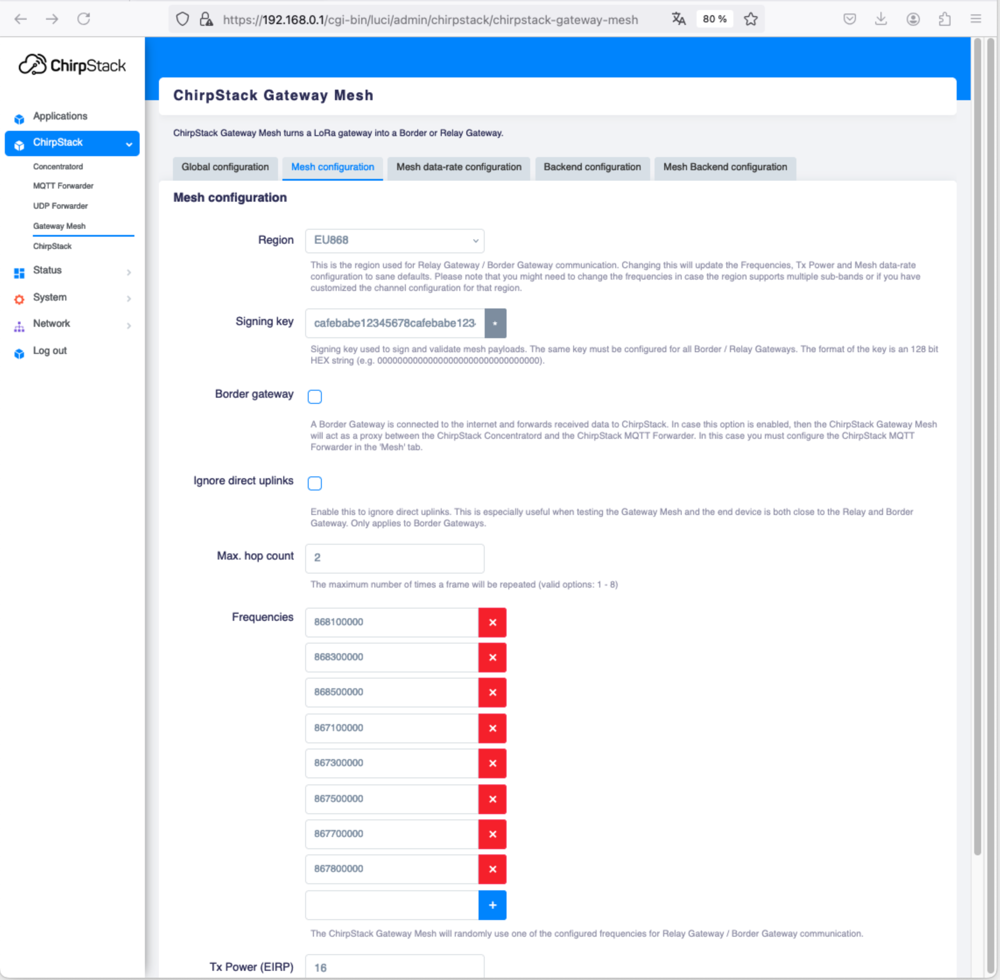
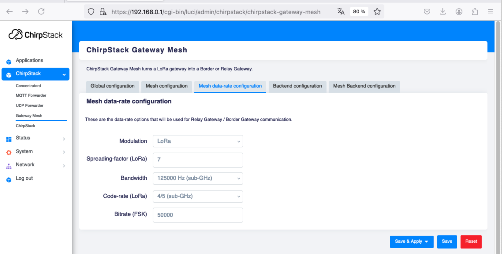
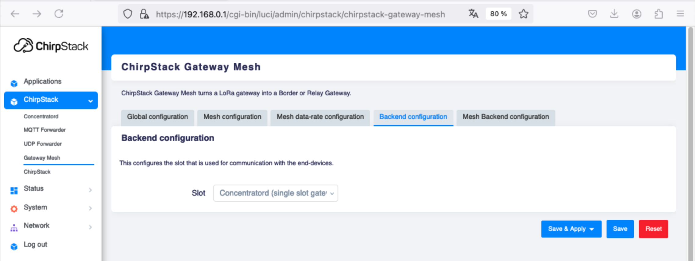
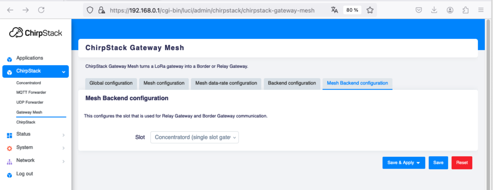
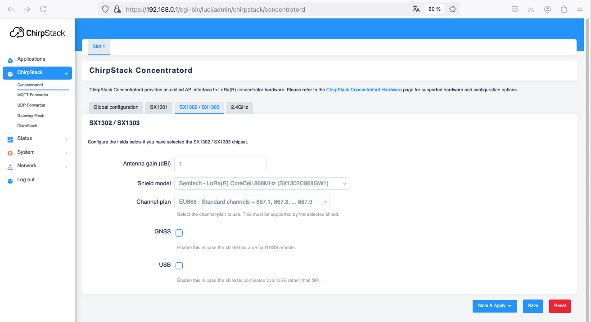

# Tutorial for Chirpstack Mesh Gateway

https://www.chirpstack.io/docs/chirpstack-gateway-os/use/chirpstack-gateway-mesh.html

Install RPI image on SDCard 
https://www.chirpstack.io/docs/chirpstack-gateway-os/install/raspberry-pi.html

Then
https://www.chirpstack.io/docs/chirpstack-gateway-os/getting-started.html


## Acces

You can connect with the name `ChirpStackAP-XXXXXX` and password `ChirpStackAP`


## Configure users passwords
Chirpstack Gateway Web Console
```
root
XXX
```

Chirpstack Web Console
```
admin
XXX
```


## Setup the RPI with RAK5146 for the LNS and the border gateway
SX1303 RAK5146


## Setup the RPI with Corecell for the mesh gateway

## Get concentrator id into the logs

```bash
logread -n 20 -f 
logread | grep gateway_id
```
`

## Configure Concentratord

https://192.168.0.1/cgi-bin/luci/admin/chirpstack/concentratord




## Configure Mesh

https://192.168.0.1/cgi-bin/luci/admin/chirpstack/chirpstack-gateway-mesh


Set shared secret AES Key for Chirpstack Mesh Gateway : `cafebabe12345678cafebabe12345678`












## Check log

* https://192.168.0.1/cgi-bin/luci/admin/status/logs


## Disable unused services

Disable nodered, chirpstack ...
* https://192.168.0.1/cgi-bin/luci/admin/system/startup

## Check with other gateways

