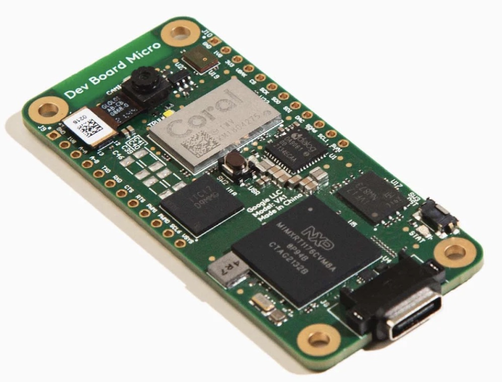
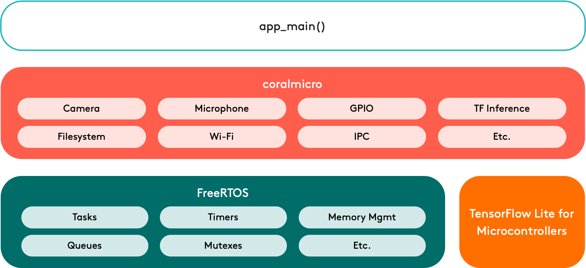

# Google Coral Dev Board Micro

The [Google Coral Dev Board Micro](https://coral.ai/products/dev-board-micro/) is a microcontroller board with a dual-core MCU, Coral Edge TPU, camera, and microphone.
With this board, you can build low-power systems with fast on-device inferencing for vision and audio ML applications. You
can also expand the hardware with custom add-on boards using the high-density board-to-board connectors.

The [firmware development platform](https://github.com/google-coral/coralmicro) is based on FreeRTOS with a CMake toolchain. It also includes support for development with Arduino. The FreeRTOS plateform for coralmicro includes APIs to use the Dev Board Micro's camera, microphone, and GPIOs, plus APIs for reading/writing files, creating RPC services, communicating across MCU cores, connecting to Wi-Fi (requires the Wireless Add-on board), and TensorFlow Lite for Microcontrollers to execute ML models on either the MCU or with acceleration on the Edge TPU. 

## Getting started

https://coral.ai/docs/dev-board-micro/get-started/#1-gather-requirements

## Build firmware with FreeRTOS

https://github.com/google-coral/coralmicro

## Build firmware with Arduino

https://coral.ai/docs/dev-board-micro/arduino/#1-gather-requirements

