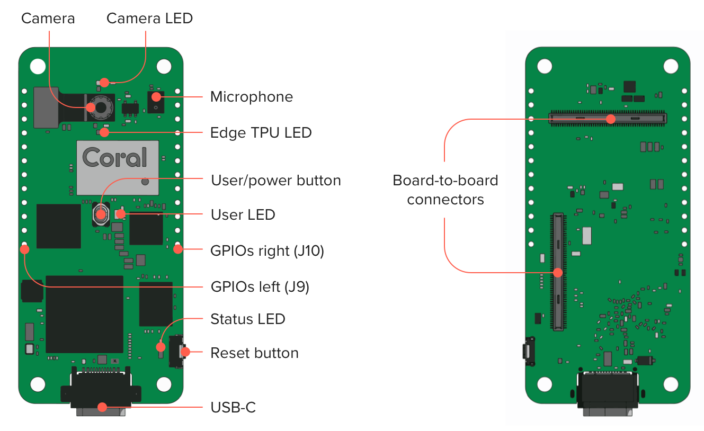
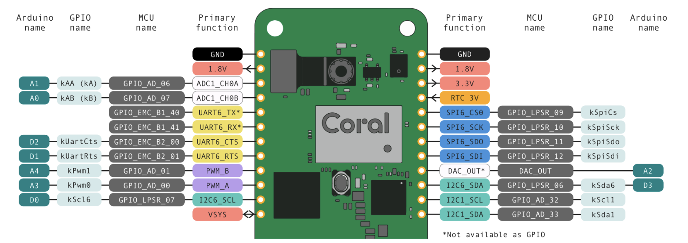

# Google Coral Dev Board Micro

The [Google Coral Dev Board Micro](https://coral.ai/products/dev-board-micro/) is a microcontroller board with a dual-core MCU, Coral Edge TPU, a [Himax HM01B0 CMOS](https://www.himax.com.tw/products/cmos-image-sensor/always-on-vision-sensors/hm01b0/) color camera (324 x 324 px or QVGA (320 x 240 px); 110º diagonal FOV; ƒ/2.0 focal ratio; Fixed focus), a PDM microphone, user and reset buttons, four LEDs and 2 GPIO headers with 12 pins (digital, analog, and power pins).

With this board, you can build low-power systems with fast on-device inferencing for vision and audio ML applications. You
can also expand the hardware with custom add-on boards using the high-density board-to-board connectors.

The [firmware development platform](https://github.com/google-coral/coralmicro) is based on FreeRTOS with a CMake toolchain. It also includes support for development with Arduino. The FreeRTOS plateform for coralmicro includes APIs to use the Dev Board Micro's camera, microphone, and GPIOs, plus APIs for reading/writing files, creating RPC services, communicating across MCU cores, connecting to Wi-Fi (requires the Wireless Add-on board), and [TensorFlow Lite for Microcontrollers](https://github.com/tensorflow/tflite-micro) to execute ML and DL models on either the MCU or with acceleration on the Edge TPU. Bare-metal apps development with the [MCUXpresso SDK](https://mcuxpresso.nxp.com/en/welcome) is available but it is not documented by Google.

> ***The power consumed by the Dev Board Micro depends on a variety of application behaviors, but most importantly, the extent to which the Edge TPU is being used. Typical test scenarios when the Edge TPU is active show average power peaks around 3 W. Beware that, depending on the type of ML model you're using, the Edge TPU can cause significant spikes in current draw.***

| Name | Color | Description |
|------|-------|-------------|
| Camera | Green | Indicates camera activity. By default, it is on during image capture, for a minimum of 500 ms.|
| TPU | White | Indicates Edge TPU status. By default, it is on while the Edge TPU is powered. It is programmable, but only while the Edge TPU is powered.|
| User | Green | Programmable. Off by default.|
| Status | Orange | Indicates board operating status. By default, it turns on briefly when the board boots from flash and it is programmable.|

## Getting started

https://coral.ai/docs/dev-board-micro/get-started/#1-gather-requirements

### Build firmware with FreeRTOS

https://github.com/google-coral/coralmicro

### Build firmware with Arduino

https://coral.ai/docs/dev-board-micro/arduino/#1-gather-requirements

Select the following examples in  section called "Examples for Dev Board Micro" in the examples menu

* `File > Examples > TensorFlow > DetectFaces`.
* `File > Examples > TensorFlow > DetectObjects`.

## Tensorflow

* [Classify Images](https://github.com/google-coral/coralmicro/blob/main/examples/classify_images/classify_images.cc) with `mobilenet_v1_1.0_224_quant_edgetpu.tflite` ([labels](https://github.com/tflite-soc/tensorflow-models/blob/master/mobilenet-v1/labels_mobilenet_quant_v1_224.txt))
* [Classify Speech](https://github.com/google-coral/coralmicro/blob/main/examples/classify_speech/classify_speech.cc)

See also [Pretrained models](https://tfhub.dev/s?deployment-format=coral).

## Communications

### UART communication

> `UART6_TX` and `UART6_RX` are configured for serial port communication and should not be used for other
purposes.

### LoRaWAN E5 Grove Modem

Connect the [LoRaWAN E5 modem](https://wiki.seeedstudio.com/Grove_LoRa_E5_New_Version/) to the UART pins (`UART6_TX` and `UART6_RX`).

TODO

## Sensors

### GPIO
TODO

* [Toogle outputs](https://github.com/google-coral/coralmicro/blob/main/examples/gpio/gpio.cc)
* [PWM](https://github.com/google-coral/coralmicro/blob/main/examples/pwm/pwm.cc)

### I2C Sensor

TODO

Connect a Bosch Sensortec BME280 breakout to the I2C pins 

Install the Arduino lib https://www.arduinolibraries.info/libraries/bme280

The original driver is https://github.com/boschsensortec/BME280_driver

### PIR Sensor
TODO

### GNSS Module
TODO

## Advanced

* [Connect to the Dev Board Micro serial console](https://coral.ai/docs/dev-board-micro/serial-console/#connect-with-linux)
* [Create a multi-core app](https://coral.ai/docs/dev-board-micro/multicore/)
  * [MC Blink](https://github.com/google-coral/coralmicro/tree/main/examples/multi_core_blink_led)
  * [IPC](https://github.com/google-coral/coralmicro/tree/main/examples/multi_core_ipc)

## Add-ons

### Environmental Sensor Board

https://coral.ai/products/environmental#tech-specs

| Function | Detail |
|--------- |-------- |  
| Display	| 128x32 OLED display |
| Security	| Microchip ECC608 crypto chip with Google keys| 
| Humidity	| HDC2010 humidity sensor| 
| Light	| OPT3002 ambient light sensor| 
| Barometric	| BMP280 barometric pressure sensor| 
| Connections	| Four Grove connectors, UART, I2C, PWM| 
| Power	| 3.3/5V analog| 

### Wifi Add-ons

https://coral.ai/docs/dev-board-micro/wireless-datasheet/

### PoE Add-ons

https://coral.ai/docs/dev-board-micro/poe-datasheet/

### Battery packs

### Power Profiling

[Power Profiler Kit II](https://www.mouser.fr/datasheet/2/297/Power_Profiler_Kit_II_PB_v1_0-1928294.pdf)

## Misc

### Enclosures & Cases

https://coral.ai/products/dev-board-micro-case/

### Add-ons

* [KiCad Templates for add-ons](https://github.com/google-coral/electricals/tree/master/dev_board_micro/DevBoardMicroAddOn)

