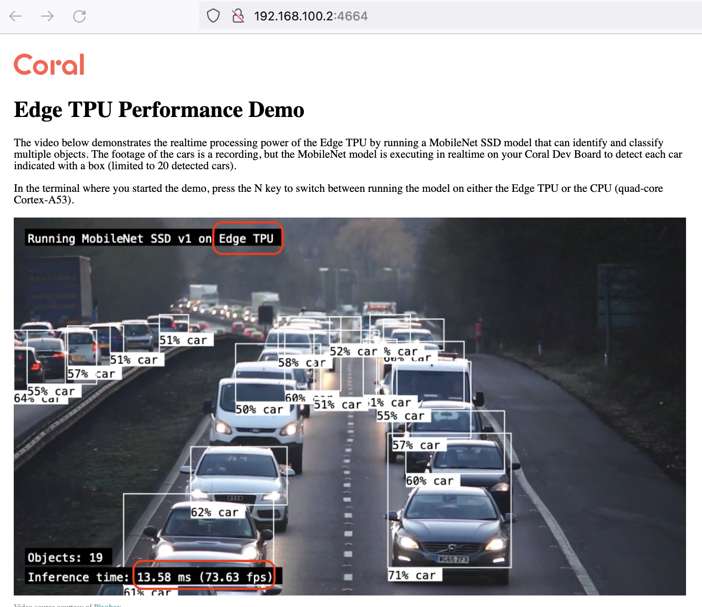
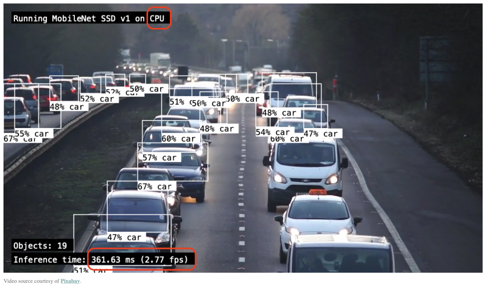

# Google Coral Dev Board

The [Google Coral Dev Board](https://coral.ai/products/dev-board/) is a Quad-core symmetric Cortex-A53 processors (with GPU and VPU) and an Edge TPU coprocessor as low-power ML acceleror ([4 TOPS, 2 TOPS per watt](https://coral.ai/docs/edgetpu/benchmarks/)). The 40x48mm system-on-module (SoM) included with the Dev Board is based on NXP's iMX 8M system-on-chip (SoC) and contains all the essential system hardware, including the Edge TPU and Wi-Fi/Bluetooth radios. It is attached to the Dev Board baseboard with three 100-pin board-to-board connectors. Network interfaces include Gigabit Ethernet, WiFi and Bluetooh 4.2 (including BLE). The board had a MicroSD slot and connectors for camera (MIPI CSI-2 camera connector), audio, external stereo speakers, video (HDMI and MIPI DSI display connector), USB-C and USB Micro-B for serial console. GPIO are available on the 40-pin I/O header.


## Getting started
TODO

### Install Mendel Linux on the eMMC from a MicroSD

[Mendel Linux](https://coral.googlesource.com/docs/+/refs/heads/master/ReadMe.md) is a lightweight derivative of Debian Linux that runs on a number of Coral development boards, such as the Dev Board and SoM.

https://coral.ai/docs/dev-board/get-started/#flash-the-board

* https://coral.googlesource.com/docs/+/refs/heads/master/GettingStarted.md

> On the host side, `lsub` gives `Bus 000 Device 004: ID 18d1:9303 Google Inc. Mendel  Serial: coy-tang`

### Connect to the shell (using MDT)

https://coral.ai/docs/dev-board/get-started/#connect-via-mdt

```bash
> mdt version
MDT version 1.5.2
> mdt help

Usage: mdt <subcommand> [<options>]

Where <subcommand> may be one of the following:
    help              - this command, gets help on another command.
    devices           - lists all detected devices.
    wait-for-device   - waits for a device to be discovered on the network
    get               - gets an MDT variable value
    set               - sets an MDT variable value
    clear             - clears an MDT variable
    genkey            - generates an SSH key for connecting to a device
    pushkey           - pushes an SSH public key to a device
    setkey            - imports a PEM-format SSH private key into the MDT
                        keystore
    resetkeys         - removes all keys from the given board and resets key
                        authentication to factory defaults
    shell             - opens an interactive shell to a device
    exec              - runs a shell command and returns the output and the
                        exit code
    install           - installs a Debian package using mdt-install-package on
                        the device
    push              - pushes a file (or files) to the device
    pull              - pulls a file (or files) from the device
    reboot            - reboots a device
    reboot-bootloader - reboots a device into the bootloader
    version           - prints which version of MDT this is

Use "mdt help <subcommand>" for more details.
```


Check the Mendel version
```bash
cat /etc/mendel_version
```

### Networking

Connect the board to your local network using WiFi or/and Ethernet.

```bash
ps -ax
df -h
ip addr
nmcli connection show
ip addr | grep 'inet '
```

> Ping the board for your host from the Wifi or Ethernet network : it's slower than throught the 192.162.100.2 address (OTG USB port).

You can change the hostname (for instance: `coral-devboard-001`)
```bash
sudo vi /etc/hostname
```
The change will be effective after the reboot.

> NB: you can connect with SSH using : `ssh -i ~/.config/mdt/keys/mdt.key mendel@192.168.100.2` or `ssh -i ~/.config/mdt/keys/mdt.key mendel@coral-erods-01.local`

### Run the Mobilnet demo

```bash
ls /usr/bin/edge*
```

https://coral.ai/docs/dev-board/get-started/#run-demo

Browse the live demo http://192.168.100.2:4664/

You can switch between CPU mode and TPU mode using key `n`.

The performances are : ~70 fps with TPU versus ~3 fps with CPU.




### Run a model

https://coral.ai/docs/dev-board/get-started/#run-pycoral

```bash
mkdir coral && cd coral
git clone https://github.com/google-coral/pycoral.git
cd pycoral/

cat examples/README.md
```

The descrition of each example in https://github.com/google-coral/pycoral/tree/master/examples is in the header of each Python program.

For instance

#### classify_image
```bash
bash examples/install_requirements.sh classify_image.py
python3 examples/classify_image.py --model test_data/mobilenet_v2_1.0_224_inat_bird_quant_edgetpu.tflite --labels test_data/inat_bird_labels.txt --input test_data/parrot.jpg
```


#### detect_image
```bash
bash examples/install_requirements.sh detect_image.py
python3 examples/detect_image.py \
  --model test_data/ssd_mobilenet_v2_coco_quant_postprocess_edgetpu.tflite \
  --labels test_data/coco_labels.txt \
  --input test_data/grace_hopper.bmp \
  --output ${HOME}/grace_hopper_processed.bmp
```

```console
----INFERENCE TIME----
Note: The first inference is slow because it includes loading the model into Edge TPU memory.
36.48 ms
23.87 ms
14.87 ms
12.39 ms
15.41 ms
-------RESULTS--------
tie
  id:     31
  score:  0.83984375
  bbox:   BBox(xmin=227, ymin=419, xmax=292, ymax=541)
person
  id:     0
  score:  0.8046875
  bbox:   BBox(xmin=2, ymin=4, xmax=513, ymax=595)
```

[Grace Hopper: Mother of COBOL](https://en.wikipedia.org/wiki/Grace_Hopper)


grace_hopper_processed.bmp

#### movenet_pose_estimation
```bash
bash examples/install_requirements.sh movenet_pose_estimation.py
python3 examples/movenet_pose_estimation.py \
  --model test_data/movenet_single_pose_lightning_ptq_edgetpu.tflite  \
  --input test_data/squat.bmp
```

```console
[[0.33184516 0.5776564  0.49981618]
 [0.31955463 0.589947   0.6350124 ]
 [0.3113609  0.56536585 0.70056206]
 [0.31955463 0.5776564  0.43016967]
 [0.31955463 0.5080099  0.29907033]
 [0.42197597 0.5776564  0.6350124 ]
 [0.41378227 0.4178791  0.49981618]
 [0.50391304 0.7128526  0.19664899]
 [0.5121068  0.5407847  0.49981618]
 [0.42197597 0.6964652  0.49981618]
 [0.42197597 0.6677872  0.15568045]
 [0.59814066 0.38920113 0.75382113]
 [0.6145281  0.2867798  0.43016967]
 [0.6595935  0.5858501  0.6350124 ]
 [0.6759809  0.42197597 0.75382113]
 [0.8480488  0.5121068  0.6350124 ]
 [0.88901734 0.3400389  0.70056206]]
Done. Results saved at movenet_result.jpg
```


#### small_object_detection

```bash
bash examples/install_requirements.sh small_object_detection.py

python3 examples/small_object_detection.py \
  --model test_data/ssd_mobilenet_v2_coco_quant_no_nms_edgetpu.tflite \
  --label test_data/coco_labels.txt \
  --input test_data/kite_and_cold.jpg \
  --tile_size 1352x900,500x500,250x250 \
  --tile_overlap 50 \
  --score_threshold 0.5 \
  --output ${HOME}/object_detection_results.jpg
```


## Run colab/Jupyter on the devboard 

https://colab.research.google.com/github/google-coral/tutorials/blob/master/run_colab_on_devboard.ipynb

> If the Jupyter installation fails, try `sudo apt-get install libffi-dev`

```bash
sudo apt-get update

sudo apt-get install libffi-dev
sudo apt-get install python3-dev

pip3 install jupyter
source $HOME/.profile
jupyter --version
```

```bash
pip3 install jupyter_http_over_ws
jupyter serverextension enable --py jupyter_http_over_ws
jupyter notebook \
  --NotebookApp.allow_origin='https://colab.research.google.com' \
  --port=8888 \
  --NotebookApp.port_retries=0
```

On host, forward the Jupyter port (`8888`):
```bash
ssh -N -L 8888:localhost:8888 mendel@192.168.100.2 -i ~/.config/mdt/keys/mdt.key
```

Open http://localhost:8888 in a browser on the host computer.


Install the `edgetpu-examples` package.

```bash
echo "deb https://packages.cloud.google.com/apt coral-edgetpu-stable main" | sudo tee /etc/apt/sources.list.d/coral-edgetpu.list
echo "deb https://packages.cloud.google.com/apt coral-cloud-stable main" | sudo tee /etc/apt/sources.list.d/coral-cloud.list
curl https://packages.cloud.google.com/apt/doc/apt-key.gpg | sudo apt-key add -
sudo apt-get update 
sudo apt-get dist-upgrade
sudo apt-get install edgetpu-examples
ls -al /usr/share/edgetpu/examples/models
ls -al /usr/share/edgetpu/examples/images
cat /usr/share/edgetpu/examples/models/inat_bird_labels.txt
```

```bash
mkdir ~/notebooks
```

Create a new notebook into the `~/notebooks` directory, add the following program into a cell and run it

```python
from edgetpu.classification.engine import ClassificationEngine
from edgetpu.utils import dataset_utils
from PIL import Image

# Prepare labels.
labels = dataset_utils.read_label_file('/usr/share/edgetpu/examples/models/inat_bird_labels.txt')
# labels = dataset_utils.read_label_file('/home/mendel/coral/pycoral/test_data/inat_bird_labels.txt')

# Initialize engine.
engine = ClassificationEngine('/usr/share/edgetpu/examples/models/mobilenet_v2_1.0_224_inat_bird_quant_edgetpu.tflite')
# engine = ClassificationEngine('/home/mendel/coral/pycoral/test_data/mobilenet_v2_1.0_224_inat_bird_quant_edgetpu.tflite')

# Run inference.
img = Image.open('/usr/share/edgetpu/examples/images/parrot.jpg')
# img = Image.open('/home/mendel/coral/pycoral/test_data/parrot.jpg')
for result in engine.classify_with_image(img, top_k=3):
 print('---------------------------')
 print(labels[result[0]])
 print('Score : ', result[1])
```

Result should be:
```console
---------------------------
Ara macao (Scarlet Macaw)
Score :  0.6796875
---------------------------
Platycercus elegans (Crimson Rosella)
Score :  0.12109375
```

You can test more models with the following repositories :

```bash
cd ~/coral
git clone https://github.com/google-coral/tutorials.git
cd tutorials
ls -al
```

> For running a notebook, you should edit it before in order to replace `pip` by `pip3` and `apt-get install` by `sudo apt-get install -y` 

Open 

More programs to test:

```bash
cd ~/coral
git clone https://github.com/google-coral/test_data.git
cd test_data
ls -al
```


## Coral Environmental Sensor Board

* https://coral.ai/products/environmental/

## Coral Camera 

The Coral camera is a Omnivision OV5645 camera (5 megapixels).

* https://fr.aliexpress.com/item/1005003709936187.html
* https://coral.ai/products/camera/
* https://coral.ai/docs/dev-board/camera/#run-a-demo-with-the-camera
* https://coral.ai/docs/dev-board/camera/#view-on-a-monitor

## USB camera (ie Logitech C920 HD Pro)

* https://coral.ai/docs/dev-board/camera/#connect-a-usb-camera
* https://github.com/google-coral/project-teachable/issues/3
* https://github.com/cz172638/v4l-utils
* https://github.com/google-coral/examples-camera

```bash
cd ~/coral
git clone https://github.com/google-coral/examples-camera.git
cd examples-camera
v4l2-ctl --list-devices
v4l2-ctl --list-formats-ext --device /dev/video1
```

This demo draws a box around any detected human faces.
```bash
edgetpu_detect \
--source /dev/video1:YUY2:800x600:24/1  \
--model ${DEMO_FILES}/ssd_mobilenet_v2_face_quant_postprocess_edgetpu.tflite
```

Run the face detection model with a streaming server
```bash
edgetpu_detect_server \
--source /dev/video1:YUY2:800x600:24/1  \
--model ${DEMO_FILES}/ssd_mobilenet_v2_face_quant_postprocess_edgetpu.tflite
```

Open http://192.168.100.2:4664/

## USB thermal camera (ie Lynred)

TODO

## LoRaWAN modem

Connect the [LoRaWAN E5 modem](https://wiki.seeedstudio.com/Grove_LoRa_E5_New_Version/) to the UART Grove connector of the Coral Environmental Sensor Board or on the devboard header according the following pinout:

TODO

## Machine Learning with Edge TPU

TODO

* https://coral.ai/docs/edgetpu/models-intro/#compatibility-overview

## LSTM

https://colab.research.google.com/github/google-coral/tutorials/blob/master/train_lstm_timeseries_ptq_tf2.ipynb


Install Python libraries
```bash
pip3 install pandas
```


Open the `train_lstm_timeseries_ptq_tf2.ipynb` notebook in Jupyter

### Run inference on the Edge TPU with Python

https://coral.ai/docs/edgetpu/tflite-python/


### Shutdown the board

```bash
sudo shutdown now
```

## Coral DevBoard in production

### Monit

TODO

### Watchdog

TODO

### Battery pack (4x NCR18650B 3.7V 3400mAh)

TODO

https://fr.aliexpress.com/item/4000337670572.html

## Misc

### More examples

* https://coral.ai/examples/
* https://github.com/google-coral/project-birdfeeder
* Worker safety https://github.com/google-coral/demo-manufacturing
* https://github.com/google-coral/project-cloud-monitor
* https://github.com/google-coral/project-banana-robo (required a L298N H-Bridge DC motor driver)
* https://github.com/google-coral/project-teachable

### Pinout


### Enclosure
* https://storage.googleapis.com/site_and_emails_static_assets/Files/Coral-Camera-and-Dev-Board-base.zip
* https://www.thingiverse.com/thing:3561461
* https://fr.rs-online.com/web/p/boitiers-pour-carte-de-developpement/2024901

## References
* https://www.mouser.fr/datasheet/2/963/Coral-Dev-Board-datasheet-1605708.pdf
* https://github.com/google-coral
* https://github.com/google-coral/tutorials
* https://colab.research.google.com/github/google-coral/tutorials/blob/master/run_colab_on_devboard.ipynb

