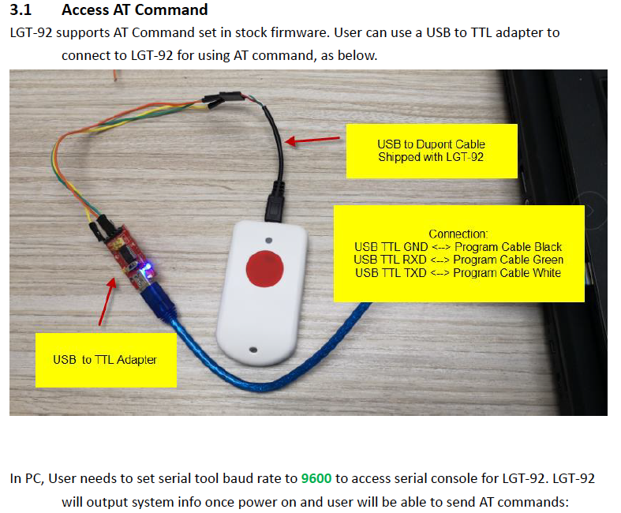
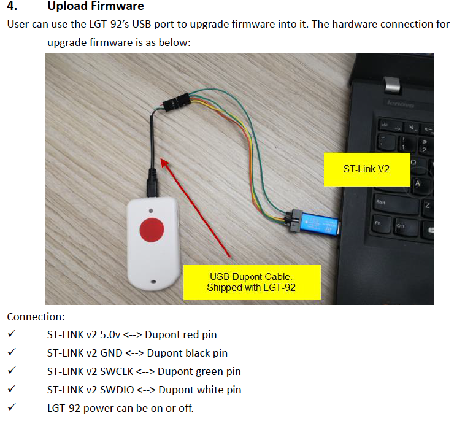

# Dragino LGT92 GPS Tracker :: Tutoriel

Le Dragino LGT92 est un traqueur GPS bon marché muni d'un module GNSS Quectel L70 ou L76, d'un button et d'un accelerometre. Le code du firmware est open-source et peut être personnalisé.


## Documentation
* https://www.dragino.com/products/lora-lorawan-end-node/item/142-lgt-92.html
* Documents https://www.dragino.com/downloads/index.php?dir=LGT_92/
* Code source du firmware https://github.com/dragino/LGT-92_-LoRa_GPS_Tracker
* Commandes AT pour LGT92 https://www.dragino.com/downloads/downloads/LGT_92/DRAGINO_LGT92_AT_Commands_v1.5.3.pdf 

## Commandes AT

Branchez le FTDI comme indiqué dans la documentation et configurez minicom avec `9600 N 1`

* Baudrate: 9600 
* Data bits: 8
* Stop bits: 1
* Parity: None
* Flow control: None



### Aide

```
AT?

AT+<CMD>?        : Help on <CMD>
AT+<CMD>         : Run <CMD>
AT+<CMD>=<value> : Set the value
AT+<CMD>=?       : Get the value
AT+DEBUG:Set more info input
ATZ: Trig a reset of the MCU
AT+FDR: Reset Parameters to Factory Default, Keys Reserve
AT+DEUI: Get or Set the Device EUI
AT+DADDR: Get or Set the Device Address
AT+APPKEY: Get or Set the Application Key
AT+NWKSKEY: Get or Set the Network Session Key
AT+APPSKEY: Get or Set the Application Session Key
AT+APPEUI: Get or Set the Application EUI
AT+ADR: Get or Set the Adaptive Data Rate setting. (0: off, 1: on)
AT+TXP: Get or Set the Transmit Power (0-5, MAX:0, MIN:5, according to LoRaWAN Spec)
AT+DR: Get or Set the Data Rate. (0-7 corresponding to DR_X)
AT+DCS: Get or Set the ETSI Duty Cycle setting - 0=disable, 1=enable - Only for testing
AT+PNM: Get or Set the public network mode. (0: off, 1: on)
AT+RX2FQ: Get or Set the Rx2 window frequency
AT+RX2DR: Get or Set the Rx2 window data rate (0-7 corresponding to DR_X)
AT+RX1DL: Get or Set the delay between the end of the Tx and the Rx Window 1 in ms
AT+RX2DL: Get or Set the delay between the end of the Tx and the Rx Window 2 in ms
AT+JN1DL: Get or Set the Join Accept Delay between the end of the Tx and the Join Rx Window 1 in ms
AT+JN2DL: Get or Set the Join Accept Delay between the end of the Tx and the Join Rx Window 2 in ms
AT+NJM: Get or Set the Network Join Mode. (0: ABP, 1: OTAA)
AT+NWKID: Get or Set the Network ID
AT+FCU: Get or Set the Frame Counter Uplink
AT+FCD: Get or Set the Frame Counter Downlink
AT+CLASS: Get or Set the Device Class
AT+JOIN: Join network
AT+NJS: Get the join status
AT+SENDB: Send hexadecimal data along with the application port
AT+SEND: Send text data along with the application port
AT+RECVB: Print last received data in binary format (with hexadecimal values)
AT+RECV: Print last received data in raw format
AT+RJTDC: Get or set the ReJoin data transmission interval in min
AT+RPL: Get or set response level
AT+VER: Get current image version and Frequency Band
AT+HWVER: Get the LGT92 of hardware version and gps of version
AT+CFM: Get or Set the confirmation mode (0-1)
AT+CFS: Get confirmation status of the last AT+SEND (0-1)
AT+SNR: Get the SNR of the last received packet
AT+RSSI: Get the RSSI of the last received packet
AT+ACE: Get or set the Alarm data transmission interval in ms
AT+KAT: Get or set the keep alive time data transmission interval in ms
AT+FTIME: Get or set the GPS positioning time in s
AT+LOGGPS: Get or set the GPS positioning time in s
AT+TDC: Get or set the application data transmission interval in ms
AT+PORT: Get or set the application port
AT+RX1WTO: Get or Set the number of symbols to detect and timeout from RXwindow1(0 to 255)
AT+RX2WTO: Get or Set the number of symbols to detect and timeout from RXwindow2(0 to 255)
AT+SGM: Get or set the status of Motion Sensor  (Disable(1), Enable (0))
AT+MD: Get or set the mode of Motion detection (0:Disable,1:Move,2:Collide,3:User)
AT+LON: Get or set the LED flashing of position,downlink and uplink (Disable(0), Enable (1))
AT+MLON: Get or set the LED of Motion detection(Disable(0), Enable (1))
AT+PDOP: Get or set the PDOP value
AT+NMEA353: Get or set the search mode of GPS
AT+NMEA886: Get or set the navigation mode of GPS
AT+MOD:Get or Set the work mode(1:IIC mode,2:Distance mode,3:3ADC mode,4:3DS18B20 mode,5:weight mode)
AT+CHS: Get or Set Frequency (Unit: Hz) for Single Channel Mode
AT+CFG: Print all configurations
AT+CAL: the sensor should be kept herizontal when calibrating Acc and Gyro
AT+BAT: the get device battery level
```


### Reset
```
ATZ

LSI=37184
LGT-92 Device
Image Version: v1.6.5
LoRaWan Stack: DR-LWS-005
Frequency Band: EU868
DevEui= A8 40 41 F4 41 82 F8 00
```

### Passage en mode Debug
```
AT+DEBUG
```

### Affichage de la configuration
```
AT+CFG

AT+DEUI=a8 40 41 f4 41 82 f8 00
AT+DADDR=01 82 f8 00 
AT+APPKEY=73 44 66 5b 62 f3 ad 91 9b 8c aa 52 d3 e5 8a 5f
AT+NWKSKEY=54 58 16 ed 8a f8 b6 f3 af 7f 7d 75 26 95 4f 89
AT+APPSKEY=13 62 25 e7 cd 78 c2 74 ae 3f 39 5e b4 94 26 2b
AT+APPEUI=a0 00 00 00 00 00 01 02
AT+ADR=1
AT+TXP=0
AT+DR=2
AT+DCS=0
AT+PNM=1
AT+RX2FQ=869525000
AT+RX2DR=0
AT+RX1DL=1000
AT+RX2DL=2000
AT+JN1DL=5000
AT+JN2DL=6000
AT+NJM=1
AT+NWKID=00 00 00 00
AT+FCU=0
AT+FCD=0
AT+CLASS=A
AT+NJS=0
AT+RECVB=0:
AT+RECV=0:
AT+RJTDC=20
AT+RPL=0
AT+VER=v1.6.5 EU868
AT+HWVER=v1.6.5,ublox-MAX7
AT+CFM=1
AT+CFS=0
AT+SNR=0
AT+RSSI=0
AT+ACE=60000
AT+KAT=3600000
AT+FTIME=150
AT+LOGGPS=0
AT+TDC=30000
AT+PORT=2
AT+RX1WTO=7
AT+RX2WTO=6
AT+SGM=1
AT+MD=1
AT+LON=1
AT+MLON=0
AT+PDOP=3.00
AT+NMEA353=0
AT+NMEA886=1
AT+MOD=0
AT+CHS=0
AT+BAT=2641
```


```
AT+CFM=1
AT+DCS=1
AT+TDC=10000
```

### Configuration de la période du _keep alive_

```
AT+KAT=?
AT+KAT=360000
```

### Envoi d'un message Uplink
```
AT+SENDB=12:abcdef0123456789
```


### Configuration du mode ballon du GNSS

Set navigation mode.(L70-RL doesn't support option 5，L76-L support all)
* `AT+NMEA886=0` default
* `AT+NMEA886=1` Normal mode: For general purpose
* `AT+NMEA886=2` Fitness mode: For running and walking purpose that the low-speed (<5m/s) movement will have more effect on the position calculation.
* `AT+NMEA886=3` Aviation mode: For high-dynamic purpose that the large-acceleration movement will have more effect on the position calculation.
* `AT+NMEA886=4` Balloon mode: For high-altitude balloon purpose that the vertical movement will have more effect on the position calculation.
* `AT+NMEA886=5` Stationary mode: For stationary applications that zero dynamics is Assumed


```
AT+NMEA886=?
AT+NMEA886=4
```


### Get or set the search mode of GPS

* 0:GPS module factory default value
* 1:GPS+GLONASS
* 2:GPS+BeiDou
* 3:GPS+Galileo
* 4:GPS+GLONASS+Galileo

```
AT+NMEA353=?
AT+NMEA353=4
```

### MAJ de la clé AppKey
```
AT+APPKEY=1234567890abcdef1234567890abcdef
```

### Configuration en ABP
```
AT+NJM=0
AT+DADDR=0182f800
AT+NWKSKEY=545816ed8af8b6f3af7f7d7526954f89
AT+APPSKEY=136225e7cd78c274ae3f395eb494262b
ATZ
```

## Mise à jour du firmware

Brancher le STLink chinois au cable fourni comme montré dans la documentation.



Lancez le STM32CubeProgrammer  (pré-installé).

```
alias stm32proj_cli=/Applications/STMicroelectronics/STM32Cube/STM32CubeProgrammer/STM32CubeProgrammer.app/Contents/MacOs/bin/STM32_Programmer_CLI
```

Il faut maintenir le reset appuyé quand on lance la commande ci-dessous puis la relache (car la broche reset du Stlink n'est pas relié à la MCU)
```
stm32proj_cli --connect port=SWD -vb 3
      -------------------------------------------------------------------
                        STM32CubeProgrammer v2.5.0                  
      -------------------------------------------------------------------

ST-LINK SN  : 264A04002A135937334D4E00
ST-LINK FW  : V2J31S7
Board       : --
Voltage     : 3,18V
SWD freq    : 4000 KHz
Connect mode: Normal
Reset mode  : Software reset
Device ID   : 0x447
Revision ID : Rev Z
Database: Config 2 is active.
Device name : STM32L07x/L08x/L010
Flash size  : 192 KBytes
Device type : MCU
Device CPU  : Cortex-M0+
```


```
stm32proj_cli --connect port=SWD freq=4000 --download ~/Downloads/LGT_92_EU868.hex 0x0800000000
```

