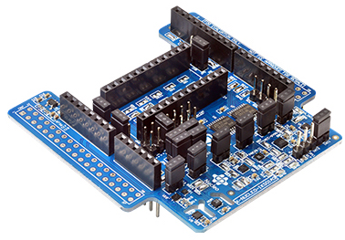

# Eclipse IoT Day 2023 :: Workshop RIOT

RIOT OS is an realtime operating system for embedded systems and Internet of Things. It supports common ISA (ARM7, ESP32, RISC-V), MCU and prototyping boards. It provides drivers for common sensors.

The tutorial will follow some chapters of the [https://riot-os.github.io/riot-course/ RIOT Course]

https://riot-os.github.io/riot-course/slides/03-riot-basics/#1


## Installation

Follow the [Getting Started](https://doc.riot-os.org/getting-started.html) section of the wiki.

https://riot-os.github.io/riot-course/slides/02-getting-started/#1


Clone the RIOT repository

```bash
cd
mkdir -p ~/github/RIOT-OS
cd ~/github/RIOT-OS
git clone https://github.com/RIOT-OS/RIOT.git
cd RIOT
```

Installing building tools for ARM7 architecture since the boards used for the tutorial are STM32.

> On MacOS, use `brew` for the installation.

### Applications for Serial Console

* [Putty for Windows](https://www.putty.org/)
* `minicom`, `tio`, `pyterm` on MacOS/Linux

TODO

## Introduction about RIOT

* [Getting Started](https://riot-os.github.io/riot-course/slides/02-getting-started/#1)
* [RIOT Basics](https://riot-os.github.io/riot-course/slides/03-riot-basics/#1)

> All the supported CPU are in the [directory `cpu`](https://github.com/RIOT-OS/RIOT/tree/master/cpu)

```bash
cd ~/github/RIOT-OS/RIOT/cpu
ls -al
```

> All the supported boards are in the [directory `boards`](https://github.com/RIOT-OS/RIOT/tree/master/boards)

```bash
cd ~/github/RIOT-OS/RIOT/boards
ls -al
```

> All the supported sensors drivers are in the [directory `drivers`](https://github.com/RIOT-OS/RIOT/tree/master/drivers)

```bash
cd ~/github/RIOT-OS/RIOT/drivers
ls -al
```


## Boards and shields for the workshop

### MCU boards

* STM Nucleo STM32 Fxxx / Lxxx
* [STM P-Nucleo STM32WB55](https://www.st.com/en/evaluation-tools/p-nucleo-wb55.html)
* [STM B-L072Z-LRWAN1](https://www.st.com/en/evaluation-tools/b-l072z-lrwan1.html)
* [STM B-L475E-IOT01A](https://www.st.com/en/evaluation-tools/b-l475e-iot01a.html)
* [STM B-U585I-IOT02A](https://www.st.com/en/evaluation-tools/b-u585i-iot02a.html)
* Seeedstudio LoRa E5 [Dev](https://stm32python.gitlab.io/fr-version-lora/lora-e5-dev.html)/[Mini]() (STM32WL55 included) requires a STLink programmer
* [IMST iM880a](https://github.com/CampusIoT/tutorial/tree/master/im880a)
* [Sparkfun Raspberry RP2040](https://www.sparkfun.com/products/18721)
* [Espressif ESP32 Wroom Dev Kit](https://www.espressif.com/en/products/devkits)

### Sensors and Actuators

* Shield MEMS IKS01Ax
* [Grove Base Shield (for Arduino)](https://www.seeedstudio.com/Base-Shield-V2.html)
* [Grove Sensor Modules](https://wiki.seeedstudio.com/Grove/)

<!--  -->


### IoT Communications

#### LoRa/LoRaWAN

* Shield LoRa [SX1272](https://os.mbed.com/components/SX1272MB2xAS/) and [SX1276](https://os.mbed.com/components/SX1276MB1xAS/)

#### Ultra Wide Band

* [Qorvo DWM 1001](https://github.com/CampusIoT/tutorial/tree/master/qorvo_dwm1001)

## Lesson #1: Hello world and Shell

Configure your board (`nucleo-f411re`, `nucleo-f446re`, `nucleo-l152re`, `p-nucleo-wb55`, `lora-e5-dev`, `b-l072z-lrwan1`, `dwm1001`, `rpi-pico` ...)
```bash
BOARD=your_board
```

```bash
cd ~/github/RIOT-OS/RIOT/examples/hello-world
make BOARD=$BOARD flash term
```

```bash
cd ~/github/RIOT-OS/RIOT/tests/shell
make BOARD=$BOARD flash term
```

## Lesson #2: Blink a LED (Hello world)

```bash
cd ~/github/RIOT-OS/RIOT/tests/leds
make BOARD=$BOARD flash term
```

## Lesson #2: Push a button

```bash
cd ~/github/RIOT-OS/RIOT/tests/buttons
make BOARD=$BOARD flash term
```

With `lora-e5-dev` boards
```
Help: Press s to start test, r to print it is ready
START
main(): This is RIOT! (Version: 2022.01-devel-217-g43bef)
On-board button test

 -- Available buttons: 2

 -- Try pressing buttons to test.

[SUCCESS]
Help: Press s to start test, r to print it is ready
START
main(): This is RIOT! (Version: 2022.01-devel-217-g43bef)
On-board button test

 -- Available buttons: 2

 -- Try pressing buttons to test.

[SUCCESS]
Pressed BTN0
Pressed BTN0
Pressed BTN0
```

## Lesson #3: MEMS and IMU

IKS01Ax shields provide several IMU and TH sensors from ST Microelectronic.

Check the version of the shield.



Shield Nucleo IKS01A1 (sensors are LSM6DS0, LIS3MDL, LPS25HB, HTS221)
* https://www.st.com/en/ecosystems/x-nucleo-iks01a1.html

Shield Nucleo IKS01A2 (sensors are LSM6DSL, LSM303AGR, LPS22HB, HTS221)
* https://www.st.com/en/ecosystems/x-nucleo-iks01a2.html 

Shield Nucleo IKS01A3 (sensors are LSM6DSO, LIS2MDL, LIS2DW12, LPS22HH, HTS221, STTS751)
* https://stm32python.gitlab.io/fr-version-lora/micro_python_iks01a3.html
* https://www.st.com/en/ecosystems/x-nucleo-iks01a3.html


For HTS221 (capacitive digital relative humidity and temperature)
```bash
cd ~/github/RIOT-OS/RIOT/tests/driver_hts221
make BOARD=$BOARD flash term
```

For LPS22HH (MEMS pressure sensor, 260-1260 hPa absolute digital output barometer)
```bash
cd ~/github/RIOT-OS/RIOT/tests/driver_lpsxxx
make BOARD=$BOARD DRIVER=lps22hh flash term
```

For LPS22HB (MEMS pressure sensor, 260-1260 hPa absolute digital output barometer)
```bash
cd ~/github/RIOT-OS/RIOT/tests/driver_lpsxxx
make BOARD=$BOARD DRIVER=lps22hb flash term
```

For LPS25HB (MEMS pressure sensor, 260-1260 hPa absolute digital output barometer)
```bash
cd ~/github/RIOT-OS/RIOT/tests/driver_lpsxxx
make BOARD=$BOARD DRIVER=lps25hb flash term
```

For LSM6DSL (MEMS 3D accelerometer (±2/±4/±8/±16 g) and 3D gyroscope (±125/±245/±500/±1000/±2000 dps))
```bash
cd ~/github/RIOT-OS/RIOT/tests/driver_lsm6dsl
make BOARD=$BOARD flash term
```

For LIS3MDL (MEMS 3D magnetometer (±4/ ±8/ ±12/ 16 gauss))
```bash
cd ~/github/RIOT-OS/RIOT/tests/driver_lis3mdl
make BOARD=$BOARD flash term
```

> TODO : test for `drivers/lsm303agr`


For `lora-e5-dev` boards, test the NXP LM75 temperature sensor
```bash
cd ~/github/RIOT-OS/RIOT/tests/driver_lm75
make BOARD=lora-e5-dev DRIVER=lm75a
```

```
main(): This is RIOT! (Version: 2022.01-devel-429-g70744)                       
Sensor test...                                                                  
Initialization...                                                               
Initialization succeeded                                                        
error setting Hyst and/or OS temps                                              
Set OS temp is 80.0ºC                                                          
Set HYST temp is 75.0ºC                                                        
20.0ºC                                                                         
Set OS temp is 80.0ºC                                                          
Set HYST temp is 75.0ºC                                                        
lm75: OS alert pin not connected or defined                                     
Error reading OS pin state                                                      
22.500ºC                                                                       
``` 

## Lesson #4: SAUL ([[S]ensor [A]ctuator [U]ber [L]ayer](https://doc.riot-os.org/group__drivers__saul.html))

Keep the Nucleo IKS01Ax Shield onto your Nucleo board

```bash
cd ~/github/RIOT-OS/RIOT/tests/saul
make BOARD=$BOARD flash term
```

Edit `Makefile` in order to add the modules related to the sensors available onto the shield.

```Makefile
...
USEMODULE += lis3mdl
USEMODULE += hts221
USEMODULE += lsm6dsl
USEMODULE += lm75
USEMODULE += stts751

USEMODULE += lpsxxx
# set the correct sub driver
USEMODULE += lps25hb
...
```

```bash
cd ~/github/RIOT-OS/RIOT/tests/saul
make BOARD=$BOARD flash term
```


For `lora-e5-dev` boards
```bash
cd ~/github/RIOT-OS/RIOT/tests/saul
make BOARD=lora-e5-dev
```

```
##########################
 
Dev: LED(red)	Type: ACT_SWITCH
Data:	              1 
 
Dev: Button(B1 Boot)	Type: SENSE_BTN
Data:	              0 
 
Dev: Button(B2 D0)	Type: SENSE_BTN
Data:	              0 
 
Dev: lm75	Type: SENSE_TEMP
Data:	          20.87 °C
```

## Lesson #5 : Analog GPIO

Connect the Grove Thumb Joystick to the A0 connector on the Grove Basic Shield (Pins are A0,A1)


```bash
cd ~/github/RIOT-OS/RIOT/tests/periph_adc
make BOARD=$BOARD flash term
```

```
TODO
```


```bash
cd ~/github/RIOT-OS/RIOT/tests/sys_arduino_analog
make BOARD=$BOARD flash term
```

```
TODO
```


## Lesson #6: LoRa/LoRaWAN communications

* https://riot-os.github.io/riot-course/slides/05-lorawan-with-riot/#1
* https://stm32python.gitlab.io/fr-version-lora/lora.html 
* https://stm32python.gitlab.io/fr-version-lora/lora-e5-dev.html 
* https://stm32python.gitlab.io/fr-version-lora/lora-e5-mini.html 

Login on [CampusIoT LoRa Network Server](https://lns.campusiot.imag.fr/#/organizations/5/applications/258)

The username is GuestSandbox and the password is given during the workshop.

The Organisation is `SANDBOX`.
Several endpoints has been already provisioned in this [application](https://lns.campusiot.imag.fr/#/organizations/5/applications/258).

Choose one for setting the DEVEUI, APPEUI and APPKEY of your endpoint.
 
```
Name   DEVEUI            APPEUI           APPKEY
EID_01 ABCDEF1200000001  ABCDEF1200FFFFFF CAFEBABECAFEBABE0123456789ABCDEF 
EID_02 ABCDEF1200000002  ABCDEF1200FFFFFF CAFEBABECAFEBABE0123456789ABCDEF 
EID_03 ABCDEF1200000003  ABCDEF1200FFFFFF CAFEBABECAFEBABE0123456789ABCDEF 
EID_04 ABCDEF1200000004  ABCDEF1200FFFFFF CAFEBABECAFEBABE0123456789ABCDEF 
EID_05 ABCDEF1200000005  ABCDEF1200FFFFFF CAFEBABECAFEBABE0123456789ABCDEF 
EID_06 ABCDEF1200000006  ABCDEF1200FFFFFF CAFEBABECAFEBABE0123456789ABCDEF 
EID_07 ABCDEF1200000007  ABCDEF1200FFFFFF CAFEBABECAFEBABE0123456789ABCDEF 
EID_08 ABCDEF1200000008  ABCDEF1200FFFFFF CAFEBABECAFEBABE0123456789ABCDEF 
EID_09 ABCDEF1200000009  ABCDEF1200FFFFFF CAFEBABECAFEBABE0123456789ABCDEF 
EID_0A ABCDEF120000000A  ABCDEF1200FFFFFF CAFEBABECAFEBABE0123456789ABCDEF 
```

Show the LoRa trafic on the [local gateway console](https://lns.campusiot.imag.fr/#/organizations/5/gateways/353036201a003200/frames)


## Lesson #7: UWB Ranging and positioning

* https://github.com/CampusIoT/tutorial/tree/master/qorvo_dwm1001#getting-started-with-riot 

## Lesson #8: GNSS module

TODO

## Lesson #9: Micro Python

TODO

## Lesson #10: RUST

TODO

## Lesson #11: Cryptography (ED25519)

https://github.com/thingsat/ecc_mcu_benchmarks


## Lesson #12: Secure Firmware Update (TODO)

This part requires a SDCard reader. New firmware is delivered on a SDCard 

## Extra

### SRF0x ultrasonic range sensor

Plug the SRF0x ultrasonic range sensor into a I2C commector of the Grove Basic Shield


```bash
cd ~/github/RIOT-OS/RIOT/tests/driver_srf02
make BOARD=$BOARD flash term
```

```bash
cd ~/github/RIOT-OS/RIOT/tests/driver_srf04
make BOARD=$BOARD flash term
```

```bash
cd ~/github/RIOT-OS/RIOT/tests/driver_srf08
make BOARD=$BOARD flash term
```


