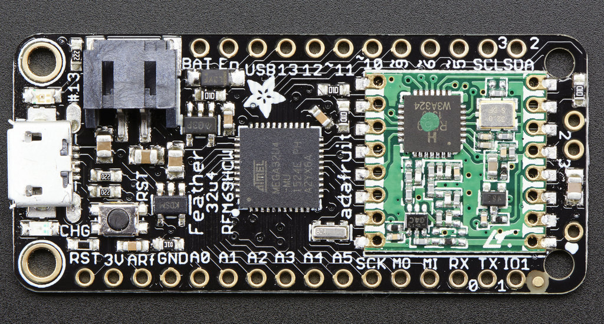
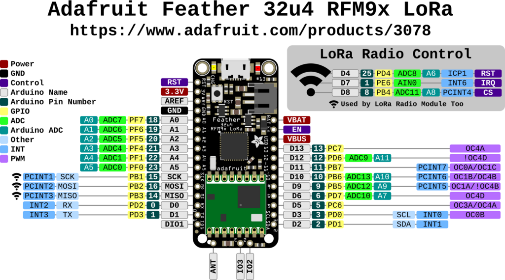

# Adafruit Feather 32u4 with LoRa Radio Module

https://learn.adafruit.com/adafruit-feather-32u4-radio-with-lora-radio-module

## Pinout

## Install `Adafruit AVR Boards > Feather LoRa 32u4`

Install the board definition https://adafruit.github.io/arduino-board-index/package_adafruit_index.json into `Preferences ...`

Choose the board  `Adafruit AVR Boards > Feather LoRa 32u4`

## Install `adafruit/RadioHead`

Download from https://codeload.github.com/adafruit/RadioHead/zip/refs/heads/master

Or from https://github.com/adafruit/RadioHead

## LoRa Reveiver

Open the [Feather9x_RX](Feather9x_RX/) sketch.

Set the `RFM95_` parameters.

Compile and upload the sketch.

## LoRa Transmitter

Open the [Feather9x_RX](Feather9x_TX/) sketch.

Set the `RFM95_` parameters.

Compile and upload the sketch.
