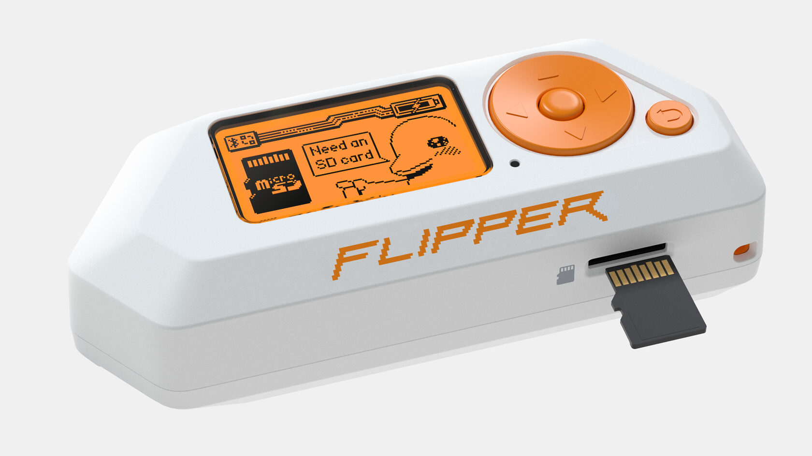

# Flipper Zero

## Description
[Flipper Zero](https://flipperzero.one) is an useful endpoint with with 128x64 px LCD screen (ST7567), a SDCard slot, and multi Comm/RF interfaces : IrDA, BLE 5.4, NFC (ST25R3916), RFID 125KHz, SubGHz radio (CC1101), iButton ...) . An extension port enables for [prototyping extensions](https://shop.flipperzero.one/products/proto-boards).

The CPU model is a [STM32WB55RG](https://www.st.com/en/microcontrollers-microprocessors/stm32wb55rg.html) which it is partially supported by RIOT.

## Project ideas

* CAN Bus commander
* LoRaWAN Field Test Device (LoRa SPI module + GNSS UART module)

## Useful links

* https://flipperzero.one
* https://github.com/flipperdevices/flipperzero-firmware

