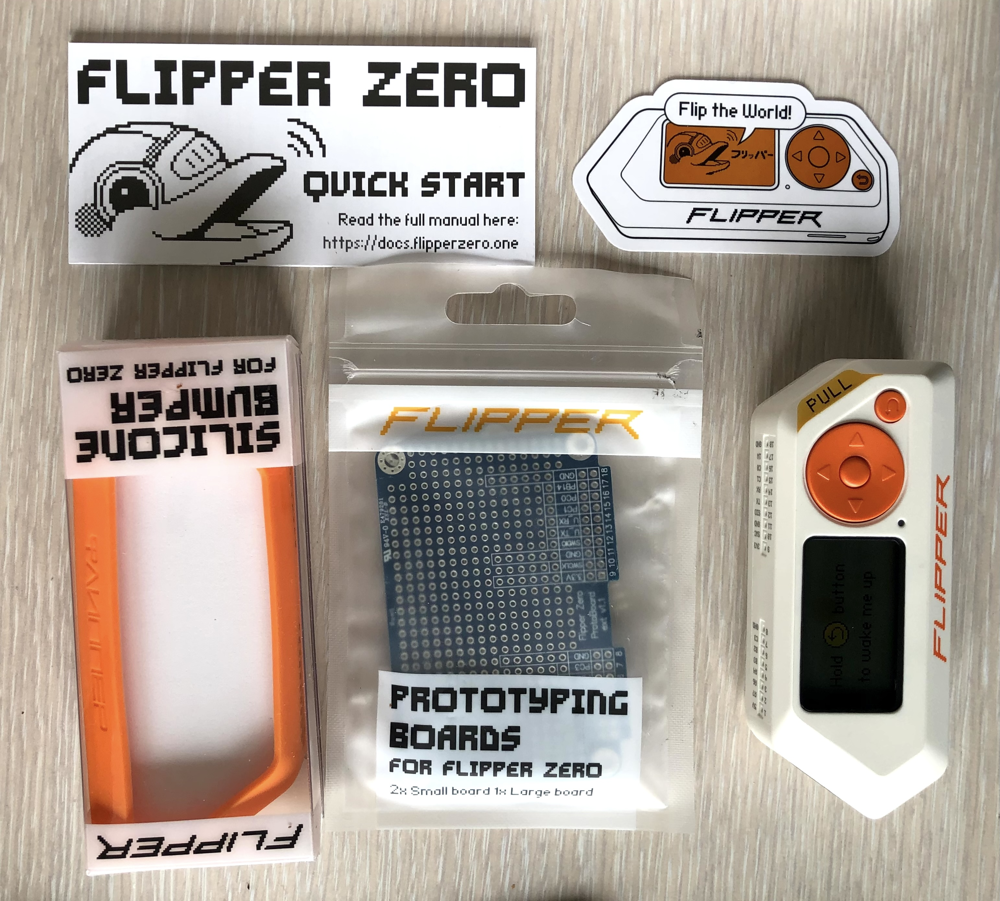
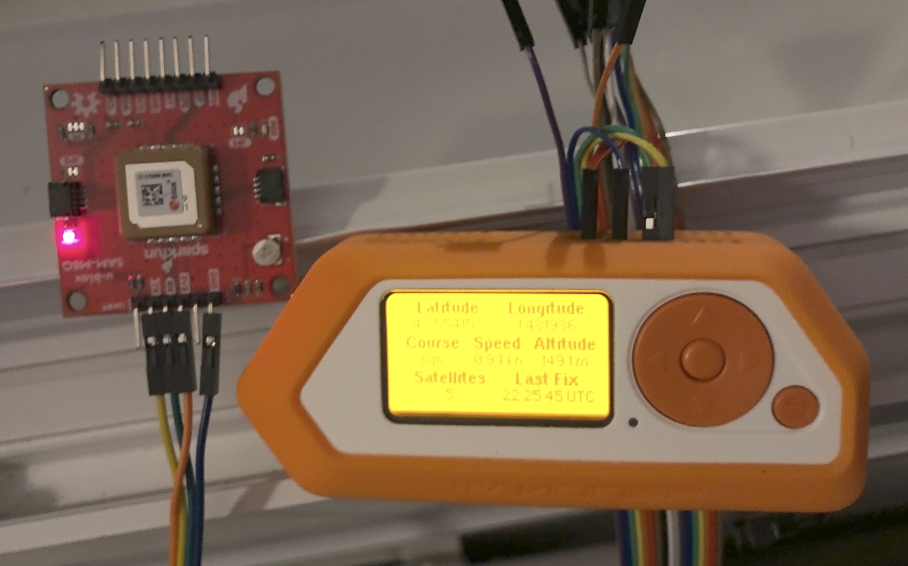
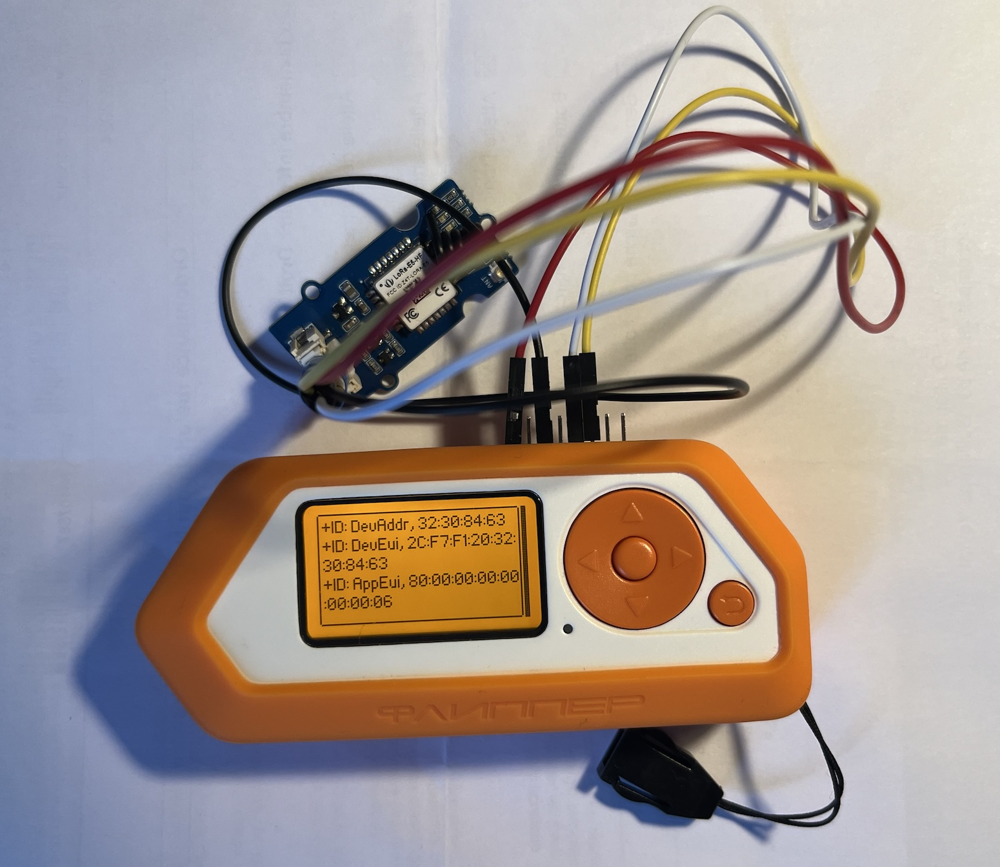
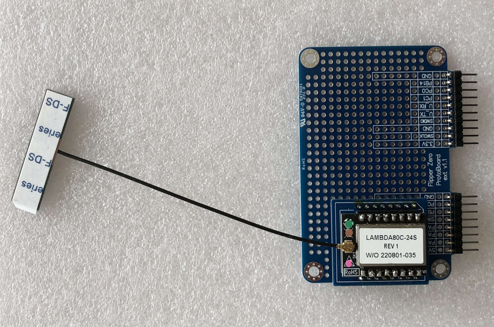
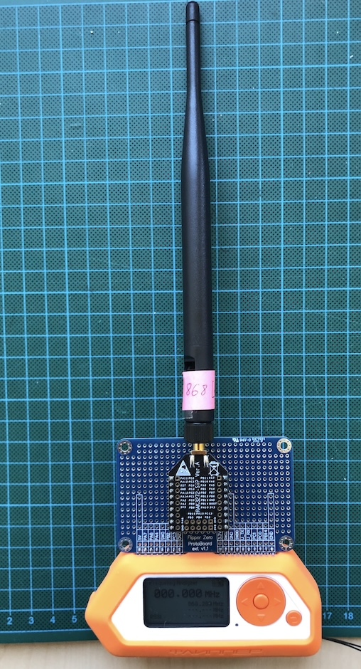

# 🐬🐬🐬🐬🐬 Flipper Zero 🐬🐬🐬🐬🐬

## Description
[Flipper 🐬 Zero](https://flipperzero.one) is an useful endpoint with with 128x64 px LCD screen (ST7567), a SDCard slot, and multi Comm/RF interfaces : IrDA, BLE 5.4, NFC (ST25R3916), RFID 125KHz (including [animal microchips](https://docs.flipper.net/rfid/animal-microchips)), SubGHz radio (CC1101), iButton ...) . An extension port enables for [prototyping extensions](https://shop.flipperzero.one/products/proto-boards).

The CPU model is a [STM32WB55RG](https://www.st.com/en/microcontrollers-microprocessors/stm32wb55rg.html) which it is partially supported by [RIOT](https://api.riot-os.org/group__boards__p-nucleo-wb55.html).




## Getting started

### [Force Reboot](https://docs.flipper.net/basics/reboot)

Hold for 5 sec return key and left arrow key

### Update with latest firmware

From My Flipper : https://lab.flipper.net/

### Install extra apps
Browse [catalog](https://lab.flipper.net) and install:
* [UART Terminal](https://lab.flipper.net/apps/uart_terminal)
* [GPS NMEA](https://lab.flipper.net/apps/gps_nmea)
* [Temp sensors reader](https://lab.flipper.net/apps/unitemp)
* [[J305] Geiger Counter](https://lab.flipper.net/apps/flipper_geiger)
  
### [CLI](https://docs.flipper.net/development/cli)

Use `minicom`, `tio` or Putty with baudrate 230400 bps.

```bash
tio -b 230400 -m INLCRNL /dev/tty.usbmodemflip_Oldishol1
```

Or open https://lab.flipper.net/cli in Chrome

```console

              _.-------.._                    -,
          .-"```"--..,,_/ /`-,               -,  \ 
       .:"          /:/  /'\  \     ,_...,  `. |  |
      /       ,----/:/  /`\ _\~`_-"`     _;
     '      / /`"""'\ \ \.~`_-'      ,-"'/ 
    |      | |  0    | | .-'      ,/`  /
   |    ,..\ \     ,.-"`       ,/`    /
  ;    :    `/`""\`           ,/--==,/-----,
  |    `-...|        -.___-Z:_______J...---;
  :         `                           _-'
 _L_  _     ___  ___  ___  ___  ____--"`___  _     ___
| __|| |   |_ _|| _ \| _ \| __|| _ \   / __|| |   |_ _|
| _| | |__  | | |  _/|  _/| _| |   /  | (__ | |__  | |
|_|  |____||___||_|  |_|  |___||_|_\   \___||____||___|

Welcome to Flipper Zero Command Line Interface!
Read the manual: https://docs.flipper.net/development/cli
Run `help` or `?` to list available commands

Firmware version: 0.98.3 0.98.3 (8b19d32c built on 12-02-2024)

>: help
Commands available:
!                             led
?                             loader
bt                            log
crypto                        nfc
date                          onewire
device_info                   power
factory_reset                 ps
free                          rfid
free_blocks                   start_rpc_session
gpio                          storage
help                          subghz
i2c                           sysctl
ikey                          update
info                          uptime
input                         vibro
ir                            
>: nfc
Other application is running, close it first
>: date
2024-03-11 17:10:35 1
>: subghz
Usage:
subghz <cmd> <args>
Cmd list:
        chat <frequency:in Hz> <device: 0 - CC1101_INT, 1 - CC1101_EXT>  - Chat with other Flippers
        tx <3 byte Key: in hex> <frequency: in Hz> <te: us> <repeat: count> <device: 0 - CC1101_INT, 1 - CC1101_EXT>     - Transmitting key
        rx <frequency:in Hz> <device: 0 - CC1101_INT, 1 - CC1101_EXT>    - Receive
        rx_raw <frequency:in Hz>         - Receive RAW
        decode_raw <file_name: path_RAW_file>    - Testing
        tx_from_file <file_name: path_file> <repeat: count> <device: 0 - CC1101_INT, 1 - CC1101_EXT>     - Transmitting from file

>: gpio
Usage:
gpio <cmd> <args>
Cmd list:
        mode <pin_name> <0|1>    - Set gpio mode: 0 - input, 1 - output
        set <pin_name> <0|1>     - Set gpio value
        read <pin_name>  - Read gpio value

>: device_info
device_info_major             : 2
device_info_minor             : 4
hardware_model                : Flipper Zero
...
protobuf_version_major        : 0
protobuf_version_minor        : 22

>: input
Usage:
input <cmd> <args>
Cmd list:
        dump                     - dump input events
        send <key> <type>        - send input event

>: uptime
Uptime: 3h53m43s
>: vibro
vibro: illegal option -- 
usage: vibro <1|0>
>: vibro 1

>: vibro 0

>: ir
Usage:
        ir rx [raw]
        ir tx <protocol> <address> <command>
        <command> and <address> are hex-formatted
        Available protocols: NEC NECext NEC42 NEC42ext Samsung32 RC6 RC5 RC5X SIRC SIRC15 SIRC20 Kaseikyo RCA
        Raw format:
        ir tx RAW F:<frequency> DC:<duty_cycle> <sample0> <sample1>...
        Frequency (10000 - 56000), Duty cycle (0 - 100), max 512 samples
        ir decode <input_file> [<output_file>]
        ir universal <remote_name> <signal_name>
        ir universal list <remote_name>
        Available universal remotes: tv audio ac projector

>: storage
Usage:
storage <cmd> <path> <args>
The path must start with /int or /ext
Cmd list:
        info     - get FS info
        format   - format filesystem
        list     - list files and dirs
        tree     - list files and dirs, recursive
        remove   - delete the file or directory
        read     - read text from file and print file size and content to cli
        read_chunks      - read data from file and print file size and content to cli, <args> should contain how many bytes you want to read in block
        write    - read text from cli and append it to file, stops by ctrl+c
        write_chunk      - read data from cli and append it to file, <args> should contain how many bytes you want to write
        copy     - copy file to new file, <args> must contain new path
        rename   - move file to new file, <args> must contain new path
        mkdir    - creates a new directory
        md5      - md5 hash of the file
        stat     - info about file or dir
        timestamp        - last modification timestamp

>: storage info
Usage:
storage <cmd> <path> <args>
The path must start with /int or /ext
Cmd list:
        info     - get FS info
        format   - format filesystem
        list     - list files and dirs
        tree     - list files and dirs, recursive
        remove   - delete the file or directory
        read     - read text from file and print file size and content to cli
        read_chunks      - read data from file and print file size and content to cli, <args> should contain how many bytes you want to read in block
        write    - read text from cli and append it to file, stops by ctrl+c
        write_chunk      - read data from cli and append it to file, <args> should contain how many bytes you want to write
        copy     - copy file to new file, <args> must contain new path
        rename   - move file to new file, <args> must contain new path
        mkdir    - creates a new directory
        md5      - md5 hash of the file
        stat     - info about file or dir
        timestamp        - last modification timestamp

>: storage info /ext
Label: FLIPPER
Type: FAT32
15449088KiB total
15438336KiB free
74J` USD   v1.0
SN:401d0002 02/2017

>: storage info /int
Label: Oldishol
Type: LittleFS
228KiB total
204KiB free

>: power
Usage:
power <cmd> <args>
Cmd list:
        off      - shutdown power
        reboot   - reboot
        reboot2dfu       - reboot to dfu bootloader
        5v <0 or 1>      - enable or disable 5v ext

>: crypto
Usage:
crypto <cmd> <args>
Cmd list:
        encrypt <key_slot:int> <iv:hex>  - Using key from secure enclave and IV encrypt plain text with AES256CBC and encode to hex
        decrypt <key_slot:int> <iv:hex>  - Using key from secure enclave and IV decrypt hex encoded encrypted with AES256CBC data to plain text
        has_key <key_slot:int>   - Check if secure enclave has key in slot
        store_key <key_slot:int> <key_type:str> <key_size:int> <key_data:hex>    - Store key in secure enclave. !!! NON-REVERSABLE OPERATION - READ MANUAL FIRST !!!

>: 
```
## [BadUSB](https://docs.flipper.net/bad-usb) : USB device emulator

Flipper Zero can act as a [BadUSB](https://docs.flipper.net/bad-usb) device, recognized by computers as a Human Interface Device (HID), such as a keyboard. A BadUSB device can change system settings, open backdoors, retrieve data, initiate reverse shells, or do anything that can be achieved with physical access.

[BadUsbScriptFormat](https://github.com/flipperdevices/flipperzero-firmware/blob/dev/documentation/file_formats/BadUsbScriptFormat.md)

[Example: demo_macos](https://github.com/flipperdevices/flipperzero-firmware/blob/dev/applications/main/bad_usb/resources/badusb/demo_macos.txt)


## Development

### Install micro Flipper Build Tool (`ufbt`)

```bash
python3 -m pip install --upgrade ufbt
ufbt --help
```

```
Configuration variables:

VERBOSE: Print full commands (yes|no)
    default: False
    actual: False

FORCE: Force target action (for supported targets) (yes|no)
    default: False
    actual: False

OTHER_ELF: Path to prebuilt ELF file to debug ( /path/to/OTHER_ELF )
    default: 
    actual: 

OPENOCD_OPTS: Options to pass to OpenOCD
    default: 
    actual: 

BLACKMAGIC: Blackmagic probe location
    default: auto
    actual: auto

SWD_TRANSPORT: SWD interface adapter type (auto|cmsis-dap|stlink|blackmagic_usb|blackmagic_wifi)
    default: auto
    actual: auto

SWD_TRANSPORT_SERIAL: SWD interface adapter serial number
    default: auto
    actual: auto

APPID: Application id
    default: 
    actual: 

UFBT_APP_DIR: Application dir to work with ( /path/to/UFBT_APP_DIR )
    default: 
    actual: /Users/donsez/github

FLIP_PORT: CDC Port of Flipper to use, if multiple are connected
    default: auto
    actual: auto

STRICT_FAP_IMPORT_CHECK: Enable strict import check for .faps (yes|no)
    default: True
    actual: True


TASKS:
    (* - not supported yet)

    launch:
        Upload and start application over USB
    vscode_dist:
        Configure application in current directory for development in VSCode.
    create:
        Copy application template to current directory. Set APPID=myapp to create an app with id 'myapp'.

Building:
    faps:
        Build all FAP apps
    fap_{APPID}, launch APPSRC={APPID}:
        Build FAP app with appid={APPID}; upload & start it over USB
    cdb:
        regenerate "compile_commands.json" file (for IDE integration)

Flashing & debugging:
    flash, *jflash:
        Flash firmware to target using SWD probe. See also SWD_TRANSPORT, SWD_TRANSPORT_SERIAL
    flash_usb, flash_usb_full:
        Install firmware using self-update package
    debug, debug_other, blackmagic:
        Start GDB
    devboard_flash:
        Update WiFi dev board. 
        Supports ARGS="..." to pass extra arguments to the update script, e.g. ARGS="-c dev"

Other:
    cli:
        Open a Flipper CLI session over USB
    lint:
        run linter for C code
    format:
        reformat C code

How to create a new application:
    1. Create a new directory for your application and cd into it.
    2. Run `ufbt vscode_dist create APPID=myapp`
    3. In VSCode, open the folder and start editing.
    4. Run `ufbt launch` to build and upload your application.

How to open a shell with toolchain environment and other build tools:
    In your shell, type "eval `ufbt -s env`".

How to update uFBT SDK:
    Run "ufbt update" to fetch latest SDK.
    You can also specify branch, target and/or channel options. See "ufbt update -h" for details.

Use scons -H for help about SCons built-in command-line options.
```

### Build a FAP (example [DS18B20 temp sensor](https://github.com/flipperdevices/flipperzero-firmware/tree/dev/applications/examples/example_thermo))

```bash
TODO
```

### Build a FAP (exemple [flipperzero-gps](https://github.com/ezod/flipperzero-gps))

```bash
git clone git@github.com:ezod/flipperzero-gps.git
cd flipperzero-gps/
git submodule init
git submodule update
ufbt faps
ufbt launch
```

Rum the application `apps/GPIO/gps_nmea.fap`.



### Flipper Zero scripting

* https://developer.flipper.net/flipperzero/doxygen/js.html

Modules
* [js_serial](https://developer.flipper.net/flipperzero/doxygen/js_serial.html)

[Examples](https://github.com/flipperdevices/flipperzero-firmware/tree/release/applications/system/js_app/examples/apps/Scripts)


### :satellite: LoRa, LR-FHSS & LoRaWAN :satellite:

Launch [GPIO > UART Terminal](https://lab.flipper.net/apps/uart_terminal) with [Seedstudio Wio E5 Mini board](../wio-lora-e5)

Pinout: Grove cable on Flipper GPIO
* `Red` on `3V3` (9)
* `Black` on `GND` (11)
* `White` on `TX` (13)
* `Yellow` on `RX` (14)

Set baudrate at 9600

Send AT command `ÀT+ID` for testing the UART connection

Register the endpoint on a LoRa Network Server using `DevEUI`, `AppEUI` and a secure AES Key `AppKey`.
> `1234567890ABCDEF1234567890ABCDEF` is not secure !

Update the AppKey value into the JS script [`wio-lora-e5.js`](wio-lora-e5.js)

Upload the JS script [`wio-lora-e5.js`](wio-lora-e5.js) into the directory `/ext/apps/Scripts` of the Flipper Zero using https://lab.flipper.net/archive

Launch the JS script [`wio-lora-e5.js`](wio-lora-e5.js)

Enqueue a confirmed downlink message `SGVsbG8gRmxpcHBlcg==` (`Hello Flipper`)) on port=10 just after join accept.

Open [CLI](https://lab.flipper.net/cli) and run `log`. 
```
>: log
Current log level: info
Use <log ?> to list available log levels
Press CTRL+C to stop...
30666465 [I][Loader] Starting JS Runner
30666468 [I][AnimationManager] Unload animation 'L1_Tv_128x47'
30666475 [W][ViewPort] ViewPort lockup: see applications/services/gui/view_port.c:185
30666521 [I][JS modules] Loading external module /ext/apps_data/js_app/plugins/js_serial.fal
30666574 [I][Elf] Total size of loaded sections: 4576
30668624 [I][JS] +ID: DevAddr, FC:00:AF:F1 
30668664 [I][JS] +ID: DevEui, 2C:F7:F1:20:32:30:84:63 
30668704 [I][JS] +ID: AppEui, 80:00:00:00:00:00:00:06 
30669841 [I][JS] +MODE: LWOTAA 
30670868 [I][JS] +DR: DR5 
30670900 [I][JS] +DR: EU868 DR5  SF7  BW125K  
30671933 [I][JS] +POWER: 14 
30674961 [I][JS] +ADR: ON 
30677991 [I][JS] +CLASS: A 
30681197 [I][JS] +KEY: APPKEY 1234567890ABCDEF1234567890ABCDEF 
30682289 [I][JS] +JOIN: Start 
30682305 [I][JS] +JOIN: NORMAL 
30683293 [I][JS] +JOIN: Join failed 
30683307 [I][JS] +JOIN: Done 
30694390 [I][JS] +JOIN: Start 
30694406 [I][JS] +JOIN: NORMAL 
30701212 [I][JS] +JOIN: Network joined 
30711244 [I][JS] +JOIN: NetID C0002B DevAddr FC:00:AF:54 
30712200 [I][JS] +JOIN: Done 
30712206 [I][JS] +PORT: 10 
30712236 [I][JS] +CMSG: Start 
30712253 [I][JS] +CMSG: Wait ACK 
30713351 [I][JS] +CMSG: FPENDING 
30713373 [I][JS] +CMSG: ACK Received 
30713409 [I][JS] +CMSG: RXWIN1, RSSI -76, SNR 13.0 
30713423 [I][JS] +CMSG: Done 
30733484 [I][JS] +CMSG: Start 
30733502 [I][JS] +CMSG: Wait ACK 
30734609 [I][JS] +CMSG: FPENDING 
30734631 [I][JS] +CMSG: ACK Received 
30734668 [I][JS] +CMSG: RXWIN1, RSSI -79, SNR 13.0 
30734681 [I][JS] +CMSG: Done 
30794744 [I][JS] +CMSG: Start 
30794761 [I][JS] +CMSG: Wait ACK 
30795885 [I][JS] +CMSG: FPENDING 
30795907 [I][JS] +CMSG: ACK Received 
30795960 [I][JS] +CMSG: PORT: 10; RX: "48656C6C6F20466C6970706572" 
30795997 [I][JS] +CMSG: RXWIN1, RSSI -81, SNR 14.0 
30796011 [I][JS] +CMSG: Done 
30836070 [I][JS] +CMSG: Start 
30836088 [I][JS] +CMSG: Wait ACK 
30837211 [I][JS] +CMSG: FPENDING 
30837233 [I][JS] +CMSG: ACK Received 
30837287 [I][JS] +CMSG: PORT: 11; RX: "48656C6C6F20466C6970706572" 
30837329 [I][JS] +CMSG: RXWIN1, RSSI -78, SNR 14.0 
30837337 [I][JS] +CMSG: Done 
30877397 [I][JS] +CMSG: Start 
30877414 [I][JS] +CMSG: Wait ACK 
30878528 [I][JS] +CMSG: FPENDING 
30878549 [I][JS] +CMSG: ACK Received 
30878603 [I][JS] +CMSG: PORT: 12; RX: "48656C6C6F20466C6970706572" 
30878639 [I][JS] +CMSG: RXWIN1, RSSI -78, SNR 14.0 
30878653 [I][JS] +CMSG: Done 
30918712 [I][JS] +CMSG: Start 
30918731 [I][JS] +CMSG: Wait ACK 
30919821 [I][JS] +CMSG: ACK Received 
30919858 [I][JS] +CMSG: RXWIN1, RSSI -85, SNR 14.0 
30919872 [I][JS] +CMSG: Done 
```

[More AT Commands](../wio-lora-e5/AT.md)



#### More

* [Flipper Add-On SubGHz (SX1272 + extra CC1101)](https://electroniccats.com/store/flipper-add-on-subghz/) ([app](https://github.com/ElectronicCats/flipper-SX1262-LoRa/wiki))
* Protoboard with [Seedstudio Wio E5 Mini board](../lora-e5)
* Protoboard with [Seedstudio Grove Wio E5 Mini board](../lora-e5)
* Protoboard with [RAK3272-SiP Breakout Board](https://store.rakwireless.com/products/wisduo-breakout-board-rak3272-sip?variant=41727627362502)
* Protoboard with [SubGHz LoRa RN2483 module](../rn2483)
* Protoboard with LoRa 2.4 GHz SX1280 module (cf picture below)



### Develop applications

* https://github.com/DroomOne/Flipper-Plugin-Tutorial
* https://brodan.biz/blog/a-visual-guide-to-flipper-zero-gui-components/
* https://github.com/jamisonderek/flipper-zero-tutorials/blob/main/youtube/README.md
* https://github.com/jamisonderek/flipper-zero-tutorials
* https://github.com/cool4uma/UART_Terminal
        
## Project ideas

* :car: CAN Bus commander
* :satellite: LoRaWAN Field Test Device (LoRa SPI/UART module + GNSS UART/I2C module) extension board
* Mikrobus x2 (SPI,I2C,UART) + Grove extension board
* :cloud: [Air Quality](https://airqualitystation.github.io/#flipper-zero-with-bme680-and-pms7003) extension board: PMS7003 connector + BME680 (temperature, humidity) + Mikrobus for GNSS Module




## References

* https://flipperzero.one
* https://github.com/flipperdevices/flipperzero-firmware
* [Awesome links](https://github.com/djsime1/awesome-flipperzero)
* [Xtreme firmware](https://flipper-xtre.me/)
* [NMEA GNSS](https://github.com/ezod/flipperzero-gps)
* [Wifi Devboard (Kicad)](https://github.com/justcallmekoko/ESP32Marauder/tree/master/PCBs/FlipperZero/WiFi-Devboard-Pro)

### PCBs

* [flipperzero-protoboards-kicad](https://github.com/lomalkin/flipperzero-protoboards-kicad)
* [Flipper-Zero-module-PCB](https://github.com/Didgitalpunk/Flipper-Zero-module-PCB)
* [ElectronicCats/flipper-shields](https://github.com/ElectronicCats/flipper-shields) : SubGiga (CC1011) LoRa (SX1262), MagSpoof, ModBus or RS485, CanBus
* [FlipperProtoBoards](https://github.com/MakeItHackin/FlipperProtoBoards)


🐬🐬🐬🐬🐬🐬🐬🐬🐬🐬🐬🐬🐬🐬🐬🐬🐬🐬🐬🐬🐬🐬🐬🐬🐬🐬🐬🐬🐬🐬🐬🐬🐬🐬

[So Long, and Thanks for All the Fish](https://en.wikipedia.org/wiki/So_Long,_and_Thanks_for_All_the_Fish)

🐬🐬🐬🐬🐬🐬🐬🐬🐬🐬🐬🐬🐬🐬🐬🐬🐬🐬🐬🐬🐬🐬🐬🐬🐬🐬🐬🐬🐬🐬🐬🐬🐬🐬
