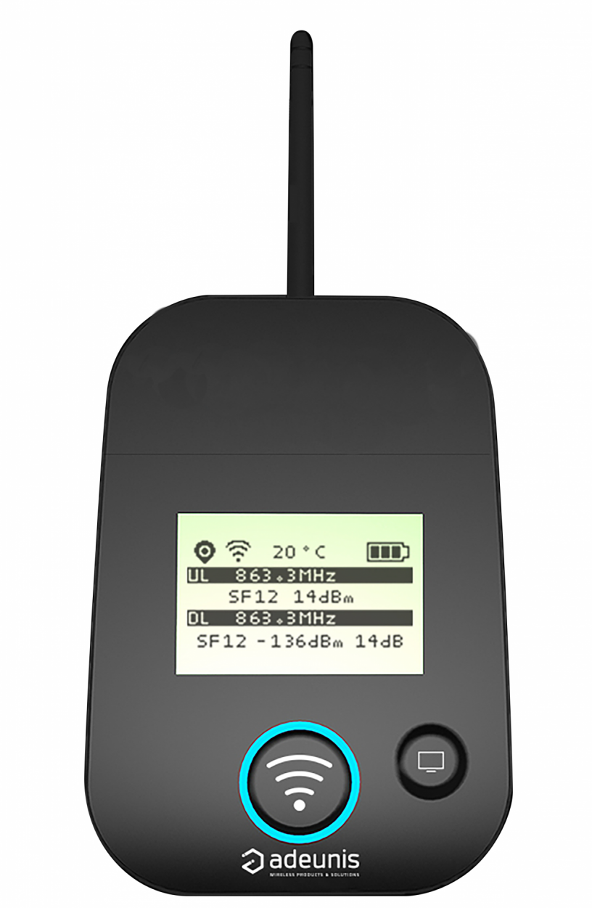

# CampusIoT :: Adeunis FTD :: Tutoriel :fr:

Le Field Test Device d'Adeunis permet aux opérateurs réseaux LoRaWAN de vérifier la qualité d'un réseau LoRaWAN à différents points géographiques.



## Configuration du FTD

Remarque: le FTD doit être allumée (ON).

Configurez le baudrate à 115200 dans votre application série (pour Zterm `Settings > Connection  > Data Rate`. Cochez également `local echo` dans `Settings > Connection`.

Remarque: le `DEVEUI` est fixé par le fabricant Adeunis à la fabrication

Pour les valeurs suivantes:
```
DevEUI 0018B20000020ABC
AppEUI 0000002095D5B370
AppKey ABCAB18A7E1B16D3E9A063EED498BEDD
```

Entrez dans le mode commande.
```
+++
```

Configurez les registres pour l'AppEUI (214,215) et l'AppKey (216,217,218,219):
```
ATT63 PROVIDER
ATS214?
ATS215?

ATS214=00000020
ATS215=95D5B370

ATS216?
ATS217?
ATS218?
ATS219?

ATS216=ABCAB18A
ATS217=7E1B16D3
ATS218=E9A063EE
ATS219=D498BEDD
```

Sauvegardez le registre et relancez le FTD
```
AT&W
AT&RST
ATO
```

## Réglage de la Période d’émission de trame

Entrez dans le mode commande.
```
+++
```

Configurez le registre (60 pour 60 secondes. La valeur par défaut est 600)
```
ATS380?
ATS380=60
```

Sauvegardez le registre et relancez le FTD
```
AT&W
AT&RST
ATO
```

## Enregistrement du FTD

Créez une application FTD dans votre organisation en suivant les [instructions suivantes](../loraserver/README-app.md).

Ajoutez le Codec [adeunisrf_ftd_codec.js](https://github.com/CampusIoT/payload-codec/blob/master/src/main/ttn_loraappserver/adeunisrf/adeunisrf_ftd_codec.js) à l'application FTD.

## Envoi de messages (downlink) vers le FTD

MQTT est le moyen par défaut pour envoyer un message descendant (down) vers un device https://www.loraserver.io/lora-app-server/integrate/data/

Actuellement, les commandes à utiliser sont:

```
ORGID=1 # l'id de votre ORGANISATION (ce n’est pas le username de votre compte utilisateur)
BROKER=lora.campusiot.imag.fr
MQTTUSER=org-$ORGID # le username de votre ORGANISATION (ce n’est pas le username de votre compte utilisateur)
MQTTPASSWORD=__SUPER_SECRET_TO_CHANGE__ # le mot de passe de votre ORGANISATION (ce n’est pas le username de votre compte utilisateur)
TLS="--cafile ca.crt -p 8883"

applicationID=1
devEUI=1234567890abcdef

# Send Downlink Messages (dn)
mosquitto_pub -h $BROKER -u $MQTTUSER -P $MQTTPASSWORD $TLS  -t "application/$applicationID/device/$devEUI/tx" -m '{"reference": "abcd1234","confirmed": true, "fPort": 10,"data":"SGVsbG8gQ2FtcHVzSW9UICE="}'
```

Le champs data contient le message binaire encodé en base64.
Dans l’exemple, le message est “`Hello CampusIoT !`” : il s'affiche sur le panneau `Payload Port` du FTD.

La commande shell `base64` permet de décoder et encoder des textes vers/depuis base64.
```
echo `echo SGVsbG8gQ2FtcHVzSW9UICE= | base64 --decode`
echo "Hello CampusIoT !" | base64
```
