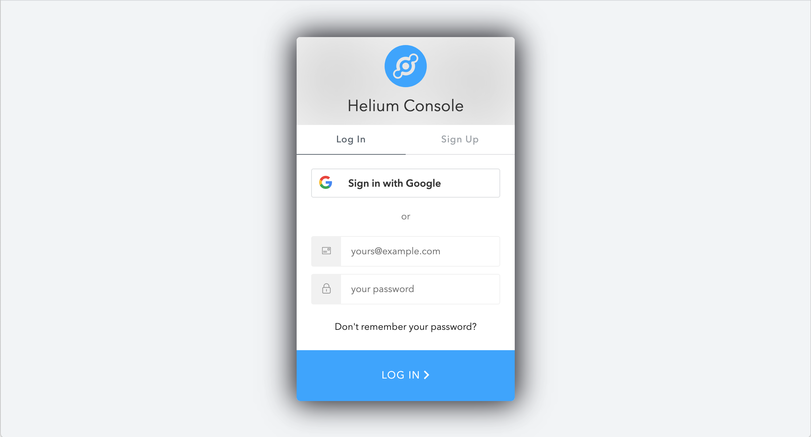
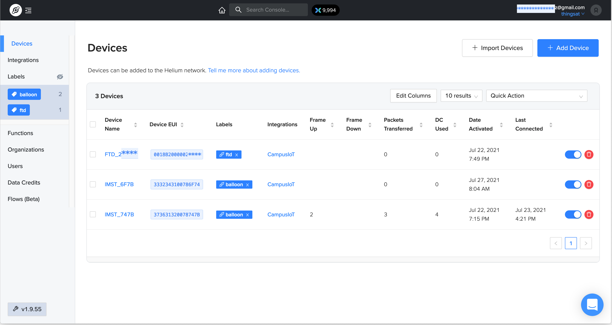
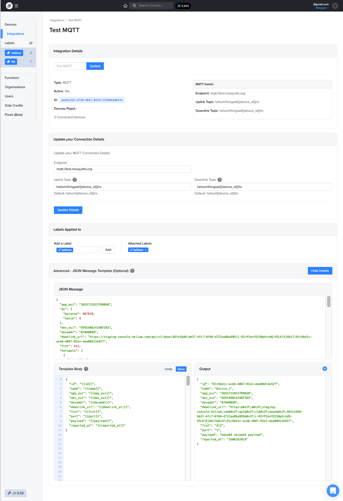
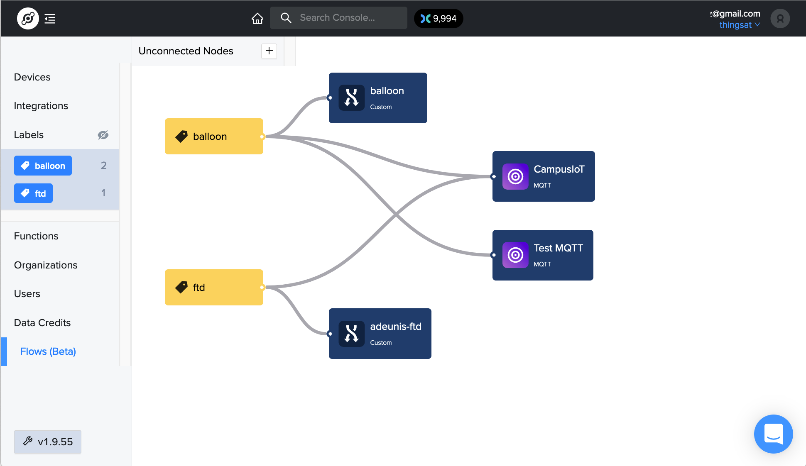

# Helium :: Tutoriel

[Helium](https://en.wikipedia.org/wiki/Helium_Systems) est un opérateur d'un réseau public LoRaWAN _crowdsourcé_. Les propriétaires de _hotspots_ LoRa (ie stations) sont récompensés avec de la [crypto-monnaie HNT](https://coinmarketcap.com/currencies/helium/).

Les hotspots sont listés sur cette [carte](https://explorer.helium.com/hotspots).

## Création d'un compte Helium


## Connection à la console

https://console.helium.com



## Lister les équipements terminaux (device)



## Ajouter un équipement (device)


## Détail d'un équipement (device)


## Lister les labels

Les labels sont utilisés pour l'intégration.


## Détail d'un label


## Lister les fonctions


> Une bibliothèque de fonctions de décodage est disponible [ici](https://github.com/helium/console-decoders). Les fonctions de décodage ont la même définition que les décodeurs TTNv2.

## Détail d'une fonction de décodage de la charge utile d'un message


## Lister les intégrations


## Détail d'une intégration MQTT

Helium peut publier les messages relatives aux équipements vers un broker MQTT externe.


> Si vous ne disposez pas de broker MQTT, vous pouvez utiliser le broker public `test.mosquitto.org`. L'URL est  `mqtt://test.mosquitto.org`. Pensez à modifier les 2 _topics_ `helium/thingsat/{{device_id}}/rx` et `helium/thingsat/{{device_id}}/tx`.



## Récupération d'un message publié

Vous pouvez récupérer les messages publiés au moyen d'un client MQTT. Par exemple, le client [MQTT CLI HiveMQ](https://hivemq.github.io/mqtt-cli/docs/subscribe.html):

```console
mqtt subscribe -v -h test.mosquitto.org -p 1883 -t 'helium/#'
```


```json
{
  "app_eui": "37363132FFFFFFFF",
  "decoded": {
    "payload": {
      "dataRate": 1,
      "gain": 16,
      "size": 16,
      "temperature": 43,
      "txpower": 14
    },
    "status": "success"
  },
  "dev_eui": "373631320078747B",
  "devaddr": "9D000048",
  "fcnt": 2,
  "hotspots": [
    {
      "channel": 6,
      "frequency": 867.7000122070312,
      "hold_time": 475,
      "id": "112sVdDJ4ajY8ziyvu1QxUw44skHeuSzzk5x6gAFeCEfufZ7Weao",
      "lat": 45.15376191524278,
      "long": 5.728159689661103,
      "name": "narrow-candy-gazelle",
      "reported_at": 1627050089668,
      "rssi": -116,
      "snr": -21.5,
      "spreading": "SF11BW125",
      "status": "success"
    }
  ],
  "id": "ec66d94c-36ac-4425-ba1a-406910bec89e",
  "metadata": {
    "adr_allowed": false,
    "cf_list_enabled": false,
    "labels": [
      {
        "id": "699edce5-55ea-4ab9-ae34-9946ade65e64",
        "name": "balloon",
        "organization_id": "cf997e03-a2b9-4f59-9339-059bb3a85fe7"
      }
    ],
    "multi_buy": 1,
    "organization_id": "cf997e03-a2b9-4f59-9339-059bb3a85fe7"
  },
  "name": "IMST_747B",
  "payload": "DgEQzAAAAAAAAAAAAAAAAA==",
  "payload_size": 16,
  "port": 2,
  "reported_at": 1627050089668,
  "uuid": "76b51b8a-09a8-45f4-b889-4368c30882a4"
}
```

> La charge utile est décodée dans la propriété `decoded` du message JSON.

> Ce message LoRa n'a été reçu que par un [seul hotspot Helium](https://explorer.helium.com/hotspots/112sVdDJ4ajY8ziyvu1QxUw44skHeuSzzk5x6gAFeCEfufZ7Weao) (ie station Helium)

## Lister les flots


Le nouveau flot après l'ajout de l'intégration MQTT vers `test.mosquitto.org.


## Lister les organisations


## Lister les utilisateurs


## Lister les crédits HNT

Le crédit initial en [HNT](https://coinmarketcap.com/currencies/helium/) est décrémenté à chaque réception de messages d'un des équipements.


## Ajouter un Hotspot (aka Miner)

https://www.helium.com/mine#hotspots


## Installer un hotspot sur une station LoRa

> _The current gateway project forwards packets to the router but does not yet use state channels which means forwarded packets are not yet rewarded by the blockchain_.

https://github.com/helium/gateway-rs

Télécharger la dernière release https://github.com/helium/gateway-rs/releases pour votre station

Suivre https://github.com/helium/gateway-rs#installing

Les fichiers de configuration sont dans `/etc/helium_gateway`

Modifier `/etc/helium_gateway/default.toml`
```toml
region = "EU868"
```

Lancer `helium_gateway`
```bash
helium_gateway --help
helium_gateway server
```

Configurer le global_conf.json de votre packet forwarder Semtech `lora_pkt_fwd`

Relancez votre packet forwarder Semtech
```bash
./lora_pkt_fwd 
```
