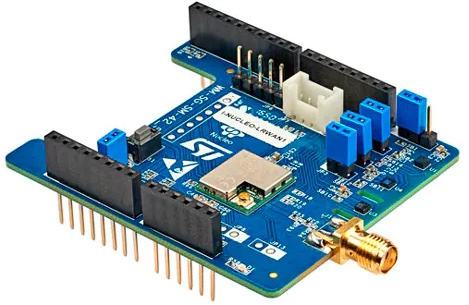

# ST I-NUCLEO-LRWAN1 LoRa board




https://www.st.com/en/evaluation-tools/i-nucleo-lrwan1.html

[Schematic](USI_LoRa_Arduino_shield_SCH_20161115-1.pdf)

### On-board sensors

* ST accelerometer and magnetometer sensor (LSM303AGR)
* ST relative humidity and temperature sensor (HTS221)
* ST pressure sensor (LPS22HB)

### Connectors

| Connector | Function |
| - | - |
| JP6 | SWD |
| JP7 |  Grove  I2C |
| JP8 | SPI |
| JP9 | DIOx x=0..5 |
|JP13 | RF switch debug header|
| JP14 | Power measurement |
| JP15 | Power measurement |


### Flashage avec un STLinkv2 d'une carte Nucleo

Si vous ne possédez pas de flasheur ST-Link v2, vous pouvez utiliser le flasheur détachable des cartes Nucleo et connecter les 5 premières broches du [connecteur CN4 SWD](https://www.st.com/content/ccc/resource/technical/document/user_manual/98/2e/fa/4b/e0/82/43/b7/DM00105823.pdf/files/DM00105823.pdf/jcr:content/translations/en.DM00105823.pdf) au connecteur J6 SWD de la carte:

	Pin 1: VDD_TARGET (VDD from application), rouge
	Pin 2: SWCLK (clock),  jaune
	Pin 3: GND (ground), noir
	Pin 4: SWDIO (SWD data input/output), bleu
	Pin 5: NRST (RESET of target STM32). vert

## Démarrage avec RIOT OS

https://doc.riot-os.org/group__boards__i-nucleo-lrwan1.html

[STM32-Cube for USI-NUCLEO-LoRaWan](https://gitlab.inria.fr/aduque/STM32-Cube-USI-NUCLEO-LoRaWan]

Connect JP6 to SWD

Connect 3V3, GND, RX and TX to FTDI.

### Test driver SX127x
```bash
cd ~/github/RIOT-OS/RIOT/tests/drivers/sx127x
gmake BOARD=i-nucleo-lrwan1 DRIVER=sx1272 flash
```

```
> main(): This is RIOT! (Version: 2025.10-devel-512-g167b5)
Unexpected netdev event received: 8
Initialization successful - starting the shell now
> help
Command              Description
---------------------------------------
setup                Initialize LoRa modulation settings
implicit             Enable implicit header
crc                  Enable CRC
payload              Set payload length (implicit header)
random               Get random number from sx127x
syncword             Get/Set the syncword
rx_timeout           Set the RX timeout
channel              Get/Set channel frequency (in Hz)
register             Get/Set value(s) of registers of sx127x
send                 Send raw payload string
listen               Start raw payload listener
reset                Reset the sx127x device
pm                   interact with layered PM subsystem
ps                   Prints information about running threads.
version              Prints current RIOT_VERSION
reboot               Reboot the node
> random
random: number from sx127x: 2241016186
> random
random: number from sx127x: 2100780727
> syncword get
Syncword: 0x12
> syncword set 34
Syncword set to 34
> syncword get
Syncword: 0x34
> channel get
Channel: 868299987
> implicit set 0
Successfully disabled implicit header
> crc set 1
Successfully enabled CRC check
> setup
usage: setup <bandwidth (125, 250, 500)> <spreading factor (7..12)> <code rate (5..8)>
> setup 125 7 5
setup: setting 125KHz bandwidth
[Info] setup: configuration set with success
> send HELLO_WORLD
sending "HELLO_WORLD" payload (12 bytes)
> Transmission completed
> listen
Listen mode set

```

### Test Semtech LoRaMac
```bash
cd ~/github/RIOT-OS/RIOT/tests/pkg/semtech-loramac
gmake BOARD=i-nucleo-lrwan1 LORA_DRIVER=sx1272 LORA_REGION=EU868 flash
```

```
> help
Command              Description
---------------------------------------
pm                   interact with layered PM subsystem
loramac              Control Semtech loramac stack
version              Prints current RIOT_VERSION
reboot               Reboot the node
> loramac
Usage: loramac <get|set|join|tx|save|erase>
> loramac set deveui cabebabe01234567
> loramac set appeui 0000000000000000
> loramac set appkey cabebabe01234567cabebabe01234567
> loramac set class
Usage: loramac set class <A,B,C>
> loramac set class A 
> loramac set adr on
> loramac join otaa
Join procedure failed!
> loramac join otaa
Join procedure succeeded!
> loramac get dr
DATARATE: 0
> loramac tx
Usage: loramac tx <payload> [<cnf|uncnf>] [port]
> loramac tx HELLO cnf 10
Message sent with success
> loramac get dr
DATARATE: 5
> loramac set
Usage: loramac set <deveui|appeui|appkey|appskey|nwkskey|devaddr|class|dr|adr|public|netid|tx_power|rx2_freq|rx2_dr|ul_cnt|ch_mask> <value>
> loramac get devaddr
DEVADDR: FC00AF67
> loramac get tx_power
TX power index: 2
> loramac get rx2_freq
RX2 freq: 869525000
> loramac get rx2_dr
RX2 dr: 0
loramac set rx2_dr 3
> loramac get ul_cnt
Uplink Counter: 1
> loramac tx HI cnf 10
Message sent with success
> loramac get ul_cnt
Uplink Counter: 2
> loramac get tx_power
TX power index: 5
```

