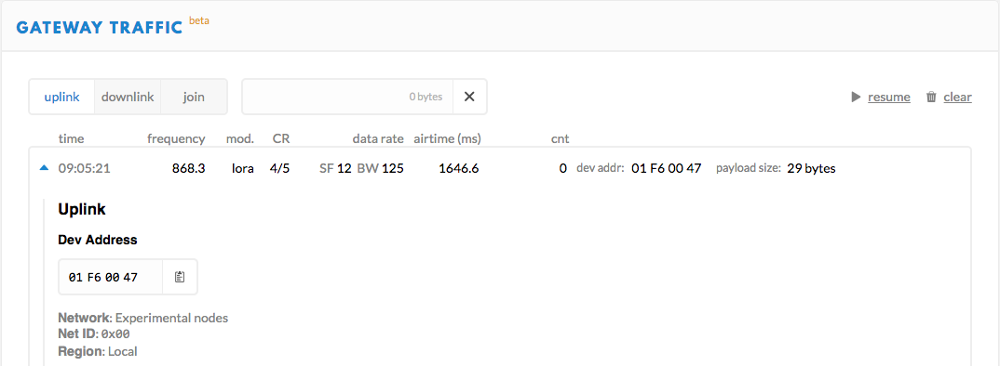
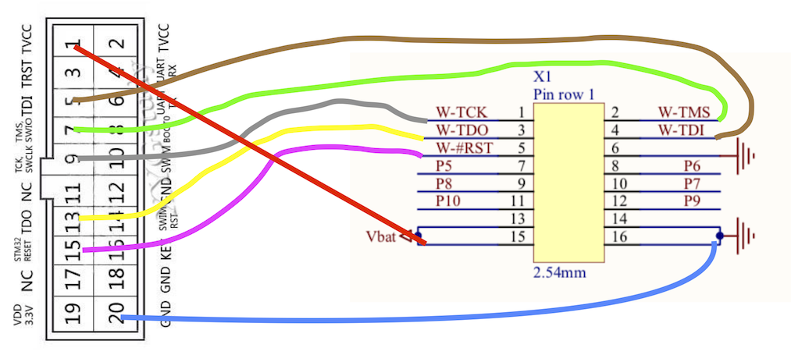

# iM880a : LoraMAC + RIOT-OS + TTN/LoraServer

Exceptés quelques outils spécifiques à OSX, ce tutoriel est valable pour les autres systèmes d'exploitation. 

## Environnement de développement sous OSX pour IM880a

Il faut tout d'abord installer les outils de compilation (cmake, arm-none-eabi-gcc) 
et de flashage (openocd ou stlink). 

Plus de détails à <https://github.com/Lora-net/LoRaMac-node/wiki/Development-environment#prerequisites> et <https://github.com/texane/stlink>

    brew install cmake # génère les Makefile
    brew tap ARMmbed/homebrew-formulae && brew install arm-none-eabi-gcc #cross-compile
    brew install openocd
    brew install stlink

Le flashage peut se faire : 

- soit via `openocd` (<https://github.com/Lora-net/LoRaMac-node/wiki/Development-environment#debugging>) 
- soit les utilitaires liés à `stlink` (<https://github.com/texane/stlink/blob/master/doc/tutorial.md#building-and-flashing-a-program>). 

## LoRaMote + LoRaMac-node

  
**Fig. 1: LoRaMote + st-linkv2**

Pour commencer la LoRaMote est plus simple car

- elle a longtemps été la plateforme par défaut du [dépot LoRaMac](https://github.com/Lora-net/LoRaMac-node) utilisée pour la certification des noeuds par semtech
- on peut directement connecter le jtag pour la flasher
- les paquets sont directement visibles dans TTN pour tester
- par contre, comment accéder au lien série ? 

### Compilation 

Il faut ensuite rapatrier le code source pour la LoRaMote, basculer sur la [branche master](https://github.com/Lora-net/LoRaMac-node/wiki/LoRaMAC-node-Wiki) où se trouve la plateforme LoRaMote et compiler

    git clone https://github.com/Lora-net/LoRaMac-node #Attention branche develop par défaut
    cd LoRaMac-node
    git checkout master #basculer sur la branche master
    mkdir build && cd build
    cmake -DCMAKE_TOOLCHAIN_FILE="cmake/toolchain-arm-none-eabi.cmake" ..
    make

Par défaut, le Makefile généré par `cmake` est pour la plateforme *LoRaMote*, l'application *LoRaMAC*, en classe A, la région *EU868*, ...

Pour modifier ces options, plus de détails au <https://github.com/Lora-net/LoRaMac-node/wiki/Development-environment#available-configuration-options-for-cmake>

### Flashage

Les étapes sont : 

- alimenter la carte par USB (cf. figure 1)
- positionner l'interrupteur sur la position ON (vers le bas)
- pour un st-link v2
	- Connectez le JTAG
	- `st-flash --format ihex write LoRaMote-LoRaMac-classA.hex` ([LoRaMote-LoRaMac-classA.hex](./firmware/LoRaMote-LoRaMac-classA.hex)) 

Si tout fonctionne bien, vous devriez voir les 3 leds clignoter une fois le noeud flashé et à chaque envoi de paquet. 
Vous pouvez également voir les paquets dans TTN (<https://console.thethingsnetwork.org/>) si une GW à proximité les reçoit (cf figure 2).  
  
  
**Fig. 2: Visualisation des paquets de la LoRaMote dans l'interface de TTN**


### Les problèmes éventuels

Si le flashage ne marche pas, mieux vaut utiliser openocd pour débugger car il est plus bavard que les utilitaires st-link. Les différents problèmes possibles sont : 

- votre OS ne voit par le stlink v2 : `st-info --probe` indiquera *Found 0 stlink programmers*. Vérifiez votre JTAG
- une carte mal alimentée : `openocd -f interface/stlink-v2.cfg -f target/stm32l1.cfg` vous indiquera *Error: target voltage may be too low for reliable debugging*. 
- `openocd` indique `Error: init mode failed (unable to connect to the target)`. `st-info --probe` devrait remettre la carte dans un état accessible par `openocd`

## LoRaMac-node + cartes à base d'iM880

Si on part sur des cartes plus brutes (sans GPS, sans LED, ...) intégrant le module radio iM880a, on peut avoir des 
carte plus compacte avec ses ports GPIO permettant un accès simplifié aux entrées/sorties du module iM880a. 
Les instructions ci-dessous se veulent le plus générique possible. 

Imaginons une carte nécessitant pour la flasher de : 

- l'alimenter par USB.
	- Nous utiliserons l'adaptateur [USB-Serial CH340G](https://robotdyn.com/usb-serial-adapter-ch340g-5v-3-3v.html) de RobotDyn avec son [driver](https://kig.re/2014/12/31/how-to-use-arduino-nano-mini-pro-with-CH340G-on-mac-osx-yosemite.html) car il n'est pas reconnu par défaut sous OSX
	- Le lien série sera accessible via `/dev/tty.wchusbserial1410`
- connecter les bonnes PIN du st-linkv2 à la carte 

Cette dernière étape nécessitera bien évidemment d'avoir accès au schéma du circuit électronique. 
Imaginons que la carte dispose des 2 ports GPIO X1 et X2 suivants.

Vous trouverez ci-dessous un exemple le schéma pour relier l'adaptateur usb (cf fig. 3) et le st-link v2 à la carte (cf fig. 4).  
  
**Fig. 3: connexion X2 - adaptateur usb serial**

  
**Fig. 4: schéma connexion X1 - JTAG**

Il ne reste plus qu'à flasher : 

- `st-flash --format ihex write LoRaMote-LoRaMac-classA.hex` ([LoRaMote-LoRaMac-classA.hex](./firmware/LoRaMote-LoRaMac-classA.hex))

Si tout fonctionne bien, vous devriez voir les paquets arrivés sur TTN comme pour la LoraMote (cf. Section [flashage](./README.md#flashage) du LoRaMote)

Si cela ne fonctionne pas, reportez vous à la section [problèmes](./README.md#les-problèmes-éventuels) du LoRaMote.

## RIOS OS + cartes à base d'iM880

*(Merci de vous référer aux paramètres de configuration de la section précédente pour l'adaptateur USB notamment.)*

On s'intéresse à RIOT-OS car il offre: 

- plus de souplesse en terme de programmation (un OS, pile IP, support d'autres technologies wireless, timer, serial, ...)
- le support de nombreuses plateformes
- beaucoup d'applicatifs
- ...

### 2 applications : 1 LoRa et 1 LoRaWAN

Les 2 applications existantes pour LoRa dans RIOT sont : 

- [```${RIOT_BASE}/tests/driver_sx127x```](https://github.com/fjmolinas/RIOT/blob/im880b_loramac/tests/driver_sx127x) qui permet de tester le driver radio lora 127x
- [```${RIOT_BASE}/tests/pkg_semtech-loramac```](https://github.com/fjmolinas/RIOT/blob/im880b_loramac/tests/pkg_semtech-loramac/README.md) qui permet de tester le réseau LoRaWAN

Le module réseau iM880a n'étant pas supporté par défaut dans le dépôt officiel, on se base sur un dépôt annexe et sur la [plateforme iM880b](https://wireless-solutions.de/products/starterkits/sk-im880b.html) qui est quasi similaire.  
Pour compiler et flasher, on suit les étapes suivantes :  

    git clone https://github.com/fjmolinas/RIOT
    cd RIOT
    RIOT_BASE=$(pwd)
    git checkout im880b_loramac
    make BOARD=im880b DRIVER=sx1272 -C tests/driver_sx127x # pour l'exemple LoRa de base
    arm-none-eabi-objcopy -O binary ${RIOT_BASE}/tests/driver_sx127x/bin/im880b/tests_driver_sx127x.elf tests_driver_sx127x.bin # conversion format .elf au format .bin
    st-flash write tests_driver_sx127x.bin 0x8000000 
    
    make BOARD=im880b LORA_DRIVER=sx1272 -C tests/pkg_semtech-loramac # pour l'exemple LoRaWAN
    st-flash write pkg_semtech-loramac.bin 0x8000000 

Pour un accès direct aux firmwares : ([```tests_driver_sx127x.bin```](firmware/tests_driver_sx127x.bin)), ([```pkg_semtech-loramac.bin```](firmware/tests_pkg_semtech-loramac.bin))

Pour vérifier le bon fonctionnement, connectons nous sur le lien série afin d'accéder au shell RIOT.  
Sous OSX, plusieurs [solutions](https://pbxbook.com/other/mac-tty.html) sont possibles. On a retenu la suivante :   

- on installe minicom : `brew install minicom`
- on configure minicom
	 - `minicom -s` (Pour accéder à l'aide, il faut utiliser Esc-Z à la place de Meta-Z)
	 - menu "Serial port setup" et on modifie les paramètres par défaut comme suit  
	 `A - Serial Device			 : /dev/tty.wchusbserial1410
	 E - Bps/Par/Bits			: 115200 8N1
	 F - Hardware Flow Control 	: No
	 G - Software Flow Control 	: No `
	 - on sauvegarde via le menu "Save setup as dfl" 
	 - on quitte minicom
- on règle les problèmes de retour à la ligne en ajoutant à $HOME/.minirc.dfl la ligne suivante  
`pu addcarreturn    Yes`

`minicom` nous donne accès au lien série et au shell de RIOT.  

Pour expérimenter, il ne reste plus qu'à suivre les instructions de l'exemple LoRa ([```readme driver_sx127x```](https://github.com/fjmolinas/RIOT/blob/im880b_loramac/tests/driver_sx127x)) ou LoRaWAN ([```readme pkg_semtech-loramac```](https://github.com/fjmolinas/RIOT/blob/im880b_loramac/tests/driver_sx127x)).  
Nous testons la procédure OTAA sur TTN dans la section suivante. 

### RIOT + LoRaWAN (OTAA on TTN)

Les notes ci-dessous viennent compléter les instructions du [```readme pkg_semtech-loramac```](https://github.com/fjmolinas/RIOT/blob/im880b_loramac/tests/driver_sx127x)

Pour permettre à un noeud de se connecter à TTN selon la procédure OTAA, il faut suivre les étapes suivantes : 

1. Enregistrer le noeud sur TTN :  <https://www.thethingsnetwork.org/docs/devices/registration.html> 
2. Programmer Device EUI, App Key et App EUI sur le noeud : <https://github.com/RIOT-OS/RIOT/tree/master/tests/pkg_semtech-loramac#using-the-shell>
3. Observer les messages de join dans l'interface de TTN accessible via le menu `Applications > Application\_Name > Devices > Device\_Name > Data`
4. Générer des messages coté noeud
	- `riot$ loramac set dr 0` (cf. [tableau datarate Europe](https://lora-alliance.org/sites/default/files/2018-04/lorawantm_regional_parameters_v1.1rb_-_final.pdf#page=16)) pour toucher les GW les plus éloignées
	- `riot$ loramac tx hello`
5. Voir les messages coté interface TTN
	- TIP: In the Payload formats > Payload format of your application console, select the Custom payload format and in the Decoder text edit, add the following decoding javascript function: 
	```javascript
	function Decoder(bytes, port)
	{
	var message = "";
	
	for  (var i=0; i < bytes.length; i++) {
	    message += String.fromCharCode(bytes[i]);
	}
	var decoded = {};
	decoded.message = message;
	return decoded;
	}```

Pour aller plus loin, un tutoriel parfait : <https://github.com/aabadie/riot-course#content-of-the-course> avec des [slides plus spécifique sur LoRa](https://aabadie.github.io/riot-course/slides/05-lorawan-with-riot/#18). 

Mettons en oeuvre un firmware se connectant en OTAA avec des EUI en dur et envoyant ensuite un message toutes les 20s : <https://github.com/aabadie/riot-course-exercises/tree/master/riot-lorawan/simple>  

1. compiler et flasher le firmware  
    `git clone https://github.com/fjmolinas/RIOT                                   `  
    `cd RIOT                                                                       `  
    `git checkout im880b_loramac                                                   `  
    `cd ..                                                                         `  
    `git clone https://github.com/aabadie/riot-course-exercises.git                `  
    `cd riot-course-exercises/riot-lorawan/simple/.solution                        `  
    `git apply add-deveui-appeui-appkey.patch #to fix the DEVEUI, APPEUI and APPKEY` ([add-deveui-appeui-appkey.patch](./firmware/add-deveui-appeui-appkey.patch))  
    `make BOARD=im880b DRIVER=sx1272                                               `  
    `st-flash --format ihex write bin/im880b/lorawan.hex                           `  ([lorawan.hex](./firmware/lorawan.hex))  
2. alimentons la carte à l'aide des piles (ne pas oublier le jumper pour activer l'alimentation par les piles)
3. observons les paquets émis dans la console applicative de TTN <https://console.thethingsnetwork.org/applications/application_name/devices/device_name/data>
4. le bouton reset permet de rebooter le noeud

<!-- <http://doc.riot-os.org/group__pkg__semtech-loramac.html> -->

D'autres scénarios sont envisageables : 

- lui ajouter des périphériques (GPS, ...)
- se balader avec le noeud, tester son autonomie, le mettre dans un ballon stratosphérique, la localisation,  ... <https://air.imag.fr/index.php?search=lora&title=Special%3ASearch&go=Go>
- Low power : <https://github.com/aabadie/riot-course-exercises/tree/master/riot-lorawan/pm>

## TODO

- [ ] instructions LoraServer
- [ ] suivi de l'intégration d'iM880b dans le dépot officel de RIOT <https://github.com/RIOT-OS/RIOT/pull/11315>
- [ ] ajout du support du st-linkv2-1 : https://gitlab.ensimag.fr/lorawan-bm/riot-im880b + googledocs
