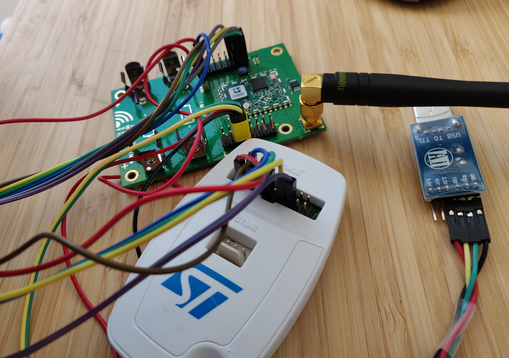
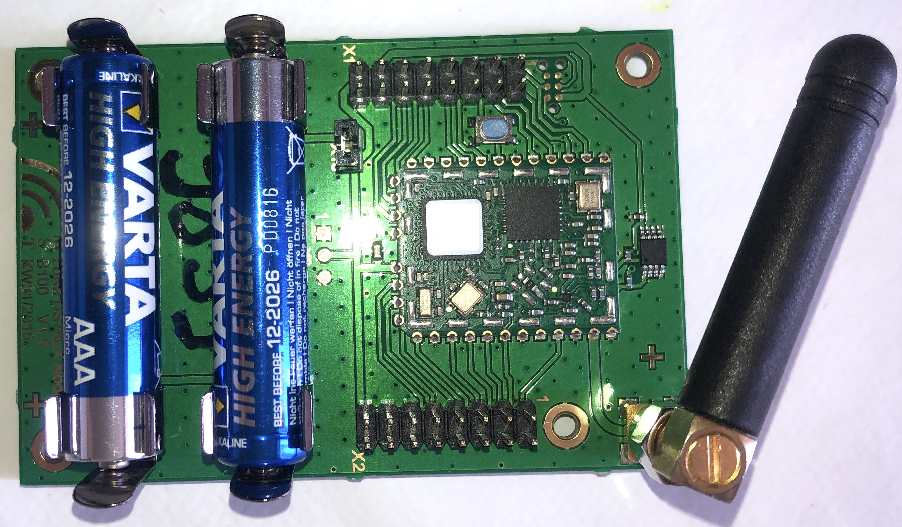
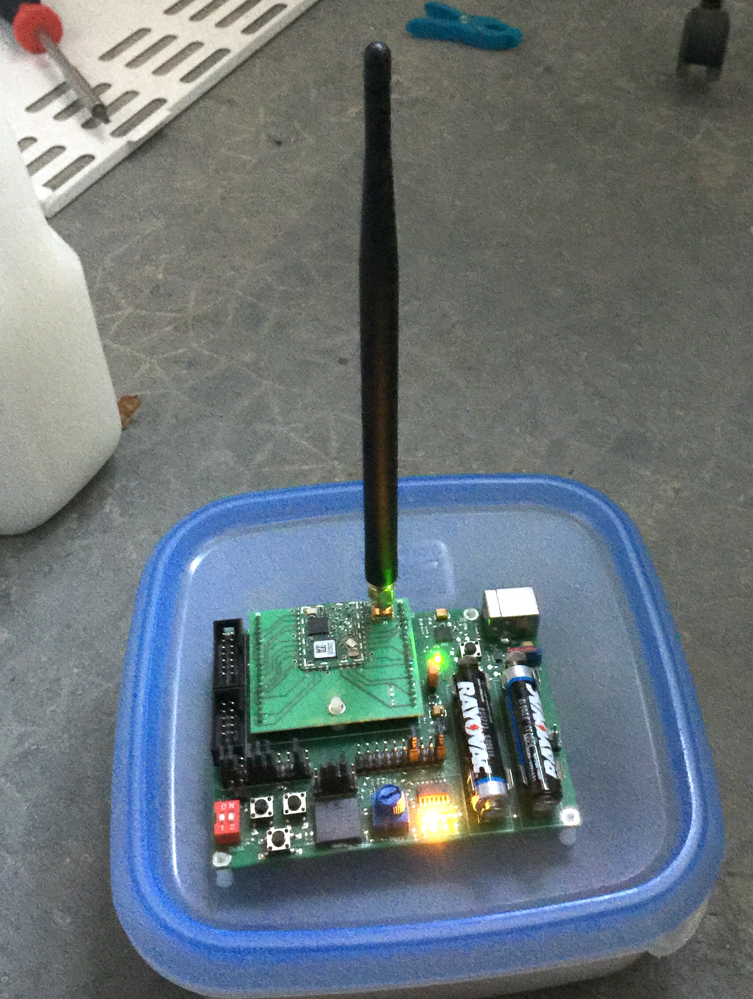

# Applications LoRaWAN avec les modules IMST iM880

Exceptés quelques outils spécifiques à OSX, ce tutoriel est valable pour les autres systèmes d'exploitation. 

## Module IMST iM880a

Le module [IMST iM880a](https://wireless-solutions.de/products/discontinued-products/im880a.html) est un module comporte un transceiver LoRa (Semtech SX1272) et et un MCU hôte STM32L1

Il est remplacé par le module [IMST iM880b](https://wireless-solutions.de/products/radiomodules/im880b-l).

Ces caractéristiques sont:

    Frequency range: 	    SRD Band 863 to 870 MHz
    Modulation: 	        LoRa® Spread-Spectrum
    RF output power: 	    up to +19 dBm (50Ω pad)
    Receiver sensitivity: 	-137 dBm (SF 12;  SB 125 kHz, CR 4/6)
                            -134 dBm (SF 12;  SB 250 kHz, CR 4/6)
                            -128 dBm (SF 12;  SB 500 kHz, CR 4/6)
    RF datarate: 	        0.24 to 37.5  kbps
    RF range: 	            up to 15000 m (line of sight)
    Operating voltage: 	    2.4 V to 3.6 V
    Current consumption: 	< 2.5 μA (Trx sleep, RTC running)
                            11 mA (Rx)
                            118 mA (Tx @ 3.0 V/ +19 dBm)
    Interfaces: 	        UART
                            SPI
                            I²C
                            RF (LoRa®)
    IO's: 	                Digital IOs
                            Analog Inputs
    Dimension (LxWxH): 	    20 x 25 x 2 mm
    Operating temperature: 	-20°C to +70°C
    Certification: 	        Prequalified according to ETSI EN 300 220

## Cartes à base d'iM880a

Nous disposons au fablab de plusieurs cartes de démonstration et de prototypage à base d'iM880a

* [LoRaMote]() : traqueur GPS LoRa
* [SK-iM880a](https://wireless-solutions.de/products/starterkits/sk-im880b.html) : kit d'évaluation et de prototypage du module iM880a
* IMST-iM880a-DS75LX : carte simple muni d'un capteur de temperature DS75LX

  
**Fig. 1: LoRaMote + st-linkv2**

  
**Fig. 2: IMST-iM880a-DS75LX**

**Fig. 3: IMST-iM880a-DS75LX**

  
**Fig. 4: SK-iM880a**

## Les codes sources disponibles

L'implémentation officielle (Semtech) des drivers des composants SX126x/SX127x et de l'interface réseau LoRaWAN coté endpoint est dans le dépôt [LoRaMac-node](https://github.com/Lora-net/LoRaMac-node).

Les deux tutoriels suivants vous permetteront de programmer les cartes disponibles : 
* [LoRaNet LoRaMac-node](loramac-node.md)
* [RIOT OS](riot.md)
