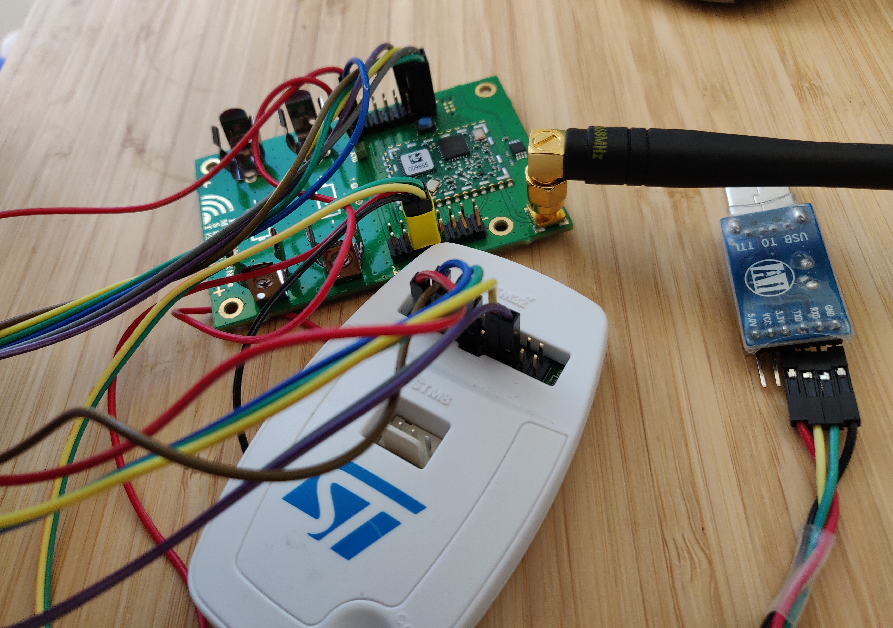

# La carte d'essai IMST iM880a DS75LX

La carte d'essai IMST iM880a DS75LX est une carte de prototypage du module iM880a.

Il comporte :
* un support double batterie AAA
* un capteur de temperature SPI [Maxim DS75LX](./docs/DS75LX.pdf)
* deux connecteurs X1 et X2 (2x  16 broches) qui donnent accès à l'ensemble des broches du module iM880a (UART, JTAG, SPI, I2C, GPIO)

La schématique de la carte est [ici](docs/LoRa-DS75LX_Node_Schematic.pdf).
## Support logiciel
* Le module IMST iM880a est supporté par [RIOTOS](https://github.com/RIOT-OS/RIOT/tree/master/boards/im880b).
* Le capteur DS75LX est supporté par [RIOTOS](https://github.com/RIOT-OS/RIOT/tree/master/drivers/ds75lx). 

## Brochage
Vous pouvez inclure ce fichier `pinmap.h` pour utiliser les GPIO des headers X1 et X2 de la carte:

```c

#ifndef IM880_PINMAP

#define IM880_PINMAP 	1

#define PIN_X1_1  GPIO(0,14)  // P1 @ module SWCLK JTCK
#define PIN_X1_2  GPIO(0,13)  // P2 @ module SWDAT JTMS
#define PIN_X1_3  GPIO(1,3)   // P3 @ module JTDO
#define PIN_X1_4  GPIO(0,15)  // P4 @ module JTDI

#define PIN_X1_7 GPIO(0,11)  // P5 @ module
#define PIN_X1_8 GPIO(0,12)  // P6 @ module

#define PIN_X1_10 GPIO(1,14)  // P7 @ module
#define PIN_X1_9  GPIO(1,15)  // P8 @ module
#define PIN_X1_12 GPIO(1,13)  // P9 @ module
#define PIN_X1_11 GPIO(1,12)  // P10 @ module

#define PIN_X2_7  GPIO(0,8)  // P11 @ module
#define PIN_X2_6  GPIO(1,8)  // P12 @ module
#define PIN_X2_5  GPIO(1,9)  // P13 @ module
#define PIN_X2_14 GPIO(0,1)  // P14 @ module
#define PIN_X2_3  GPIO(0,0)  // P15 @ module
#define PIN_X2_17 GPIO(0,3)  // P17 @ module

#endif

```

## Flashage
Le module peut être flashé 
* soit via l'interface JTAG (connecteur X1) voir figure 3,
* soit via l'UART en branche la broche P16-BOOT (broche 2 du connecteur X2) sur une des broches `VCC` (broches 11,13,15 du connecteur X2) voir figure 4.

### Flashage avec un STLinkv2

Il faut connecter les bonnes broches du ST-Linkv2 à la carte vers le connecteur X1 (voir figure 3).

Il faut alimenter la carte soit avec 2 batteries AAA 1.5V soit via un adapteur USB série via les broches 11, 13 ou 15 pour le `VCC` et 12, 14 ou 16 pour le `GND`

Nous utiliserons l'adaptateur [USB-Serial CH340G](https://robotdyn.com/usb-serial-adapter-ch340g-5v-3-3v.html) de RobotDyn avec son [driver](https://kig.re/2014/12/31/how-to-use-arduino-nano-mini-pro-with-CH340G-on-mac-osx-yosemite.html) car il n'est pas reconnu par défaut sous OSX. Le lien série sera accessible via `/dev/tty.wchusbserial1410`


Il ne reste plus qu'à flasher : 

- `st-flash --format ihex write LoRaMote-LoRaMac-classA.hex` ([LoRaMote-LoRaMac-classA.hex](./firmware/LoRaMote-LoRaMac-classA.hex))

Si tout fonctionne bien, vous devriez voir les paquets arrivés sur TTN comme pour la LoraMote (cf. Section [flashage](./README.md#flashage) du LoRaMote)

Si cela ne fonctionne pas, reportez vous à la section [problèmes](./README.md#les-problèmes-éventuels) du LoRaMote.


### Flashage avec un STLinkv2 d'une carte Nucleo

Si vous ne possédez pas de flasheur ST-Link v2, vous pouvez utiliser le flasheur détachable des cartes Nucleo et connecter les 5 premières broches du [connecteur CN4 SWD](https://www.st.com/content/ccc/resource/technical/document/user_manual/98/2e/fa/4b/e0/82/43/b7/DM00105823.pdf/files/DM00105823.pdf/jcr:content/translations/en.DM00105823.pdf) au connecteur X1 de la carte IMST im880:

	Pin 1: VDD_TARGET (VDD from application),
	Pin 2: SWCLK (clock),
	Pin 3: GND (ground),
	Pin 4: SWDIO (SWD data input/output),
	Pin 5: NRST (RESET of target STM32).


### Flashage via l'UART avec la broche BOOT

Les MCU STM32 peuvent être flashé avec un simple adapteur USB Serial. Il suffit pour cela d'utiliser l'utilitaire [STM32CubeProgrammer](https://www.st.com/en/development-tools/stm32cubeprog.html) (en GUI ou en ligne de commande) et de mettre la MCU en mode boot en raccordant la broche BOOT avec le VCC.

Instructions : 
* Branchez l'UART sur les broches 9 (`TXD`),10 (`RXD`),11 (`VCC`),12 (`GND`) du connecteur X2 en croisant `TXD` et `RXD` de l'hôte.
* Au moyen d'un fil, reliez la broche P16-BOOT (broche 2 du connecteur X2) sur une des broches `VCC` (broches 11,13,15 du connecteur X2) voir figure 4.
* Appuyez sur le bouton `RESET`
* La carte est en attente des commandes du STM32CubeProgrammer

```bash
alias stm32proj_cli=/Applications/STMicroelectronics/STM32Cube/STM32CubeProgrammer/STM32CubeProgrammer.app/Contents/MacOs/bin/STM32_Programmer_CLI
```

Les exemples suivants sont avec la carte `iM880a`.

#### Options du STM32_Programmer_CLI
```bash
stm32proj_cli
```

#### Liste des UART

```bash
stm32proj_cli --list
```

```console
      -------------------------------------------------------------------
                        STM32CubeProgrammer v2.5.0                  
      -------------------------------------------------------------------

=====  DFU Interface   =====

No STM32 device in DFU mode connected

===== STLink Interface =====
Error: No ST-Link detected!

=====  UART Interface  =====

Total number of serial ports available: 10

...

Port: tty.SLAB_USBtoUART
Location: /dev/tty.SLAB_USBtoUART
Description: CP210x USB to UART Bridge Controller
Manufacturer: Silicon Labs

Port: tty.usbserial-0001
Location: /dev/tty.usbserial-0001
Description: CP2102 USB to UART Bridge Controller
Manufacturer: Silicon Labs
```


#### Récupération de la carte
```bash
stm32proj_cli --connect port=/dev/tty.usbserial-1410 -vb 3
```

```console
      -------------------------------------------------------------------
                        STM32CubeProgrammer v2.5.0                  
      -------------------------------------------------------------------

Serial Port /dev/tty.usbserial-1410 is successfully opened.
Port configuration: parity = even, baudrate = 115200, data-bit = 8,
                     stop-bit = 1,0, flow-control = off
No Init bits value is : 0 

Sending init command: 
byte 0x7F sent successfully to target
Wait ends after 1 loop, dataready = 1, delay = 2
Received response from target: 0x79
Activating device: OK
Sending GetID command and its XOR:
byte 0x02 sent successfully to target
byte 0xFD sent successfully to target
Wait ends after 1 loop, dataready = 1, delay = 3
Received response from target: 0x79
Received response from target: 0x01041679
Chip ID: 0x416 
Sending Get command and its XOR:
byte 0x00 sent successfully to target
byte 0xFF sent successfully to target
Wait ends after 1 loop, dataready = 1, delay = 4
Received response from target: 0x79
Received response from target: 0x0b
size of bytes in the response: 11
Received response from target: 0x30000102112131446373829279
Full received response: 0b30000102112131446373829279
BootLoader protocol version: 3.0
byte 0x11 sent successfully to target
byte 0xEE sent successfully to target
data sent successfully to target: 0x0800000008
byte 0x00 sent successfully to target
byte 0xFF sent successfully to target
Sending GetID command and its XOR:
byte 0x02 sent successfully to target
byte 0xFD sent successfully to target
Wait ends after 1 loop, dataready = 1, delay = 3
Received response from target: 0x79
Received response from target: 0x01041679
byte 0x11 sent successfully to target
byte 0xEE sent successfully to target
data sent successfully to target: 0x0800000008
byte 0x00 sent successfully to target
byte 0xFF sent successfully to target
byte 0x11 sent successfully to target
byte 0xEE sent successfully to target
data sent successfully to target: 0x0800000008
byte 0x00 sent successfully to target
byte 0xFF sent successfully to target
Device name : STM32L100x8/STM32L100xB/STM32L15xx6/STM32L15xx8/STM32L15xxB
Flash size  : 128 KBytes (default)
Device type : MCU
Device CPU  : Cortex-M3
```

#### Chargement d'une firmware sur la carte
```bash
stm32proj_cli --connect port=/dev/tty.usbserial-1410 --download bin/im880b/field-test-device.bin 0x0800000000
```

```console
      -------------------------------------------------------------------
                        STM32CubeProgrammer v2.5.0                  
      -------------------------------------------------------------------

Serial Port /dev/tty.SLAB_USBtoUART is successfully opened.
Port configuration: parity = even, baudrate = 115200, data-bit = 8,
                     stop-bit = 1,0, flow-control = off
Activating device: OK
Chip ID: 0x416 
BootLoader protocol version: 3.0
Device name : STM32L100x8/STM32L100xB/STM32L15xx6/STM32L15xx8/STM32L15xxB
Flash size  : 128 KBytes (default)
Device type : MCU
Device CPU  : Cortex-M3


Warning: The value of partition ID to download is ignored for STM32 MCU devices.


Memory Programming ...
Opening and parsing file: field-test-device.bin
  File          : field-test-device.bin
  Size          : 61304 Bytes
  Address       : 0x08000000 


Erasing memory corresponding to segment 0:
Erasing internal memory sectors [0 239]
Download in Progress:
[==================================================] 100% 

File download complete
Time elapsed during download operation: 00:00:12.327
```


### Flashage via l'UART avec `riotboot serial`

Si vous utilisez RIOTOS pour développer les firmwares de cette carte, il est possible d'installer un bootloader résident en début de la mémoire Flash (`0x80000000`).
Ce bootloader attend quelques secondes une demande de flashage d'un nouveau firmware après le reset.
Le firmware est logé dans les pages Flash suivantes de la MCU (à partir de `0x80000400` pour certaines MCU).
Si rien n'est demandé, le bootloader démarre à l'adresse de début du firmware.

A compléter ...

A voir:
* https://doc.riot-os.org/group__bootloader__riotboot.html
* https://github.com/benpicco/RIOT/tree/riotboot-serial/bootloaders/riotboot_serial

## Figures


**Fig. 1: IMST-iM880a-DS75LX**

  
**Fig. 2: IMST-iM880a-DS75LX**

  
**Fig. 3: schéma connexion X1 - JTAG**

  
**Fig. 4: connexion X2 - adaptateur usb serial**
