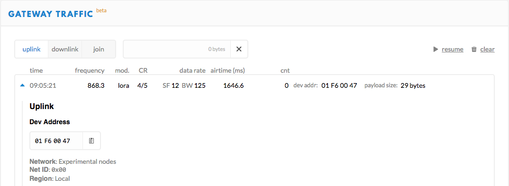
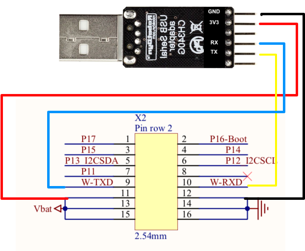

# LoRaMac-node sur LoRaMote

  
**Fig. 1: LoRaMote + st-linkv2**

Pour commencer la LoRaMote est plus simple car

- elle a longtemps été la plateforme par défaut du [dépot LoRaMac](https://github.com/Lora-net/LoRaMac-node) utilisée pour la certification des noeuds par semtech
- on peut directement connecter le jtag pour la flasher
- les paquets sont directement visibles dans TTN pour tester
- par contre, comment accéder au lien série ? 

### Compilation 

Il faut ensuite rapatrier le code source pour la LoRaMote, basculer sur la [branche master](https://github.com/Lora-net/LoRaMac-node/wiki/LoRaMAC-node-Wiki) où se trouve la plateforme LoRaMote et compiler

    git clone https://github.com/Lora-net/LoRaMac-node #Attention branche develop par défaut
    cd LoRaMac-node
    git checkout master #basculer sur la branche master
    mkdir build && cd build
    cmake -DCMAKE_TOOLCHAIN_FILE="cmake/toolchain-arm-none-eabi.cmake" ..
    make

Par défaut, le Makefile généré par `cmake` est pour la plateforme *LoRaMote*, l'application *LoRaMAC*, en classe A, la région *EU868*, ...

Pour modifier ces options, plus de détails au <https://github.com/Lora-net/LoRaMac-node/wiki/Development-environment#available-configuration-options-for-cmake>

### Flashage

Les étapes sont : 

- alimenter la carte par USB (cf. figure 1)
- positionner l'interrupteur sur la position ON (vers le bas)
- pour un st-link v2
	- Connectez le JTAG
	- `st-flash --format ihex write LoRaMote-LoRaMac-classA.hex` ([LoRaMote-LoRaMac-classA.hex](./firmware/LoRaMote-LoRaMac-classA.hex)) 

Si tout fonctionne bien, vous devriez voir les 3 leds clignoter une fois le noeud flashé et à chaque envoi de paquet. 
Vous pouvez également voir les paquets dans TTN (<https://console.thethingsnetwork.org/>) si une GW à proximité les reçoit (cf figure 2).  
  
  
**Fig. 2: Visualisation des paquets de la LoRaMote dans l'interface de TTN**

### Les problèmes éventuels

Si le flashage ne marche pas, mieux vaut utiliser openocd pour débugger car il est plus bavard que les utilitaires st-link. Les différents problèmes possibles sont : 

- votre OS ne voit par le stlink v2 : `st-info --probe` indiquera *Found 0 stlink programmers*. Vérifiez votre JTAG
- une carte mal alimentée : `openocd -f interface/stlink-v2.cfg -f target/stm32l1.cfg` vous indiquera *Error: target voltage may be too low for reliable debugging*. 
- `openocd` indique `Error: init mode failed (unable to connect to the target)`. `st-info --probe` devrait remettre la carte dans un état accessible par `openocd`

## LoRaMac-node + cartes à base d'iM880

Si on part sur des cartes plus brutes (sans GPS, sans LED, ...) intégrant le module radio iM880a, on peut avoir des cartes plus compactes avec ses ports GPIO permettant un accès simplifié aux entrées/sorties du module iM880a. 

  

Les instructions ci-dessous se veulent le plus générique possible. 

Imaginons une carte nécessitant pour la flasher de : 

- l'alimenter par USB.
	- Nous utiliserons l'adaptateur [USB-Serial CH340G](https://robotdyn.com/usb-serial-adapter-ch340g-5v-3-3v.html) de RobotDyn avec son [driver](https://kig.re/2014/12/31/how-to-use-arduino-nano-mini-pro-with-CH340G-on-mac-osx-yosemite.html) car il n'est pas reconnu par défaut sous OSX
	- Le lien série sera accessible via `/dev/tty.wchusbserial1410`
- connecter les bonnes PIN du st-linkv2 à la carte 

Cette dernière étape nécessitera bien évidemment d'avoir accès au schéma du circuit électronique. 
Imaginons que la carte dispose des 2 ports GPIO X1 et X2 suivants.

Vous trouverez ci-dessous un exemple le schéma pour relier l'adaptateur usb (cf fig. 3) et le st-link v2 à la carte (cf fig. 4).  
  
**Fig. 3: connexion X2 - adaptateur usb serial**

  
**Fig. 4: schéma connexion X1 - JTAG**

Il ne reste plus qu'à flasher : 

- `st-flash --format ihex write LoRaMote-LoRaMac-classA.hex` ([LoRaMote-LoRaMac-classA.hex](./firmware/LoRaMote-LoRaMac-classA.hex))

Si tout fonctionne bien, vous devriez voir les paquets arrivés sur TTN comme pour la LoraMote (cf. Section [flashage](./README.md#flashage) du LoRaMote)

Si cela ne fonctionne pas, reportez vous à la section [problèmes](./README.md#les-problèmes-éventuels) du LoRaMote.

> Remarque: si vous ne possédez pas de flasheur ST-Link v2, vous pouvez utiliser le flasheur détachable des cartes Nucleo et connecter les 5 premières broches du [connecteur CN4 SWD](https://www.st.com/content/ccc/resource/technical/document/user_manual/98/2e/fa/4b/e0/82/43/b7/DM00105823.pdf/files/DM00105823.pdf/jcr:content/translations/en.DM00105823.pdf) au connecteur X1 de la carte IMST im880:

	Pin 1: VDD_TARGET (VDD from application),
	Pin 2: SWCLK (clock),
	Pin 3: GND (ground),
	Pin 4: SWDIO (SWD data input/output),
	Pin 5: NRST (RESET of target STM32).
