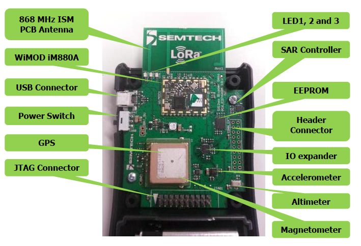
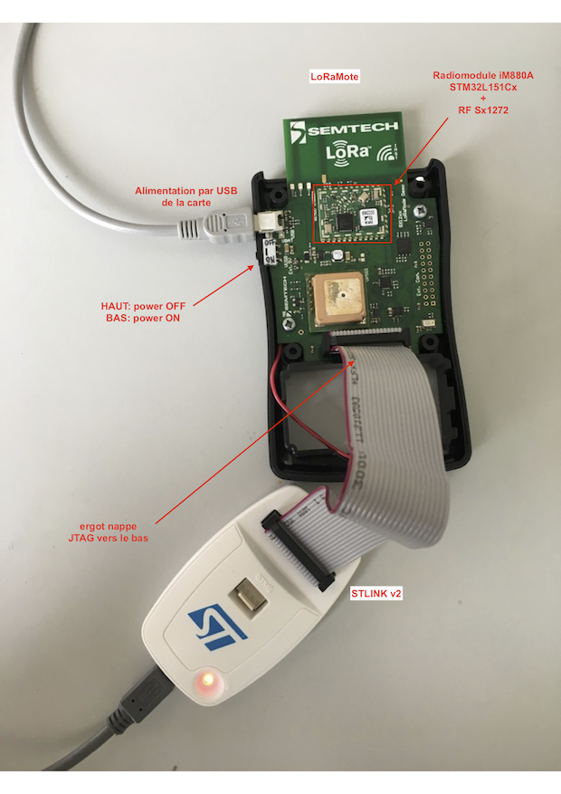

# Le suiveur Semtech LoRaMote

Le suiveur [Semtech LoRaMote](https://lora-developers.semtech.com/library/tech-papers-and-guides/loramote/) est un des premiers démonstrateurs de la technologie LoRa et LoRaWAN. Il s'appuie sur le module iM880a d'IMST.

Il comporte :
* un connecteur batterie 9V
* un connecteur USB vers l'UART de la MCU
* un accéleromètre 3-axes  [MMA8451Q](https://www.nxp.com/docs/en/data-sheet/MMA8451Q.pdf)
* un magnétomètre 3-axes [MAG3110](https://www.nxp.com/docs/en/data-sheet/MAG3110.pdf)
* un altimètre, thermomètre et pression [MPL3115A2](https://www.nxp.com/docs/en/data-sheet/MPL3115A2.pdf)
* un capteur [SAR proximity SX9500](https://semtech.my.salesforce.com/sfc/p/#E0000000JelG/a/44000000MDnv/ctpf5YCJXN1lEb4BMGKghwGKJgUGnJUOwZWgCdzFdDc)
* un module GPS [u-blox Fastrax UP501](docs/UP501-UM.pdf) connecté à l'UART du module
* un [EEPROM Microchip 24AA1287](https://ww1.microchip.com/downloads/aemDocuments/documents/MPD/ProductDocuments/DataSheets/24AA128-24LC128-24FC128-128-Kbit-I2C-Serial-EEPROM-20001191U.pdf) de 128 Kbit (16K x 8).

La schématique de la carte est disponible à la page 5 du [manuel utilisateur](docs/User_Guide_LoRaMote_STD.pdf).

> NB: une [deuxième version de la LoRaMote (WiMOD Mote II)](https://lora-alliance.org/wp-content/uploads/2019/07/Mote_II_Datasheet_V1_1.pdf) a été produite.

## Micrologiciel (firmware)

Le dernier micrologiciel supporté par Semtech pour la LoRaMote est le [tag v4.4.1](https://github.com/Lora-net/LoRaMac-node/tree/v4.4.1/src/apps/LoRaMac/classA/LoRaMote).

## Construction (build)

```bash
TODO
```

## Chargement (flashage)
Le module peut être flashage via le connecteur JTAG

  
**Fig. 1: LoRaMote**

  
**Fig. 2: LoRaMote + st-linkv2**
