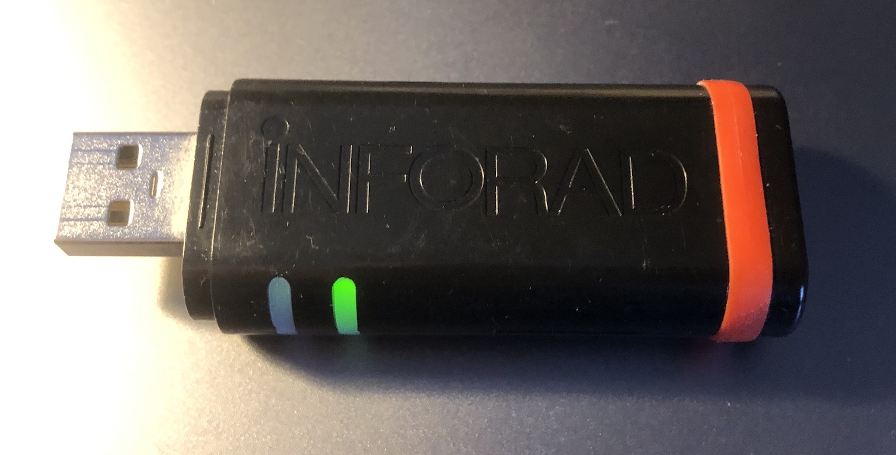

# INFORAD K0 and K1 GNSS USB Stick



## Spec
```
Récepteur GPS: SiRFStar III , 20 canaux
Temps d’acquisition moyen*: Initialisation: 3 min, 38 secondes à froid et 8 secondes à chaud
Temps de réactualisation: 1 seconde
Précision: position 10 mètres RMS - vitesse < à 1km/h
Processeur: RISC 32 bits ARM7 at 49MHz
Mémoire: Processeur 128Kb - Vive 8Mb
Alarme: Sonore
Alimentation: 5 Vdc par adaptateur allume-cigare
Entrée: 12/24 Vdc, Sortie: 5 Vdc - 850mA max.
Dimensions: Longueur: 75 mm - Largeur: 25 mm - Hauteur: 10 mm
Poids du produit complet: 20 g.
```

## Get NMEA 0183 sentences

Baudrate is 4800.

```bash
tio -b 4800 -m INLCRNL /dev/tty.usbserial-140 
```

## GPSd @ Raspberry Pi

TODO
