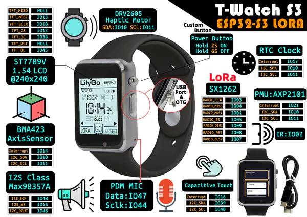

# Liliogo T-Watch ESP32-S3 LoRa

* https://github.com/Xinyuan-LilyGO/TTGO_TWatch_Library
* https://t-watch-document-en.readthedocs.io/en/latest/introduction/product/2020.html#description
* Micropython https://micropython.org/download/ESP32_GENERIC/
* LoRa https://t-watch-document-en.readthedocs.io/en/latest/introduction/product/sx127606.html
   * Demo https://github.com/Xinyuan-LilyGO/twatch-series-modules/blob/master/twatch_s7xg/twatch_s7xg.ino
* Meshtastic https://meshtastic.org/docs/hardware/devices/community-supported/lilygo/twatch/

