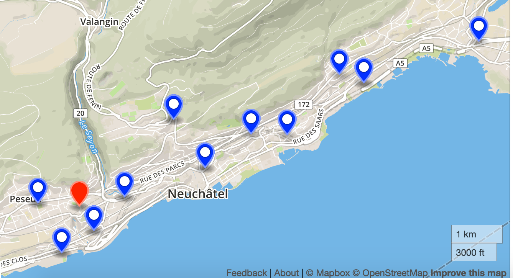

# CampusIoT :: LoRaCloud Location Solver :: Tutoriel

LoRaCloud est un service en ligne proposé par l'entreprise Semtech qui est le fondeur des composants LoRa.

LoRaCloud propose un service de géolocalisation d'équipements à partir d'informations dérivées du réseau (RSSI, TDOA, GNSS).

Ce service est décrit ici https://www.loracloud.com/portal/geolocation

Il propose une API REST dont l'interface est décrite https://www.loracloud.com/documentation/geolocation?url=index.html

La LoRa Alliance a publié ce [white paper à propos de la géolocalisation LoRa](https://lora-alliance.org/sites/default/files/2018-04/geolocation_whitepaper.pdf).

## Démarrage

Créez un compte utilisateur sur LoRaCloud https://www.loracloud.com/

Créez un Token pour l'utilisation de l'API https://www.loracloud.com/portal/geolocation/token_management

Testez les scripts suivants en utilisant le Token créé.

```bash
./singleframe.sh > singleframe.result.json
cat singleframe.result.json
```

```json
{
	"result": {
		"numUsedGateways": 7,
		"HDOP": 0.82,
		"locationEst": {
			"latitude": 51.498998,
			"longitude": -0.146996,
			"toleranceHoriz": 185
		},
		"algorithmType": "Tdoa"
	},
	"warnings": []
}
```

```bash
./multiframes.sh > multiframes.result.json
cat multiframes.result.json
```

```json
{
	"result": [{
		"numUsedGateways": 5,
		"HDOP": 1.0,
		"locationEst": {
			"latitude": 46.987555,
			"longitude": 6.9027,
			"toleranceHoriz": 75
		},
		"algorithmType": "Tdoa"
	}, {
		"numUsedGateways": 5,
		"HDOP": 1.0,
		"locationEst": {
			"latitude": 46.987555,
			"longitude": 6.9027,
			"toleranceHoriz": 75
		},
		"algorithmType": "Tdoa"
	}],
	"warnings": []
}
```
> [HDOP horizontal dilution of precision](https://en.wikipedia.org/wiki/Dilution_of_precision_(navigation))

## Visualisation du résultat en GeoJSON

```bash
node res2geojson.js multiframes.json multiframes.result.json > multiframes.geojson
```

Ouvrez le fichier [multiframes.geojson](./multiframes.geojson) avec http://geojson.io




# LR1110 LoRa Edge

Le traqueur LR1110 est le démonstrateur du composant LR1110 de Semtech qui capture les signaux Wifi et GPS/Beidou et les envoie vers le cloud de Semtech via un réseau LoRaWAN (public ou privé) pour calculer la position du traqueur.

[Requests a location estimate for a single on-chip GNSS capture](https://www.loracloud.com/documentation/geolocation?url=gnss.html#single-capture-http-request).

The request body contains a JSON object with the navigation message in HEX and at least the capture timestamp:
```json
{
  "payload":                    HEX,            // Required. HEX string with valid single capture payload
  "gnss_capture_time":          FLOAT,          // Optional. capture time estimate, GPST
  "gnss_capture_time_accuracy": FLOAT,          // Optional. capture time accuracy, seconds, default: 300
  "gnss_assist_position":       [FLOAT, FLOAT], // Optional. assistance position WGS84, (latitude, longitude) [deg]
  "gnss_assist_altitude":       FLOAT,          // Optional. assistance position WGS84, (latitude, longitude) [deg]
  "gnss_use_2D_solver":         BOOL            // Optional. force 2D solve, "gnss_assist_altitude" mandatory
}
```

```bash
./gnss_lr1110_singleframe.sh > gnss_lr1110_singleframe.result.json
cat gnss_lr1110_singleframe.result.json
```

The result is:
```json
{
  "result": {
    "ecef": [
      4288076.01,
      665721.15,
      4659254.83
    ],
    "llh": [
      47.22729,
      8.82469,
      399.84
    ],
    "capture_time_gps": 1269172730.011371,
    "gdop": 1.6,
    "accuracy": 1.4,
    "capture_time_utc": 1585137512.011371
  },
  "warnings": []
}
```


> Linux Epoch has 315964782 sec more than GPS epoch.

```bash
LINUX_EPOCH=$(date +%s)
GPS_EPOCH=`expr $LINUX_EPOCH - $315964782`
echo $GPS_EPOCH
```
