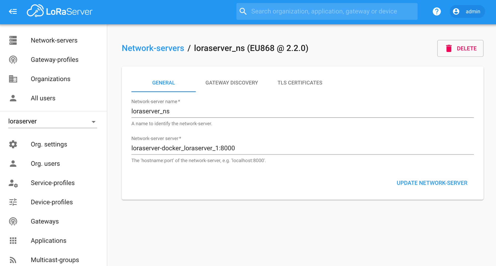
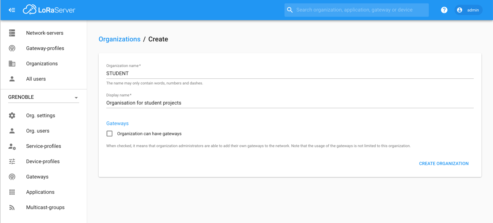
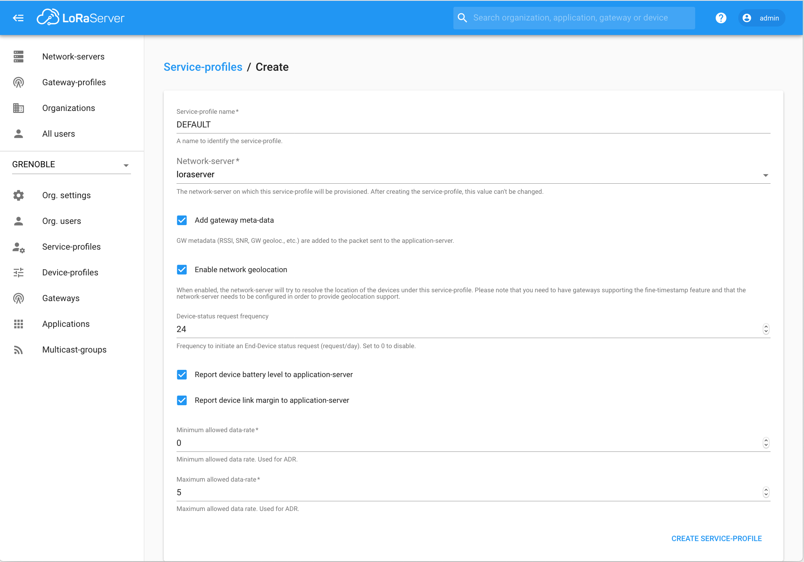

# CampusIoT :: LoRaServer > Partie 3: Administrer le service :: Tutoriel :fr:

Si ce tutoriel vous est utile, pensez à donner une étoile :star: en haut à droit.

## Ajout d’un networkserver
Cette opération est pour l’administrateur global du service.

Attention à mettre le nom de domaine du container dans la composition `loraserver-docker_loraserver_1:8000`

[Plus de détails](https://www.loraserver.io/lora-app-server/use/network-servers/)

## Création d’une organization
Cette opération est pour l’administrateur global du service.

[Plus de détails](https://www.loraserver.io/lora-app-server/use/organizations/)

### Création d'un service-profile dans l'organisation
Créez un service-profile `DEFAULT` depuis `Menu > Service-profiles > + Create`

https://lora.campusiot.imag.fr/#/organizations/1/service-profiles

[Plus de détails](https://www.loraserver.io/lora-app-server/use/service-profiles/)

## Administration du geoserver

[Plus de détails](https://www.loraserver.io/lora-geo-server/overview/)

### La suite
* [Partie 1 : Débuter](./README.md)
* [Partie 2 : Installer une nouvelle gateway](./README-gateway.md)
