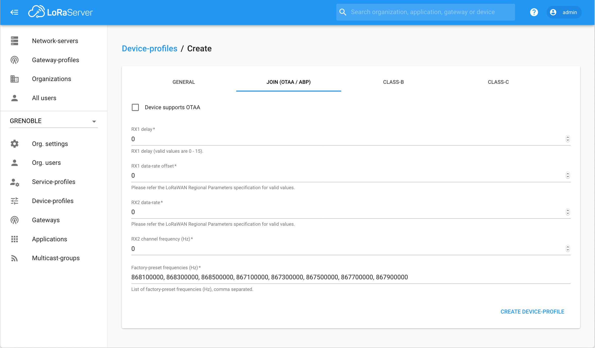
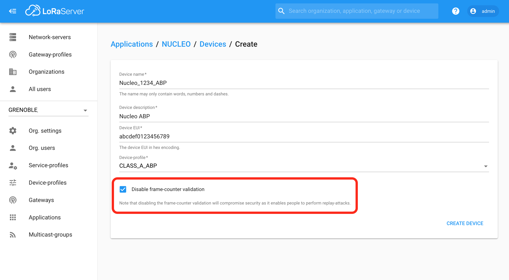

# CampusIoT :: LoRaServer > Ajouter une application :: Tutoriel :fr:

Si ce tutoriel vous est utile, pensez à donner une étoile :star: en haut à droit.

### Création d'un device-profile pour les devices Class A en mode OTAA
Créez (au moins) un device-profile `CLASS_A_OTAA` depuis `Menu > Device-profiles > + Create`

https://lora.campusiot.imag.fr/#/organizations/1/device-profiles


[Plus de détails](https://www.loraserver.io/lora-app-server/use/device-profiles/)

### Création d'une application
Une application est un ensemble de devices envoyant le même format de données et partageant le même service-profile (utiliser `DEFAULT`).

Créez une application depuis `Menu > Applications > + Create`
https://lora.campusiot.imag.fr/#/organizations/1/applications

Les valeurs de “`Payload codec`” sont “`None`”, “`Cayenne LPP`”, “`Custom JavaScript codec functions`”

Le “`Payload codec`” permet de spécifier (ou non) un codec pour décoder le payload des frames montantes et encoder les frames descendantes.

Le “`Payload codec`” peut être mis à jour à tout moment. Une erreur dans le code Javascript ou dans l’encodage LPP produit une erreur dans l’onglet “`Live LoRaWAN Frames`”

> Remarques:

> L’encodage “Cayenne LPP” est spécifié ici https://mydevices.com/cayenne/docs/lora/#lora-cayenne-low-power-payload

> Les “Custom JavaScript codec functions” ne supportent pas les libraries utiles comme Buffer ...

> Des codec Javascript pour des devices LoRaWAN sont fournis dans https://github.com/CampusIoT/payload-codec/tree/master/src/main/

[Plus de détails](https://www.loraserver.io/lora-app-server/use/applications/)

### Enregistrement d'un device OTAA
Un device OTAA est un endpoint LoRaWAN envoyant le même format de données et partageant le même service-profile (utilisez `CLASS_A_OTAA` ou un autre plus spécifique que vous aurez créé). Il utilise la procédure par défaut OTAA pour son admission dans le réseau. La plupart des devices que vous utilisez suivent la version 1.0.x de la spécification LoRaWAN.

Créez un device depuis une application créée (`Menu > Applications`) en utilisant les `DevEUI` (64 bits soit 16 caractères hexadécimaux) inscrit sur l’étiquette collée sur le endpoint LoRaWAN ou sur son emballage d’expédition.


Ajoutez ensuite l’`AppKey` (AES 128bits soit 32 caractères hexadécimaux) fournie dans le champs `Network Key`. Penser à valider l’enregistrement de la clé avec le bouton `Set Device-Keys`.


> Nota Bene : Une clé `AppKey` est livrée avec le endpoint (étiquette amovible, fichier Excel envoyé par le vendeur, …) à l'achat. L’`AppKey` par défaut peut être modifié sur la plupart des endpoints via une liaison USB, NFC, BLE au moyen d' une application mobile (Android, iOS) fournie par le constructeur ou de commandes série (type AT).

[Plus de détails](https://www.loraserver.io/lora-app-server/use/devices/)

### Enregistrement d'un device ABP
Un device LoRaWAN peut utiliser la procédure ABP (Activation By Personalization) pour communiquer avec le réseau. Les deux clés de session `AppSKey` et `NwkSKey` sont livrées avec le endpoint. Le device doit être enregistré avec le device-profile `CLASS_A_ABP` préalablement créé (voir ci-dessous).



> Nota Bene : La liste des fréquences `868100000`, `868300000`, `868500000`, `867100000, 867300000`, `867500000`, `867700000`, `867900000` correspond à celle définie par la spécification LoRaWAN pour la region `eu868`.



Renseignez le champs `Device address` avec une adresse comprise dans le NetId `0x00` soit entre `0x00000000` et `0x01FFFFFF`.

Ajoutez le clé de session `NwkSKey` dans les 3 premiers champs de clé.

Ajoutez le clé de session `AppSKey` dans le quatrième champs de clé.

Initialisez le compteur montant courant et le compteur descendant courant (ie. `frame-counters`) du device si vous les connaissez.

Validez avec le bouton `(Re)Activate Device`.


> Nota Bene : Il est parfois nécessaire de cocher `Disable frame counter validation` quand le device ne conserve pas le compteur montant (`fCntUp`) de manière persistante. En cas de changement de batterie ou de reset, le compteur montant est remis à zero.

> Nota Bene : La procédure ABP est à éviter du fait d'une moindre sécurité par rapport à la procédure OTAA en cas de `Disable frame counter validation`.

[Plus de détails](https://www.loraserver.io/lora-app-server/use/devices/)

### Affichage des messages d’un device
Affichez (en temps réel) les données envoyées par un device depuis l’onglet “`Live LoRaWAN Frames`” et avec l’onglet “`Live Data Device`” pour les valeurs du payload décodées avec le codec spécifié pour l’application.


> Remarque: le serveur n’archive pas les données. Il faut utiliser l’onglet “Integrations” de l’application.

### Récupération du flot MQTT de messages
MQTT est le moyen par défaut pour récupérer les messages envoyés par les devices.

Le flot de messages envoyés par les devices des applications peut être récupérer via des clients MQTT comme mosquitto_sub (en ligne de commande), [mqtt-spy](https://kamilfb.github.io/mqtt-spy/), , HiveMQ Websocket Client, MQTTBox ([configuration](images/mqttbox-brokerconfig.png), [souscription](images/mqttbox-subscribe.png)) [myMQTT](https://play.google.com/store/apps/details?id=at.tripwire.mqtt.client) pour Android ... Remarque: Des clients (comme [mqtt-lens](https://chrome.google.com/webstore/detail/mqttlens/hemojaaeigabkbcookmlgmdigohjobjm) pour Chrome) ne supportent pas MQTT/TLS.

Installez le client MQTT `mosquitto_sub` avec
```
sudo apt-get install -y mosquitto-clients
```
> Remarque: Une alternative à mosquitto-clients est la commande `mqtt` qui s'installe avec `sudo npm install mqtt -g; mqtt help subscribe; mqtt help publish`.

Il faut installer dans le répertoire courant le certificat `ca.crt` dec l’autorité de certification du broker MQTT avec la commande suivante:
```
wget https://raw.githubusercontent.com/CampusIoT/campusiot-certs/master/mqtt/ca.crt
```
> Remarque: l'option `--insecure` des commandes `mqtt` et `mosquitto_sub` permet de se passer du certificat du broker MQTT.

Actuellement, les commandes à utiliser sont:

```
ORGID=1 # l'id de votre ORGANISATION (ce n’est pas le username de votre compte utilisateur)
BROKER=lora.campusiot.imag.fr
MQTTUSER=org-$ORGID # le username de votre ORGANISATION (ce n’est pas le username de votre compte utilisateur)
MQTTPASSWORD=__SUPER_SECRET_TO_CHANGE__ # le mot de passe de votre ORGANISATION (ce n’est pas le username de votre compte utilisateur)
TLS="--cafile ca.crt -p 8883"

# Receive applications messages
mosquitto_sub -h $BROKER -t "application/#" -u $MQTTUSER -P $MQTTPASSWORD -v  $TLS

# Receive Gateways stats
mosquitto_sub -h $BROKER -t "gateway/#" -u $MQTTUSER -P $MQTTPASSWORD -v  $TLS
```

Remarque: les 2 commandes `wget` et `mosquitto_sub` peuvent être lancées depuis un container léger `alpine`:
```bash
docker run -i -t alpine /bin/sh
/ # apk update && apk add mosquitto-clients
```

La commande suivante affiche la value hexadécimale du champ `data` qui correspond au champ frmPayload de la frame LoRaWAN déchiffré avec la clé de session AppSKey.
```bash
apk add jq
...
mosquitto_sub -h $BROKER -t "application/#" -u $MQTTUSER -P $MQTTPASSWORD   $TLS | \
while read LINE; do
  TIMESTAMP=$(date +%s)
  DATAHEX=$(echo $LINE | jq -M '.data' | base64 -d | xxd -p)
  echo "$TIMESTAMP;$LINE;$DATAHEX"
done
```

> Remarque: je mettrai en place dès possible des ACL par topic pour les gateways et les organisations.

[Plus de détails](https://www.loraserver.io/lora-app-server/integrate/data/)

### Envoi d'un message downlink à un device
MQTT est le moyen par défaut pour envoyer un message descendant (down) vers un device https://www.loraserver.io/lora-app-server/integrate/data/

Actuellement, les commandes à utiliser sont:

```
ORGID=1 # l'id de votre ORGANISATION (ce n’est pas le username de votre compte utilisateur)
BROKER=lora.campusiot.imag.fr
MQTTUSER=org-$ORGID # le username de votre ORGANISATION (ce n’est pas le username de votre compte utilisateur)
MQTTPASSWORD=__SUPER_SECRET_TO_CHANGE__ # le mot de passe de votre ORGANISATION (ce n’est pas le username de votre compte utilisateur)
TLS="--cafile ca.crt -p 8883"

applicationID=1
devEUI=1234567890abcdef

# Send Downlink Messages (dn)
mosquitto_pub -h $BROKER -u $MQTTUSER -P $MQTTPASSWORD $TLS  -t "application/$applicationID/device/$devEUI/tx" -m '{"reference": "abcd1234","confirmed": true, "fPort": 10,"data":"SGVsbG8gQ2FtcHVzSW9UICE="}'
```

Le champs data contient le message binaire encodé en base64.
Dans l’exemple, le message est “`Hello CampusIoT !`”

```
echo `echo SGVsbG8gQ2FtcHVzSW9UICE= | base64 --decode`
echo "Hello CampusIoT !" | base64
```
Pour aller plus loin avec MQTT, vous pouvez:
* [journaliser le flot MQTT en Python](../python/README.md)
* [journaliser le flot MQTT de messages dans un fichier avec mqtt-logger](../mqtt-logger/README.md)
* [journaliser le flot MQTT de messages dans un fichier avec NodeRed](../nodered/README.md)
* [afficher les messages avec Cayenne](../cayenne/README.md)

### API Swagger
Le lora-app-server expose une API suivant la spécification OpenAPI 2.0 (ie Swagger). Elle peut être affichée depuis https://lora.campusiot.imag.fr/api

Le JWT à utiliser dans l'UI Swagger se récupère via la commande suivante:
```
curl 'https://lora.campusiot.imag.fr/api/internal/login' --data '{"username":"admin","password":"XXXXXXX"}' --insecure
```
La commande retourne le token de la forme suivante:
```
{"jwt":"XX.YY.ZZ"}
```

cURL peut être utilisé de la facon suivante pour invoquer des opérations de l'API :
```
AUTH='Grpc-Metadata-Authorization: Bearer XX.YY.ZZ'
curl -X GET --header 'Accept: application/json' --header "$AUTH" 'https://lora.campusiot.imag.fr/api/applications?limit=9999'  --insecure
```

### CLI (for bulk loading)

Le dépôt https://github.com/CampusIoT/loraserver-cli contient des commandes en ligne pour simplifier l'ajout en masse (bulk) de devices décrits dans un fichier CSV.

```
...
ORGID=...
USERNAME=...
PASSWORD=...
APPNAME=...
PROFILE_NAME=
JWT=$(./get_jwt.sh $USERNAME $PASSWORD)
./add_devices.sh $JWT $APPNAME $PROFILE_NAME devices.csv
./add_gateways.sh $JWT $ORGID $NS_NAME $GW_PROFILE_NAME gateways.csv
```

### Integration HTTP
En plus de l’intégration MQTT par défaut, le network server supporte l’intégration vers un endpoint HTTP/HTTPS

Vous devez déployer un serveur HTTP atteignable par le network server pour recevoir le flot de messages relatif aux devices de l’application.


[Plus de détails](https://www.loraserver.io/lora-app-server/integrate/sending-receiving/http/)

### Integration InfluxDB
En plus de l’intégration MQTT par défaut, le network server supporte l’intégration vers un SGBD temporel InfluxDB.

Vous devez déployer un serveur InfluxDB atteignable par le network server pour archiver le flot de messages relatifs aux devices de l’application dans une base temporelle.


[Plus de détails](https://www.loraserver.io/lora-app-server/integrate/sending-receiving/influxdb/)


### Création d’un groupe multicast
TODO


[Plus de détails](https://www.loraserver.io/lora-app-server/use/multicast-groups/)

### A voir
* [Introduction à LoRaServer](./README.md)
* [Installer une nouvelle gateway](./README-gateway.md)
* [Administrer une organisation](./README-org.md)
* [Administrer du service](./README-admin.md)
