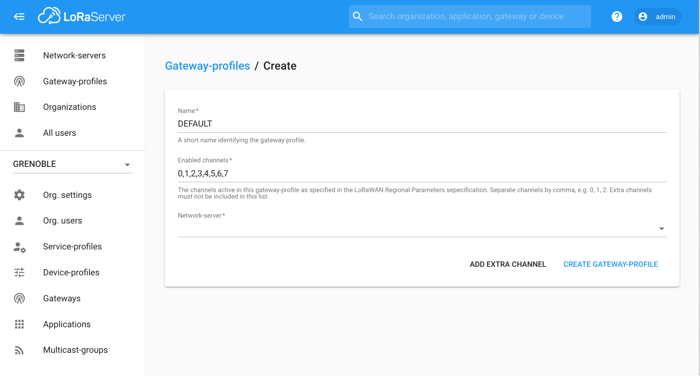
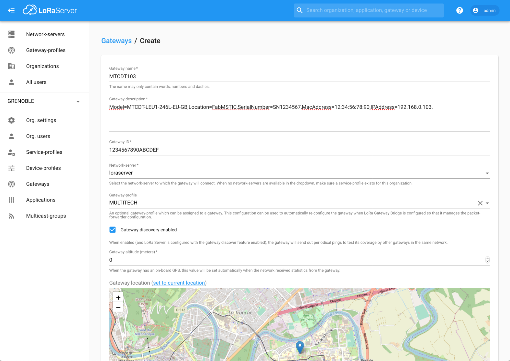
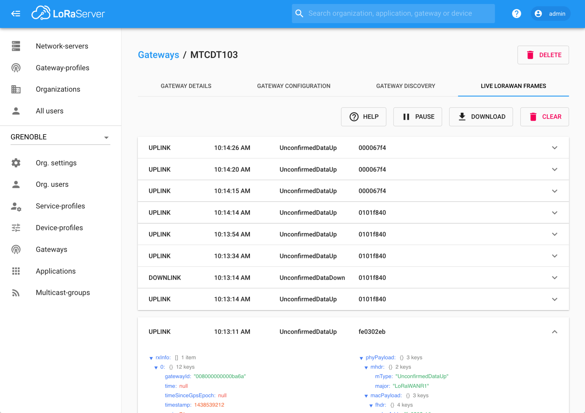

# CampusIoT :: LoRaServer > Partie 2: Installer une nouvelle gateway :: Tutoriel :fr:

Si ce tutoriel vous est utile, pensez à donner une étoile :star: en haut à droit.

## Création d’un gateway-profile
Cette opération est pour l’administrateur d’une organisation

Se logger sur https://lora.campusiot.imag.fr

Créer au moins un gateway-profile `DEFAULT` pour l’organisation.



[Plus de détails](https://www.loraserver.io/lora-app-server/use/gateways/)

## Installation et enregistrement d’une gateway
Deux composants doivent être installés sur une nouvelle gateway.
* Semtech lora-pkt-fwd qui contrôle le concentrateur SX130X de la gateway,
* lora-gateway-bridge qui réalise un pont entre lora-pkt-fwd et le network server.

Une fois ces 2 composants installés, la gateway peut être enregistrée via `Menu > Gateways` de l'organisation.

### Installation sur Multitech Conduit AP
Installer la gateway en suivre son [guide](http://www.multitech.net/developer/products/multiconnect-conduit-access-point/).

Votre gateway [Multitech Conduit AP](https://www.multitech.com/brands/multiconnect-conduit-ap) doit avoir le firmware mLinux et non pas AEP. [Plus de détails](http://www.multitech.net/developer/software/mlinux/using-mlinux/flashing-mlinux-firmware-for-conduit/)

Se logger (admin) sur la gateway et exécuter les commandes suivantes pour connaitre le `LoRaNote EUI` de la gateway :
```
cd /tmp
REPO=https://raw.githubusercontent.com/CampusIoT/gateway-config/master
DIST=multitech-mtcap
wget $REPO/$DIST/getinfo.sh -O getinfo.sh
chmod +x getinfo.sh
./getinfo.sh
wget $REPO/$DIST/packages.sh -O packages.sh
chmod +x packages.sh
./packages.sh
```

Récupérer les MQTT_USERNAME et MQTT_PASSWORD de la gateway auprès du sysadmin du serveur CampusIoT (Didier DONSEZ pour le moment) en lui communiquant le `LoRaNote EUI`.

Se logger (admin) sur la gateway et exécuter les commandes suivantes:
```
cd /tmp
REPO=https://raw.githubusercontent.com/CampusIoT/gateway-config/master
DIST=multitech-mtcap
wget $REPO/$DIST/install.sh -O install.sh
chmod +x install.sh
./install.sh
./install.sh __MQTT_USERNAME__ __MQTT_PASSWORD__
```

### Installation sur Multitech Conduit USB
Votre gateway [Multitech Conduit](https://www.multitech.com/brands/multiconnect-conduit) doit avoir le firmware mLinux et non pas AEP. [Plus de détails](http://www.multitech.net/developer/software/mlinux/using-mlinux/flashing-mlinux-firmware-for-conduit/)

Se logger (admin) sur la gateway et exécuter les commandes suivantes:
```
cd /tmp
REPO=https://raw.githubusercontent.com/CampusIoT/gateway-config/master
DIST=multitech-mtcdt-usb
wget $REPO/$DIST/getinfo.sh -O getinfo.sh
chmod +x getinfo.sh
./getinfo.sh
wget $REPO/$DIST/packages.sh -O packages.sh
chmod +x packages.sh
./packages.sh
```
Récupérer les MQTT_USERNAME et MQTT_PASSWORD de la gateway auprès du sysadmin du serveur CampusIoT (Didier DONSEZ pour le moment).

Se logger (admin) sur la gateway et exécuter les commandes suivantes:
```
MQTT_USERNAME=gw-1234567890abcdef
MQTT_PASSWORD=xXxXxXxXxXxXxXxXxXxXxXxXxXxXxX
cd /tmp
REPO=https://raw.githubusercontent.com/CampusIoT/gateway-config/master
DIST=multitech-mtcdt-usb
wget $REPO/$DIST/install.sh -O install.sh
chmod +x install.sh
./install.sh
./install.sh $MQTT_USERNAME $MQTT_PASSWORD
```

### Installation sur Multitech Conduit IP67
Votre gateway [Multitech Conduit IP67](https://www.multitech.com/brands/multiconnect-conduit-ip67) doit avoir le firmware mLinux et non pas AEP. [Plus de détails](http://www.multitech.net/developer/software/mlinux/using-mlinux/flashing-mlinux-firmware-for-conduit/)
TODO

### Installation sur RPI3 + iC880a
TODO
### Installation sur RPI3 + Picocell
TODO
### Installation sur Kerlink Wirgrid
TODO
### Installation sur Kerlink Femtocell
TODO
### Installation sur Kerlink iBTS Compact
TODO
### Installation sur Kerlink iBTS
TODO
### Installation sur Intel NUC + NFuse Mini-PCIe
TODO

## Enregistrement d’une gateway

Créer une gateway depuis une application créée (`Menu > Gateways`) en utilisant le `GWID` (64 bits soit 16 caractères hexadécimaux) fourni. Le GWID est calculé soit à partir de l’adresse MAC de la carte ethernet (`eth0`) de la gateway ou à partir de l’identifiant du composant concentrateur SX130x de la gateway (ie le `LoRaNote EUI`). (A noter: une gateway comme la Kerlink iBTS peut avoir plusieurs concentrateurs donc plusieurs `LoRaNote EUI`s).



> Remarque: le gain de l’antenne ne peut pas être spécifié via le frontend Web.

## Enregistrement et configuration d’une gateway TDOA.
TODO

## Affichage live des frames recus par une gateway

Une fois la gateway enregistrée, les frames reçues par la gateway sont visualisables en temps réel depuis l’onglet “`Live LoRaWAN Frame`”.



## La suite
* [Partie 1 : Débuter](./README.md)
* [Partie 3 : Administrer du service](./README-admin.md)
