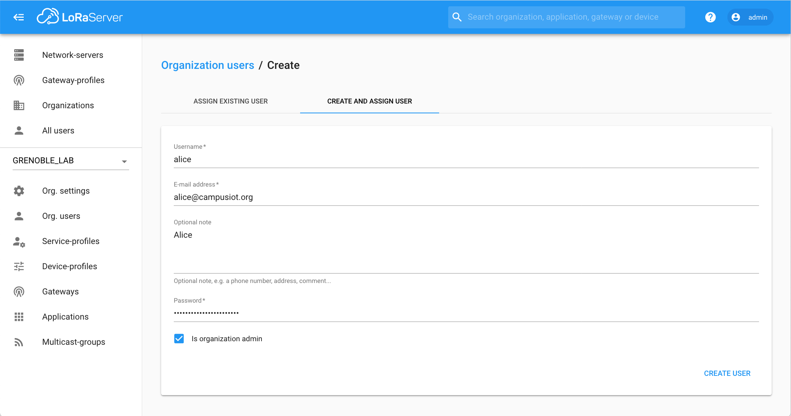
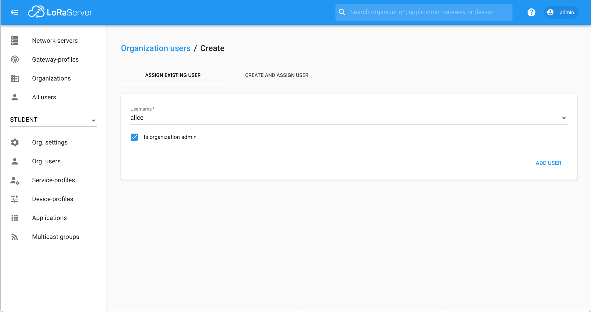

# CampusIoT :: LoRaServer :: Organisation :: Tutoriel :fr:

Si ce tutoriel vous est utile, pensez à donner une étoile :star: en haut à droit.

## Gestion d’une organisation
Si vous êtes adminstrateur d'une organisation, vous devez au minimum ajouter un utilisateur, Créez un device-profile et un service-profile.

[Plus de détails](https://www.loraserver.io/lora-app-server/use/organizations/)

### Ajout d'un utilisateur

Créez un nouvel utilisateur avec l'onglet `Create and Assign User` depuis `Menu > Org. Users > + Add`.

Créez un utilisateur existant avec l'onglet `Assign Existing User` depuis `Menu > Org. Users > + Add`.

> Remarque: aucun email n'est envoyé à l'utilisateur

> Remarque: aucun email n'est envoyé à l'utilisateur

[Plus de détails](https://www.loraserver.io/lora-app-server/use/users/)

> Remarque: le script add_users.sh du dépôt https://github.com/CampusIoT/loraserver-cli permet de Créez en masse (bulk) des utilisateurs  décrits dans un fichier CSV. Un email leurs ai envoyé avec leur identifiant de compte.

### Création de device-profiles
Vous pouvez ensuite créer un ou plusieurs device-profile. [Plus de détails](./README-app.md)

### A voir
* [Introduction à LoRaServer](./README.md)
* [Ajouter une application et des équipements](./README-app.md)
* [Installer une nouvelle gateway](./README-gateway.md)
* [Administrer du service](./README-admin.md)
