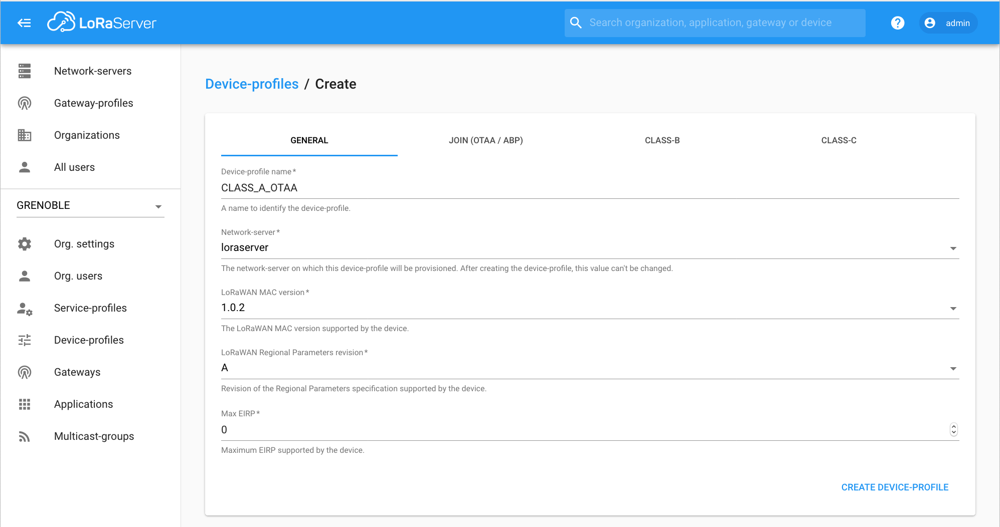
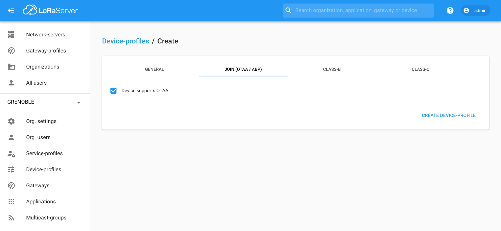
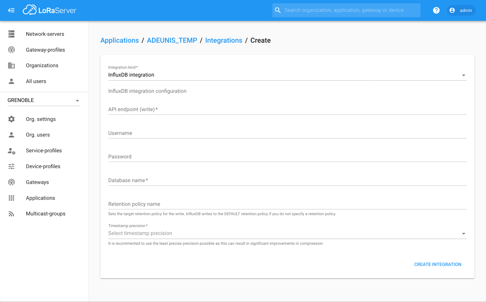
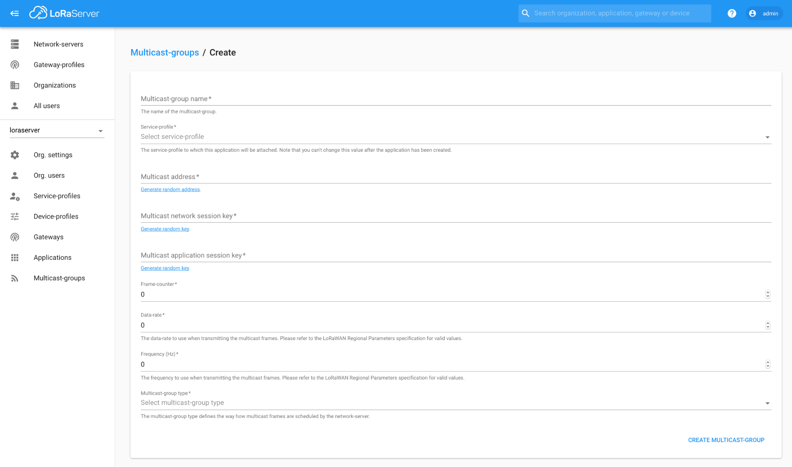
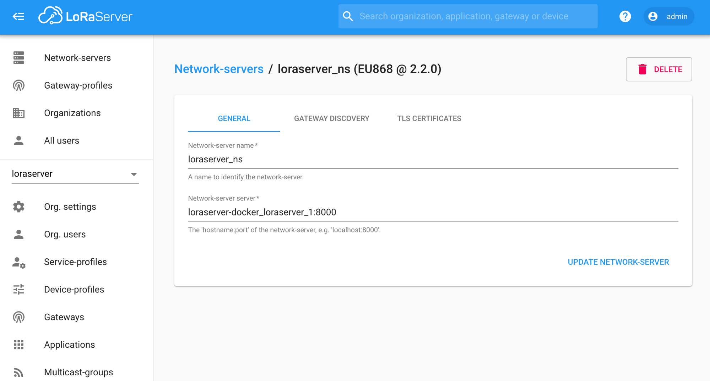
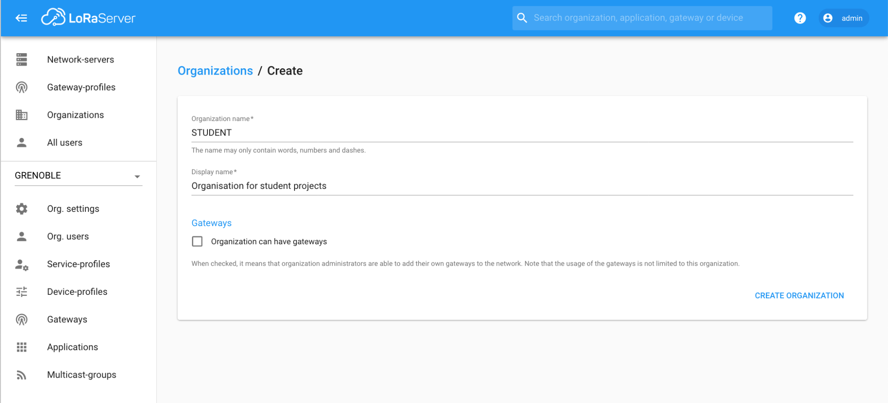

# CampusIoT :: LoRaServer :: Tutoriel :fr:

## Architecture et composants du LoRaServer
[Loraserver.io](https://www.loraserver.io/) est un network server LoRaWAN open-source.
Il est déployé sur une machine de l’IMAG lora.campusiot.imag.fr avec la composition Docker disponible sur https://github.com/CampusIoT/loraserver-docker.

Les principaux composants sont décrits dans la figure ci-dessous.


Dans le déploiement sur lora.campusiot.imag.fr, le service Mosquitto est sécurisé avec TLS (port 8883) et une authentification par username / password des organisations et des gateways. Les ACL par gateway et par organisation seront mises en place ASAP. Le port 1700 UDP vers le lora-gateway-bridge sera prochainement filtré par des raisons de sécurité.

Des containers supplémentaires ont été déployés pour le rendre opérationnel (dump des bases de données, log des messages MQTT, démo NodeRed, console Grafana …).

Remarque: Le NetID est `0x00`. Une demande de NetID est en cours auprès de LoRa Alliance.

## Gestion d’une organisation
Si vous êtes adminstrateur d'une organisation, vous devez au minimum créer un device-profile et un service-profile.

[Plus de détails](https://www.loraserver.io/lora-app-server/use/organizations/)

### Créer un device-profile
Créer (au moins) un device-profile `CLASS_A_OTAA` depuis `Menu > Device-profiles > + Create`

https://lora.campusiot.imag.fr/#/organizations/1/device-profiles





[Plus de détails](https://www.loraserver.io/lora-app-server/use/device-profiles/)

### Créer un service-profile
Créer un service-profile `DEFAULT` depuis `Menu > Service-profiles > + Create`

https://lora.campusiot.imag.fr/#/organizations/1/service-profiles


[Plus de détails](https://www.loraserver.io/lora-app-server/use/service-profiles/)

### Créer une application
Une application est un ensemble de devices envoyant le même format de données et partageant le même service-profile (utiliser `DEFAULT`).

Créer une application depuis `Menu > Applications > + Create`
https://lora.campusiot.imag.fr/#/organizations/1/applications


Les valeurs de “`Payload codec`” sont “`None`”, “`Cayenne LPP`”, “`Custom JavaScript codec functions`”

Le “`Payload codec`” permet de spécifier (ou non) un codec pour décoder le payload des frames montantes et encoder les frames descendantes.

Le “`Payload codec`” peut être mis à jour à tout moment. Une erreur dans le code Javascript ou dans l’encodage LPP produit une erreur dans l’onglet “`Live LoRaWAN Frames`”

> Remarques
> L’encodage “Cayenne LPP” est spécifié ici https://mydevices.com/cayenne/docs/lora/#lora-cayenne-low-power-payload
> Les “Custom JavaScript codec functions” ne supportent pas des libraries utiles comme Buffer ...
> Des codec Javascript pour des devices LoRaWAN sont fournis dans https://github.com/CampusIoT/payload-codec/tree/master/src/main/javascript

[Plus de détails](https://www.loraserver.io/lora-app-server/use/applications/)

### Enregistrer un device OTAA
Un device OTAA est un endpoint LoRaWAN envoyant le même format de données et partageant le même service-profile (utiliser `CLASS_A_OTAA` ou un autre plus spécifique que vous aurez créé). Il utilise la procédure par défaut OTAA pour son admission dans le réseau.

Créer un device depuis une application créée (`Menu > Applications`) en utilisant les `DevEUI` (64 bits soit 16 caractères hexadécimaux) inscrit sur l’étiquette collée sur le endpoint LoRaWAN ou sur son emballage d’expédition.


Ajouter ensuite l’`AppKey` (AES 128bits soit 32 caractères hexadécimaux) fournie avec le endpoint (étiquette amovible, fichier Excel envoyé par le vendeur, …). Penser à valider l’enregistrement de la clé avec le bouton `Set Device-Keys`.


> A noter : l’`AppKey` par défaut peut être modifié sur la plupart des endpoints via une liaison USB, NFC, BLE via une application mobile (Android, iOS) fournie par le constructeur.

[Plus de détails](https://www.loraserver.io/lora-app-server/use/devices/)

### Enregistrer un device ABP
TODO

[Plus de détails](https://www.loraserver.io/lora-app-server/use/devices/)

### Afficher les messages d’un device
Afficher (en temps réel) les données envoyées par un device depuis l’onglet “`Live LoRaWAN Frames`” et avec l’onglet “`Live Data Device`” pour les valeurs du payload décodées avec le codec spécifié pour l’application.


> Remarque: le serveur n’archive pas les données. Il faut utiliser l’onglet “Integrations” de l’application.

### Récupérer les flots MQTT de messages
MQTT est le moyen par défaut pour récupérer les messages envoyés par les devices.

Le flot de messages envoyés par les devices des applications peut récupérer via des clients MQTT comme mosquitto_sub (en ligne de commande), [mqtt-spy](https://kamilfb.github.io/mqtt-spy/), [mqtt-lens](https://chrome.google.com/webstore/detail/mqttlens/hemojaaeigabkbcookmlgmdigohjobjm) pour Chrome ...

Installer `mosquitto_sub` avec
```
sudo apt-get install -y mosquitto-clients
```

Il faut installer dans le répertoire courant le certificat `ca.crt` dec l’autorité de certification du broker MQTT avec la commande suivante
```
wget https://raw.githubusercontent.com/CampusIoT/campusiot-certs/master/mqtt/ca.crt
```

Actuellement, les commandes à utiliser sont:

```
BROKER=lora.campusiot.imag.fr
MQTTUSER=org1 # le username de votre ORGANISATION (ce n’est pas le username de votre compte utilisateur)
MQTTPASSWORD=__SUPER_SECRET_TO_CHANGE__
TLS="--cafile ca.crt -p 8883"

# Receive applications messages
mosquitto_sub -h $BROKER -t "application/#" -u $MQTTUSER -P $MQTTPASSWORD -v  $TLS

# Receive Gateways stats
mosquitto_sub -h $BROKER -t "gateway/#" -u $MQTTUSER -P $MQTTPASSWORD -v  $TLS
```

> Remarque: je mettrai en place dès possible des ACL par topic pour les gateways et les organisations.

[Plus de détails](https://www.loraserver.io/lora-app-server/integrate/data/)

### Envoyer un downlink à un device
MQTT est le moyen par défaut pour envoyer un message descendant (down) vers un device https://www.loraserver.io/lora-app-server/integrate/data/

Actuellement, les commandes à utiliser sont:

```
BROKER=lora.campusiot.imag.fr
MQTTUSER=org1 # le username de votre ORGANISATION (ce n’est pas le username de votre compte utilisateur)
MQTTPASSWORD=__SUPER_SECRET_TO_CHANGE__
TLS="--cafile ca.crt -p 8883"

applicationID=1
devEUI=1234567890abcdef

# Send Downlink Messages (dn)
mosquitto_pub -h $BROKER -u $MQTTUSER -P $MQTTPASSWORD $TLS  -t "application/$applicationID/device/$devEUI/tx" -m '{"reference": "abcd1234","confirmed": true, "fPort": 10,"data":"SGVsbG8gQ2FtcHVzSW9UICE="}'
```

Le champs data contient le message binaire encodé en base64.
Dans l’exemple, le message est “Hello CampusIoT !”

```
echo `echo SGVsbG8gQ2FtcHVzSW9UICE= | base64 --decode`
echo "Hello CampusIoT !" | base64
```


### Journaliser le flot MQTT de messages dans un fichier avec mqtt-logger
Voir https://github.com/CampusIoT/tutorial/blob/master/mqtt-logger/README.md


### Journaliser le flot MQTT de messages dans un fichier avec NodeRed
Lancer NodeRed avec Docker (sur votre machine)
```
docker run -it -p 1880:1880 --name campusiot-nodered nodered/node-red-docker
```

Ouvrir l’interface de NodeRed dans un navigateur Web
```
open http://127.0.0.1:1880
```

Créer le “flot” en important le JSON suivant (Menu > Import)
```
[{"id":"9d6b9737.6ee6a8","type":"mqtt in","z":"b3a2df4.51c83a","name":"campusiot","topic":"#","qos":"2","broker":"61ca344b.cfb484","x":210,"y":180,"wires":[["7fea5047.da2c5","4ece3642.56654"]]},{"id":"7fea5047.da2c5","type":"debug","z":"b3a2df4.51c83a","name":"","active":true,"tosidebar":true,"console":false,"tostatus":false,"complete":"false","x":510,"y":180,"wires":[]},{"id":"4ece3642.56654","type":"file","z":"b3a2df4.51c83a","name":"msg.log","filename":"msg.log","appendNewline":true,"createDir":true,"overwriteFile":"false","x":500,"y":260,"wires":[[]]},{"id":"61ca344b.cfb484","type":"mqtt-broker","z":"","name":"campusiot","broker":"lora.campusiot.imag.fr","port":"8883","tls":"11b0c2f3.c55f2d","clientid":"","usetls":true,"compatmode":true,"keepalive":"60","cleansession":true,"birthTopic":"","birthQos":"0","birthPayload":"","closeTopic":"","closeQos":"0","closePayload":"","willTopic":"","willQos":"0","willPayload":""},{"id":"11b0c2f3.c55f2d","type":"tls-config","z":"","name":"","cert":"","key":"","ca":"","certname":"","keyname":"","caname":"ca.crt","servername":"","verifyservercert":false}]
```

Editer le noeud mqtt-in en chargant le ca.crt pour la configuration SSL et en configurant le username et password MQTT.


Afficher le journal des messages avec
```
docker exec -it campusiot-nodered tailf /usr/src/node-red/msg.log
```

Remarque : Vous pouvez monter un volume local pour rendre persistant le journal dans votre répertoire courant. -v $PWD/msg.log:/usr/src/node-red/msg.log

```
touch $PWD/msg.log
docker run -d -p 1880:1880 -v $PWD/msg.log:/usr/src/node-red/msg.log --name campusiot-nodered nodered/node-red-docker

tail -f $PWD/msg.log
```

### Journaliser le flot MQTT de messages dans une base de données temporelle InfluxDB avec NodeRed et visualiser les séries temporelles avec Grafana.
TODO
* https://github.com/CampusIoT/loraserver-docker/blob/master/nodered.yml
* https://github.com/CampusIoT/loraserver-docker/blob/master/influxdb.yml
* https://github.com/CampusIoT/loraserver-docker/blob/master/grafana.yml

### Plus de tutoriels
https://github.com/CampusIoT/tutorial

### API Swagger
L’API Swagger est https://lora.campusiot.imag.fr/api

Le JWT se recupère via
```
curl 'https://lora.campusiot.imag.fr/api/internal/login' --data '{"username":"admin","password":"XXXXXXX"}' --insecure
```
retourne
```
{"jwt":"XX.YY.ZZ"}
```

```
curl -X GET --header 'Accept: application/json' --header 'Grpc-Metadata-Authorization: Bearer XX.YY.ZZ' 'https://lora.campusiot.imag.fr/api/applications?limit=9999'  --insecure
```

### CLI (for bulk loading)

Le dépôt https://github.com/CampusIoT/loraserver-cli contient des commandes en ligne pour créer des gateways et des devices en masse (bulk) descrits dans un fichier CSV.

```
...
JWT=$(./get_jwt.sh $USERNAME $PASSWORD)
./add_devices.sh $JWT $APPNAME $PROFILE_NAME devices.csv
./add_gateways.sh $JWT $ORGID $NS_NAME $GW_PROFILE_NAME gateways.csv
```

### Bonus track : Integration HTTP
En plus de l’intégration MQTT par défaut, le network server supporte l’intégration vers un endpoint HTTP/HTTPS

Vous devez déployer un serveur HTTP atteignable par le network server pour recevoir le flot de messages relatif aux devices de l’application.


[Plus de détails](https://www.loraserver.io/lora-app-server/integrate/sending-receiving/http/)

### Bonus track : Integration InfluxDB
En plus de l’intégration MQTT par défaut, le network server supporte l’intégration vers un SGBD temporel InfluxDB.

Vous devez déployer un serveur InfluxDB atteignable par le network server pour archiver le flot de messages relatifs aux devices de l’application dans une base temporelle.



[Plus de détails](https://www.loraserver.io/lora-app-server/integrate/sending-receiving/influxdb/)


### Bonus track : Création d’un groupe multicast
TODO




### Installation et enregistrement d’une gateway
Deux composants doivent être installés sur une nouvelle gateway.
* Semtech lora-pkt-fwd
* lora-gateway-bridge

Une fois ces 2 composants installés, la gateway peut être enregistrée via Menu > Gateways
Prérequis

Récupérer l’adresse MAC de la carte Ethernet de la gateway.

La communiquer à xxxx@imag.fr

Il fournira l’id (gweui), le username et le password de la gateway qui servira à la configuration de 2 composants.
### Installation du Semtech lora-pkt-fwd
#### Sur Kerlink Wirgrid
TODO
#### Sur Multitech USB
TODO
#### Sur Multitech
TODO
#### Sur RPI3 + iC880a
TODO
#### Sur RPI3 + Picocell
TODO
#### Sur Kerlink Femtocell
TODO

### Installation du lora-gateway-bridge
#### Sur Kerlink Wirgrid
TODO
#### Sur Multitech
TODO
#### Sur RPI3 + iC880a
TODO
#### Sur Kerlink Femtocell
TODO

### Enregistrement d’une gateway
https://lora.campusiot.imag.fr/#/organizations/1/gateways/create

Créer une gateway depuis une application créée (Menu > Gateways) en utilisant le GWID (64 bits soit 16 caractères hexadécimaux) fourni. Le GWID est calculé soit à partir de l’adresse MAC de la carte ethernet de la gateway ou à partir de l’identifiant du composant concentrateur SX130x de la gateway. (A noter: une gateway peut avoir plusieurs concentrateurs).

> Remarque: le gain de l’antenne ne peut pas être spécifié via le frontend Web.

### Enregistrement et configuration d’une gateway TDOA.
TODO
### Affichage live des frames recus par une gateway

https://lora.campusiot.imag.fr/#/organizations/1/gateways/008000000000ba6a/frames

Une fois enregistrée, les frames reçus par la gateway sont visualisables en temps réel  depuis l’onglet “`Live LoRaWAN Frame`”.


## Administration du service
### Ajout d’un networkserver
Cette opération est pour l’administrateur global du service.



Attention à mettre le nom de domaine du container dans la composition `loraserver-docker_loraserver_1:8000`

### Création d’une organization
Cette opération est pour l’administrateur global du service.




### Création d’un gateway-profile
Cette opération est pour l’administrateur d’une organisation

Créer au moins un gateway-profile `DEFAULT` pour l’organisation.


## Administration du geoserver
https://www.loraserver.io/lora-geo-server/overview/
