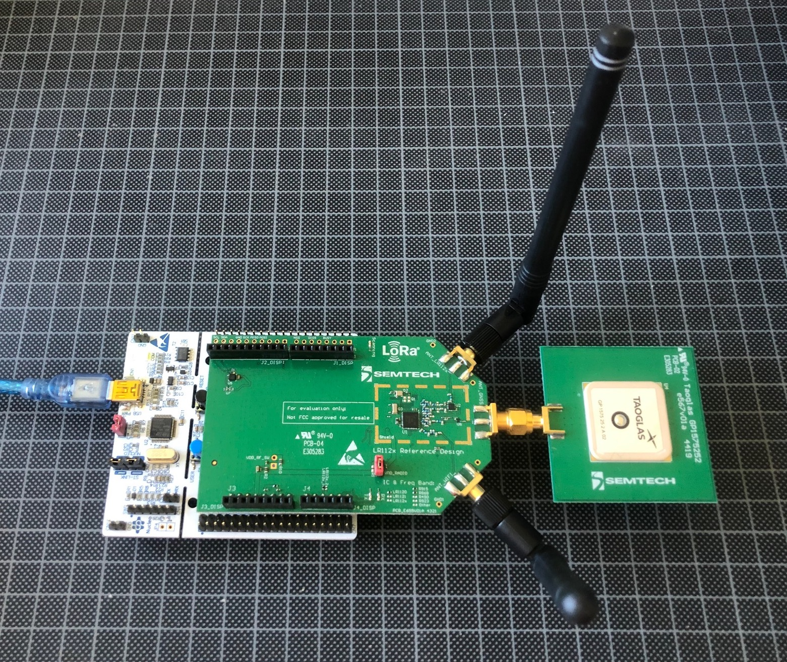

# Semtech LR1120 :: LoRa transceiver + GNSS/Wifi Sniffer

''The [LR1120](https://fr.semtech.com/products/wireless-rf/lora-edge/lr1120) is an ultra-low power device targeting global geolocation applications. It provides multi band LoRa® and Long Range - Frequency Hopping Spread Spectrum (LR-FHSS) communication over sub-GHz and 2.4GHz Industrial, Scientific and Medical (ISM) bands as well as licensed S-Band for satellites. It integrates a Cloud-native multi-constellation global navigation satellite system (GNSS) scanner and a passive Wi-Fi MAC address scanner, both leveraging Semtech’s LoRa Cloud™ services.''


Check the model of your LR1120 shield. Mine is [`LR1120MB1DIS` (868 MHz for the SubGhz interface)](https://fr.semtech.com/products/wireless-rf/lora-edge/lr1120dvk1tcks)

Two Github repositories are available:
* [SWSD003: LR11xx SDK](https://github.com/Lora-net/SWSD003)
* [SWSD001: LoRa Basics Modem SDK](https://github.com/Lora-net/SWSD001)




## Setup SWSD003 LR11xx SDK

`arm-none-eabi-gcc` suite should .be installed.

```bash
mkdir -p github/lora-net
cd github/lora-net/
git clone https://github.com/Lora-net/SWSD003
cd SWSD003/
```

## Console

Open the serial console of the Nucleo board

```bash
brew install tio
tio -L
tio -b 921600 -m INLCRNL /dev/tty.usbmodem142xxx
```

## Demonstrations SWSD003

### Ping Pong

```bash
cd apps/ping_pong/
cd makefile/
make RADIO_SHIELD=LR1120MB1DIS
cp build/ping_pong.bin  /Volumes/NODE_L476RG/
```

###  Spectral scan

```bash
cd apps/spectral_scan/
cd makefile/
make RADIO_SHIELD=LR1120MB1DIS
cp build/spectral_scan.bin  /Volumes/NODE_L476RG/
```

###  GNSS

```bash
cd apps/gnss/gnss_autonomous/
cd makefile/
make RADIO_SHIELD=LR1120MB1DIS
cp build/gnss.bin  /Volumes/NODE_L476RG/
```

```bash
cd apps/gnss/gnss_assisted/
cd makefile/
make RADIO_SHIELD=LR1120MB1DIS
cp build/gnss.bin  /Volumes/NODE_L476RG/
```


## Setup SWSD001 LoRa Basics Modem SDK

```bash
mkdir -p github/lora-net
cd github/lora-net/
git clone https://github.com/Lora-net/SWSD001
cd SWSD001/
```

##  Demonstations SWSD001 LoRa Basics Modem SDK

### Endpoint registration

Register the endpoint on your LoRaWAN Network Server (ie Chirpstack, TTN, Orange Liveobject ...) with:

```
DevEUI 1010101010123456
JoinEUI 10101010101FFFFF
AppKey 101010101012345610101010101FFFFF
```

### Application server setup

Start a Node-RED server and deploy the following flow : https://github.com/Lora-net/SWSD001/tree/master/apps/examples/application_server

### LoRaWAN class A endpoint

```bash
cd apps/examples/lorawan/
cd makefile/
gmake RADIO_BOARD=LR1120MB1DJS CRYPTO=SOFT EXTRAFLAGS='-DLORAWAN_DEVICE_EUI=\{0x10,0x10,0x10,0x10,0x10,0x12,0x34,0x56\} -DLORAWAN_JOIN_EUI=\{0x10,0x10,0x10,0x10,0x10,0x1F,0xFF,0xFF\} -DLORAWAN_APP_KEY=\{0x10,0x10,0x10,0x10,0x10,0x12,0x34,0x56,0x10,0x10,0x10,0x10,0x10,0x1F,0xFF,0xFF\} -DLORAWAN_APP_PORT=10 -DLORAWAN_CONFIRMED_MSG_ON=true -DAPP_TX_DUTYCYCLE=15'
cp build/lorawan.bin  /Volumes/NODE_L476RG/
```

Decode the payload by registering the decoder:

```javascript

// TODO

```


From the device console, enqueue a downlink with `base64` is `SGVsbG8gV29ybGQK` ('Hello World') and `port` is `22`.

```console
INFO: Request uplink
 User Tx LORa on FPort 10 

  *************************************
  * Send Payload  HOOK ID = 3
  *************************************
  Tx  LoRa at 86950 ms: freq:868300000, SF7, BW125, len 17 bytes 0 dBm, fcnt_up 9, toa = 52

  *************************************
  *  TX DONE
  *************************************

  Open RX1 for Hook Id = 3  RX1 LoRa at 87997 ms: freq:868300000, SF7, BW125, sync word = 0x34
  Timer will expire in 993 ms
 rx_packet_type = 1

  *************************************
  * Receive a Valid downlink RX1 for Hook Id = 3
  *************************************
Downlink frame  - (12 bytes):
 48 65 6C 6C 6F 20 57 6F 72 6C 64 0A
DL Port = 22 , DL SNR = 52 , DL RSSI = -33 , DL Freq = 868300000 , DL DR = 5 , DL Fpending Bit = 0 
INFO: ###### ===== TX DONE EVENT ==== ######
TX Done status: SMTC_MODEM_EVENT_TXDONE_CONFIRMED
INFO: Uplink count: 4
INFO: ###### ===== DOWNLINK EVENT ==== ######
Rx window: SMTC_MODEM_EVENT_DOWNDATA_WINDOW_RX1
Rx port: 22
Rx RSSI: -97
Rx SNR: 13
INFO: Downlink received:
INFO:   - LoRaWAN Fport = 22
INFO:   - Payload size  = 12
INFO:   - RSSI          = -97 dBm
INFO:   - SNR           = 13 dB
INFO:   - Rx window     = SMTC_MODEM_EVENT_DOWNDATA_WINDOW_RX1
Payload - (12 bytes):
 48 65 6C 6C 6F 20 57 6F 72 6C 64 0A
 ```


### Time sync (RTC)

This example demonstrates the synchronization of the endpoint's RTC according to the [App Clock Sync specification](https://lora-alliance.org/resource_hub/lorawan-application-layer-clock-synchronization-specification-v1-0-0/)

```bash
cd apps/examples/time_sync/
cd makefile/
gmake RADIO_BOARD=LR1120MB1DJS CRYPTO=SOFT EXTRAFLAGS='-DLORAWAN_DEVICE_EUI=\{0x10,0x10,0x10,0x10,0x10,0x12,0x34,0x56\} -DLORAWAN_JOIN_EUI=\{0x10,0x10,0x10,0x10,0x10,0x1F,0xFF,0xFF\} -DLORAWAN_APP_KEY=\{0x10,0x10,0x10,0x10,0x10,0x12,0x34,0x56,0x10,0x10,0x10,0x10,0x10,0x1F,0xFF,0xFF\} -DLORAWAN_APP_PORT=10 -DLORAWAN_CONFIRMED_MSG_ON=true -DAPP_TX_DUTYCYCLE=15'
cp build/time_sync.bin  /Volumes/NODE_L476RG/
```

Some LNS (such as Chirpstack) intercept [App Clock Sync](https://lora-alliance.org/resource_hub/lorawan-application-layer-clock-synchronization-specification-v1-0-0/) messages (`fport=199`) and reply with downlink messages. 

if the LNS supports [App Clock Sync](https://lora-alliance.org/resource_hub/lorawan-application-layer-clock-synchronization-specification-v1-0-0/), the trace looks like this:
```console
INFO: Application parameters:
INFO:   - Time synchronization service = SMTC_MODEM_TIME_MAC_SYNC
INFO:   - Automatic time synchronization interval = 900 s
INFO:   - Manual time synchronization interval = 130 s

...

  *************************************
  * Receive a Valid downlink RX1 for Hook Id = 3
  *************************************
Cmd device_time_ans_parser = b6 bc 49 50 51
SecondsSinceEpoch 1347009718, FractionalSecond 316
INFO: ###### ===== TIME EVENT ==== ######
Time: SMTC_MODEM_EVENT_TIME_VALID
INFO: Checking/printing local UTC time upon TIME reception
INFO: Current UTC time: Mon 2022-09-12 09:21:41 GMT
```


### LoRaWAN application sending asynchronous uplinks

```bash
cd apps/examples/lorawan/
cd makefile/
gmake RADIO_BOARD=LR1120MB1DJS CRYPTO=SOFT EXTRAFLAGS='-DLORAWAN_DEVICE_EUI=\{0x10,0x10,0x10,0x10,0x10,0x12,0x34,0x56\} -DLORAWAN_JOIN_EUI=\{0x10,0x10,0x10,0x10,0x10,0x1F,0xFF,0xFF\} -DLORAWAN_APP_KEY=\{0x10,0x10,0x10,0x10,0x10,0x12,0x34,0x56,0x10,0x10,0x10,0x10,0x10,0x1F,0xFF,0xFF\} -DLORAWAN_APP_PORT=10 -DLORAWAN_CONFIRMED_MSG_ON=true -DAPP_TX_DUTYCYCLE=15'
cp build/gnss.bin  /Volumes/NODE_L476RG/
```

```console
INFO: Use soft secure element for cryptographic functionalities

INFO: ###### ===== LoRa Basics Modem LoRaWAN Class A/C asynchronous demo application ==== ######

INFO: SDK version: v2.0.0
INFO: LoRaWAN version: 01.00.04.01
INFO: LoRa Basics Modem version: 03.02.04

```

### LoRaWAN application sending asynchronous LR-FHSS uplinks

This example requires LNS and gateways supporting LR-FHSS uplinks.

The ADR should enable LR-FHSS datarates DR8 and DR11 (see [Table 8 of section 2.4.3 in RP002-1.0.3 LoRaWAN® Regional Parameters](https://lora-alliance.org/wp-content/uploads/2021/05/RP002-1.0.3-FINAL-1.pdf))

```bash
cd apps/examples/lorawan_asynchronous/
cd makefile/
gmake RADIO_BOARD=LR1120MB1DJS CRYPTO=SOFT EXTRAFLAGS='-DLORAWAN_DEVICE_EUI=\{0x10,0x10,0x10,0x10,0x10,0x12,0x34,0x56\} -DLORAWAN_JOIN_EUI=\{0x10,0x10,0x10,0x10,0x10,0x1F,0xFF,0xFF\} -DLORAWAN_APP_KEY=\{0x10,0x10,0x10,0x10,0x10,0x12,0x34,0x56,0x10,0x10,0x10,0x10,0x10,0x1F,0xFF,0xFF\} -DLORAWAN_APP_PORT=10 -DLORAWAN_CONFIRMED_MSG_ON=true -DAPP_TX_DUTYCYCLE=15'
cp build/lorawan_asynchronous.bin  /Volumes/NODE_L476RG/
```

```console

INFO: Use soft secure element for cryptographic functionalities

INFO: ###### ===== LoRa Basics Modem LoRaWAN LR-FHSS asynchronous demo application ==== ######

INFO: SDK version: v2.0.0
INFO: LoRaWAN version: 01.00.04.01
INFO: LoRa Basics Modem version: 03.02.04

....


  *************************************
  * RX2 Timeout for Hook Id = 3
  *************************************
INFO: ###### ===== NEW LINK ADR EVENT ==== ######
WARN: No LR-FHSS datarates are available
```


