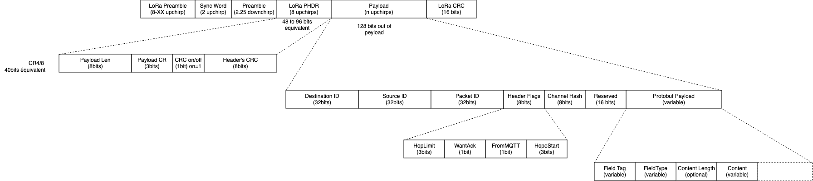

# Meshtastic

Meshtastic is an off-grid messaging system using [affortable LoRa endpoints](https://meshtastic.org/docs/hardware/devices) for building dynamic mesh networks over kilometers. LoRa endpoints (aka nodes) [forward messages to the next node](https://meshtastic.org/blog/why-meshtastic-uses-managed-flood-routing/) to distribute them over the network. Messages can be encrypted using [AES256-CTR](https://meshtastic.org/docs/overview/encryption/) expect from radio-amateur bands. Internet-connected relay nodes enable the conversation to move online too using MQTT brokers.

https://meshtastic.org


## Message Routing

When you send a message on your Meshtastic companion app, it is relayed to the radio using Bluetooth, Wi-Fi/Ethernet or serial connection. That message is then broadcasted by the radio. If it hasn't received a confirmation from any other device after a certain timeout, it will retransmit the message up to three times.

When a receiving radio captures a packet, it checks to see if it has heard that message before. If it has it ignores the message. If it hasn't heard the message, it will rebroadcast it.

For each message a radio rebroadcasts, it marks the "hop limit" down by one. When a radio receives a packet with a hop limit of zero, it will not rebroadcast the message.

The radio will store a small amount of packets (around 30) in its memory for when it's not connected to a client app. If it's full, it will replace the oldest packets with newly incoming text messages only.

Be sure to also check out this blog post about why the current protocol is used: https://meshtastic.org/blog/why-meshtastic-uses-managed-flood-routing/

While simplistic, it has been proven to be successful, e.g. at DEFCON with a mesh of over 700 nodes. Doing proper listen-before-talk with collision avoidance is already half of the work to get a mesh going.

## Physical layer

The physical layer of Meshtastic uses the LoRa modulation.

The SyncWord for Meshtastic LoRa frames is `0x2B` in order to separate the traffic with LoRaWAN endpoints (SyncWord = `0x34`)

Meshtastic adopts CSMA/CA, similar as to what is used in WiFi. This means that all transmitters must perform Channel Activity Detection (CAD). The amount of slot times to wait is randomly picked from a contention window (CW)

## Message format



## Payload encoding

Message payloads are serialized using Protobuf. `.proto` definitions are listed [here](https://github.com/meshtastic/protobufs/tree/master/meshtastic) and documented [here](https://buf.build/meshtastic/protobufs/docs/main:meshtastic#) 

## Payload encryption

https://meshtastic.org/docs/overview/encryption

Message payloads can be encrypted using [AES256-CTR](https://meshtastic.org/docs/overview/encryption/).

> NB: encryption is not allowed on radio-amateur bands

## Bands in Europe

### 433 MHz

The maximum power allowed for Europe is +10 dBm ERP (Effective Radiated Power).

The band range is from 433 to 434 MHz.

There are four frequency slots defined with the standard radio preset LongFast. After factory reset the radio will be set to frequency slot 4 with a center frequency of 433.875 MHz.

### 868 MHz

The maximum power allowed for Europe is +27 dBm ERP (Effective Radiated Power).

The band range is from 869.40 to 869.65 MHz. This is less than the 863–870 MHz range defined as SRD (Short Range Devices) Band, but allows for a higher ERP and a duty cycle of 10%.

There is one frequency slot defined with the standard radio preset LongFast. After factory reset the radio will be set to frequency slot 1 with a center frequency of 869.525 MHz.

It is worth noting that 868 MHz is generally the most popular frequency band for Meshtastic in Europe.

### 2400-2483 MHz

TODO

### Radio-amateur bands

TODO

## Supported Devices

https://meshtastic.org/docs/hardware/devices/

### @Fablab FabMaSTIC

* WisBlock with RAK11300 RP2040 SX1262 https://store.rakwireless.com/products/wisduo-lpwan-module-rak11300
* https://lilygo.cc/products/t-beam-supreme-meshtastic
* https://www.passion-radio.fr/materiel-wifi/sx-1262-433-2825.html
* https://www.passion-radio.fr/materiel-wifi/tbeam-sx1262-2823.html
* [Seeedstudio Wio-WM1110](https://wiki.seeedstudio.com/Wio-WM/Introduction/) https://meshtastic.org/docs/hardware/devices/seeed-studio/wm1110/
* https://www.seeedstudio.com/SenseCAP-Solar-Node-P1-Pro-for-Meshtastic-LoRa-p-6412.html

## Produits distribués en France

* https://www.gotronic.fr/art-carte-seeed-xiao-rp2350-39742.htm
* https://www.gotronic.fr/art-shield-xiao-wio-sx1262-47632.htm
* https://www.gotronic.fr/art-carte-xiao-esp32s3-36954.htm
* https://www.gotronic.fr/art-carte-xiao-ble-sense-soud--47617.htm
* https://www.gotronic.fr/art-sensecap-tracker-t1000-e-40059.htm
* https://www.gotronic.fr/art-xiao-esp32s3-mash-lora-40055.htm
* https://www.passion-radio.fr/module/twatch-868-3044.html (la Classe à Dallas)

## Firmware

* https://github.com/meshtastic/firmware

## Python CLI

* https://meshtastic.org/docs/software/python/cli/

```
pip3 install --upgrade pytap2
pip3 install --upgrade meshtastic
meshtastic --help
```

```bash
ls -al /dev/tty.*
PORT=/dev/ttyUSB0
PORT=/dev/tty.usbmodem48CA435B98B41
meshtastic --port $PORT --info

meshtastic --export-config --port $PORT > example_config.yaml

meshtastic --port /dev/ttyUSB0 --seriallog

meshtastic -t meshtastic.local --seriallog log.txt

meshtastic --set-ringtone "LeisureSuit:d=16,o=6,b=56:f.5,f#.5,g.5,g#5,32a#5,f5,g#.5,a#.5,32f5,g#5,32a#5,g#5,8c#.,a#5,32c#,a5,a#.5,c#.,32a5,a#5,32c#,d#,8e,c#.,f.,f.,f.,f.,f,32e,d#,8d,a#.5,e,32f,e,32f,c#,d#.,c#"
```

Meshtastic Web is a Meshtastic client that runs directly in your browser. There are three ways of accessing the app: Served directly from an ESP32 based node via meshtastic.local or the device's IP Address.1

https://github.com/lyusupov/SoftRF/wiki/Prime-Edition-MkIII#quick-start

## Integrations

### MQTT


### NodeRED

https://meshtastic.org/docs/software/integrations/mqtt/nodered/


## Misc

### Meshtastic site planner

https://site.meshtastic.org/

### Mesh-metrics

https://github.com/cordelster/mesh-metrics

### Meshtastic routing simulator (Discrete Event)

https://github.com/meshtastic/Meshtasticator

### meshtastic-map

https://github.com/liamcottle/meshtastic-map

```bash
MQTT_BROKER=mqtt.meshtastic.org
MQTT_PORT=8883
MQTT_USERNAME=meshdev
MQTT_PASSWORD=large4cats
TOPIC="msh/#"
  
mqtt subscribe -v -h $MQTT_BROKER -p 1883  $TOPIC

mqtt subscribe --insecure -v -h $MQTT_BROKER -p $MQTT_PORT -u $MQTT_USERNAME -P $MQTT_PASSWORD -l mqtts $TOPIC

mqtt subscribe -v -h $MQTT_BROKER -p $MQTT_PORT -u $MQTT_USERNAME -P $MQTT_PASSWORD  $TOPIC
```

## Glossary

* ATAK : [Android Tactical Awareness Kit](https://en.wikipedia.org/wiki/Android_Team_Awareness_Kit) ([more ...](https://freetakteam.github.io/FreeTAKServer-User-Docs/)), [Comparing Meshtastic, Beartooth MkII, and goTenna Pro Radios for ATAK (video)](https://www.youtube.com/watch?v=b8bVSwhYt8U)
* CoT : [Cursor on Target](https://pmc.ncbi.nlm.nih.gov/articles/PMC3615829/)

## Projects @ UGA

* https://gricad-gitlab.univ-grenoble-alpes.fr/Projets-INFO4/24-25/18/docs
* https://gricad-gitlab.univ-grenoble-alpes.fr/thingsat/public/-/blob/master/balloons/2025-05/README.md
