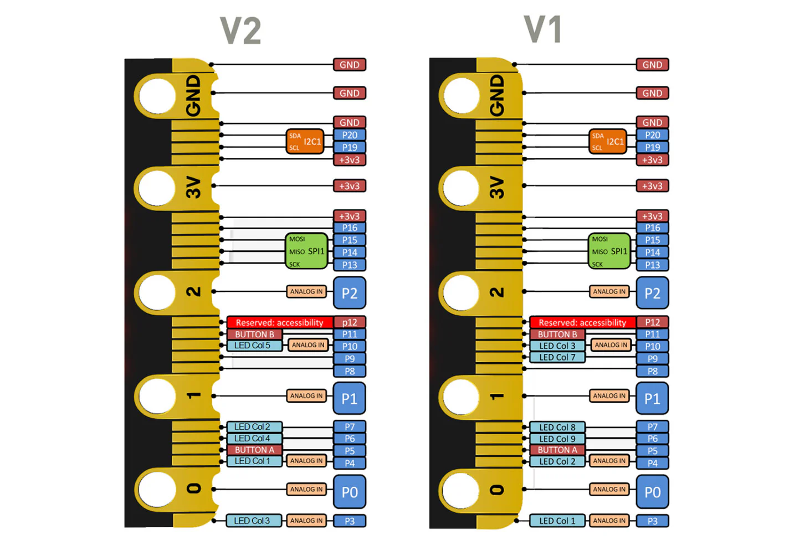

# micro:bit

https://microbit.org/

The micro:bit is a pocket-sized computer designed to inspire creative thinking in children. It can be programmed in many different ways and has multiple uses. Through the micro:bit, children are encouraged to explore ideas using real code.

> Note: [2 versions of micro:bit boards coexist](https://kitronik.co.uk/blogs/resources/explore-micro-bit-v1-microbit-v2-differences) : 

| Previous (v1.5) |	Feature |	Latest (v2) |
|	-	|	-	|	-	|
|	25 Programmable LEDs in a 5 x 5 grid	|	LED Matrix	|	25 Programmable LEDs in a 5 x 5 grid	|
|	3-axis motion sensing	|	Accelerometer	|	3-axis motion sensing	|
|	On-board magnetometer	|	Compass	|	On-board magnetometer	|
|	On-board temperature sensor	|	Temperature sensing	|	On-board temperature sensor	|
|	On-board light level sensing	|	Light level sensing	|	On-board light level sensing	|
|	2 x programmable buttons, A & B	|	User Buttons	|	2 x programmable buttons, A & B	|
|	BLE Bluetooth 4.0	|	Bluetooth	|	BLE Bluetooth 5.0	|
|	2.4Ghz Micro:bit Radio	|	Radio	|	2.4Ghz Micro:bit Radio	|
|	Rear-mounted push button	|	Reset Button	|	Rear-mounted push button	|
|	N/A	|	On/Off switch	|	Power off (push and hold power button)	|
|	25 pins	|	Edge Connector	|	25 pins	|
|	N/A	|	Microphone	|	MEMS microphone and LED indicator	|
|	N/A	|	Speaker	|	Onboard speaker	|
|	N/A	|	Logo touch	|	Touch-sensitive logo pin	|
|	N/A	|	Power indicator	|	LED power indicator	|
|	C++, MakeCode, Python, Scratch	|	Software	|	C++, MakeCode, Python, Scratch	|

## Pinouts

## Firmware

### Makecode

drag-n-drop block programming or Javascript

### Javascript

https://makecode.microbit.org/courses/blocks-to-javascript/hello-javascript

### Micropython

https://python.microbit.org/v/3

### Arduino

https://learn.adafruit.com/use-micro-bit-with-arduino/overview

go to Preferences and add `https://sandeepmistry.github.io/arduino-nRF5/package_nRF5_boards_index.json`

Open `Tools>Board>Boards Manager` from the menu bar, search for nRF5 and install `Nordic Semiconductor nRF5 Boards` by Sandeep Mistry

Select `BBC micro:bit` from the Boards menu

### RIOT OS

https://doc.riot-os.org/group__boards__microbit.html

## References

* https://kitronik.co.uk/blogs/resources/explore-micro-bit-v1-microbit-v2-differences