# Ecole MPLS 2025 :: Atelier GNSS

L'objectif de ce tutoriel est de comprendre les informations retournées par les modules GNSS et GNSS RTK.

## Partie 1: GNSS

### Matériel

* 1 parapluie
* 1 PC ou 1 Mac
* 1 module GNSS UART (Grove ou Mikrobus)
* 1 [platine support](https://github.com/thingsat/tinygs_2g4station) pour ESP32-Wroom-32U avec connecteur Grove et emplacements Mikrobus

| Fabricant | Module | Baudrate | Commentaires |
| --------- | ------ | -------- | ------------ |
|  [Adafruit Ultimate GPS Featherwing](https://learn.adafruit.com/adafruit-ultimate-gps-featherwing) | Mediatek MTK3333 |  9600 | |
|[SparkFun GPS Breakout - XA1110](https://learn.sparkfun.com/tutorials/sparkfun-gps-breakout---xa1110-qwiic-hookup-guide)| Mediatek MTK3333 | 9600 (réglable à 4800-115200) | [Mode ballon activable](https://github.com/sparkfun/SparkFun_I2C_GPS_Arduino_Library/blob/a0c84da4f4e7064b858fdd25729e7e3f2f1f21bc/examples/Example5-ConfigureGPS/Example5-ConfigureGPS.ino#L130), [MikroBus](https://gricad-gitlab.univ-grenoble-alpes.fr/Drakkar-LIG/waltor/-/tree/jeremie/kicad/jeremie/kicad/XA1110_MikroBus?ref_type=heads), Connecteur U-FL pour une antenne externe |
|  | [u-blox NEO-6M](https://www.u-blox.com/en/product/neo-6-series) | 4800, 9600(default), 19200, 38400, 57600, 115200, 230400 | disponible sur de nombreuses platines chinoises bon marché|
| [Mikroe GNSS RTK Click](https://www.mikroe.com/gnss-rtk-click) | [u-blox ZED-F9P](https://www.u-blox.com/en/product/zed-f9p-module) | 38400 (default), 460800 | RTK. La platine doit être alimentée en 5V |

## Banchement

### Via le connecteur Grove UART

Configurez les 2 cavaliers du connecteur `JmpRx1` du coté `Grove OUT`

> Si votre platine GNSS ne dispose pas de connecteur Grove (comme dans le cas de l'Adafruit Ultimate GPS): branchez le fil blanc sur la broche `RX` et le fil jaune sur la branche `TX`

> Si votre platine GNSS dispose d'une broche PPS (en sortie), vous pouvez la brancher sur la broche `13` de l'ESP32

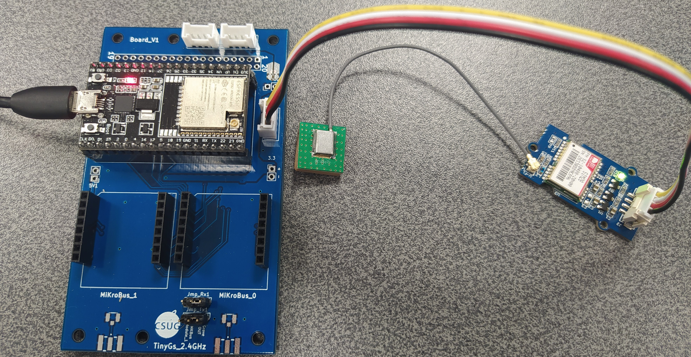

### Via l'emplacement Mikrobus #1

Configurez les 2 cavaliers du connecteur `JmpRx1` du coté `MKBus Module_1`

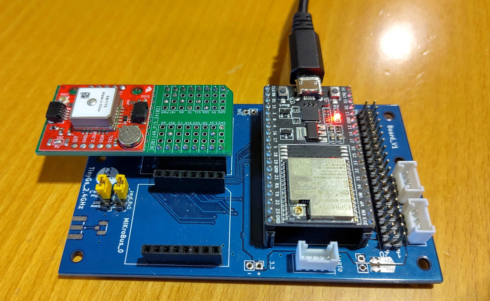

### Installation de l'IDE Arduino

Installez l'[IDE Arduino](https://www.arduino.cc/en/software) (2.3.4 ou plus) sur votre PC (Windows ou Mac) ou Mac

Ajoutez la définition des cartes ESP32 `[https://dl.espressif.com/dl/package_esp32_index.json](https://github.com/espressif/arduino-esp32/tree/master/libraries)` dans les préférences `Preferences > URL of Board manager`

Installez la bibliothéque `TinyGPSPlusPlus` depuis le gestionnaire de bibliothèques `Tools > Manage Libraries ...`.

Sélectionnez votre carte `ESP32 Dev Module` dans `Tools > Board > esp32`.

Sélectionnez le port auquel est connecté la carte dans `Tools > Port`.

### Pratique

#### Visualisation des trames NMEA0183

Ouvrez l'exemple `XXXX`

```c++
// Test code for Ultimate GPS Using Hardware Serial
// (e.g. GPS for Leonardo, Flora or FeatherWing)
//
// This code shows how to test a passthru between USB and hardware serial
//
// Tested and works great with the Adafruit GPS FeatherWing
// ------> https://www.adafruit.com/products/3133
// or Flora GPS
// ------> https://www.adafruit.com/products/1059
// but also works with the shield, breakout
// ------> https://www.adafruit.com/products/1272
// ------> https://www.adafruit.com/products/746
//
// Pick one up today at the Adafruit electronics shop
// and help support open source hardware & software! -ada


// what's the name of the hardware serial port?
#define GPSSerial Serial1


void setup() {
  // make this baud rate fast enough to we aren't waiting on it
  Serial.begin(115200);

  // wait for hardware serial to appear
  while (!Serial) delay(10);

  // 9600 baud is the default rate for the Ultimate GPS
  GPSSerial.begin(9600);
}


void loop() {
  if (Serial.available()) {
    char c = Serial.read();
    GPSSerial.write(c);
  }
  if (GPSSerial.available()) {
    char c = GPSSerial.read();
    Serial.write(c);
  }
}
```


Compilez et chargez le programme sur la carte.

Ouvrez la console série (baudrate 9600).

```
$GPRMC,045103.000,A,3014.1984,N,09749.2872,W,0.67,161.46,030913,,,A*7C
$GPGGA,045104.000,3014.1985,N,09749.2873,W,1,09,1.2,211.6,M,-22.5,M,,0000*62
$GPRMC,045200.000,A,3014.3820,N,09748.9514,W,36.88,65.02,030913,,,A*77
$GPGGA,045201.000,3014.3864,N,09748.9411,W,1,10,1.2,200.8,M,-22.5,M,,0000*6C
$GPRMC,045251.000,A,3014.4275,N,09749.0626,W,0.51,217.94,030913,,,A*7D
$GPGGA,045252.000,3014.4273,N,09749.0628,W,1,09,1.3,206.9,M,-22.5,M,,0000*6F
```

Commentaires:

Les phrases NMEA commencent par 1 caractère de préambule `$` et par un identifiant de locuteur (Talker Id) en 2 lettres

| Locuteur (Talker Id) | Systeme | 
| --------- |------- | 
| GB | Global Positioning System (GPS) 🇺🇸 |
| GA | Galileo Positioning System 🇪🇺 |
| GB | BDS ([BeiDou System](https://fr.wikipedia.org/wiki/Syst%C3%A8me_de_positionnement_par_satellites#Le_syst%C3%A8me_chinois_Beidou)) 🇨🇳 | 
| GI | [NavIC (IRNSS)](https://fr.wikipedia.org/wiki/Indian_Regional_Navigation_Satellite_System) 🇮🇳 |
| GL | GLONASS Receiver 🇷🇺 |
| GQ | [QZSS](https://fr.wikipedia.org/wiki/Quasi-Zenith_Satellite_System) 🇯🇵|
| GN | Global Navigation Satellite System (GNSS)  |

> Remarque : L’identifiant de locuteur `GN` est utilisé lorsque les données de la phrase proviennent d’une combinaison de plusieurs systèmes satellitaires. Les identifiants de locuteur propres à un système satellitaire ne sont utilisés que lorsque les données de la phrase proviennent d’un seul système de navigation par satellite. Les descriptions et remarques dans les définitions des phrases fournissent des indications sur l’utilisation des identifiants de locuteur des récepteurs de systèmes de navigation par satellite, lorsque cela est nécessaire.

Les phrases NMEA continuent avec 3 lettres pour désigner une option

| Option | Description |
| ------ |----------- |
|GGA |Donnéees de temps, position et type de positionnement (fix). |
|GSA |Mode de fonctionnement du récepteur GNSS, satellites actifs utilisés dans la solution de positionnement et valeurs DOP. |
|GSV |Nombre de satellites GPS visibles, identifiants des satellites, élévation, azimut et valeurs SNR.|
|RMC |Données de temps, date, position, cap et vitesse. Les informations de navigation minimales recommandées.|
|VTG |Informations de cap et de vitesse par rapport au sol.|

#### Décodage des trames NMEA0183 avec la bibliothèque TinyGPS d'Arduino

##### `DeviceExample`

Ouvrez l'exemple `DeviceExample` dans `Examples > TinyGPS++ > DeviceExample`

Modifiez la valeur `GPSBaud` dans la ligne `static const uint32_t GPSBaud = 4800;` en fonction du module GNSS que vous avez à vous disposition.

Compilez et chargez le programme sur la carte.

Ouvrez la console série.

##### `SatElevTracker`

Ce code d’exemple suit l’élévation des satellites en utilisant des objets TinyGPSCustom. Les numéros et élévations des satellites ne sont normalement pas suivis par TinyGPSPlus, mais en utilisant TinyGPSCustom, nous contournons cette limitation.

Modifiez la valeur `GPSBaud` dans la ligne `static const uint32_t GPSBaud = 4800;` en fonction du module GNSS que vous avez à vous disposition.

Compilez et chargez le programme sur la carte.

Ouvrez la console série.

##### `SatelliteTracker`

Modifiez la valeur `GPSBaud` dans la ligne `static const uint32_t GPSBaud = 4800;` en fonction du module GNSS que vous avez à vous disposition.

Compilez et chargez le programme sur la carte.

Ouvrez la console série.

##### `FullExample`

Ouvrez le [croquis `FullExample`](https://github.com/CampusIoT/tutorial/blob/master/mpls-gnss/TinyGPSPlus_FullExample/TinyGPSPlus_FullExample.ino)

Modifiez la valeur `GPSBaud` dans la ligne `static const uint32_t GPSBaud = 4800;` en fonction du module GNSS que vous avez à vous disposition.

Modifiez la ligne `static const double POI_LAT = 51.508131, POI_LON = -0.128002;` par la ligne `static const double POI_LAT = 44.910101, POI_LON = 5.782137;` qui est l'[emplacement du Murtel](https://www.openstreetmap.org/relation/109753#map=19/44.910101/5.782137).

Compilez et chargez le croquis sur la carte.

Ouvrez la console série.

#### Récupération sur signal PPS du module GNSS

Le module GNSS génère un signal à 1 Hz (PPS pour Pulse per Second) dont le front montant (`RISING`) lors du passage à la nouvelle seconde du temps (GPS).

Ce signal peut être utilisé par le programme du microcontroleur pour synchroniser finement son horloge temps-réel (RTC).

Ouvrez le [croquis `GNSS_PPS_ISR`](https://github.com/CampusIoT/tutorial/blob/master/mpls-gnss/GNSS_PPS_ISR/GNSS_PPS_ISR.ino).

```c
/*
 * This example for ESP32 illustrates the PPS of a GNSS module
 */

#define PPS_PIN     13 // INT_1 INT pin on Mikrobus #1 on TinyGS 2G4 Board
//#define PPS_LED   12

void setup () {
  Serial.begin(115200);
  
  // Attach an interrupt to interrupt #1, calls program "pps_interrupt", happens on rising (low to high)
  pinMode(PPS_PIN, INPUT_PULLDOWN);
  digitalWrite(PPS_PIN, LOW);
  attachInterrupt(digitalPinToInterrupt(PPS_PIN), pps_interrupt, RISING);

#ifdef PPS_LED
  pinMode(PPS_LED, OUTPUT);
  // Check to make sure LED is working
  digitalWrite(PPS_LED, HIGH);
  delay(1000);
  digitalWrite(PPS_LED, LOW);
#endif

  Serial.println(__DATE__);
  Serial.println(__TIME__);
  
}

void loop () {  
  delay(10000);
}

static int cpt = 0;

void pps_interrupt(){
  if(++cpt % 60 == 0) {
    Serial.println();
  }
  Serial.print((char)('0'+(cpt%10)));

#ifdef PPS_LED
  digitalWrite(PPS_LED, HIGH);
  delay(100);
  digitalWrite(PPS_LED, LOW);
#endif
}
```
Compilez et chargez le croquis sur la carte.

Ouvrez la console série.

#### Utilisation de l'interface I2C du module GNSS Sparkfun XA1110

Installez la bibliothéque [`SparkFun I2C GPS Reading and Control`](https://github.com/sparkfun/SparkFun_I2C_GPS_Arduino_Library/) via le gestionnaire de bibliothèques. 

Ouvrez les croquis suivants dans le menu `File > Examples > `SparkFun I2C GPS Reading and Control`.

* `Example1-BasicReadings`
* `Example2-TinyGPS`
* `Example3-MoreGPSInfo`
* `Example4-LibraryOptions`
* `Example5-ConfigureGPS`

##### `Example5-ConfigureGPS`

Ouvrez le croquis `Example5-ConfigureGPS` dans le menu `File > Examples > `SparkFun I2C GPS Reading and Control`.

Compilez et chargez le croquis sur la carte.

Ouvrez la console série.

```
1) Set update rate to 10Hz
2) Set update rate to 1Hz
3) Enable PPS LED
4) Turn off all sentences but RMC&GGA
5) Enable high altitude balloon mode
6) Set serial baud rate to 57600bps
7) Enable DGPS/SBAS
8) Enable/Disable Debugging
9) Reset module
a) Query version information
s) Set baud rate:
--  0 : 4800
--  1 : 9600
--  2 : 14400
--  3 : 19200
--  4 : 38400
--  5 : 57600
--  6 : 115200
```

`a` affiche les informations sur le module GNSS I2C
```
Querying GPS version: .done!
Firmware version: AXN_5.1.1_3333
Build ID: 8530
Model: XA1110
```

`3` active le clignotement de la LED du PPS
```
Packet 285: Command successful
```

`5` active le mode ballon
```
Packet 886: Command successful
```

#### Utilisation de l'interface I2C du module GNSS RTK ZED-F9P de u-Blox

Installez la bibliothéque [`SparkFun u-Blox GNSS Arduino Library`](https://github.com/sparkfun/SparkFun_u-blox_GNSS_Arduino_Library) via le gestionnaire de bibliothèques. 

##### Example1_GetPositionAccuracy

Ouvrez le croquis `Example1_GetPositionAccuracy` dans le menu `File > Examples > `SparkFun u-Blox GNSS Arduino Library > ZED-F9P`.

Compilez et chargez le croquis sur la carte.

Ouvrez le console série.
```
Lat: 451921702 Long: 57355977 (degrees * 10^-7) Alt: 284288 (mm) 3D Positional Accuracy: 3096 (mm)
Lat: 451921702 Long: 57355977 (degrees * 10^-7) Alt: 284288 (mm) 3D Positional Accuracy: 3096 (mm)
Lat: 451921702 Long: 57355977 (degrees * 10^-7) Alt: 284288 (mm) 3D Positional Accuracy: 3096 (mm)
Lat: 451921702 Long: 57355977 (degrees * 10^-7) Alt: 284288 (mm) 3D Positional Accuracy: 3096 (mm)
Lat: 451921702 Long: 57355977 (degrees * 10^-7) Alt: 284288 (mm) 3D Positional Accuracy: 3096 (mm)
...
Lat: 451921762 Long: 57356013 (degrees * 10^-7) Alt: 281091 (mm) 3D Positional Accuracy: 2524 (mm)
Lat: 451921768 Long: 57356009 (degrees * 10^-7) Alt: 281072 (mm) 3D Positional Accuracy: 2411 (mm)
Lat: 451921770 Long: 57356005 (degrees * 10^-7) Alt: 281082 (mm) 3D Positional Accuracy: 2300 (mm)
...
Lat: 451921752 Long: 57355994 (degrees * 10^-7) Alt: 281621 (mm) 3D Positional Accuracy: 1641 (mm)
Lat: 451921745 Long: 57355996 (degrees * 10^-7) Alt: 281697 (mm) 3D Positional Accuracy: 1598 (mm)
Lat: 451921741 Long: 57355998 (degrees * 10^-7) Alt: 281744 (mm) 3D Positional Accuracy: 1562 (mm)
Lat: 451921736 Long: 57356000 (degrees * 10^-7) Alt: 281782 (mm) 3D Positional Accuracy: 1532 (mm)
...
Lat: 451921767 Long: 57355959 (degrees * 10^-7) Alt: 281073 (mm) 3D Positional Accuracy: 1285 (mm)
Lat: 451921767 Long: 57355959 (degrees * 10^-7) Alt: 281069 (mm) 3D Positional Accuracy: 1284 (mm)
Lat: 451921766 Long: 57355960 (degrees * 10^-7) Alt: 281068 (mm) 3D Positional Accuracy: 1284 (mm)
Lat: 451921765 Long: 57355961 (degrees * 10^-7) Alt: 281062 (mm) 3D Positional Accuracy: 1283 (mm)
Lat: 451921762 Long: 57355962 (degrees * 10^-7) Alt: 281067 (mm) 3D Positional Accuracy: 1282 (mm)
...
```

##### Example10_GetHighPrecisionPositionAndAccuracy

Ouvrez le croquis `Example10_GetHighPrecisionPositionAndAccuracy` dans le menu `File > Examples > `SparkFun u-Blox GNSS Arduino Library > ZED-F9P`.

Compilez et chargez le croquis sur la carte.

Ouvrez le console série.
```
Lat (deg): 45.192160927, Lon (deg): 5.735626530
Ellipsoid (m): 281.5781, Mean Sea Level(m): 234.1774, Accuracy (m): 0.8260
Lat (deg): 45.192162438, Lon (deg): 5.735625510
Ellipsoid (m): 281.5037, Mean Sea Level(m): 234.1030, Accuracy (m): 0.7335
Lat (deg): 45.192163892, Lon (deg): 5.735624634
Ellipsoid (m): 281.3831, Mean Sea Level(m): 233.9824, Accuracy (m): 0.6673
...
Lat (deg): 45.192168262, Lon (deg): 5.735619136
Ellipsoid (m): 281.1934, Mean Sea Level(m): 233.7927, Accuracy (m): 0.4572
Lat (deg): 45.192167647, Lon (deg): 5.735618387
Ellipsoid (m): 281.3362, Mean Sea Level(m): 233.9354, Accuracy (m): 0.4348
Lat (deg): 45.192167198, Lon (deg): 5.735617660
Ellipsoid (m): 281.4437, Mean Sea Level(m): 234.0430, Accuracy (m): 0.4150
...
Lat (deg): 45.192165677, Lon (deg): 5.735605826
Ellipsoid (m): 281.7930, Mean Sea Level(m): 234.3922, Accuracy (m): 0.2626
Lat (deg): 45.192165707, Lon (deg): 5.735605575
Ellipsoid (m): 281.7908, Mean Sea Level(m): 234.3900, Accuracy (m): 0.2620
Lat (deg): 45.192165695, Lon (deg): 5.735605358
Ellipsoid (m): 281.8010, Mean Sea Level(m): 234.4003, Accuracy (m): 0.2615
```

## Partie 2: RTK

Dans cette partie, vous manipulerez un [rover GNSS RTK de Sparfun](https://learn.sparkfun.com/tutorials/sparkfun-rtk-surveyor-hookup-guide/all) en extérieur pour obtenir un positionnement centimétrique comme un arpenteur professionnel.

### Matériel nécessaire

* 1 parapluie
* 1 téléphone Android (pas trop vieux) avec une connectivité Internet.
* 1 [Sparkfun Surveyor RTK](https://learn.sparkfun.com/tutorials/sparkfun-rtk-surveyor-hookup-guide/all)
* 1 perche telescopique (dont la longueur est connue)
* 1 niveau à bulle

### Explication

Le [rover GNSS RTK de Sparfun](https://learn.sparkfun.com/tutorials/sparkfun-rtk-surveyor-hookup-guide/all) est bati autour d'un microcontroleur ESP32 et d'un module GNSS RTK [u-blox ZED-F9P](https://www.u-blox.com/en/product/zed-f9p-module).

Le rover peut assurer 2 roles :
* celui de station de référence RTK quand il est positionné à un endroit fixe dont la poistion est précisément connue,
* celui de rover qui se dépasse et marque des positions corrigés à partir des données (RTCM) envoyées par une base de réference RTK (qui peut être un autre rover fixe) 

Le rover utilise un smartphone/tablette (connecté à Internet) pour récupérer les données depuis un caster RTCM et pour l'affichage des données GNSS.

[CentipedeRTK](https://docs.centipede.fr/) est un réseau collaboratif de bases de référence GNSS ouvertes ([carte](https://map.centipede-rtk.org/index.php/view/map/?repository=cent&project=centipede#3.992131,44.673872,6.703008,45.990611|basesrtk,notdeclared,nearest_30km,nearest_50km|d%C3%A9faut,d%C3%A9faut,d%C3%A9faut,d%C3%A9faut|1,1,1,1)) et disponibles pour toute personne se trouvant dans la zone de couverture. Le réseau est étendu par des instituts publics, des particuliers, des acteurs privés comme les agriculteurs ou d’autres partenaires publics.

Exercice: repérez une base RTK proche de votre domicile.

Exercice: repérez une base RTK proche de La Mure.

> Remarque : Les [schémas électroniques](https://github.com/sparkfun/SparkFun_RTK_Surveyor) et le [micro-logiciel](https://github.com/sparkfun/SparkFun_RTK_Firmware) du Sparkfun RTK Surveyor sont en source ouverte et libre (open source)

### Montage du [Sparkfun Surveyor RTK](https://learn.sparkfun.com/tutorials/sparkfun-rtk-surveyor-hookup-guide/all)

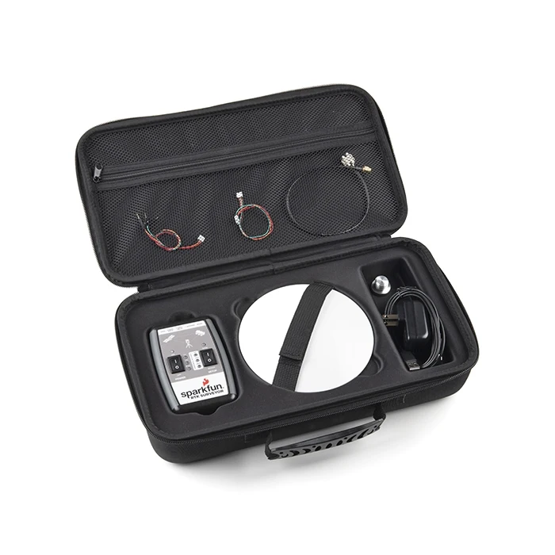
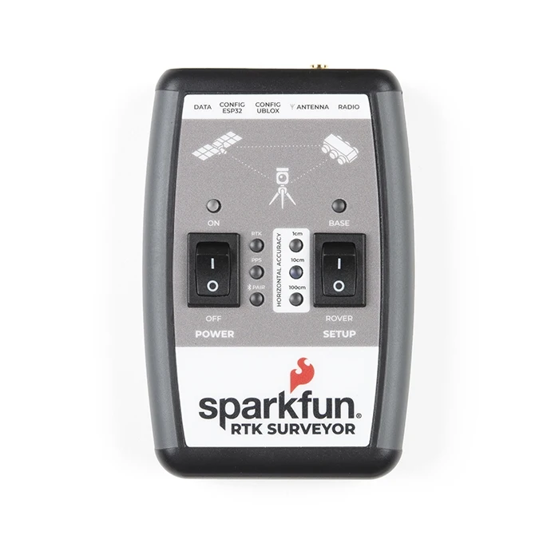
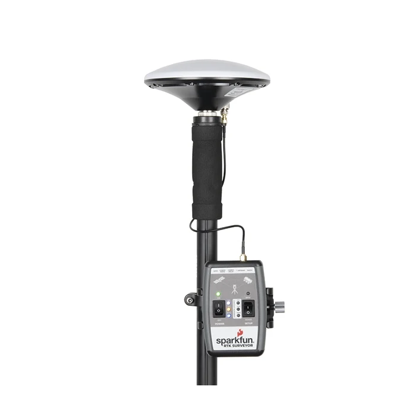
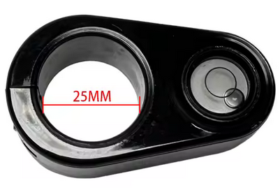

### Installation de l'application SW Maps pour iOS ou pour Android

L'application SW Maps permet d'enregistrer un parcours et prendre des photos et les localiser avec une précision de l'ordre du centimêtre.

Installez l'[application SW Maps](https://apps.apple.com/us/app/sw-maps/id6444248083) pour iOS

Installez l'[application SW Maps](https://play.google.com/store/apps/details?id=np.com.softwel.swmaps&hl=fr) pour Android

La precédure à suivre est [ici](https://docs.sparkfun.com/SparkFun_RTK_Firmware/gis_software_ios/#sw-maps).

Cependant, voici un résumé:

**1) Appariellez le Surveyor avec votre smartphone/tablette via le menu Bluetooth.**

**2) Ouvrez l'application SW Maps+**

**3) Selectionnez le menu GNSS Connection pour choisir le Surveyor à utiliser**

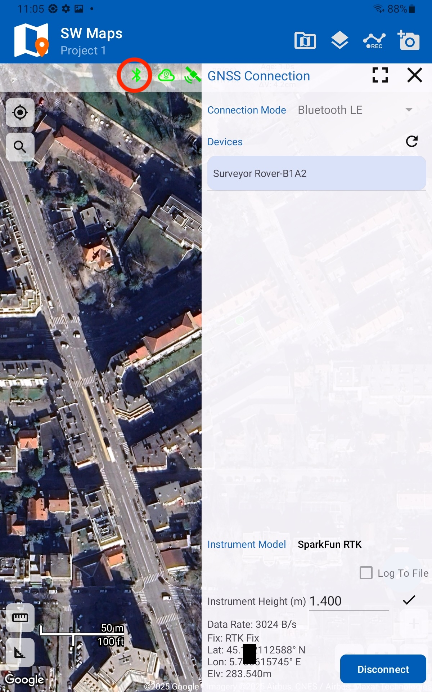

**4) Selectionnez le menu NTRIP Client pour configurer le caster NTRIP à utiliser**

Dans notre cas, c'est `caster.centipede.fr` sur le port `2101` et le point de montage (le plus proche) est `CHA2` (Chamrousse).

> Note: plusieurs casters et [points de montage](https://map.centipede-rtk.org/index.php/view/map/?repository=cent&project=centipede#5.357680,44.716345,6.035399,45.048156|basesrtk,notdeclared|d%C3%A9faut,d%C3%A9faut|1,1) peuvent être ajoutés comme `AVR2` ou `ALPE`.

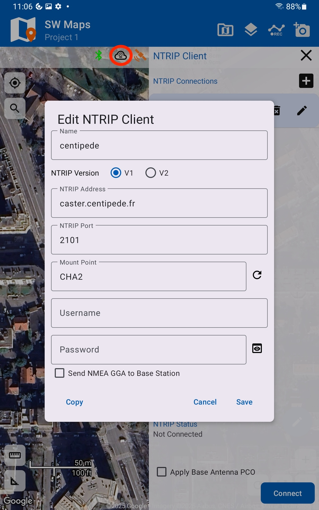

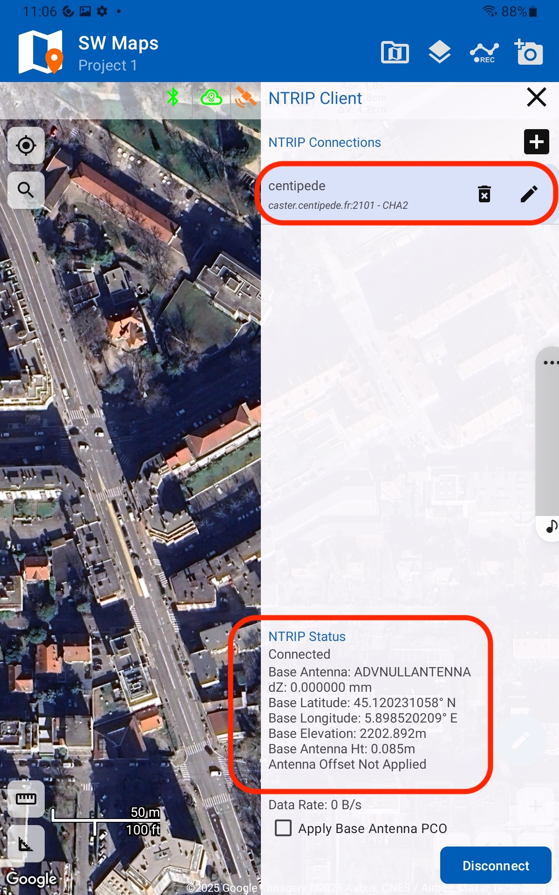

**5) Vérifiez la précision de la position GNSS dans le menu Skyplot**

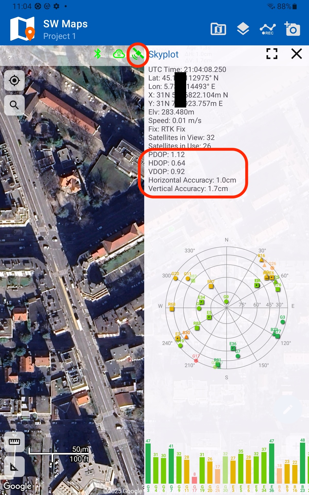

### Installation de l'application  Bluetooth GNSS pour Android

Installez l’application Bluetooth GNSS sur votre téléphone Android depuis le [Play Store](https://play.google.com/store/apps/details?id=com.clearevo.bluetooth_gnss&hl=fr)

> **N.B. :** Vous devez configurer votre téléphone Android en [mode développeur](https://developer.android.com/studio/debug/dev-options?hl=fr) :

1. Accédez à l’écran **Paramètres**.  
2. Sélectionnez **À propos du téléphone**.  
3. Appuyez **sept fois** sur le **Numéro de build** jusqu’à ce que le message *« Vous êtes maintenant un développeur ! »* s’affiche.

### Configuration de l'application

Configurez l'application

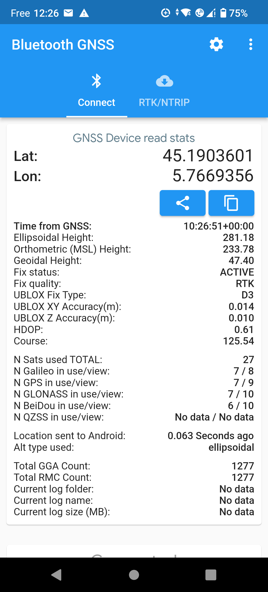
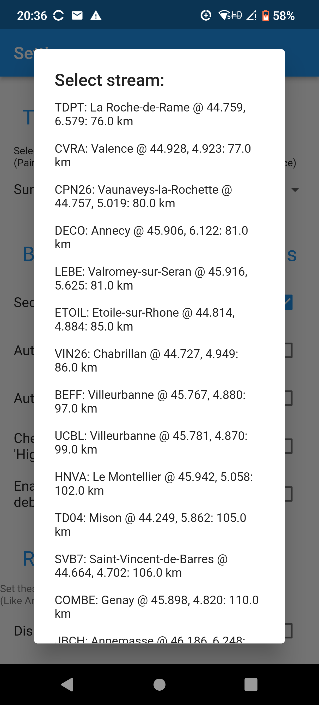
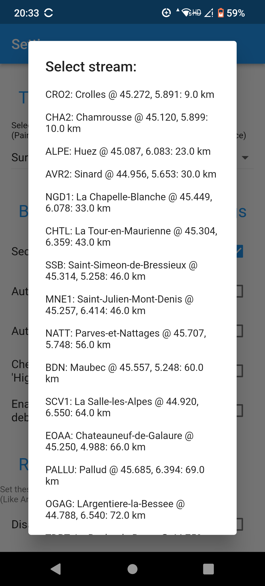

### Pratique

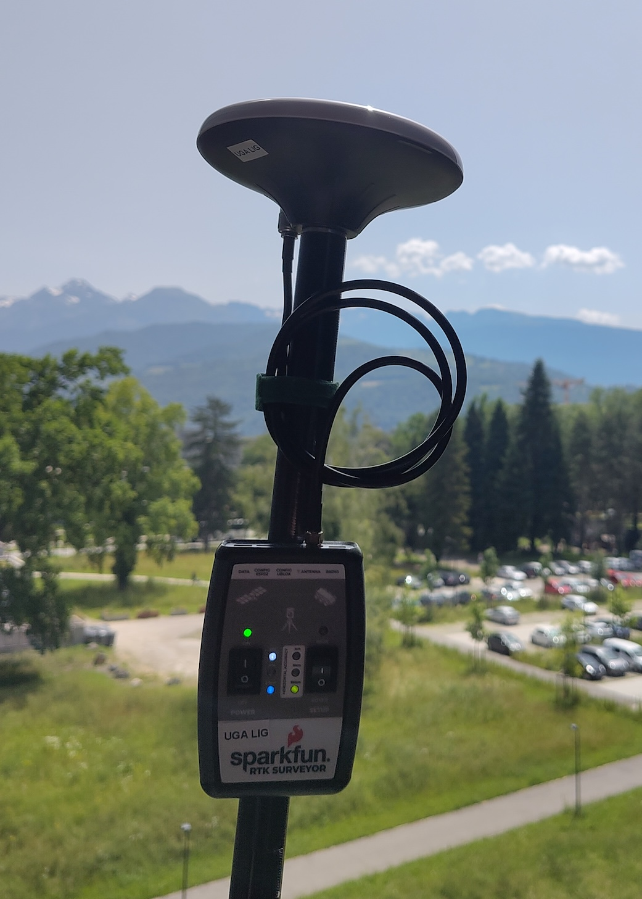

## Pour aller plus loin

### GNSS

* [ESP32 NTP Server](https://github.com/DennisSc/PPS-ntp-server/tree/master)

### RTK

* [Fabriquer et installer sa base de référence RTK et contribuer à Centipede](https://docs.centipede.fr/docs/base/)
* [Autres applications pour Smartphone Android](https://docs.sparkfun.com/SparkFun_RTK_Firmware/gis_software_android/)
* [Autres applications pour Smartphone iOS](https://docs.sparkfun.com/SparkFun_RTK_Firmware/gis_software_ios/)
* [Autres applications pour Windows](https://docs.sparkfun.com/SparkFun_RTK_Firmware/gis_software_windows/#qgis)

