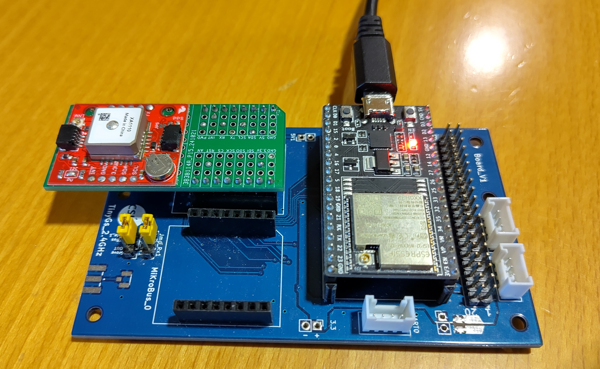

# Ecole [MPLS](https://alpes-dauphine.maisons-pour-la-science.org/) 2026 :: Atelier GNSS (La Mure)

Auteur: Didier DONSEZ, GINP-UGA.

> Ce support est sous licence [CC BY-NC-SA 4.0](https://creativecommons.org/licenses/by-nc-sa/4.0/). Les exemples de croquis fournis ne sont pas couverts par cette licence. Veuillez vous référer à la licence de chacun.

L'objectif de ce tutoriel est de comprendre les informations retournées par les modules GNSS et GNSS RTK.

[Transparents](MPLS-GNSS-2026-slides.pdf)

## Sommaire

* [Pré-installation](install.md)
* [Partie 1: GNSS](partie1-gnss.md)
* [Partie 2: GNSS RTK](partie2-rtk.md)
* [Partie 3: GNSS et Applications](partie3-applications.md)
* [Partie 4: Systèmes d'information géographique](partie4-sig.md)
* [Partie 5: Codage des coordonnées](partie5-codage.md)
* [Partie 6: Mise en oeuvre avec des ballons stratosphériques](partie6-hab.md)
* [Partie 7: GNSS et risques cyber](partie7-cyberrisk.md)
* [Partie 8: GNSS et SDR](partie8-gnss-sdr.md)
* [Bonus Track](bonus-track.md)
* [Glossaire](glossaire.md)

