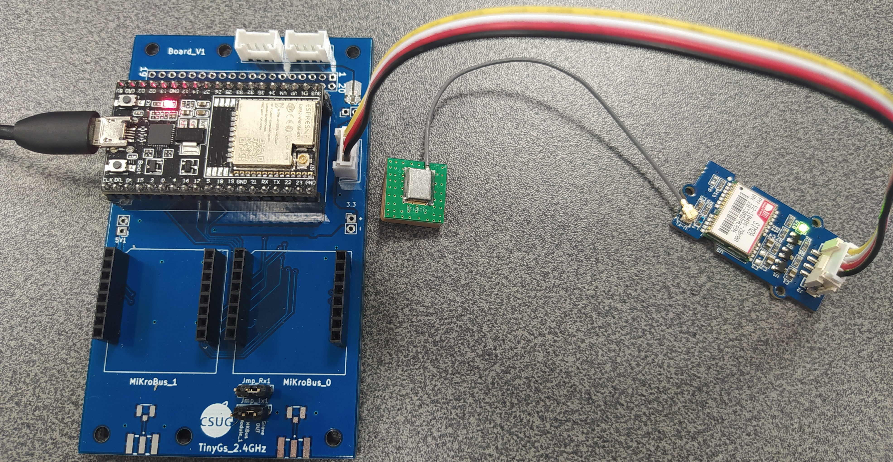

# Ecole [MPLS](https://alpes-dauphine.maisons-pour-la-science.org/) 2025 :: Atelier GNSS (La Mure)

Auteur: Didier DONSEZ, GINP-UGA.

> Ce support est sous licence [CC BY-NC-SA 4.0](https://creativecommons.org/licenses/by-nc-sa/4.0/). Les exemples de croquis fournis ne sont pas couverts par cette licence. Veuillez vous référer à la licence de chacun.

**[Sommaire](README.md) | [Glossaire](glossaire.md)**

## Partie 1: GNSS

### Matériel

* 1 parapluie
* 1 PC ou 1 Mac
* 1 module GNSS UART (Grove ou Mikrobus)
* 1 [platine support](https://github.com/thingsat/tinygs_2g4station) pour ESP32-Wroom-32U avec connecteur Grove et emplacements Mikrobus

| Fabricant | Module | Baudrate | Commentaires |
| --------- | ------ | -------- | ------------ |
|  [Adafruit Ultimate GPS Featherwing](https://learn.adafruit.com/adafruit-ultimate-gps-featherwing) | Mediatek MTK3333 |  9600 | |
|[SparkFun GPS Breakout - XA1110](https://learn.sparkfun.com/tutorials/sparkfun-gps-breakout---xa1110-qwiic-hookup-guide)| Mediatek MTK3333 | 9600 (réglable à 4800-115200) | [Mode ballon activable](https://github.com/sparkfun/SparkFun_I2C_GPS_Arduino_Library/blob/a0c84da4f4e7064b858fdd25729e7e3f2f1f21bc/examples/Example5-ConfigureGPS/Example5-ConfigureGPS.ino#L130), [MikroBus](https://gricad-gitlab.univ-grenoble-alpes.fr/Drakkar-LIG/waltor/-/tree/jeremie/kicad/jeremie/kicad/XA1110_MikroBus?ref_type=heads), Connecteur U-FL pour une antenne externe |
|  | [u-blox NEO-6M](https://www.u-blox.com/en/product/neo-6-series) | 4800, 9600(default), 19200, 38400, 57600, 115200, 230400 | disponible sur de nombreuses platines chinoises bon marché|
| [Mikroe GNSS RTK Click](https://www.mikroe.com/gnss-rtk-click) | [u-blox ZED-F9P](https://www.u-blox.com/en/product/zed-f9p-module) | 38400 (default), 460800 | RTK L1 et L2. La platine doit être alimentée en 5V |
| [Mikrobus click for Quectel LC29H GNSS RTK modules](https://github.com/i2hm/micro_climate_station/tree/main/kicad/lc29h_mikrobus) | [Quectel LC29H](https://www.quectel.com/product/gnss-lc29h/) | | RTK L1 et L5. La platine doit être alimentée en  3.3V |
| [SparkFun RTK Postcard](https://www.sparkfun.com/sparkfun-rtk-postcard.html)| [Quectel LG290P](https://www.quectel.com/product/gnss-lg290p/#summary)| | RTK. 4 bandes|
| [simpleRTK3B](https://fr.ardusimple.com/simplertk3b-receivers/)| Septentrio [Mosaic-X5](https://www.septentrio.com/en/products/gnss-receivers/gnss-receiver-modules/mosaic-x5) & [Mosaic-H](https://www.septentrio.com/en/products/gnss-receivers/gnss-receiver-modules/mosaic-h) | | RTK jusqu'à 7mm de précision. bandes L1, L2 et L5. Anti-brouillage et Anti-usurpation d'identité |
| [mPCIe u-blox ZED-X20P](https://fr.ardusimple.com/product/mpcie-u-blox-zed-x20p/) | [u-blox ZED-X20P](https://www.u-blox.com/en/product/zed-x20p-module) | | RTK. bandes : L1, L2, L5, L6 ...|

## Banchement

### Via le connecteur Grove UART

Configurez les 2 cavaliers du connecteur `JmpRx1` du coté `Grove OUT`

> Si votre platine GNSS ne dispose pas de connecteur Grove (comme dans le cas de l'Adafruit Ultimate GPS): branchez le fil blanc sur la broche `RX` et le fil jaune sur la branche `TX`

> Si votre platine GNSS dispose d'une broche PPS (en sortie), vous pouvez la brancher sur la broche `13` de l'ESP32



### Via l'emplacement Mikrobus #1

Configurez les 2 cavaliers du connecteur `JmpRx1` du coté `MKBus Module_1`


### Installation de l'IDE Arduino

Téléchargez et installez le [driver CP210x](https://www.silabs.com/developer-tools/usb-to-uart-bridge-vcp-drivers?tab=downloads) (présent sur la carte ESP32) pour votre système d'exploitation.

Installez l'[IDE Arduino](https://www.arduino.cc/en/software) (2.3.4 ou plus) sur votre PC (Windows ou Mac) ou Mac

Ajoutez la définition des cartes ESP32 `https://dl.espressif.com/dl/package_esp32_index.json` dans les préférences `Preferences > URL of Board manager`

Cherchez et installez `exp32` (by Espressif Systems) depuis `Tools > Board > Board manager`, 

Installez la bibliothéque `EspSoftwareSerial` depuis le gestionnaire de bibliothèques `Tools > Manage Libraries ...`.

Installez la bibliothéque `TinyGPSPlusPlus` depuis le gestionnaire de bibliothèques `Tools > Manage Libraries ...`.

Sélectionnez votre carte `ESP32 Dev Module` dans `Tools > Board > esp32`.

Sélectionnez le port auquel est connecté la carte dans `Tools > Port`.


#### Le format NMEA0183

Le format NMEA0183 est le format de données par défaut produites par tous les modules GNSS.
Il décrit des phrases (*sentences* en anglais) NMEA0183 contenant les informations relatives au calcul des coordonnées géographiques.

> Remarque : Le format NMEA0183 n'est pas le seul car il existe des formats propriétaires spécifiques aux fabricants de module.

Les phrases NMEA commencent par 1 caractère de préambule `$` et par un identifiant de locuteur (Talker Id) en 2 lettres

| Locuteur (Talker Id) | Systeme | 
| --------- |------- | 
| GP | Global Positioning System (GPS) 🇺🇸 |
| GA | Galileo Positioning System 🇪🇺 |
| GB | BDS ([BeiDou System](https://fr.wikipedia.org/wiki/Syst%C3%A8me_de_positionnement_par_satellites#Le_syst%C3%A8me_chinois_Beidou)) 🇨🇳 | 
| GI | [NavIC (IRNSS)](https://fr.wikipedia.org/wiki/Indian_Regional_Navigation_Satellite_System) 🇮🇳 |
| GL | GLONASS Receiver 🇷🇺 |
| GQ | [QZSS](https://fr.wikipedia.org/wiki/Quasi-Zenith_Satellite_System) 🇯🇵|
| GN | Global Navigation Satellite System (GNSS)  |

> Remarque : L’identifiant de locuteur `GN` est utilisé lorsque les données de la phrase proviennent d’une combinaison de plusieurs systèmes satellitaires. Les identifiants de locuteur propres à un système satellitaire ne sont utilisés que lorsque les données de la phrase proviennent d’un seul système de navigation par satellite. Les descriptions et remarques dans les définitions des phrases fournissent des indications sur l’utilisation des identifiants de locuteur des récepteurs de systèmes de navigation par satellite, lorsque cela est nécessaire.

Les phrases NMEA continuent avec 3 lettres pour désigner une option

| Option | Description |
| ------ |----------- |
|`GGA` |Donnéees de temps, position et type de positionnement (fix). |
|`GSA` |Mode de fonctionnement du récepteur GNSS, satellites actifs utilisés dans la solution de positionnement et valeurs DOP. |
|`GSV` |Nombre de satellites GPS visibles, identifiants des satellites, élévation, azimut et valeurs SNR.|
|`RMC` |Données de temps, date, position, cap et vitesse. Les informations de navigation minimales recommandées.|
|`VTG` |Informations de cap et de vitesse par rapport au sol.|


> Remarque: lors que le module démarre, il peut envoyer plusieurs phrases propriétaires qui informe sur son fabricant, son modèle, sa version de micro-logiciel, sur le modèle de l'antenne, son statut ...

> Dans le cas du module GNSS XA1110 que vous utiliserez, vous pourrez observer les phrases suivantes :

```
$PMTK011,MTKGPS*08
$PMTK010,001*2E
$PGACK,EPE,H=9999000.000000,V=100000000.000000*3D
$PMTK011,MTKGPS*08
$PMTK010,002*2D
$PGACK,EPE,H=9999000.000000,V=100000000.000000*3D
...
```

Les phrases NMEA0183 se terminent enfin par un [checksum de 2 caractères](https://forum.arduino.cc/t/nmea-checksums-explained/1046083) préfixés par le caractère `*` pour détecter des erreurs de transmission.

La bibliothèque TinyGPS que vous avez installée décodage les phrases NMEA0183 pour donner directement les coordonnées, la qualité du signal (DOP) et fournit des fonctions utilitaires (cap vers un point d'intérêt ([POI](https://fr.wikipedia.org/wiki/Point_d%27int%C3%A9r%C3%AAt_(topographie))) ...)

### Pratique

#### Visualisation des phrases NMEA0183

Dans ce croquis, vous pourrez observer les phrases NMEA0183 produites par le module.

Ouvrez le croquis `XXXX`

```c++
// Test code for Ultimate GPS Using Hardware Serial
// (e.g. GPS for Leonardo, Flora or FeatherWing)
//
// This code shows how to test a passthru between USB and hardware serial
//
// Tested and works great with the Adafruit GPS FeatherWing
// ------> https://www.adafruit.com/products/3133
// or Flora GPS
// ------> https://www.adafruit.com/products/1059
// but also works with the shield, breakout
// ------> https://www.adafruit.com/products/1272
// ------> https://www.adafruit.com/products/746
//
// Pick one up today at the Adafruit electronics shop
// and help support open source hardware & software! -ada


// what's the name of the hardware serial port?
#define GPSSerial Serial1


void setup() {
  // make this baud rate fast enough to we aren't waiting on it
  Serial.begin(115200);

  // wait for hardware serial to appear
  while (!Serial) delay(10);

  // 9600 baud is the default rate for the Ultimate GPS
  GPSSerial.begin(9600);
}


void loop() {
  if (Serial.available()) {
    char c = Serial.read();
    GPSSerial.write(c);
  }
  if (GPSSerial.available()) {
    char c = GPSSerial.read();
    Serial.write(c);
  }
}
```


Compilez et chargez le programme sur la carte.

Ouvrez la console série (baudrate 9600).

```
$GPRMC,045103.000,A,3014.1984,N,09749.2872,W,0.67,161.46,030913,,,A*7C
$GPGGA,045104.000,3014.1985,N,09749.2873,W,1,09,1.2,211.6,M,-22.5,M,,0000*62
$GPRMC,045200.000,A,3014.3820,N,09748.9514,W,36.88,65.02,030913,,,A*77
$GPGGA,045201.000,3014.3864,N,09748.9411,W,1,10,1.2,200.8,M,-22.5,M,,0000*6C
$GPRMC,045251.000,A,3014.4275,N,09749.0626,W,0.51,217.94,030913,,,A*7D
$GPGGA,045252.000,3014.4273,N,09749.0628,W,1,09,1.3,206.9,M,-22.5,M,,0000*6F
```

#### Décodage des trames NMEA0183 avec la bibliothèque TinyGPS d'Arduino

##### `DeviceExample`

Ouvrez l'exemple `DeviceExample` dans `Examples > TinyGPS++ > DeviceExample`

Modifiez la valeur `GPSBaud` dans la ligne `static const uint32_t GPSBaud = 4800;` en fonction du module GNSS que vous avez à vous disposition.

Compilez et chargez le croquis sur la carte.

Ouvrez la console série.

##### `SatElevTracker`

Ce code d’exemple suit l’élévation des satellites en utilisant des objets TinyGPSCustom. Les numéros et élévations des satellites ne sont normalement pas suivis par TinyGPSPlus, mais en utilisant TinyGPSCustom, nous contournons cette limitation.

Modifiez la valeur `GPSBaud` dans la ligne `static const uint32_t GPSBaud = 4800;` en fonction du module GNSS que vous avez à vous disposition.

Compilez et chargez le croquis sur la carte.

Ouvrez la console série.

##### `SatelliteTracker`

Modifiez la valeur `GPSBaud` dans la ligne `static const uint32_t GPSBaud = 4800;` en fonction du module GNSS que vous avez à vous disposition.

Compilez et chargez le croquis sur la carte.

Ouvrez la console série.

##### `FullExample`

Ce [croquis `FullExample`](https://github.com/CampusIoT/tutorial/blob/master/mpls-gnss/TinyGPSPlus_FullExample/TinyGPSPlus_FullExample.ino) affiche toutes les secondes :

* le nombre de satellites visibles/utilisés
* le [HDOP](glossaire.md)
* les coordonnées géographiques calculées par le module (latitude, longitude, altitude)
* le nombre de millisecondes (age) depuis le dernier fixe
* le distance (en km) vers un point d'intêret (POI) qui est par défaut l'emplacement du CSUG,
* le [cap](https://fr.wikipedia.org/wiki/Cap_(navigation)) (heading en *anglais*) vers ce point d'intêret (en dégré et en graduation en [rose des vents](https://fr.wikipedia.org/wiki/Rose_des_vents) (*Compass rose* en anglais))
* le nombre de caractéres récupérés via la liaison UART avec les modules
* le nombre de [phrases NMEA erronées](https://forum.arduino.cc/t/nmea-checksums-explained/1046083)

Ouvrez le [croquis `FullExample`](https://github.com/CampusIoT/tutorial/blob/master/mpls-gnss/TinyGPSPlus_FullExample/TinyGPSPlus_FullExample.ino)

Modifiez la valeur `GPSBaud` dans la ligne `static const uint32_t GPSBaud = 4800;` en fonction du module GNSS que vous avez à vous disposition.

Modifiez la valeur des broches `RXPin` et `TXPin` en fonction de votre micro-contrôleur.


Modifiez la ligne `static const double POI_LAT = 51.508131, POI_LON = -0.128002;` par la ligne `static const double POI_LAT = 44.910101, POI_LON = 5.782137;` qui est l'[emplacement du Murtel](https://www.openstreetmap.org/relation/109753#map=19/44.910101/5.782137).

Compilez et chargez le croquis sur la carte.

Ouvrez la console série.

Pour `DISPLAY_GNSS_LINES==1`

```
An extensive example of many interesting TinyGPS++ features
Testing TinyGPS++ library v. 1.0.2
by Mikal Hart

Sats HDOP  Latitude   Longitude   Fix  Date       Time     Date Alt    Course Speed Card  Distance Course Card  Chars Sentences Checksum
           (deg)      (deg)       Age                      Age  (m)    --- from GPS ----  ----  to POI    ----  RX    RX        Fail
----------------------------------------------------------------------------------------------------------------------------------------
0    0.0   ********** *********** **** 04/16/2025 13:32:26 260  ****** ****** ***** ***   ******** ****** ***   18849 0         0
4    2.7   44.911983  5.783640    465  04/16/2025 13:32:27 465  870.34 272.54 0.50  W     31       356.60 N     19176 2         0        
4    2.7   44.911888  5.783698    486  04/16/2025 13:32:28 486  870.34 272.54 0.81  W     31       356.59 N     19502 4         0        
4    2.7   44.911865  5.783693    489  04/16/2025 13:32:29 489  870.32 257.45 1.11  WSW   31       356.59 N     19829 6         0        
4    2.7   44.911842  5.783696    493  04/16/2025 13:32:30 493  870.33 254.49 1.24  WSW   31       356.59 N     20156 8         0        
2    100.0  44.911831  5.783672    671  04/16/2025 13:32:31 201  870.33 254.49 1.24  WSW   31       356.60 N     20766 9         0        
0    100.0  44.911831  5.783672    1672 04/16/2025 13:32:32 602  870.33 254.49 1.24  WSW   31       356.60 N     20994 9         0        
0    100.0  44.911831  5.783672    2673 04/16/2025 13:32:33 603  870.33 254.49 1.24  WSW   31       356.60 N     21222 9         0        
0    100.0  44.911831  5.783672    3674 04/16/2025 13:32:34 604  870.33 254.49 1.24  WSW   31       356.60 N     21450 9         0        
0    100.0  44.911831  5.783672    4675 04/16/2025 13:32:35 605  870.33 254.49 1.24  WSW   31       356.60 N     21678 9         0        
0    100.0  44.911831  5.783672    5676 04/16/2025 13:32:36 285  870.33 254.49 1.24  WSW   31       356.60 N     22213 9         0        
0    100.0  44.911831  5.783672    6677 04/16/2025 13:32:37 599  870.33 254.49 1.24  WSW   31       356.60 N     22441 9         0        
   
```

> Commentaire: la premiere ligne indique que le module a acquis un signal de temps d'au moins 1 satellite

> Commentaire: les 4 lignes suivantes indiquent que le module a acquis un signal de temps de 4 satellites et à pu calculer ses coordonnées

> Commentaire: les lignes suivantes indiquent que le module a perdu les signaux de temps des satellites : les dernières coordonnées calculées sont affichées avec leur age (en millisecondes) soit ~1000 millisecondes de plus à chaque ligne.


Pour `DISPLAY_NMEA0183_SENTENCES==1`

```
$PGACK,EPE,H=137.096375,V=4.918639*3F
$GNGGA,133236.550,,,,,0,0,,,M,,M,,*50
$GPGSA,A,1,,,,,,,,,,,,,,,*1E
$GLGSA,A,1,,,,,,,,,,,,,,,*02
$GPGSV,3,1,11,27,82,088,18,10,65,102,18,08,54,305,,16,37,186,*76
$GPGSV,3,2,11,02,36,264,14,23,33,049,12,26,13,177,,01,08,250,*7C
$GPGSV,3,3,11,32,08,131,,07,06,289,,30,03,320,*40
$GLGSV,2,1,08,84,56,034,,85,46,299,,75,43,276,,69,36,100,*66
$GLGSV,2,2,08,68,27,041,,76,14,336,,70,06,160,,83,03,077,*6F
$GNRMC,133236.550,V,,,,,0.03,256.61,160425,,,N*54
$GNVTG,256.61,T,,M,0.03,N,0.06,K,N*2F
```


> Remarque: si vous lisez le message suivant, vous devez modifier les branchements ou la position des cavaliers

```
No GPS data received: check wiring
**** ***** ********** *********** **** ********** ******** **** ****** ****** ***** ***   ******** ****** ***   0     0         0        
```

> Exercice : calculez le [gisement](https://fr.wikipedia.org/wiki/Gisement_(navigation)) (bearing en anglais) et ajoutez le à l'affichage.

#### Programmation par bloc

En construction

https://fr.vittascience.com/esp32


#### Récupération sur signal PPS du module GNSS

Le module GNSS génère un signal à 1 Hz (PPS pour Pulse per Second) dont le front montant (`RISING`) lors du passage à la nouvelle seconde du temps (GPS).

Ce signal peut être utilisé par le programme du microcontroleur pour synchroniser finement son horloge temps-réel (RTC).

Ouvrez le [croquis `GNSS_PPS_ISR`](https://github.com/CampusIoT/tutorial/blob/master/mpls-gnss/GNSS_PPS_ISR/GNSS_PPS_ISR.ino).

```c
/*
 * This example for ESP32 illustrates the PPS of a GNSS module
 */

#define PPS_PIN     13 // INT_1 INT pin on Mikrobus #1 on TinyGS 2G4 Board
//#define PPS_LED   12

void setup () {
  Serial.begin(115200);
  
  // Attach an interrupt to interrupt #1, calls program "pps_interrupt", happens on rising (low to high)
  pinMode(PPS_PIN, INPUT_PULLDOWN);
  digitalWrite(PPS_PIN, LOW);
  attachInterrupt(digitalPinToInterrupt(PPS_PIN), pps_interrupt, RISING);

#ifdef PPS_LED
  pinMode(PPS_LED, OUTPUT);
  // Check to make sure LED is working
  digitalWrite(PPS_LED, HIGH);
  delay(1000);
  digitalWrite(PPS_LED, LOW);
#endif

  Serial.println(__DATE__);
  Serial.println(__TIME__);
  
}

void loop () {  
  delay(10000);
}

static int cpt = 0;

void pps_interrupt(){
  if(++cpt % 60 == 0) {
    Serial.println();
  }
  Serial.print((char)('0'+(cpt%10)));

#ifdef PPS_LED
  digitalWrite(PPS_LED, HIGH);
  delay(100);
  digitalWrite(PPS_LED, LOW);
#endif
}
```
Compilez et chargez le croquis sur la carte.

Ouvrez la console série.

#### Utilisation de l'interface I2C du module GNSS Sparkfun XA1110

Installez la bibliothéque [`SparkFun I2C GPS Reading and Control`](https://github.com/sparkfun/SparkFun_I2C_GPS_Arduino_Library/) via le gestionnaire de bibliothèques. 

Ouvrez les croquis suivants dans le menu `File > Examples > `SparkFun I2C GPS Reading and Control`.

* `Example1-BasicReadings`
* `Example2-TinyGPS`
* `Example3-MoreGPSInfo`
* `Example4-LibraryOptions`
* `Example5-ConfigureGPS`

##### `Example5-ConfigureGPS`

Ouvrez le croquis `Example5-ConfigureGPS` dans le menu `File > Examples > `SparkFun I2C GPS Reading and Control`.

Compilez et chargez le croquis sur la carte.

Ouvrez la console série.

```
1) Set update rate to 10Hz
2) Set update rate to 1Hz
3) Enable PPS LED
4) Turn off all sentences but RMC&GGA
5) Enable high altitude balloon mode
6) Set serial baud rate to 57600bps
7) Enable DGPS/SBAS
8) Enable/Disable Debugging
9) Reset module
a) Query version information
s) Set baud rate:
--  0 : 4800
--  1 : 9600
--  2 : 14400
--  3 : 19200
--  4 : 38400
--  5 : 57600
--  6 : 115200
```

`a` affiche les informations sur le module GNSS I2C
```
Querying GPS version: .done!
Firmware version: AXN_5.1.1_3333
Build ID: 8530
Model: XA1110
```

`3` active le clignotement de la LED du PPS
```
Packet 285: Command successful
```

`5` active le mode ballon
```
Packet 886: Command successful
```

#### Utilisation de l'interface I2C du module GNSS RTK ZED-F9P de u-Blox

Installez la bibliothéque [`SparkFun u-Blox GNSS Arduino Library`](https://github.com/sparkfun/SparkFun_u-blox_GNSS_Arduino_Library) via le gestionnaire de bibliothèques. 

##### Example1_GetPositionAccuracy

Ouvrez le croquis `Example1_GetPositionAccuracy` dans le menu `File > Examples > `SparkFun u-Blox GNSS Arduino Library > ZED-F9P`.

Compilez et chargez le croquis sur la carte.

Ouvrez le console série.
```
Lat: 451921702 Long: 57355977 (degrees * 10^-7) Alt: 284288 (mm) 3D Positional Accuracy: 3096 (mm)
Lat: 451921702 Long: 57355977 (degrees * 10^-7) Alt: 284288 (mm) 3D Positional Accuracy: 3096 (mm)
Lat: 451921702 Long: 57355977 (degrees * 10^-7) Alt: 284288 (mm) 3D Positional Accuracy: 3096 (mm)
Lat: 451921702 Long: 57355977 (degrees * 10^-7) Alt: 284288 (mm) 3D Positional Accuracy: 3096 (mm)
Lat: 451921702 Long: 57355977 (degrees * 10^-7) Alt: 284288 (mm) 3D Positional Accuracy: 3096 (mm)
...
Lat: 451921762 Long: 57356013 (degrees * 10^-7) Alt: 281091 (mm) 3D Positional Accuracy: 2524 (mm)
Lat: 451921768 Long: 57356009 (degrees * 10^-7) Alt: 281072 (mm) 3D Positional Accuracy: 2411 (mm)
Lat: 451921770 Long: 57356005 (degrees * 10^-7) Alt: 281082 (mm) 3D Positional Accuracy: 2300 (mm)
...
Lat: 451921752 Long: 57355994 (degrees * 10^-7) Alt: 281621 (mm) 3D Positional Accuracy: 1641 (mm)
Lat: 451921745 Long: 57355996 (degrees * 10^-7) Alt: 281697 (mm) 3D Positional Accuracy: 1598 (mm)
Lat: 451921741 Long: 57355998 (degrees * 10^-7) Alt: 281744 (mm) 3D Positional Accuracy: 1562 (mm)
Lat: 451921736 Long: 57356000 (degrees * 10^-7) Alt: 281782 (mm) 3D Positional Accuracy: 1532 (mm)
...
Lat: 451921767 Long: 57355959 (degrees * 10^-7) Alt: 281073 (mm) 3D Positional Accuracy: 1285 (mm)
Lat: 451921767 Long: 57355959 (degrees * 10^-7) Alt: 281069 (mm) 3D Positional Accuracy: 1284 (mm)
Lat: 451921766 Long: 57355960 (degrees * 10^-7) Alt: 281068 (mm) 3D Positional Accuracy: 1284 (mm)
Lat: 451921765 Long: 57355961 (degrees * 10^-7) Alt: 281062 (mm) 3D Positional Accuracy: 1283 (mm)
Lat: 451921762 Long: 57355962 (degrees * 10^-7) Alt: 281067 (mm) 3D Positional Accuracy: 1282 (mm)
...
```

##### Example10_GetHighPrecisionPositionAndAccuracy

Ouvrez le croquis `Example10_GetHighPrecisionPositionAndAccuracy` dans le menu `File > Examples > `SparkFun u-Blox GNSS Arduino Library > ZED-F9P`.

Compilez et chargez le croquis sur la carte.

Ouvrez le console série.
```
Lat (deg): 45.192160927, Lon (deg): 5.735626530
Ellipsoid (m): 281.5781, Mean Sea Level(m): 234.1774, Accuracy (m): 0.8260
Lat (deg): 45.192162438, Lon (deg): 5.735625510
Ellipsoid (m): 281.5037, Mean Sea Level(m): 234.1030, Accuracy (m): 0.7335
Lat (deg): 45.192163892, Lon (deg): 5.735624634
Ellipsoid (m): 281.3831, Mean Sea Level(m): 233.9824, Accuracy (m): 0.6673
...
Lat (deg): 45.192168262, Lon (deg): 5.735619136
Ellipsoid (m): 281.1934, Mean Sea Level(m): 233.7927, Accuracy (m): 0.4572
Lat (deg): 45.192167647, Lon (deg): 5.735618387
Ellipsoid (m): 281.3362, Mean Sea Level(m): 233.9354, Accuracy (m): 0.4348
Lat (deg): 45.192167198, Lon (deg): 5.735617660
Ellipsoid (m): 281.4437, Mean Sea Level(m): 234.0430, Accuracy (m): 0.4150
...
Lat (deg): 45.192165677, Lon (deg): 5.735605826
Ellipsoid (m): 281.7930, Mean Sea Level(m): 234.3922, Accuracy (m): 0.2626
Lat (deg): 45.192165707, Lon (deg): 5.735605575
Ellipsoid (m): 281.7908, Mean Sea Level(m): 234.3900, Accuracy (m): 0.2620
Lat (deg): 45.192165695, Lon (deg): 5.735605358
Ellipsoid (m): 281.8010, Mean Sea Level(m): 234.4003, Accuracy (m): 0.2615
```

## GNSS avancé : GNSS raw data

Les données dites brutes GNSS (GNSS raw data) sont générées par le moteur de suivi et comprennent des mesures pour chaque satellite suivi. Il s’agit d’une copie des mesures utilisées en interne par la tâche principale de navigation du récepteur.

Les utilisations possibles sont:
*	L'enregistrement des données pour les calculs cinématiques post-traités (RTK) (avec des logiciels comme [RTKLib](https://www.rtklib.com/))
*	Une sortie secondaire pour la fusion avec des capteurs externes supplémentaires
*	Une sortie primaire pour la calcul de la position dans le cloud (***offloading***)
*	Une sortie secondaire pour la génération ou la mise à jour de cartes dans le cloud

La plupart des modules haut de gamme des fabricants (u-blox, quectel ...) peuvent fournir ces informations:

Par exemple, pour les modules u-blox (M8+, F9+, X20):

| |  Basic raw data	| Full raw data |
| -- |-- |-- |
| GNSS raw data output	| Code phase	| Carrier phase |
| Supported UBX messages	| UBX-RXM-SFRBX, RXM-MEASX	| UBX-RXM-SFRBX, RXM-MEASX, RXM-RAWX
| RAW data elements	| Satellite Information, Code Phase [ms], Doppler [m/s, Hz]	Satellite Information| Code Phase [ms], Doppler [m/s, Hz], Pseudoranges [m], Carrier phase [cycles] |

L'[API developpeur GNSS brutes](https://developer.android.com/develop/sensors-and-location/sensors/gnss?hl=fr) d'Android donne accès à ces informations dans les équipements Android.

## GNSS vraiment avancé : 

Les constellations GNSS transmettent leurs signaux sur 3 bandes de fréquence. 

|Constellation | Bandes et fréquences |
|-- |-- |
| Global Positioning System (GPS) 🇺🇸 | L1 (1575,42 MHz), L2 (1227,60 MHz) et L5 (1176,45 MHz) |
| Galileo Positioning System 🇪🇺 | E1 (1575,42 MHz), E5 (1176,45 MHz) et E6 (1278,75 MHz) |
| BDS ([BeiDou System](https://fr.wikipedia.org/wiki/Syst%C3%A8me_de_positionnement_par_satellites#Le_syst%C3%A8me_chinois_Beidou)) 🇨🇳 | B1 (1561,098 MHz), B2 (1207,14 MHz) et B3 (1268,52 MHz) |
| GLONASS 🇷🇺 | L1 (1598,06 MHz), L2 (1242,94 MHz), L3 (1202,025 MHz) |
| [QZSS](https://fr.wikipedia.org/wiki/Quasi-Zenith_Satellite_System) 🇯🇵 | L1 (1575,42 MHz), L2 (1227,60 MHz), L5 (1176,45 MHz) et L6 (1278,75 MHz) |
| [NavIC (IRNSS)](https://fr.wikipedia.org/wiki/Indian_Regional_Navigation_Satellite_System) 🇮🇳 | L5 (1176,45 MHz) et S (2492,03 MHz) |


> Les récepteurs et antennes GNSS d'entrée de gamme n'écoutent qu'une fraction des canaux ci-dessous. 

Il est possible de recevoir ces signaux au moyen d'un récepteur SDR (Software Defined Radio) et de les démoduler et les décoder au moyen d'applications comme [GNU Radio]([GNU Radio](https://wiki.gnuradio.org/index.php?title=Main_Page)).

Pour exploirer, vous pouvez vous référer aux cours, articles et [livres]() de [Jean-Michel Friedt](http://jmfriedt.free.fr/).

**Chapitre suivant: [Partie 2: GNSS RTK](partie2-rtk.md)**

