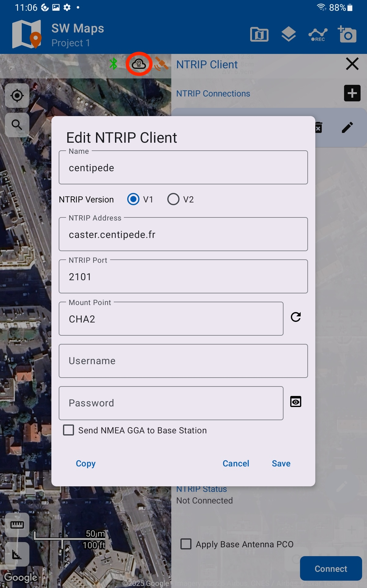
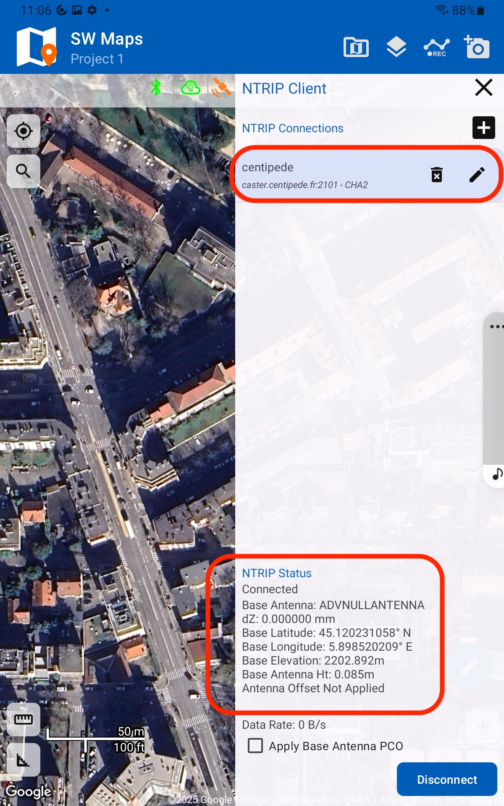
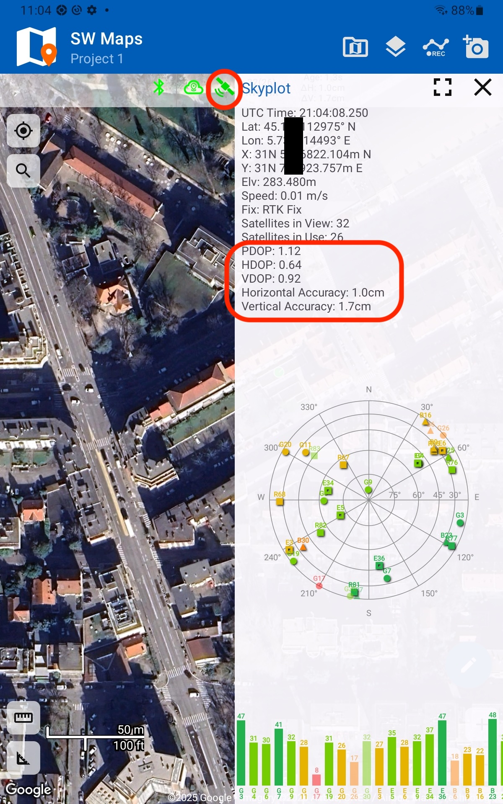
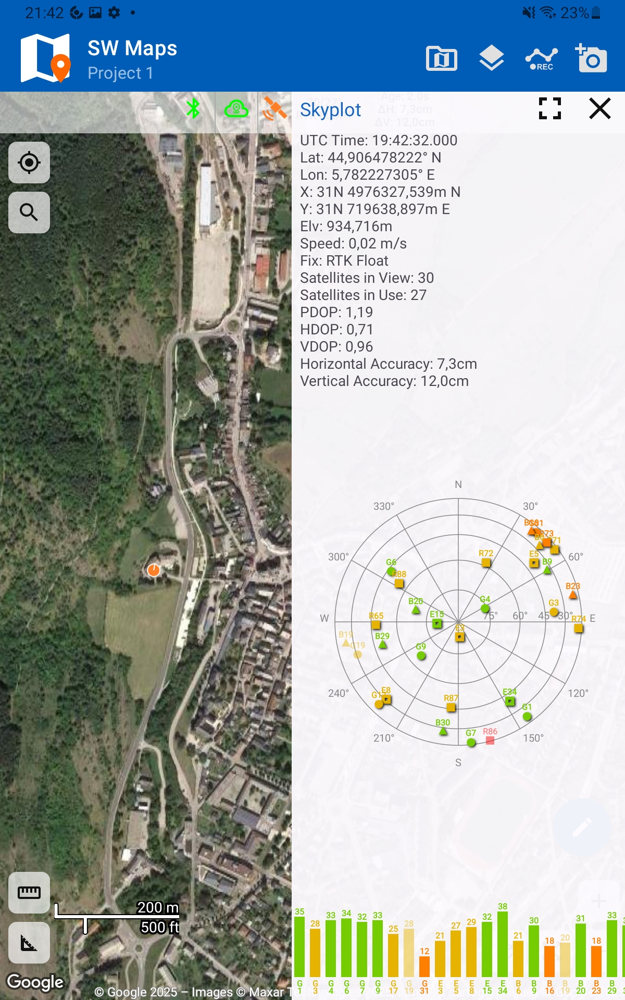
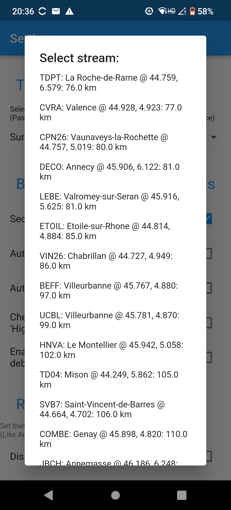
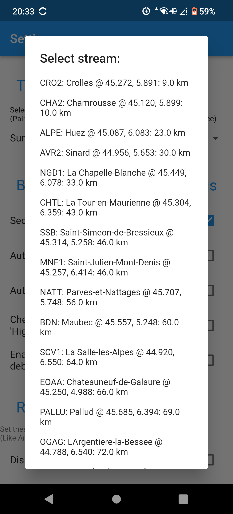

# Ecole [MPLS](https://alpes-dauphine.maisons-pour-la-science.org/) 2025 :: Atelier GNSS (La Mure)

Auteur: Didier DONSEZ, GINP-UGA.

> Ce support est sous licence [CC BY-NC-SA 4.0](https://creativecommons.org/licenses/by-nc-sa/4.0/). Les exemples de croquis fournis ne sont pas couverts par cette licence. Veuillez vous référer à la licence de chacun.

**[Sommaire](README.md) | [Glossaire](glossaire.md)**

## Partie 2: GNSS RTK

Dans cette partie, vous manipulerez un [rover GNSS RTK de Sparfun](https://learn.sparkfun.com/tutorials/sparkfun-rtk-surveyor-hookup-guide/all) en extérieur pour obtenir un positionnement centimétrique comme un arpenteur professionnel.

### Précision de la position GNSS

Le récepteur GNSS calcule la position (latitude, longitude, altitude) à partir des dates d'arrivée des différents satellites visibles et des paramêtres orbitaux de ces derniers.

Le précision du calcul de la postion dépend du type de récepteur (professionel à grand public), du nombre de satellites visibles 🛰️, du nombre de constellations utilisées, de la géométrie des satellites et de la qualité des signaux

La dilution de la précision (DOP) mesure la qualité de la géométrie des satellites 📐.	Une bonne répartition dans le ciel donne un faible DOP, donc une meilleure précision.

La qualité des signaux 📡 est impactée par les obstacles (arbres, montagnes, immeubles) qui masquent les satellites, par les réflexions des signaux sur des bâtiments ou des parois rocheuses (multi-trajet) et les conditions en haute atmosphère (ionosphère et troposphère)

Le GNSS RTK mesure les conditions atmosphérique afin de calculer la correction à apporter sur le calcul de la postion.

La ionosphère (située 50 à 1000 km d’altitude) qui contient des particules ionisées par le Soleil retarde les signaux GNSS. L'erreur est dite dispersive car elle dépend de la fréquence des signaux.	Le récepteur peut comparer plusieurs fréquences (ex : L1, L2, L5 ...) pour estimer l’erreur ionosphérique.

La troposhère (située entre 0 à 15 km d’altitude) dans laquelle se trouve de la vapeur d'eau, ralentit les signaux de manière non dispersive (uniforme quelques soit la fréquence).

### Matériel nécessaire

* 1 parapluie
* 1 téléphone Android (pas trop vieux) avec une connectivité Internet.
* 1 [Sparkfun Surveyor RTK](https://learn.sparkfun.com/tutorials/sparkfun-rtk-surveyor-hookup-guide/all)
* 1 perche telescopique (dont la longueur est connue)
* 1 niveau à bulle

### Explication

#### Rover et Base

Le [rover GNSS RTK de Sparfun](https://learn.sparkfun.com/tutorials/sparkfun-rtk-surveyor-hookup-guide/all) peut assurer 2 roles :
* celui de station de référence RTK quand il est positionné à un endroit fixe dont la position est précisément connue,
* celui de rover RTK qui se dépasse et marque des positions corrigés à partir des données (RTCM) envoyées par une base de réference RTK (qui peut être un autre rover fixe) 

Le [rover GNSS RTK de Sparfun](https://learn.sparkfun.com/tutorials/sparkfun-rtk-surveyor-hookup-guide/all) est bati autour d'un microcontroleur ESP32 et d'un module GNSS RTK [u-blox ZED-F9P](https://www.u-blox.com/en/product/zed-f9p-module).

> Remarque : Les [schémas électroniques](https://github.com/sparkfun/SparkFun_RTK_Surveyor) et le [micro-logiciel](https://github.com/sparkfun/SparkFun_RTK_Firmware) du Sparkfun RTK Surveyor sont en source ouverte et libre (open source)

### Mises en oeuvre

#### Direct (ie sans caster NTRIP)

La station de référence RTK diffuse via une communication radio (sans fil) les correctifs (RTCM) aux rovers à proximité de la base (ie à portée de la communication radio).

[source: Sparkfun](https://www.sparkfun.com/rtk#boards)

#### Avec caster NTRIP

Quand les rovers ne sont pas à portée d'une station, il est possible d'opérer un service de diffusion (appelé caster NTRIP) des correctifs fournis par les stations. Le rover utilise un smartphone/tablette (connecté à Internet) ou un modem 4G interbe pour récupérer les correctifs d'une station depuis le caster NTRIP.

L'accès au caster peut être payant afin de rémunérer l'opérateur qui installe et assure en condition opérationnelle un parc des stations RTK. Le parc des stations RTK peut être aussi géré de manière collaborative et contributive (comme dans le cas de Centipede).

[source: Sparkfun](https://www.sparkfun.com/rtk#boards)

#### Centipède et Caster

[CentipedeRTK](https://docs.centipede.fr/) est un réseau collaboratif de bases de référence GNSS ouvertes ([carte](https://map.centipede-rtk.org/index.php/view/map/?repository=cent&project=centipede#3.992131,44.673872,6.703008,45.990611|basesrtk,notdeclared,nearest_30km,nearest_50km|d%C3%A9faut,d%C3%A9faut,d%C3%A9faut,d%C3%A9faut|1,1,1,1)) et disponibles pour toute personne se trouvant dans la zone de couverture. Le réseau est étendu par des instituts publics, des particuliers, des acteurs privés comme les agriculteurs ou d’autres partenaires publics.

Exercice: repérez une base RTK [proche de votre domicile](https://map.centipede-rtk.org/index.php/view/map?repository=cent&project=centipede#-0.129991,42.888354,10.059828,46.578038|basesrtk,notdeclared|d%C3%A9faut,d%C3%A9faut|1,1).

Exercice: repérez une base RTK [proche de La Mure](https://map.centipede-rtk.org/index.php/view/map?repository=cent&project=centipede#-0.129991,42.888354,10.059828,46.578038|basesrtk,notdeclared|d%C3%A9faut,d%C3%A9faut|1,1).

### Montage du [Sparkfun Surveyor RTK](https://learn.sparkfun.com/tutorials/sparkfun-rtk-surveyor-hookup-guide/all)

Un fois monté, positionnez l'interrupteur SETUP sur Rover et mettez son tension le Surveyor (Position ON du bouton POWER).

### Installation de l'application SW Maps pour iOS ou pour Android

L'application SW Maps permet d'enregistrer un parcours et prendre des photos et les localiser avec une précision de l'ordre du centimêtre.

Installez l'[application SW Maps](https://apps.apple.com/us/app/sw-maps/id6444248083) pour iOS

Installez l'[application SW Maps](https://play.google.com/store/apps/details?id=np.com.softwel.swmaps&hl=fr) pour Android

La precédure à suivre est [ici](https://docs.sparkfun.com/SparkFun_RTK_Firmware/gis_software_ios/#sw-maps).

Cependant, voici un résumé:

**1) Appariellez le Surveyor avec votre smartphone/tablette via le menu Bluetooth.**

La LED bleue passe de 1Hz à fixe

Quand le fix GPS est obtenue, la LED orange s'allume

**2) Ouvrez l'application SW Maps+**

**3) Sélectionnez le menu GNSS Connection pour choisir le Surveyor à utiliser**

**4) Vérifiez la précision de la position GNSS sans correction RTK dans le menu Skyplot**

**5) Sélectionnez le menu NTRIP Client pour configurer le caster NTRIP à utiliser**

Dans notre cas, c'est `caster.centipede.fr` sur le port `2101` et le point de montage (le plus proche) est `CHA2` ([Chamrousse](http://gnssfr.unice.fr/#/metadata/marker=CHA2)).

> Note: plusieurs casters et [points de montage](https://map.centipede-rtk.org/index.php/view/map/?repository=cent&project=centipede#5.357680,44.716345,6.035399,45.048156|basesrtk,notdeclared|d%C3%A9faut,d%C3%A9faut|1,1) peuvent être ajoutés comme `AVR2`, `ALPE` ou bien `SMH` (à l'IGE, Saint Martin d'Hères (31 Kms)) ou `TMAC` (au Tarmac, Meylan).

**6) Vérifiez la précision de la position GNSS dans le menu Skyplot**

Quand les données RTCM recues du caster NTRIP sont recues et utilisées par le module GNSS RTK du Surveyor, la LED blanche s'allume (ainsi que la LED verte 10 cms.

**7) Vérifiez la précision de la position GNSS dans le menu Skyplot**

**8) Démarrez l'enregistrement de votre parcours**

#### A pied !

#### A vélo !

> Vous pouvez contribuer les traces des chemins parcourus à la base de données ouvertes [OpenStreetMap](https://www.openstreetmap.org/diary/fr).

**9) Ajoutez et sélectionnez un autre caster NTRIP via le menu NTRIP Client**

> S'il vous reste un peu de temps

[Mililpède](http://crtk.net:2101) est le nouveau caster de l'[association Centipède](https://www.linkedin.com/company/centipede-rtk/posts/?feedView=all).

Son adresse NTRIP est `crtk.net` et le port est `2101`. Vous pouvez choisir un autre point de montage proche est `AVR2` ([Avignonet](http://gnssfr.unice.fr/#/metadata/marker=AVR2).

**10) Inspectez quelques unes de stations de référence utilisées**

* `CHA2` ([Chamrousse](http://gnssfr.unice.fr/#/metadata/marker=CHA2))
* `AVR2` ([Avignonet](http://gnssfr.unice.fr/#/metadata/marker=AVR2))
* `ALPE` ([Alpe d'Huez](http://gnssfr.unice.fr/#/metadata/marker=ALPE))

  

### Extra : Installation de l'application  Bluetooth GNSS (open source) pour Android

Installez l’application Bluetooth GNSS sur votre téléphone Android depuis le [Play Store](https://play.google.com/store/apps/details?id=com.clearevo.bluetooth_gnss&hl=fr)

> **N.B. :** Vous devez configurer votre téléphone Android en [mode développeur](https://developer.android.com/studio/debug/dev-options?hl=fr) :

1. Accédez à l’écran **Paramètres**.  
2. Sélectionnez **À propos du téléphone**.  
3. Appuyez **sept fois** sur le **Numéro de build** jusqu’à ce que le message *« Vous êtes maintenant un développeur ! »* s’affiche.

### Configuration de l'application Bluetooth GNSS

Configurez l'application

**Chapitre suivant: [GNSS et Applications](partie3-applications.md)**
