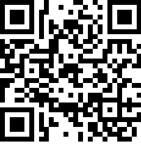
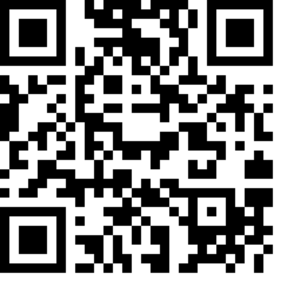
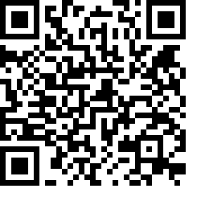

# Ecole [MPLS](https://alpes-dauphine.maisons-pour-la-science.org/) 2025 :: Atelier GNSS (La Mure)

Auteur: Didier DONSEZ, GINP-UGA.

> Ce support est sous licence [CC BY-NC-SA 4.0](https://creativecommons.org/licenses/by-nc-sa/4.0/). Les exemples de croquis fournis ne sont pas couverts par cette licence. Veuillez vous référer à la licence de chacun.

**[Sommaire](README.md) | [Glossaire](glossaire.md)**

## Partie 3 : GNSS et applications

En construction

### Applications

#### Navigation (terre, mer, air ...)

Planification et replanification d'un trajet (navire marchand, avion de ligne, camion ...), d'une tournée (livreur, ordures et déchets, DAB ...) ... en fonction d'information géographique statiques et plus ou dynamiques (état des routes, fermeture de cols, traffic, bouchons, ZFE, courants maritimes, courants atmosphériques ...).

#### [Géolocalisation](https://fr.wikipedia.org/wiki/G%C3%A9olocalisation)

La géolocalisation (geotracking en anglais) est un procédé permettant de positionner un objet (valise ...), un véhicule (volé, livreur ...), ou une personne (enfant, malade d'Alzheimer, [détenu à docimile](https://fr.wikipedia.org/wiki/D%C3%A9tention_%C3%A0_domicile), sportif, skieur/randonneur, travailleur isolé, animal de compagnie, chien de chasse ...) sur un plan ou une carte à l'aide de ses coordonnées géographiques. Certains systèmes permettent également de connaître l'altitude (avion, drone, ballons stratosphériques, bouet, satellite LEO ...)

#### [Geofencing](https://fr.wikipedia.org/wiki/G%C3%A9orep%C3%A9rage)

Le géorepérage ou gardiennage virtuel (en anglais, geofence ou geofencing) est une fonction d'un logiciel de géolocalisation qui permet de surveiller à distance la position et le déplacement d'un objet et de prendre des mesures si la position ou le déplacement s'écarte de certaines valeurs fixées d'avance.

### Systèmes d'information géographique (SIG ou GIS)

Un [Système d'information géographique](https://fr.wikipedia.org/wiki/Syst%C3%A8me_d%27information_g%C3%A9ographique) est un système d'information conçu pour recueillir, stocker, traiter, analyser, gérer et présenter tous les types de données spatiales et géographiques. Les applications sont par exemple, les cadastres, les réseaux d'eau, de gaz, d'électricité, les systèmes de gestion des batiments (BMS) ...

OpenStreetMap (aka OSM) est une base de données géographique contributive et gratuite (open data). À la suite du temblement de terre en Haiti, le projet Humanitarian OpenStreetMap Team se forme pour répondre aux besoins des humanitaires et aider à la cartographie des pays en voie de développement. La base a aussi été la cible de vandales (notamment avec la guerre en Urkaine) pour passer des messages de haine et de propagande.

> Exercice: recherchez le Mutel dans [www.openstreetmap.org](https://www.openstreetmap.org/relation/109753). [Correction](https://www.openstreetmap.org/search?lat=44.906582&lon=5.782365&zoom=19#map=19/44.906583/5.782365).

[QGIS](https://fr.wikipedia.org/wiki/QGIS) est un logiciel SIG (système d'information géographique) libre. Vous pouvez l'installer pour l'essayer.

[Leaflet](https://leafletjs.com/index.html) est une bibliothèque Javascript libre pour construire des applications web incluant des cartes interactives. Il existe des [dérivés](https://github.com/mapbox/leaflet-omnivore).

### Formats de fichiers d'échange

De [nombreux formats de fichier](https://fr.wikipedia.org/wiki/Formats_de_fichier_SIG) sont manipulés par les SIG. Ils permettent l'echange de données de type raster, vectorielle ou modèles numériques de terrain.

Voici quelques modèles (vectoriels) utilisés dans des applications grand public

#### [GPX](https://fr.wikipedia.org/wiki/GPX_(format_de_fichier))

GPX est un format de fichier permettant l'échange de coordonnées géographiques provenant d'un récepteur GNSS. Il est utilisé par les applications et les réseaux sociaux sportifs. 

[Un exemple de fichier GPX de la randonnée Tour du Mont Aiguille](tour_du_mont_aiguille.gpx) (récupéré depuis https://www.alpes-isere.com)


#### [KML](https://fr.wikipedia.org/wiki/Keyhole_Markup_Language)

Le format KML est un format de fichier décrivant des caractéristiques géoréférencés (lieu des marques, des images, des polygones, des modèles 3D, des descriptions textuelles, etc.). Les fichiers KML peuvent être visualisés dans des applications comme Géoportail, Google Street View ...

[Un exemple de fichier KML d'une randonnée facile depuis La Mure](meharieauparadis.kml) (récupéré depuis https://www.alpes-isere.com)

#### [EXIF](https://fr.wikipedia.org/wiki/Exchangeable_image_file_format)

Le format Exchangeable image file format (EXIF) est une spécification de format de fichier pour les images. Il permet de décrire entre autre les coordonnées géographiques au sein du fichier image.

[ExifTool](https://exiftool.org/) est un outil en ligne de commande permettant la manipulation des données EXIF dans les fichiers image.

> Exercice: Consultez les informations EXIF présentes dans les photos prises lors de la randonnée RTK (avec SW Maps) en utilisant soit l'inspecteur d'images de votre PC/Mac, soit l'application https://exif.tools/ basée sur Exiftool.

#### GeoJSON

[GeoJSON](https://fr.wikipedia.org/wiki/GeoJSON) est un format ouvert d'encodage d'ensemble de données géospatiales simples utilisant la norme JSON. Il permet d'annoter des points d'intéret (Point of Interest (POI)) et des zones d'intéret (Zone of Interest (ZOI))

> Exercice: recherchez la Gare du Temps avec l'application [geojson.io](https://geojson.io/#map=11.91/44.9121/5.7837) et utilisez les outils pour entourer le batiment.

> Exercice: recherchez le Mutel avec l'application [geojson.io](https://geojson.io/#map=11.91/44.908/5.77479) et utilisez les outils pour ajouter le batiment et la piscine.

```geojson
{
  "type": "FeatureCollection",
  "features": [
    {
      "type": "Feature",
      "properties": {
        "place": "Le Mutel",
        "event": "Ecole TF de la MPLS"
      },
      "geometry": {
        "coordinates": [
          [
            5.782021553985373,
            44.90646168389782
          ],
          [
            5.782187850944638,
            44.906412291625685
          ],
          [
            5.782316596977267,
            44.906571866506255
          ],
          [
            5.782434614174292,
            44.9065566689178
          ],
          [
            5.782659919731373,
            44.9065642677123
          ],
          [
            5.782643826477312,
            44.90670864462274
          ],
          [
            5.782311232560062,
            44.90669344707047
          ],
          [
            5.782139571182398,
            44.90660986045998
          ],
          [
            5.782037647239434,
            44.9064654833019
          ]
        ],
        "type": "LineString"
      },
      "id": 0
    },
    {
      "type": "Feature",
      "properties": {
        "stroke": "#00fcff",
        "stroke-width": 5,
        "stroke-opacity": 1,
        "fill": "#0432ff",
        "fill-opacity": 0.5,
        "place": "swimming pool"
      },
      "geometry": {
        "coordinates": [
          [
            [
              5.782452074446184,
              44.90653175586314
            ],
            [
              5.782452074446184,
              44.90649368427967
            ],
            [
              5.782581083359247,
              44.90649368427967
            ],
            [
              5.782581083359247,
              44.90653175586314
            ],
            [
              5.782452074446184,
              44.90653175586314
            ]
          ]
        ],
        "type": "Polygon"
      },
      "id": 1
    },
    {
      "type": "Feature",
      "properties": {
        "place": "La Gare du Temps",
        "event": "Ecole TF de la MPLS",
        "stroke": "#ff2600",
        "stroke-width": 2,
        "stroke-opacity": 1,
        "fill": "#ff2600",
        "fill-opacity": 0.5
      },
      "geometry": {
        "coordinates": [
          [
            [
              5.783628710937734,
              44.912220837449524
            ],
            [
              5.783672677971879,
              44.912021985018555
            ],
            [
              5.783778598554335,
              44.91203684590036
            ],
            [
              5.783737629272622,
              44.912230037011426
            ],
            [
              5.783628710937734,
              44.912220837449524
            ]
          ]
        ],
        "type": "Polygon"
      },
      "id": 2
    }
  ]
}
```

> Exercice : ajoutez des Feature supplémentaires ([imag.geojson](imag.geojson), [mutel.geojson](mutel.geojson)) à la collection courante du GeoJSON en cours d'édition.

> Exercice : exportez le GeoJSON au format KML 

Des utilitaires convertissent les différents formats entre eux. [Par exemple](https://github.com/mapbox/togeojson).

Les résultats de la conversion [meharieauparadis.geojson](meharieauparadis.geojson) et [tour_du_mont_aiguille.geojson](tour_du_mont_aiguille.geojson) peuvent être ouverts et visualisés avec [geojson.io](https://geojson.io)

#### Devoir à la maison: Edition du plan de masse de votre bâtiment

Prenez une photo des panneaux des plans d'évacuation de votre bâtiment (un par étage en général). Créez le(s) fichier(s) GeoJSON correspondant à partir de ces photos. Convertissez les en fichiers KML pour les visualiser. Importez les dans l'outil QGIS. 

### Codage des coordonnées

#### [GeoCode](https://fr.wikipedia.org/wiki/Code_g%C3%A9ographique)

Code permettant de définir (ou d'identifier) un point, une zone, ou une entité à la surface. Exemple: code postal, [code INSEE](https://fr.wikipedia.org/wiki/Code_Insee) ...

Le [géocodage inversé](https://fr.wikipedia.org/wiki/G%C3%A9ocodage_invers%C3%A9) (*reverse geocoding* en anglais) consiste à effectuer l'opération inverse du géocodage, c'est-à-dire d'attribuer une adresse à des coordonnées géographiques.

Exercice: Testez le service de géocodage inversé [nominatim d'OpenstreetMap](https://nominatim.openstreetmap.org/ui/search.html?street=Bd+Frejus+Michon&city=La+Mure&county=France).

#### [GeoHash](https://fr.wikipedia.org/wiki/Geohash)

GeoHash est une [fonction de hachage](https://fr.wikipedia.org/wiki/Fonction_de_hachage) qui subdivise la surface terrestre selon une grille hiérarchique. Chaque niveau contient 32 cellules (4x8 ou 8x4). Chaque cellule est codée avec un minuscule ou un chiffre. 

> Exercice: retrouvez les geohash du Mutel et de celui de votre domicile avec https://geohash.softeng.co/ [Correction](https://geohash.softeng.co/spup7wfym)

#### [GeoHexGrid](https://www.redblobgames.com/grids/hexagons/implementation.html)

GeoHexGrid est une [fonction de hachage](https://fr.wikipedia.org/wiki/Fonction_de_hachage) multi-niveau de coordonnées géographiques. La sphére terrestre est représentée comme une grille d'hexagones. A chaque niveau, chaque hexagone couvre une aire terrestre identique.

> Exercice: trouvez l'hexagone qui englobe la ville de La Mure et celui qui englobe le Mutel avec l'application [h3geo.org](https://h3geo.org). [Correction1](https://h3geo.org/#hex=861f932efffffff), [Correction 2](https://h3geo.org/#hex=891f932e89bffff).

> A noter: les grilles avec des cellules hexagonales sont souvent utilisées pour les [cartes des jeux de plateau](https://hextml.playest.net/).

[Encodage pour le bâtiment IMAG](https://h3geo.org/#hex=8b1f9ed9e41efff%2C+8b1f9ed9e4adfff%2C+8b1f9ed9e41afff%2C+8b1f9ed9e4a9fff%2C+8b1f9ed9e413fff)

> Il existe d'autres applications de visualisation comme [geohex](http://geohex.net/) et des nombreuses bibliothéques comme [geohexgrid](https://github.com/mrcagney/).

### QRCode

Les QRCode peuvent encoder des coordonnées géographiques. La lecture avec un smatphone provoque l'ouverture de l'application de cartographie par défaut.

> Exercice: [Générez un QRCode](http://donsez.github.io/qrcodegen/) qui encode les coordonnées de l'entrée du Mutel (44.9063,5.7828).

>  Exercice: [Générez un QRCode](http://donsez.github.io/qrcodegen/) qui encode les coordonnées de l'entrée de la Gare du Temps.

   

### NFC

Les étiquettes NFC peuvent encoder des coordonnées géographiques dans des champs NDEF. La lecture avec un smatphone provoque l'ouverture de l'application de cartographie par défaut. 

## Mise en application du GNSS au collège et au lycée : le suivi 📡📡📡📡📡 de ballons strastosphériques scientifiques 🎈🎈🎈🎈🎈🎈🎈🎈🎈🎈🎈🎈

Objectif : Embarquer des expériences de sciences physique (température 🌡️, humidité ☁️, pression atmosphérique, mesure UV 🕶️, qualité de l'air 🏭, compteur Geiger ☢️, ultrasons (vitesse de propagation) 🔉, ...) à 30 kms d'altitude.

Matériel:
* cutter et pistocolle (attention les doigts)
* les caisses PU de poissonerie 🐟
* du dusk tape
* un traceur FSK/LoRa (LoRaWAN, Meshtastic, ...) 📡 avec un module GNSS 🛰️📍 mode ballon 🎈
* un à trois caméras sport 📷
* un pack batterie 🔋 dans un isolant thermique (-60°C) 🥶
* votre expérience scientifique 🔬 ⚛️ 🧪🧬

Rapprochez-vous de [Planète Sciences](https://www.planete-sciences.org/occitanie/web/un-vol-de-ballon-tres-connecte/) pour embarquer des expériences de sciences physique ... !

Contactez les radio-amateurs 📡 locaux.

Rapprochez-vous de nous ([CSUG activités ballons](https://www.csug.fr/projets/ballons-stratospheriques/)) si vous êtes intéressés par des [cartes support pour nanosats et pour ballons](https://gricad-gitlab.univ-grenoble-alpes.fr/thingsat/seed#usage)


**Chapitre suivant : [Partie 4: GNSS et risques cyber](partie4-cyberrisk.md)**
