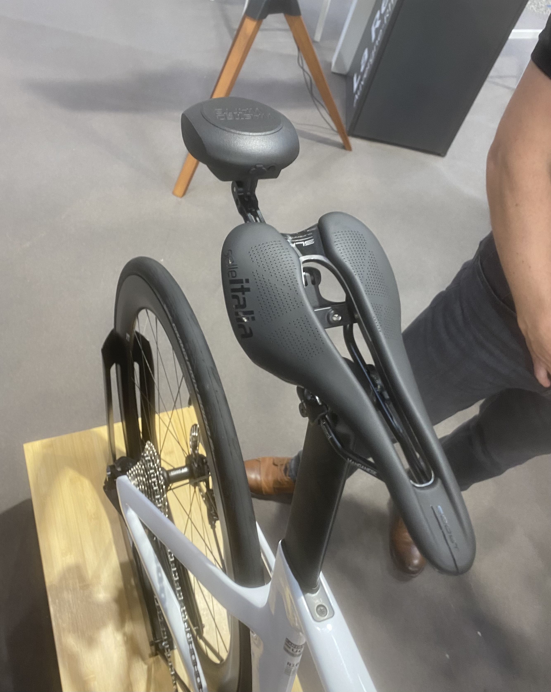
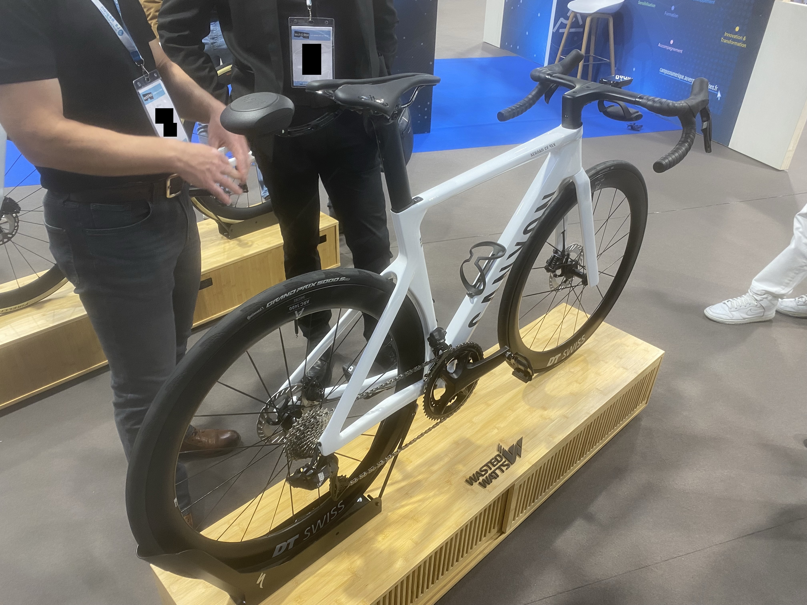

# Ecole [MPLS](https://alpes-dauphine.maisons-pour-la-science.org/) 2025 :: Atelier GNSS (La Mure)

Auteur: Didier DONSEZ, GINP-UGA.

> Ce support est sous licence [CC BY-NC-SA 4.0](https://creativecommons.org/licenses/by-nc-sa/4.0/). Les exemples de croquis fournis ne sont pas couverts par cette licence. Veuillez vous référer à la licence de chacun.

**[Sommaire](README.md) | [Glossaire](glossaire.md)**

## Partie 3 : GNSS et applications

En construction

### Applications

#### Navigation (terre, mer, air ...)

Planification et replanification d'un trajet (navire marchand, avion de ligne, camion ...), d'une tournée (livreur, ordures et déchets, DAB ...) ... en fonction d'information géographique statiques et plus ou dynamiques (état des routes, fermeture de cols, traffic, bouchons, ZFE, courants maritimes, courants atmosphériques ...).

#### [Géolocalisation](https://fr.wikipedia.org/wiki/G%C3%A9olocalisation)

La géolocalisation (geotracking en anglais) est un procédé permettant de positionner un objet (valise ...), un véhicule (volé, livreur ...), ou une personne (enfant, malade d'Alzheimer, [détenu à docimile](https://fr.wikipedia.org/wiki/D%C3%A9tention_%C3%A0_domicile), sportif, skieur/randonneur, travailleur isolé, animal de compagnie, chien de chasse ...) sur un plan ou une carte à l'aide de ses coordonnées géographiques. Certains systèmes permettent également de connaître l'altitude (avion, drone, ballons stratosphériques, bouet, satellite LEO ...)

#### [Geofencing](https://fr.wikipedia.org/wiki/G%C3%A9orep%C3%A9rage)

Le géorepérage ou gardiennage virtuel (en anglais, geofence ou geofencing) est une fonction d'un logiciel de géolocalisation qui permet de surveiller à distance la position et le déplacement d'un objet et de prendre des mesures si la position ou le déplacement s'écarte de certaines valeurs fixées d'avance.

#### Autres

##### Sports de précision

###### Cyclisme

Calcul en temps réel et in vivo de l'aérodynamisme d'un coureur ([WastedWatts](https://www.wastedwatts.com/))

Combine la puissance mesurée au niveau des pédales, l'inclinaison (ie. la pente), la position centrimêtrique (RTK), la traction des pneus (20%) pour mesurer la puissance perdue en aérodynamisme.

 

**Chapitre suivant : [Partie 4: Systèmes d'information géographique](partie4-sig.md)**
