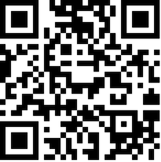
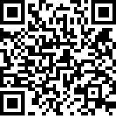

# Ecole [MPLS](https://alpes-dauphine.maisons-pour-la-science.org/) 2025 :: Atelier GNSS (La Mure)

Auteur: Didier DONSEZ, GINP-UGA.

> Ce support est sous licence [CC BY-NC-SA 4.0](https://creativecommons.org/licenses/by-nc-sa/4.0/). Les exemples de croquis fournis ne sont pas couverts par cette licence. Veuillez vous référer à la licence de chacun.

**[Sommaire](README.md)**

## Partie 3 : GNSS et applications

En construction

### Système d'information géographique (SIG ou GIS)

Un [Système d'information géographique](https://fr.wikipedia.org/wiki/Syst%C3%A8me_d%27information_g%C3%A9ographique) est un système d'information conçu pour recueillir, stocker, traiter, analyser, gérer et présenter tous les types de données spatiales et géographiques. Les applications sont par exemple, les cadastres, les réseaux d'eau, de gaz, d'électricité, les systèmes de gestion des batiments (BMS) ...

OpenStreetMap (aka OSM) est une base de données géographique contributive et gratuite. À la suite du temblement de terre en Haiti, le projet Humanitarian OpenStreetMap Team se forme pour répondre aux besoins des humanitaires et aider à la cartographie des pays en voie de développement. La base a aussi été la cible de vandales (notamment avec la guerre en Urkaine) pour passer des messages de haine et de propagande.

> Exercice: recherchez le Mutel dans [www.openstreetmap.org](https://www.openstreetmap.org/relation/109753). [Correction](https://www.openstreetmap.org/search?lat=44.906582&lon=5.782365&zoom=19#map=19/44.906583/5.782365).

[QGIS](https://fr.wikipedia.org/wiki/QGIS) est un logiciel SIG (système d'information géographique) libre.Vous povuez l'installer pour l'essayer.

[Leaflet](https://leafletjs.com/index.html) est une bibliothèque Javascript libre pour construire des applications web incluant des cartes interactives. Il existe des [dérivés](https://github.com/mapbox/leaflet-omnivore).

### [Geofencing](https://fr.wikipedia.org/wiki/G%C3%A9orep%C3%A9rage)

Le géorepérage ou gardiennage virtuel (en anglais, geofence ou geofencing) est une fonction d'un logiciel de géolocalisation qui permet de surveiller à distance la position et le déplacement d'un objet et de prendre des mesures si la position ou le déplacement s'écarte de certaines valeurs fixées d'avance.

### Formats de fichiers

#### [GPX](https://fr.wikipedia.org/wiki/GPX_(format_de_fichier))

format de fichier permettant l'échange de coordonnées géographiques provenant d'un récepteur GNSS. Il est utilisé par les applications et les réseaux sociaux sportifs. 

[Un exemple de fichier GPX de la randonnée Tour du Mont Aiguille](tour_du_mont_aiguille.gpx) (récupéré depuis https://www.alpes-isere.com)


#### [KML](https://fr.wikipedia.org/wiki/Keyhole_Markup_Language)

Format de fichier décrivant des caractéristiques géoréférencés (lieu des marques, des images, des polygones, des modèles 3D, des descriptions textuelles, etc.). Les fichiers KML peuvent être visualisés dans des applications comme Géoportail, Google Street View ...

[Un exemple de fichier KML d'une randonnée facile depuis La Mure](meharieauparadis.kml) (récupéré depuis https://www.alpes-isere.com)

#### [EXIF](https://fr.wikipedia.org/wiki/Exchangeable_image_file_format)

Exchangeable image file format (EXIF) est une spécification de format de fichier pour les images. Il permet de décrire entre autre les coordonnées géographiques au sein du fichier image.

[ExifTool](https://exiftool.org/) est un outil en ligne de commande permettant la manipulation des données EXIF dans les fichiers image.

> Exercice: Consultez les informations EXIF présentes dans les photos prises lors de la randonnée RTK (avec SW Maps) en utilisant soit l'inspecteur d'images de votre PC/Mac, soit l'application https://exif.tools/ basée sur Exiftool.

#### GeoJSON

[GeoJSON](https://fr.wikipedia.org/wiki/GeoJSON) est un format ouvert d'encodage d'ensemble de données géospatiales simples utilisant la norme JSON. Il permet d'annoter des points d'intéret (Point of Interest (POI)) et des zones d'intéret (Zone of Interest (ZOI))

> Exercice: recherchez le Mutel avec l'application [geojson.io](https://geojson.io/#map=11.91/44.908/5.77479) et utilisez les outils pour entourer le batiment et la piscine.

```geojson
{
  "type": "FeatureCollection",
  "features": [
    {
      "type": "Feature",
      "properties": {
        "place": "Le Mutel",
        "event": "Ecole TF de la MPLS"
      },
      "geometry": {
        "coordinates": [
          [
            5.782021553985373,
            44.90646168389782
          ],
          [
            5.782187850944638,
            44.906412291625685
          ],
          [
            5.782316596977267,
            44.906571866506255
          ],
          [
            5.782434614174292,
            44.9065566689178
          ],
          [
            5.782659919731373,
            44.9065642677123
          ],
          [
            5.782643826477312,
            44.90670864462274
          ],
          [
            5.782311232560062,
            44.90669344707047
          ],
          [
            5.782139571182398,
            44.90660986045998
          ],
          [
            5.782037647239434,
            44.9064654833019
          ]
        ],
        "type": "LineString"
      },
      "id": 0
    },
    {
      "type": "Feature",
      "properties": {
        "stroke": "#00fcff",
        "stroke-width": 5,
        "stroke-opacity": 1,
        "fill": "#0432ff",
        "fill-opacity": 0.5,
        "place": "swimming pool"
      },
      "geometry": {
        "coordinates": [
          [
            [
              5.782452074446184,
              44.90653175586314
            ],
            [
              5.782452074446184,
              44.90649368427967
            ],
            [
              5.782581083359247,
              44.90649368427967
            ],
            [
              5.782581083359247,
              44.90653175586314
            ],
            [
              5.782452074446184,
              44.90653175586314
            ]
          ]
        ],
        "type": "Polygon"
      },
      "id": 1
    }
  ]
}
```

> Exercice : ajoutez des Feature supplémentaires ([imag.geojson](imag.geojson), [mutel.geojson](mutel.geojson)) à la collection courante du GeoJSON en cours d'édition.

> Exercice : exportez le GeoJSON au format KML 

Des utilitaires convertissent les différents formats entre eux. [Par exemple](https://github.com/mapbox/togeojson).

Les résultats de la conversion [meharieauparadis.geojson](meharieauparadis.geojson) et [tour_du_mont_aiguille.geojson](tour_du_mont_aiguille.geojson) peuvent être ouverts et visualisés avec [geojson.io](https://geojson.io)

### Codage des coordonnées

#### [GeoCode](https://fr.wikipedia.org/wiki/Code_g%C3%A9ographique)

#### [GeoHash](https://fr.wikipedia.org/wiki/Geohash)

fonction de hachage qui subdivise la surface terrestre selon une grille hiérarchique. Chaque niveau contient 32 cellules (4x8 ou 8x4). Chaque cellule est codée avec un minuscule ou un chiffre. 

> Exercice: retrouvez les geohash du Mutel et de celui de votre domicile avec https://geohash.softeng.co/ [Correction](https://geohash.softeng.co/spup7wfym)

#### [GeoHexGrid](https://www.redblobgames.com/grids/hexagons/implementation.html)

fonction de hachage multi-niveau de coordonnées géographiques. La sphére terrestre est représentée comme une grille d'hexagones. A chaque niveau, chaque hexagone couvre une aire terrestre identique.

> Exercice: trouvez l'hexagone qui englobe la ville de La Mure et celui qui englobe le Mutel avec l'application [h3geo.org](https://h3geo.org). [Correction1](https://h3geo.org/#hex=861f932efffffff), [Correction 2](https://h3geo.org/#hex=891f932e89bffff).

> A noter: les grilles avec des cellules hexagonales sont souvent utilisées pour les [cartes des jeux de plateau](https://hextml.playest.net/).

[Encodage pour le bâtiment IMAG](https://h3geo.org/#hex=8b1f9ed9e41efff%2C+8b1f9ed9e4adfff%2C+8b1f9ed9e41afff%2C+8b1f9ed9e4a9fff%2C+8b1f9ed9e413fff)

> Il existe d'autres applications de visualisation comme [geohex](http://geohex.net/) et des nombreuses bibliothéques comme [geohexgrid](https://github.com/mrcagney/).

### QRCode

Les QRCode peuvent encoder des coordonnées géographiques. La lecture avec un smatphone provoque l'ouverture de l'application de cartographie par défaut.

> Exercice: [Générez un QRCode](http://donsez.github.io/qrcodegen/) qui encode les coordonnées de l'entrée du Mutel (44.9063,5.7828).

 

### NFC

Les étiquettes NFC peuvent encoder des coordonnées géographiques dans des champs NDEF. La lecture avec un smatphone provoque l'ouverture de l'application de cartographie par défaut. 


**Chapitre suivant : [Partie 4: GNSS et risques cyber](partie4-cyberrisk.md)**
