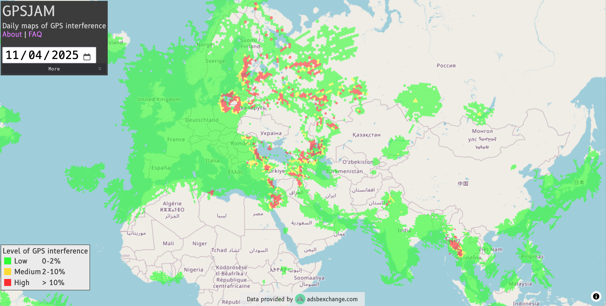
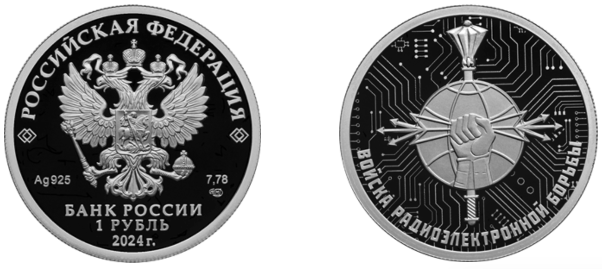

# Ecole [MPLS](https://alpes-dauphine.maisons-pour-la-science.org/) 2025 :: Atelier GNSS (La Mure)

Auteur: Didier DONSEZ, GINP-UGA.

> Ce support est sous licence [CC BY-NC-SA 4.0](https://creativecommons.org/licenses/by-nc-sa/4.0/). Les exemples de croquis fournis ne sont pas couverts par cette licence. Veuillez vous référer à la licence de chacun.

**[Sommaire](README.md)**

## Partie 4 : GNSS et risques cyber

En construction

### Brouillage GPS

effets d'une énergie électromagnétique due à des émissions, rayonnements ou inductions qui dégrade, entrave ou interrompt le fonctionnement des récepteurs GPS.

A titre d'exemple, l'Aéroport de Nantes-Atlantique (7,2 millions de passagers par an) a été bloqué plusieurs heures le 21 avril 2017 à cause d'un brouilleur GPS laissé dans une voiture de service garée sur le parking de l'aéroport. Le détail page 7 de [Brouillages d’ondes : L’ANFR mène l’enquête !](https://www.anfr.fr/fileadmin/mediatheque/documents/brouillage/ANFR_25_ENQUETES-WEB-HD-2.pdf#page=8)

Moins anecdotique, le brouillage GNSS est largement utilisé dans les zones de conflit ou des tensions frontalières avec des armements de guerre électronique (***electronic warfare***). 

> Exercice : consultez le site [gpsjam.org](https://gpsjam.org/?lat=43.71449&lon=44.58150&z=2.3&date=2025-04-11) qui élobore une carte des brouillages subis par les avions de ligne depuis [Février 2022](https://gpsjam.org/?lat=43.71449&lon=44.58150&z=2.3&date=2022-02-11). Zoomez sur la région de la Mer Baltique.

[Russian R-330Zh Zhitel electronic warfare system](https://www.pravda.com.ua/eng/news/2024/05/24/7457518/). Stock photo: open sources

Source : Bank of Russia (cbr.ru)

### Leurrage GPS

technique consistant à émettre de signaux GPS synthétiques pour fausser le calcul de temps et de la position par des récepteurs GPS. C'est un des risques cyber pour les entreprises et gouvernements.

> Des tricheurs au jeu Pokermon Go ont leurré le propre téléphone pour se téléporter et chasser des Pokermon sans bouger de leur fauteuil.

### Dispositif anti-leurrage

Système de détection du leurrage GNSS. Certains modules GNSS sont dotés de tels systèmes. |

### Fuite d'information géographique

Comme vous l'avez vu dans le chapitre précedent, les informations EXIF peuvent contenir les coordonnées du lieu de prise d'une image. Ces coordonnées peuvent être exploitées par des personnes malveillantes (vie privée, informations stratégiques, braconage ...) quand les images sont rendues publiques (réseaux sociaux ...).

**Chapitre suivant : [Bonus track](bonus-track.md)**
