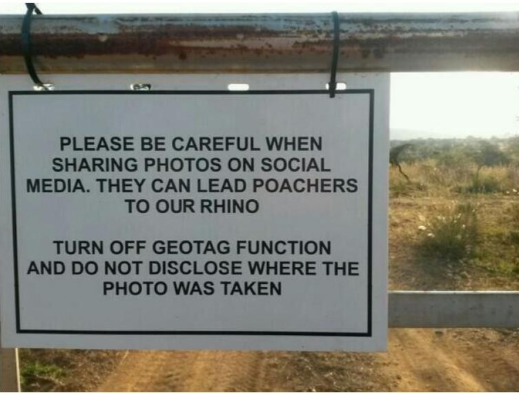

# Ecole [MPLS](https://alpes-dauphine.maisons-pour-la-science.org/) 2025 :: Atelier GNSS (La Mure)

Auteur: Didier DONSEZ, GINP-UGA.

> Ce support est sous licence [CC BY-NC-SA 4.0](https://creativecommons.org/licenses/by-nc-sa/4.0/). Les exemples de croquis fournis ne sont pas couverts par cette licence. Veuillez vous référer à la licence de chacun.

**[Sommaire](README.md)**

## Partie 4 : GNSS et risques cyber

En construction

### Brouillage GNSS

Le brouillage GNSS est l'effet d'une énergie électromagnétique due à des émissions, rayonnements ou inductions qui dégrade, entrave ou interrompt le fonctionnement des récepteurs GNSS.

A titre d'exemple, l'Aéroport de Nantes-Atlantique (7,2 millions de passagers par an) a été bloqué plusieurs heures le 21 avril 2017 à cause d'un brouilleur GPS laissé dans une voiture de service garée sur le parking de l'aéroport. Le détail page 7 de [Brouillages d’ondes : L’ANFR mène l’enquête !](https://www.anfr.fr/fileadmin/mediatheque/documents/brouillage/ANFR_25_ENQUETES-WEB-HD-2.pdf#page=8)

Moins anecdotique, le brouillage GNSS est largement utilisé dans les zones de conflit ou des tensions frontalières avec des armements de guerre électronique (***electronic warfare***). 

[Exemple de brouillage du GNSS des satellites](https://www.gps.gov/cgsic/meetings/2024/humphreys.pdf)

> Exercice : consultez le site [gpsjam.org](https://gpsjam.org/?lat=43.71449&lon=44.58150&z=2.3&date=2025-04-11) qui élobore une carte des brouillages subis par les avions de ligne depuis [Février 2022](https://gpsjam.org/?lat=43.71449&lon=44.58150&z=2.3&date=2022-02-11). Zoomez sur la région de la Mer Baltique.

[Russian R-330Zh Zhitel electronic warfare system](https://www.pravda.com.ua/eng/news/2024/05/24/7457518/). Stock photo: open sources

Source : Bank of Russia (cbr.ru)

### Leurrage GNSS

Le leurrage GNSS (GNSS spoofing en anglais) est une technique consistant à émettre de signaux GPS synthétiques pour fausser le calcul de temps et de la position par des récepteurs GPS. C'est un des risques cyber pour les entreprises et gouvernements.

> Des tricheurs au jeu Pokermon Go ont leurré le propre téléphone pour se téléporter et chasser des Pokermon sans bouger de leur fauteuil.

[Exemple de leurrage GPS dans un réseau LoRaWAN (station de base et suiveur GPS)](https://gitlab.com/EclipseIoTDaysGrenoble/archive/-/wikis/2020/Eclipse-IoTDay2020Grenoble-friedt.pdf) : Grenoble, 220m,14/02/2020 –> Svalbard, 8849m, 24/12/2019

### Dispositif anti-leurrage

Système de détection du leurrage GNSS.

Certains modules GNSS (plus chers) sont dotés de tels systèmes. 

Certains modules GNSS (encore plus chers) peuvent continuer à produire des coordonnées géographiques en s'appuyant sur une centrale inertielle MEMS (IMU en anglais) malgré le brouillage ou le leurrage.

### Fuite d'information géographique

Comme vous l'avez vu dans le chapitre précedent, les informations EXIF peuvent contenir les coordonnées géographiques du lieu de prise d'une image. Ces coordonnées peuvent être exploitées par des personnes malveillantes (vie privée, informations stratégiques, braconage, home jacking ...) quand les images sont rendues publiques (réseaux sociaux, blog ...).

Exemple: Utilisation des geotag des photos publiées sur les réseaux sociaux : les braconniers géolocalisent les rhinocéros.

Exemple: Réseaux sociaux sportifs : Anomaly Six, un sous-traitant gouvernemental discret, affirme surveiller les déplacements de milliards de téléphones dans le monde entier et démasquer des espions d’une simple pression sur un bouton.

> Exercice : inspectez les photos prises par votre smartphone pour retrouver les coordonnées géographiques lors de la prise de vue. Vous pouvez utilisez ExifTool ou les "inspecteurs" de votre machine.

> Exercice : Replacez les coordonnées géographiques par un geohash avec ExifTool.

### EU Cybersecurity Resilient Act (CRA)

https://www.european-cyber-resilience-act.com/ 

**Chapitre suivant : [Bonus track](bonus-track.md)**
