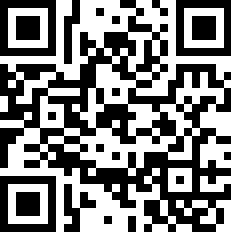
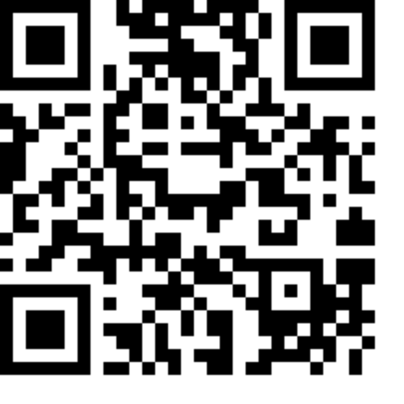
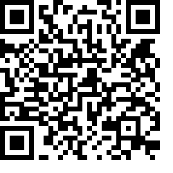

# Ecole [MPLS](https://alpes-dauphine.maisons-pour-la-science.org/) 2026 :: Atelier GNSS (La Mure)

Auteur: Didier DONSEZ, GINP-UGA.

> Ce support est sous licence [CC BY-NC-SA 4.0](https://creativecommons.org/licenses/by-nc-sa/4.0/). Les exemples de croquis fournis ne sont pas couverts par cette licence. Veuillez vous référer à la licence de chacun.

**[Sommaire](README.md) | [Glossaire](glossaire.md)**

### Partie 5 : Codage des coordonnées

#### [GeoCode](https://fr.wikipedia.org/wiki/Code_g%C3%A9ographique)

Code permettant de définir (ou d'identifier) un point, une zone, ou une entité à la surface. Exemple: code postal, [code INSEE](https://fr.wikipedia.org/wiki/Code_Insee) ...

Le [géocodage inversé](https://fr.wikipedia.org/wiki/G%C3%A9ocodage_invers%C3%A9) (*reverse geocoding* en anglais) consiste à effectuer l'opération inverse du géocodage, c'est-à-dire d'attribuer une adresse à des coordonnées géographiques.

Exercice: Testez le service de géocodage inversé [nominatim d'OpenstreetMap](https://nominatim.openstreetmap.org/ui/search.html?street=Bd+Frejus+Michon&city=La+Mure&county=France).

#### [GeoHash](https://fr.wikipedia.org/wiki/Geohash)

GeoHash est une [fonction de hachage](https://fr.wikipedia.org/wiki/Fonction_de_hachage) qui subdivise la surface terrestre selon une grille hiérarchique. Chaque niveau contient 32 cellules (4x8 ou 8x4). Chaque cellule est codée avec un minuscule ou un chiffre. 

> Exercice: retrouvez les geohash du Mutel et de celui de votre domicile avec https://geohash.softeng.co/ [Correction](https://geohash.softeng.co/spup7wfym)

#### [GeoHexGrid](https://www.redblobgames.com/grids/hexagons/implementation.html)

GeoHexGrid est une [fonction de hachage](https://fr.wikipedia.org/wiki/Fonction_de_hachage) multi-niveau de coordonnées géographiques. La sphére terrestre est représentée comme une grille d'hexagones. A chaque niveau, chaque hexagone couvre une aire terrestre identique.

> Exercice: trouvez l'hexagone qui englobe la ville de La Mure et celui qui englobe le Mutel avec l'application [h3geo.org](https://h3geo.org). [Correction1](https://h3geo.org/#hex=861f932efffffff), [Correction 2](https://h3geo.org/#hex=891f932e89bffff).

> A noter: les grilles avec des cellules hexagonales sont souvent utilisées pour les [cartes des jeux de plateau](https://hextml.playest.net/).

[Encodage pour le bâtiment IMAG](https://h3geo.org/#hex=8b1f9ed9e41efff%2C+8b1f9ed9e4adfff%2C+8b1f9ed9e41afff%2C+8b1f9ed9e4a9fff%2C+8b1f9ed9e413fff)

> Il existe d'autres applications de visualisation comme [geohex](http://geohex.net/) et des nombreuses bibliothéques comme [geohexgrid](https://github.com/mrcagney/).

### QRCode

Les QRCode peuvent encoder des coordonnées géographiques. La lecture avec un smatphone provoque l'ouverture de l'application de cartographie par défaut.

> Exercice: [Générez un QRCode](http://donsez.github.io/qrcodegen/) qui encode les coordonnées de l'entrée du Mutel (44.9063,5.7828).

>  Exercice: [Générez un QRCode](http://donsez.github.io/qrcodegen/) qui encode les coordonnées de l'entrée de la Gare du Temps.

   

### NFC

Les étiquettes NFC peuvent encoder des coordonnées géographiques dans des champs NDEF. La lecture avec un smatphone provoque l'ouverture de l'application de cartographie par défaut. 

**Chapitre suivant : [Partie 6: Mise en oeuvre pour le suivi de ballons stratosphériques](partie6-hab.md)**
