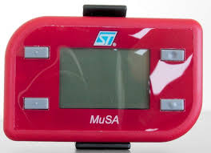

# STEVAL-MKI031V1 :: Plateforme MuSA

Le kit STEVAL-MKI031V1 (aka MuSA) est une carte d'évaluation du MEMS [LIS331DLH](https://www.st.com/en/mems-and-sensors/lis331dlh.html) qui est un accéléromètre 3 axes.

Le MCU est un ST7 (ST72F651AR6T1E) MCU 8-bit ST7 CISC 32KB Flash 3.3V/5V.

* [Fiche & Schematics](./doc/en.CD00276666.pdf)
* [BOM](./doc/10.1.1.362.6365.pdf)
