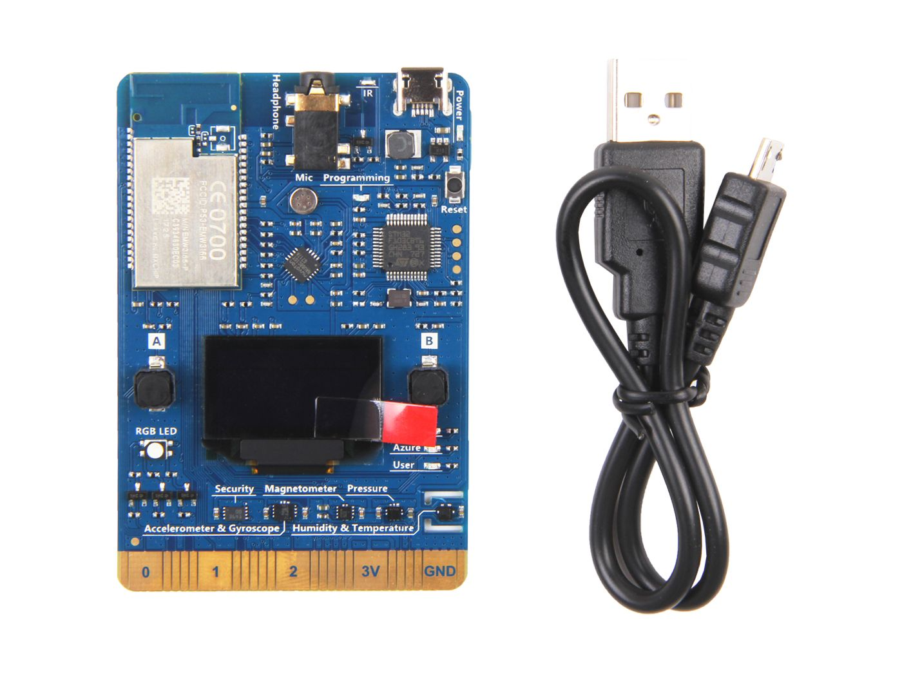

# MXCHIP AZ3166 :: Eclipse ThreadX tutorial

## Getting started

* https://microsoft.github.io/azure-iot-developer-kit/docs/get-started/
* https://docs.google.com/presentation/d/1ayCS_kEJaZaK10ZhFyCe2oNvr9sY4N8ieIZUfd-B3m0
* https://github.com/Eclipse-SDV-Hackathon-Chapter-Two/challenge-threadx-and-beyond
* https://github.com/MXCHIP/mbed-wifi-example
* https://testdocs.zerynth.com/latest/reference/boards/az3166/docs/

## Features

* EMW3166 (ST STM32F412 + Broadcom BCM43362) Wi-Fi module with 256K SRAM，1M+2M Byte SPI Flash
* DAP Link emulator
* Micro USB
* 3.3V DC-DC, maximum current 1.5A
* Codec, with microphone and earphone socket
* OLED, 128x64 ([SSD1306](https://cdn-shop.adafruit.com/datasheets/SSD1306.pdf))
* 2 user button
* 1 RGB light
* 3 working status indicator
* Security encryption chip
* Infrared emitter
* Connecting finger extension interface

Sensors
* ST HTS221 : relative humidity and temperature.
* ST LPS22HB : absolute piezoresistive pressure sensor
* ST LIS2MDL : magnetometer
* ST LSM6DSL : 3D digital accelerometer and gyroscope




## Console

```bash
tio -b 115200 -m INLCRNL /dev/tty.usbmodemXXXX
```

```
************************************************
** MXChip - Microsoft IoT Developer Kit **
************************************************
AP mode Wi-Fi AZ-c8934688xxxx started .
Soft AP AZ-c8934688xxxx is running...
Connect and visit "http://192.168.0.1/" to config the Wi-Fi settings.

************************************************
** MXChip - Microsoft IoT Developer Kit **
************************************************
You can 1. press Button A and reset to enter configuration mode.
        2. press Button B and reset to enter AP mode.

0) Freebox-xxxxxx	Signal: -43	Enc type: 4
1) FreeWifi_secure	Signal: -44	Enc type: 4

Wi-Fi Freebox-xxxxxx connected.
Time from pool.ntp.org, now is (UTC): Mon Jan  6 21:28:00 2025

>>> Failed to send telemetry data: Http fault.
>>> Failed to send telemetry data: Http fault.
```

