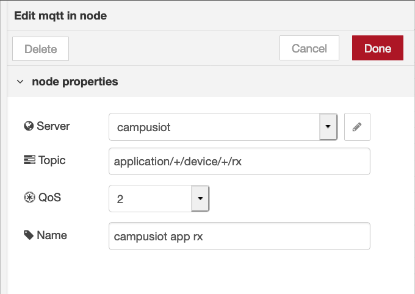

# CampusIoT :: NodeRED :: Tutoriel :fr:

## Objectif
L'objectif de ce tutoriel est de récupérer les mesures des capteurs gérés par la plateforme CampusIoT afin de les archiver et de les visualiser en temps réel au moyen de la stack [NodeRED](https://nodered.org/), InfluxDB, Grafana.

[NodeRED](https://nodered.org/) est un canevas de traitement de flots de données. Il permet la programmation visuelle des chaines de traitement de données. Il est très populaire pour le prototypage d'applications IoT.

Si ce tutoriel vous est utile, pensez à donner une étoile :star: en haut à droit.

## Etape 0: Prérequis
Installez Docker CE et Docker Compose sur votre machine
* https://docs.docker.com/install/
* https://docs.docker.com/compose/install/

## Etape 1: Journaliser le flot MQTT de messages dans un fichier avec NodeRed
Lancez NodeRed avec Docker (sur votre machine)
```bash
docker run -it -p 1880:1880 --name campusiot-nodered nodered/node-red-docker
```

Ouvrez l’interface de NodeRed dans un navigateur Web http://127.0.0.1:1880
```bash
open http://127.0.0.1:1880
```

Créez le “flot” en important le JSON suivant au moyen du (Menu > Import)
```json
[{"id":"a223aefb.78f27","type":"mqtt in","z":"c98c469c.7db958","name":"campusiot app rx","topic":"application/+/device/+/rx","qos":"2","broker":"e78a78ee.6dbae8","x":320,"y":140,"wires":[["2b6278fc.60352","f7b805a.4fa4178"]]},{"id":"e78a78ee.6dbae8","type":"mqtt-broker","z":"","name":"campusiot","broker":"lora.campusiot.imag.fr","port":"8883","tls":"ffa7a071.2d7b7","clientid":"","usetls":true,"compatmode":true,"keepalive":"60","cleansession":true,"birthTopic":"","birthQos":"0","birthPayload":"","closeTopic":"","closeQos":"0","closePayload":"","willTopic":"","willQos":"0","willPayload":""},{"id":"ffa7a071.2d7b7","type":"tls-config","z":"","name":"","cert":"","key":"","ca":"","certname":"","keyname":"","caname":"ca.crt","servername":"","verifyservercert":false}]
```

Editez le noeud mqtt-in `campusiot` pour changer le topic, le ca.crt pour la configuration SSL, le username et password MQTT avec les credentials MQTT qui vous ont été fournis.
Le certificat se récupère au moyen de
```bash
wget https://raw.githubusercontent.com/CampusIoT/campusiot-certs/master/mqtt/ca.crt
```





Affichez le journal des messages avec
```bash
docker exec -it campusiot-nodered tailf /usr/src/node-red/msg.log
```

Remarque : Vous pouvez monter un volume local pour rendre persistant le journal dans votre répertoire courant en ajoutant `-v $PWD/msg.log:/usr/src/node-red/msg.log` à la commande docker précédente
```bash
touch $PWD/msg.log
docker run -it -p 1880:1880 -v $PWD/msg.log:/usr/src/node-red/msg.log --name campusiot-nodered nodered/node-red-docker
```
Afficher le flot de messages écrits dans le journal `msg.log`
```bash
tail -f $PWD/msg.log
```

En fin d'expérimentation, vous pouvez utiliser la commande suivante pour arrêter et supprimer le container `campusiot-nodered` :
```bash
docker rm -f campusiot-nodered
```

## Etape 2: Décoder et afficher les charges utiles des devices dans les tableaux de bord NodeRed

```bash
git clone https://github.com/CampusIoT/tutorial.git
cd tutorial/nodered/tuto-nodered
docker-compose up -d
docker-compose ps
docker-compose logs -f
```

Entrez le username et mot de passe MQTT en éditant un des noeuds MQTT In comme à l'étape précédente.

Ouvrez les pages suivantes:
* http://localhost:1880 avec `admin` `MY_SUPER_ADMIN_SECRET`
* http://localhost:1880/ui avec `user` `MY_SUPER_USER_SECRET`
* http://localhost:1880/worldmap avec `user` `MY_SUPER_USER_SECRET`

Le flot ([`flow.json`](https://github.com/CampusIoT/tutorial/blob/master/nodered/tuto-nodered/configuration/nodered/flow.json)) par défaut est dans le répertoire `nodered/tuto-nodered/configuration/nodered/`.

Vous pourrez personnaliser ce flot en fonction des devices que vous avez enregistrez dans votre organisation.

Pour changer les 2 mots de passe avec les lignes suivantes:
```bash
docker-compose stop nodered
docker-compose exec nodered /data/set_password.sh MY_SUPER_ADMIN_SECRET MY_SUPER_USER_SECRET
sleep 10
docker-compose start nodered
```

Changez les mots de passe:
```bash
docker-compose exec nodered /data/set_password.sh MY_SUPER_ADMIN_SECRET MY_SUPER_USER_SECRET
docker-compose stop nodered
docker-compose start nodered
```


## Etape 3: Journaliser le flot MQTT de messages dans une base time-series InfluxDB avec NodeRed

Ajoutez dans la composition `docker-compose.yml` le service `influxdb` qui étend `influxdb.yml` et ajouter un lien vers `influxdb` dans le service `nodered`.

Arrêtez et redémarrez la composition `docker-compose.yml` avec :
```bash
docker-compose stop
docker-compose start
```

## Etape 4: Visualiser les séries temporelles de la base time-series InfluxDB avec Chronograf

Ajoutez dans la composition `docker-compose.yml` le service `chronograf` qui étend `chronograf.yml`.

Démarrez le service dans la composition `docker-compose.yml` avec :
```bash
docker-compose start chronograf
```

Ouvrez la page suivante http://localhost:8888

Ajoutez la connection `http://influxdb:8086` dans `Configuration > Connection > + Add Connection`.

Explorez la base de données `lorawan` en ajoutant une requête suivante pour afficher le graphe du nombre de messages LoRa reçus et émis par les stations de base :

```sql
SELECT sum("rxPacketsReceived") AS "sum_rxPacketsReceived", sum("txPacketsReceived") AS "sum_txPacketsReceived", sum("rxPacketsReceivedOK") AS "sum_rxPacketsReceivedOK", sum("txPacketsEmitted") AS "sum_txPacketsEmitted" FROM "lorawan"."three_days"."stat" WHERE time > :dashboardTime: GROUP BY time(1m) FILL(null)
```


Ajoutez d'autres graphes.

## Etape 5: Visualiser les séries temporelles de la base time-series InfluxDB avec Grafana
Grafana est un outil très populaires pour la visualisation de séries temporelles.

Ajoutez dans la composition `docker-compose.yml` le service `grafana` qui étend `grafana.yml`.

Démarrez le service dans la composition `docker-compose.yml` avec :
```bash
docker-compose start grafana
```

Ouvrez la page suivante http://localhost:3000 et loggez vous avec `admin` `__SUPER_SECRET_TO_CHANGE__`

Ajoutez la source de données (url=`http://influxdb:8086`, database=`lorawan`) dans `Configuration > Data Sources > InfluxDB > Settings` en suivant la page http://localhost:3000/datasources/edit/1?gettingstarted

> Pour la source InfluxDB, le username est `campusiot` et le mot de passe est `__SUPER_SECRET_TO_CHANGE__`

Ajoutez un nouveau tableau de bord avec `Create > New Dashboard` en suivant la page http://localhost:3000/dashboard/new

Ajoutez un panel de type `Graph` et ajoutez les requêtes suivantes pour afficher le graphe du nombre de messages LoRa reçus et émis par les stations de base via l'aide d'édition des requêtes :

```sql
SELECT sum("rxPacketsReceived") FROM "stat" WHERE $timeFilter GROUP BY time($__interval) fill(null)

SELECT sum("rxPacketsReceivedOK") FROM "stat" WHERE $timeFilter GROUP BY time($__interval) fill(null)

SELECT sum("txPacketsEmitted") FROM "stat" WHERE $timeFilter GROUP BY time($__interval) fill(null)

SELECT sum("txPacketsReceived") FROM "stat" WHERE $timeFilter GROUP BY time($__interval) fill(null)
```


Sauvegardez le tableau de bord et ajoutez d'autres panneaux.

Ajoutez un panel de type `Graph` et ajoutez la requête suivante pour afficher le graphe des nombres de messages LoRa reçus, groupés par la propriété `mac` des stations de base via l'aide d'édition des requêtes :

```sql
SELECT sum("rxPacketsReceivedOK") FROM "stat" WHERE $timeFilter GROUP BY time($__interval), "mac" fill(null)
```

Modifiez les valeurs de l'onglet `Display` pour obtenir le graphe suivant.


Ajoutez un panel de type `Graph` et ajoutez la requête suivante pour afficher le graphe des nombres de messages LoRaWAN reçus, groupés par operateur LoRaWAN via l'aide d'édition des requêtes :

```sql
SELECT count("size") FROM "rx" WHERE ("operator" != 'undefined' AND "frametype" = 'dtup') AND $timeFilter GROUP BY time($__interval), "operator" fill(null)
```


Ajoutez un panel de type `Heatmap` et ajoutez la requête précédente pour afficher la heatmap des nombres de messages LoRaWAN reçus, groupés par operateur LoRaWAN.


## Etape 6: Installer des plugins complémentaires dans Grafana
La communauté Grafana propose de nombreux plugins (greffons en français) dont la liste complete est https://grafana.com/plugins .

Pour ajouter un plugin au serveur Grafana (par exemple https://grafana.com/plugins/citilogics-geoloop-panel), il faut exécuter dans le conteneur des commandes en ligne de `grafana-cli` puis rédémarrer le conteneur.

```bash
docker exec -it tuto-nodered_grafana_1 grafana-cli plugins list-remote
docker exec -it tuto-nodered_grafana_1 grafana-cli plugins list-remote | grep geoloop
docker exec -it tuto-nodered_grafana_1 grafana-cli plugins install citilogics-geoloop-panel
docker-compose stop grafana
docker-compose start grafana
```


## Etape 7: Créer une alerte Alerta avec Kapacitor

Ajoutez dans la composition `docker-compose.yml` le service `kapacitor` qui étend `kapacitor.yml` et les service `alerta` et `postgresdb` qui étendent `alerta.yml`.

Démarrez le service dans la composition `docker-compose.yml` avec :
```bash
docker-compose start postgresdb
docker-compose start alerta
docker-compose start kapacitor
```

Ouvrez la page suivante http://localhost:8080
