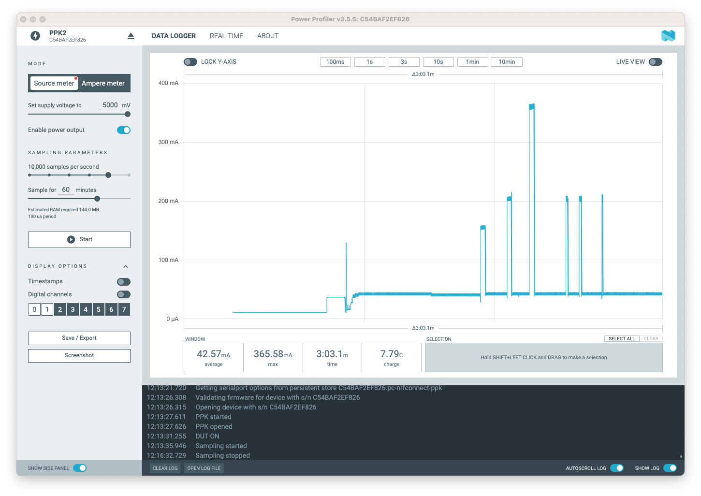

# Nordic Power Profiler Kit II

The [Power Profiler Kit II (PPK2)](https://www.nordicsemi.com/Products/Development-hardware/Power-Profiler-Kit-2) is an affordable, flexible tool that measures the real-time power consumption of your designs.

The PPK2 measures power consumption by either providing power to the external board or acting as an ampere meter. It measures current from 500 nA to 1 A and gives a detailed picture of the current profile for the user application.

The PPK2 can vary power supply voltage ranging from 0.8 V to 5.0 V (software configurable)

## Getting started

* https://infocenter.nordicsemi.com/index.jsp?topic=%2Fug_ppk2%2FUG%2Fppk%2FPPK_user_guide_Intro.html

Download and install the [nRF Connect](https://www.nordicsemi.com/Products/Development-tools/nRF-Connect-for-Desktop/Download#infotabs)

Plug the `USB DATA/POWER` connector to your host.

Switch on the nRF PPK2

Select the PPK device in `Select Device`.

Select `Source meter`

Set the supply voltage for your board.

Set the number of samples per second 

Plug the board to power with black and red wires (resp. `GND` and `VOUT`)

Press `Start`

Envoy the chart !

## Using GPIO level for debugging

TODO