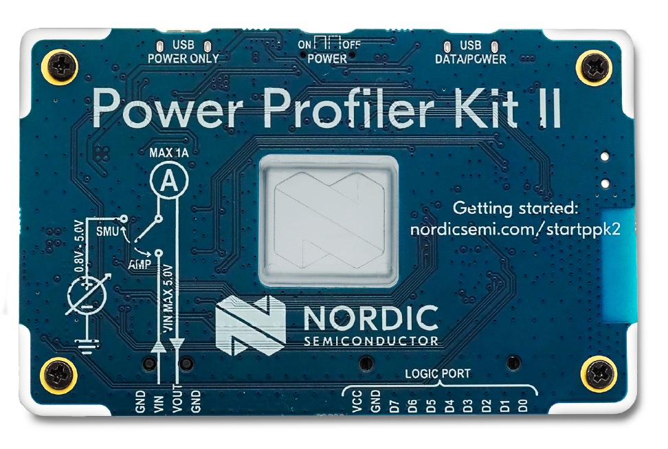

# Nordic Power Profiler Kit II

The [Power Profiler Kit II (PPK2)](https://www.nordicsemi.com/Products/Development-hardware/Power-Profiler-Kit-2) is an affordable, flexible tool that measures the real-time power consumption of your designs.

The PPK2 measures power consumption by either providing power to the external board or acting as an ampere meter. It measures current from 500 nA to 1 A and gives a detailed picture of the current profile for the user application.

The PPK2 can vary power supply voltage ranging from 0.8 V to 5.0 V (software configurable)

| Connector | Description |
|-----------|-------------|
| `GND` | Ground connection to DUT. |
| `VOUT` | Positive voltage output to DUT. |
| `VIN` | External power input. Only used for Ampere meter mode. |
| `GND` | Ground connection to DUT. |
| `USB DATA/POWER` | USB connection for power and communication with the PPK2. |
| `USB POWER ONLY` | USB connection for supplying extra power to the PPK2. Only needed in Source Meter mode (> 400 mA). |
| LOGIC PORT  |  |
| `VCC` | VCC of DUT |
| `GND` | GND of DUT |
| `D0–D7` | Digital input pins |

## Getting started

* https://infocenter.nordicsemi.com/index.jsp?topic=%2Fug_ppk2%2FUG%2Fppk%2FPPK_user_guide_Intro.html

Download and install the [nRF Connect](https://www.nordicsemi.com/Products/Development-tools/nRF-Connect-for-Desktop/Download#infotabs)

Plug the `USB DATA/POWER` connector to your host.

Switch on the nRF PPK2

Select the PPK2 device in `Select Device`.

Select `Source meter`

Switch Off `Enable power output`

Set the supply voltage for your board.

Set the number of samples per second (10000 samples per second).

Set the duration in minutes.

Plug the board to power with black and red wires (resp. `GND` and `VOUT`)

Press `Start`

Switch On `Enable power output`

Envoy the chart !

(study from [sx1302 driver](https://github.com/thingsat/riot_modules/tree/main/tests/driver_sx1302#power-consumption-study))

## Small reminder
### Battery life

* C = capacity in mAh
* A = average consumption in mA
* T = time in hours

T = C/A

Example

* a battery of 2500 mAh
* a device consuming 60 µA -> 0.06 mA

The life expectancy is `2500/0.06 = 41666 hours` -> 4.75 years

## Using GPIO level for debugging

TODO

## API

* https://github.com/IRNAS/ppk2-api-python

## Documentation

* [PPK2 User Guide](https://infocenter.nordicsemi.com/pdf/PPK2_User_Guide_v1.0.1.pdf)
