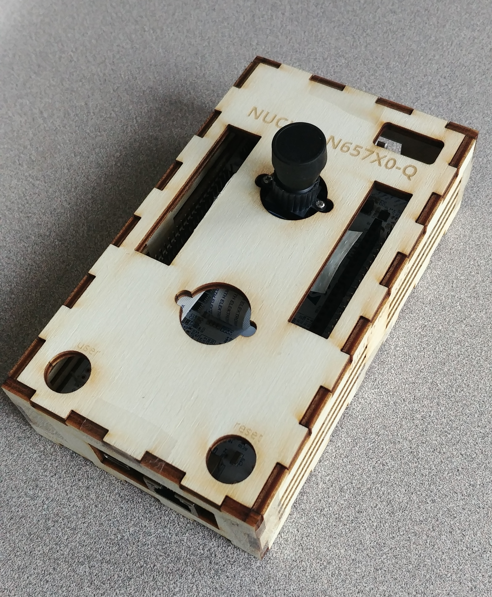
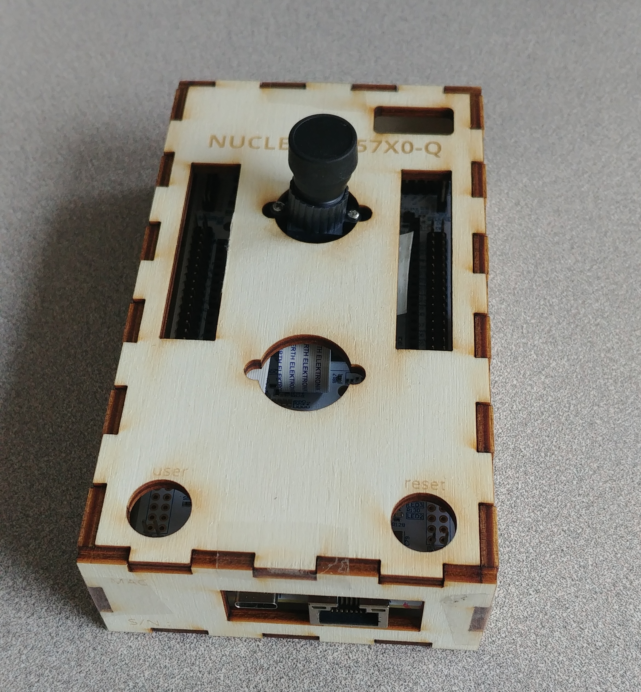
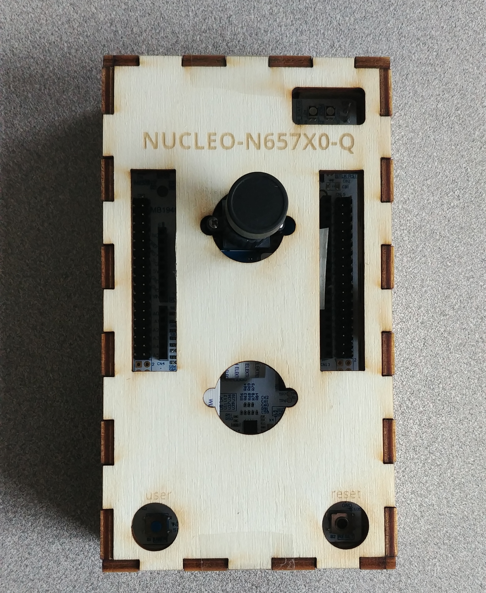

# STM32 NUCLEO-N657X0-Q

* https://www.st.com/en/evaluation-tools/nucleo-n657x0-q.html
* + B-CAMS-IMX https://www.st.com/en/evaluation-tools/b-cams-imx.html

## Enclosure

Laser-cutter enclosure : [`.odg`](NUCLEO-N657X0-Q.odg), [`.svg`](NUCLEO-N657X0-Q.svg)

See also
* https://makerworld.com/fr/models/223372
* https://www.printables.com/model/764904-simple-stm32-nucleo-144-case

