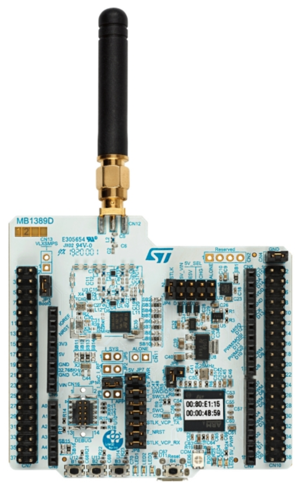

# NUCLEO-WL55 Starter Packs

ST Microelectronics propose 2 Starter Packs de prototypage Nucleo 64 de la technologie LoRa avec les MCU STM32WL55 qui intégrent les transceivers Semtech SX1261 :  [NUCLEO-WL55JC](https://www.st.com/en/evaluation-tools/nucleo-wl55jc.html) et  [P-NUCLEO-LRWAN3](https://www.st.com/en/evaluation-tools/p-nucleo-lrwan3.html). Les 2 packs sont adaptés pour les fréquences LF (433/470 MHz) et HF (868/915 MHz)

## Démarage avec STM32CubeWL
Téléchargez le paquetage logiciel [STM32CubeWL Software Package](https://my.st.com/content/my_st_com/en/products/embedded-software/mcu-mpu-embedded-software/stm32-embedded-software/stm32cube-mcu-mpu-packages/stm32cubewl.license=1616570498866.product=STM32CubeWL.version=1.0.0.html).

TBC : Coming soon.

## Démarage avec RIOTOS

Coming soon.

## Documentation
* [NUCLEO-WL55JC STM32WL](https://www.st.com/en/evaluation-tools/nucleo-wl55jc.html)
* [STM32WL Online Training](https://www.st.com/content/st_com/en/support/learning/stm32-education/stm32-online-training/stm32wl-online-training.html)
* [STM32CubeWL Software Package](https://my.st.com/content/my_st_com/en/products/embedded-software/mcu-mpu-embedded-software/stm32-embedded-software/stm32cube-mcu-mpu-packages/stm32cubewl.license=1616570498866.product=STM32CubeWL.version=1.0.0.html)
