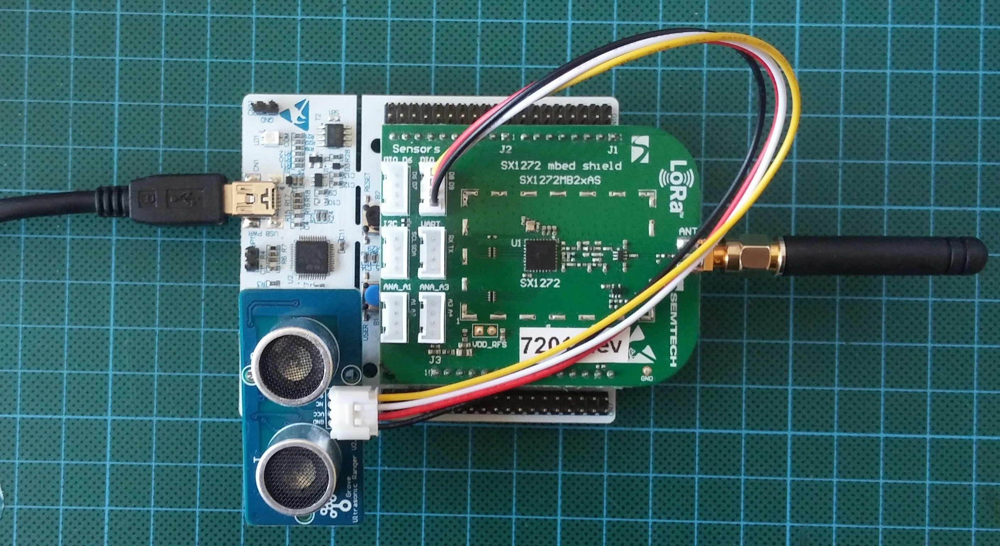

# CampusIoT :: Nucleo :: Tutoriel :fr:

Si ce tutoriel vous est utile, pensez à donner une étoile :star: en haut à droit.

## Prérequis
Ce tutoriel requiert un kit [Nucleo LRWAN1](https://www.st.com/en/evaluation-tools/p-nucleo-lrwan1.html).

Créez un compte sur MBed https://ide.mbed.com/compiler/

## Import du démonstrateur LoRaWAN-demo-72 (si vous avez une carte avec un SX1272)
Importez la version `7:5077515` du démonstrateur [LoRaWAN-demo-72](https://os.mbed.com/teams/Semtech/code/LoRaWAN-demo-72/
) dans votre IDE MBed au moyen du bouton `Import into Compiler`.




## Import du démonstrateur LoRaWAN-demo-76 (si vous avez une carte avec un SX1276)
Importez la version `9:ee9dcbb` du démonstrateur [LoRaWAN-demo-76](https://os.mbed.com/teams/Semtech/code/LoRaWAN-demo-76/
) dans votre IDE MBed au moyen du bouton `Import into Compiler`.


## Changement de DevEUI et de l'AppKey
Modifiez le fichier Commissioning.h en changeant la valeur de `ENDPOINT_ID`.
```cpp
/*
 / _____)             _              | |
( (____  _____ ____ _| |_ _____  ____| |__
 \____ \| ___ |    (_   _) ___ |/ ___)  _ \
 _____) ) ____| | | || |_| ____( (___| | | |
(______/|_____)_|_|_| \__)_____)\____)_| |_|
    (C)2015 Semtech

Description: End device commissioning parameters

License: Revised BSD License, see LICENSE.TXT file include in the project

Maintainer: Miguel Luis and Gregory Cristian
*/
#ifndef __LORA_COMMISSIONING_H__
#define __LORA_COMMISSIONING_H__

/*!
 * When set to 1 the application uses the Over-the-Air activation procedure
 * When set to 0 the application uses the Personalization activation procedure
 */
#define OVER_THE_AIR_ACTIVATION                     1

/*!
 * Indicates if the end-device is to be connected to a private or public network
 */
#define LORAWAN_PUBLIC_NETWORK                      true

/*!
 * IEEE Organizationally Unique Identifier ( OUI ) (big endian)
 * \remark This is unique to a company or organization
 */
#define IEEE_OUI            0x0C, 0xAF, 0xCA
#define APP_ID              0x04
#define ENDPOINT_ID         0x72, 0x08

/*!
 * Mote device IEEE EUI (big endian)
 */
#define LORAWAN_DEVICE_EUI                          { IEEE_OUI, 0x00, 0x00, APP_ID, ENDPOINT_ID }

/*!
 * Application IEEE EUI (big endian)
 */
#define LORAWAN_APPLICATION_EUI                     { IEEE_OUI, 0x00, 0x00, APP_ID, 0xFF, 0xFF }

/*!
 * AES encryption/decryption cipher application key
 */
#define LORAWAN_APPLICATION_KEY                     { APP_ID, ENDPOINT_ID,  0x16, 0x28, 0xAE, 0xD2, 0xA6, 0xAB, 0xF7, 0x15, 0x88, 0x09, 0xCF, 0x4F, 0x3C }

/*!
 * Current network ID
 */
#define LORAWAN_NETWORK_ID                          ( uint32_t )0

/*!
 * Device address on the network (big endian)
 */
#define LORAWAN_DEVICE_ADDRESS                      ( uint32_t )0x12345678

/*!
 * AES encryption/decryption cipher network session key
 */
#define LORAWAN_NWKSKEY                             { 0x2B, 0x7E, 0x15, 0x16, 0x28, 0xAE, 0xD2, 0xA6, 0xAB, 0xF7, 0x15, 0x88, 0x09, 0xCF, 0x4F, 0x3C }

/*!
 * AES encryption/decryption cipher application session key
 */
#define LORAWAN_APPSKEY                             { 0x2B, 0x7E, 0x15, 0x16, 0x28, 0xAE, 0xD2, 0xA6, 0xAB, 0xF7, 0x15, 0x88, 0x09, 0xCF, 0x4F, 0x3C }

#endif // __LORA_COMMISSIONING_H__

```

## Chargement du firmware
Sélectionnez le modèle de la carte Nucleo (L073RZ, F411RE ...) puis lancez la compilation avec le bouton Compile.

Téléchargez et sauvez le fichier binaire produit puis copiez celui-ci dans le "disque" émulé sur votre machine par la carte Nucleo.

## Lancement d'un terminal série
Lancez une application de terminal série (comme PuTTY sur Windows, ZTerm ou CoolTerm sur MacOS, ...).

Connectez vous à la console du programme embarqué via le port série de la carte avec les paramètres `115200/8/1/N`.

Rafraichissez l'interface en appuyant sur la touche `R` de la console.

## Enregistrement de l'équipement dans LoRaServer
Créez une nouvelle application `NUCLEO`.

Ajoutez un device (device profile `CLASS_A_OTAA`) avec le `DevEUI` qui est la valeur de la macro `LORAWAN_DEVICE_EUI` et l'`AppKey` qui est la valeur de la macro `LORAWAN_APPLICATION_EUI`.

[Plus de détails](../loraserver/README-app.md#enregistrement-dun-device-otaa).


## Envoi de messages Downlink vers la carte

MQTT est le moyen par défaut pour envoyer un message descendant (down) vers un device https://www.loraserver.io/lora-app-server/integrate/data/

Actuellement, les commandes à utiliser sont:

```
ORGID=1 # l'id de votre ORGANISATION (ce n’est pas le username de votre compte utilisateur)
BROKER=lora.campusiot.imag.fr
MQTTUSER=org-$ORGID # le username de votre ORGANISATION (ce n’est pas le username de votre compte utilisateur)
MQTTPASSWORD=__SUPER_SECRET_TO_CHANGE__ # le mot de passe de votre ORGANISATION (ce n’est pas le username de votre compte utilisateur)
TLS="--cafile ca.crt -p 8883"

applicationID=1
devEUI=1234567890abcdef

# Send Downlink Messages (dn)
mosquitto_pub -h $BROKER -u $MQTTUSER -P $MQTTPASSWORD $TLS  -t "application/$applicationID/device/$devEUI/tx" -m '{"reference": "abcd1234","confirmed": true, "fPort": 10,"data":"SGVsbG8gQ2FtcHVzSW9UICE="}'
```

Le champs data contient le message binaire encodé en base64.
Dans l’exemple, le message “`Hello CampusIoT !`” en hexadécimale est affiché dans le terminal serie.

La commande shell `base64` permet de décoder et encoder des textes vers/depuis base64.
```
echo `echo SGVsbG8gQ2FtcHVzSW9UICE= | base64 --decode`
echo "Hello CampusIoT !" | base64
```
