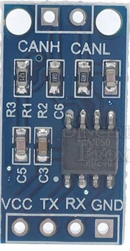
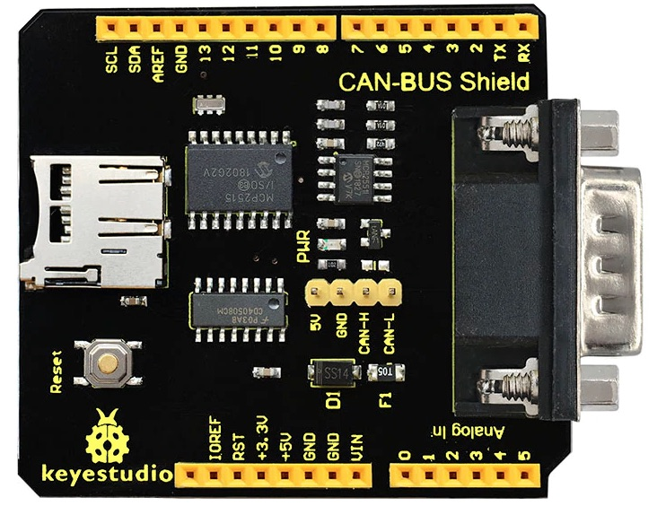
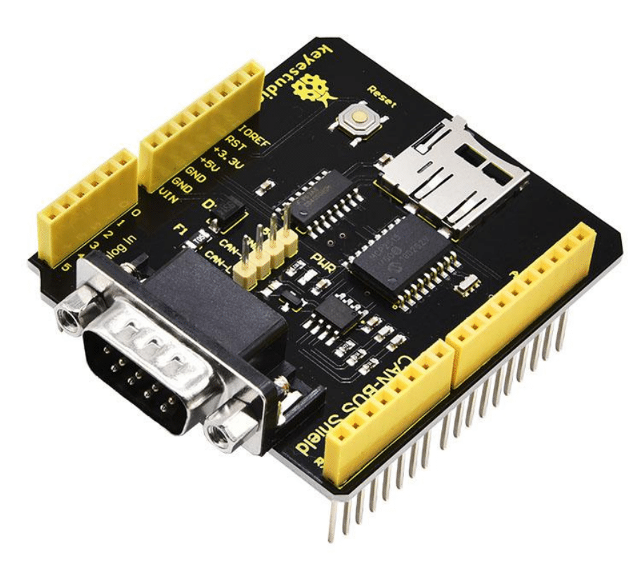
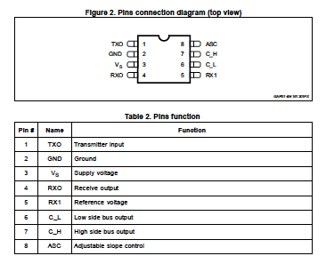
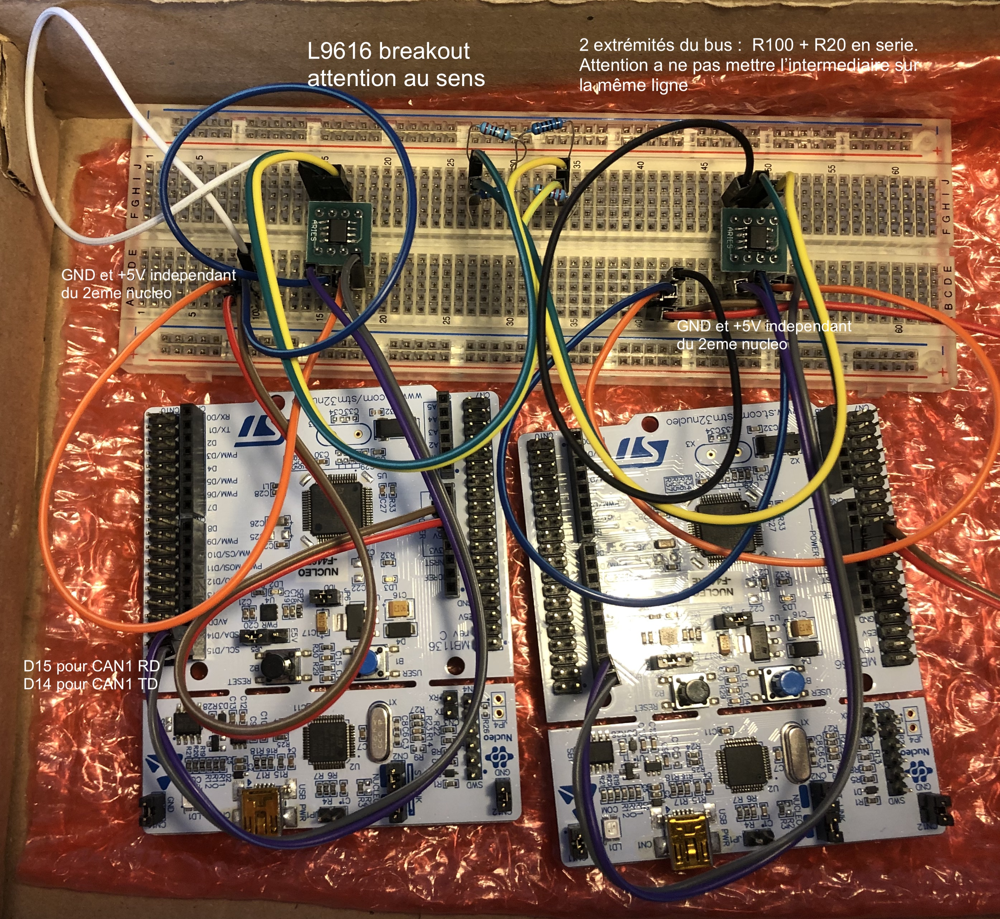
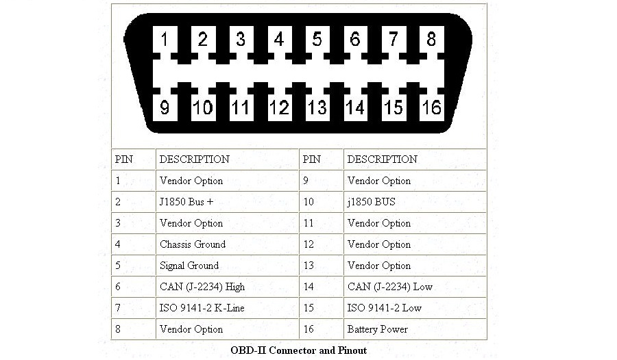
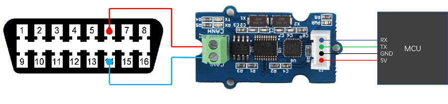

# ODB-II ::Tutoriel

## Cartes

* [Keyestudio CAN-BUS Shield MCP2515](https://fr.aliexpress.com/item/32998255055.html) [wiki](https://wiki.keyestudio.com/KS0411_keyestudio_CAN-BUS_Shield)


### Carte de pilote de Bus CAN MCP2515 + TJA1050 récepteur SPI 

* [Carte de pilote de Bus CAN MCP2515 TJA1050 récepteur SPI](https://fr.aliexpress.com/item/32223930366.html)



### Carte de pilote de Bus CAN MCP2515 

* [Carte de pilote de Bus CAN MCP2515 TJA1050 récepteur SPI](https://fr.aliexpress.com/item/32223930366.html)

### Carte CAN VP230

* [Carte CAN VP230](https://fr.aliexpress.com/item/1005002843325046.html)


### KS0411 keyestudio CAN-BUS Shield

Ce shield contient à la fois un driver MCP2515 et un lecteur de cartes Micro-SD : il faut s'en servir pour l'emulateur d'OBC.

https://wiki.keyestudio.com/KS0411_keyestudio_CAN-BUS_Shield

Celle-ci semble être un clone de la carte [Sparkfun CAN BUS](https://github.com/sparkfun/CAN-Bus_Shield)

La broche CS du lecteur de carte Micro-SD est Arduino D9.

Code de test sur Arduino (MCU AVR)
* https://www.dropbox.com/sh/hd1feflnh5gkw8l/AACFr87wOB2fKy98NXHXgZZya/Resource?dl=0&subfolder_nav_tracking=1
* [Sparkfun CAN BUS](https://github.com/sparkfun/CAN-Bus_Shield)




### L9616

L9616 seems compatible with the [NXP TJA1042](https://www.nxp.com/docs/en/data-sheet/TJA1042.pdf) CAN driver.

The TJA1042 driver for RIOT should be added as a module.



## Wiring

### Wiring with 2 Nucleo F446RE + 2 L9616


The pinout of the L9616 is belong:


The pinout of the L9616 (SOC8) adapter is: 

		        VREF			RXD	--> D15 (Grey)
		        CANL (Yellow)	VDD --> 5V	(Red)
		        CANH (Green)	VSS	--> GND	(Black)		
		GND <-- RS				TXD --> D14	(Purple)
		     			ARIES	
	 

[see pinout Nucleo F443RE](https://os.mbed.com/platforms/ST-Nucleo-F446RE/).

The Nucleo F446RE had 2 CAN ports:
* CAN1 (CAN1_RD is on D15, CAN1_TD is on D14) --> can0 on "can list"
* CAN2 (CAN2_RD is on D4, CAN2_TD is on D10)  --> can1 on "can list"




### RIOT Driver tja1042 for L9616

L9616 seems compatible with the [NXP TJA1042](https://www.nxp.com/docs/en/data-sheet/TJA1042.pdf) CAN driver.

The TJA1042 driver for RIOT should be added as a module.

```makefile

TRX_TO_BUILD ?= tja1042

ifneq (,$(filter tja1042,$(TRX_TO_BUILD)))
  USEMODULE += tja1042
	TJA1042_STB_PIN ?= GPIO_PIN\(0,0\)

	CFLAGS += -DTJA1042_STB_PIN=$(TJA1042_STB_PIN)
endif

```


### RIOT Driver MCP2515 for KS0411 keyestudio CAN-BUS Shield

CAN_DRIVER ?= MCP2515


MCP2515_PARAM_CS on D10
MCP2515_PARAM_INT on D2


Add the following line into `tests/candev/Makefile` 
```bash
ifeq ($BOARD,nucleo-wl55jc)
# configuration for the sdcard_spi driver on SPI #1 since SPI #0 is used by the SubGHz radio
CFLAGS += -DMCP2515_PARAM_SPI='(SPI_DEV(1))'
CFLAGS += -DMCP2515_PARAM_CS=GPIO_PIN\(PORT_A,9\)
CFLAGS += -DMCP2515_PARAM_INT=GPIO_PIN\(PORT_B,12\)
CFLAGS += -DMCP2515_PARAM_CLK=GPIO_PIN\(PORT_A,5\)
CFLAGS += -DMCP2515_PARAM_MOSI=GPIO_PIN\(PORT_A,7\)
CFLAGS += -DMCP2515_PARAM_MISO=GPIO_PIN\(PORT_A,6\)
CFLAGS += -DMCP2515_PARAM_RST='(GPIO_UNDEF)'
endif
```


```
cd tests/candev
gmake BOARD=nucleo-wl55jc flash

```

### RIOT Test `can_trx` avec 1 Nucleo F446RE

No README.md

```bash
cd ~/gricad/thingsat/riot-board
cd tests/can_trx/
gmake BOARD=nucleo-f446re
cat README.md
```

```
> help
Command              Description
---------------------------------------
init                 initialize a can trx
set_mode             set a can trx mode
```


### RIOT Test CAN `conn_can` avec 2 Nucleo F446RE

#### Makefile

Ajouter au Makefile
```makefile
ifeq ($(BOARD),nucleo-f446re)
# Enabling CAN2 (aka can1)
CFLAGS += -DCAN_DLL_NUMOF=2
CFLAGS += -DPAYLOAD_CAN=\"can1\"
endif
```

Normalement, il faudrait modifier le Makefile en commentant TRX_TO_BUILD

```makefile
...
# TRX_TO_BUILD ?= tja1042
...
```
Cependant, en faisant cela, ca ne fonctionne plus (12/11/2020)


#### Build

```bash
cd ~/gricad/thingsat/riot-board
cd tests/conn_can/
cat README.md
gmake BOARD=nucleo-f446re
```

#### On Nucleo #1 and #2
Test démarré le 9/11/2020
TD  démarré le 9/11/2020

```
ps
help
can list
```

> Remarque : Il n'y a qu'une des 2 interfaces CAN du Nucleo F446RE !!!

To initialize a CAN transceiver device (trx_id = 0)
```
init 0
```

To set a CAN transceiver device's (trx_id = 0) mode to TRX_NORMAL_MODE
```
set_mode 0 0
```

The CAN interfaces are registered at startup to the dll. The list of registered
interfaces and their RIOT names can be retrieved with:
```
test_can list
```

#### On Nucleo #1

To send a raw CAN frame, id 0x100 with 2 bytes of data 01 02 on interface 0:
```
test_can send 0 100 01 02
```

To send a raw CAN remote request frame, id 0x100 on interface 0 and datalenght 7:
```
test_can sendrtr 0 100 7
```
A remote request frame has a NULL payload but can have a specific data length code (DLC).
Valid DLC val: 0..8

To send a raw CAN remote request frame, id 0x100 and id 0x500 on interface 0:
> can send ifnum id [B1 .. B8]
```
can send 0 100 AA BB CC DD EE FF
can send 0 500 CC DD EE FF AA BB
```

#### On Nucleo #2

Two threads are launched to enable receiving frames. To receive raw CAN frames,
ids 0x100 and 0x500 with thread 0 on interface 1, with 10s timeout:

> test_can send ifnum can_id [B1 [B2 [B3 [B4 [B5 [B6 [B7 [B8]]]]]]]]              
> test_can recv ifnum user_id timeout can_id1 [can_id2..can_id16]                 

```
test_can recv 0 0 100000000 100 500
```

#### On Nucleo #1 and #2

A connection can be closed with its thread id, for instance:
```
test_can close 0
```

#### On Nucleo #1 and #2 (ERROR)

To send an ISO-TP datagram, first bind a connection with one of the threads,
source id 700, dest id 708, thread 1 and interface 0:
```
test_can bind_isotp 0 1 700 708
```
Then send the data 01 02 03 04 05 0a 0b 0c:
```
test_can send_isotp 1 01 02 03 04 05 0a 0b 0c
```

To receive from an ISO-TP channel, it must be bound, then with the previous channel,
and 10s timeout:
```
test_can recv_isotp 1 10000000
```

An ISO-TP channel can be closed with:
```
test_can close_isotp 1
```

#### On Nucleo #1 and #2

```
test_can get_bitrate 0
```

You can also set a bitrate (this won't work on native with vcan, only with real
interfaces, but then root access are needed), for instance 250000 bit/s with
sampling point 87.5%:
```

test_can set_bitrate 0 250000 875

test_can get_bitrate 0

```


For Thingsat

```
> test_can set_bitrate 0 1000000 750                                            
Setting bitrate=1000000, sample point=750                                       
Bittimings successfully set                                                     
> test_can get_bitrate 0                                                        
Bitrate read: bitrate=1000000, sample_point=733                                 
brp=3phase-seg1=5, phase-seg2=4, sjw=1                                          
```


## Test sur prise ODBII 


https://github.com/sparkfun/CAN-Bus_Shield/blob/2e152297bd82162a0aa01cae8f074c9ae953bbcb/Libraries/Arduino/src/Canbus.cpp#L100


## Test sur Grove ODBII 

https://docs.longan-labs.cc/1030002/



